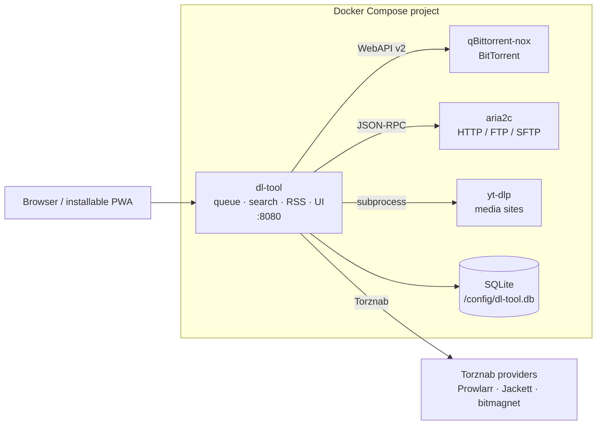

# dl-tool

A self-hosted replacement for **Synology Download Station**, deployed with Docker Compose.

One queue for every protocol. One folder picker. Pluggable search. RSS rules that can land anywhere.
A modern UI that works on a phone.

> ### Status: planning
>
> **This repository currently contains a complete implementation plan, not an implementation.**
> There is no runnable code yet. Everything below describes what the plan builds.
> If you are here to build it, start at **[`docs/00-INDEX.md`](docs/00-INDEX.md)**.

---

## Why

Download Station is the best thing about a Synology NAS for a lot of people, and Synology has largely
stopped working on it. The evidence is in Synology's own release notes:

- Fourteen releases in the five years of DSM 7, including two gaps of **17 months**.
- Version **4.0.0-4708** (2023-04-25) is a *major* version bump whose entire release note reads
  "Download Station 4.0.0 requires DSM 7.2 and above."
- The bundled BitTorrent engine sat on **Transmission 2.93** from 2018-04-16 to 2025-11-25 — seven and a
  half years — and the 4.0.5 that replaced it was already two years old on the day it shipped.
- Features have been *removed* rather than added (Xunlei-Lixian UI and Web API, 2018-10-15).
- A 2024 security feature ships with **no UI at all** — its documented interface is root SSH and `vi`.
- The current help page still tells users to install **Flash Player 9**, EOL since 2020.
- The `.dlm` BT-search plugin ecosystem is dead: the largest community pack last added a module in 2015,
  and most of the sites those modules scraped no longer exist.

Meanwhile the self-hosted alternatives are individually excellent and collectively incoherent. A composed
stack of qBittorrent, SABnzbd, aria2, Prowlarr and Unpackerr beats Download Station on capability and
loses to it badly on "paste a link, pick a folder, walk away". See [`docs/16-prior-art-and-research.md`](docs/16-prior-art-and-research.md)
for the full survey and the feature-parity matrix.

## What dl-tool is

**A control plane, not a download engine.** It never re-implements BitTorrent or Usenet. It drives
engines that already exist and are good at their job:



The goal is to be **superficially identical to Download Station** — same screen, same sidebar, same
add-task dialog, same folder picker — while being none of the things about it that have aged badly.
dl-tool does not pretend to *be* Download Station to other software: there is no Synology or
qBittorrent API emulation, and it is not a drop-in download client for anything. It has one API, its
own, and one interface, the one you look at.

It is **single-tenant**: one operator account, created by the first-run wizard. Authentication is still
mandatory and there are no default credentials, but there are no roles, no per-user destinations and no
quotas — see [`ADR-0019`](docs/decisions/0019-single-account-no-ownership.md).

### The five things it owns that nothing else does

1. **One queue across every protocol** — HTTP, HTTPS, FTP, FTPS, SFTP, magnet, `.torrent`, and media-site
   URLs, in one list, with one set of controls.
2. **Auto-extraction driven by the queue** — `.zip`, `.tar`, `.gz`, `.tgz`, `.rar` and `.7z` on completion
   against a shared password list, triggered by the download that produced the file rather than by a
   separate watcher.
3. **A server-side destination browser** — the folder picker Download Station has and no self-hosted
   engine exposes at all.
4. **Search as a user feature** — Torznab/Newznab providers plus declarative YAML engines, with a proper
   results grid, not an automation-only side door.
5. **A global bandwidth governor** — one 24×7 schedule that fans out to every engine, applying to *all*
   protocols rather than BitTorrent only.

### Deliberate improvements on Download Station

| Download Station | dl-tool |
|---|---|
| Speed changes do not apply to already-running HTTP/FTP tasks | Per-task and global limits apply immediately, to running tasks |
| Alternative speeds are BitTorrent-only | The schedule applies to every protocol |
| RSS download filters "only work for newly-added feeds" | Rules can be run against existing items, with a live dry-run that explains every non-match |
| 2048 tasks for admins, 256 for other users; 50 URLs per add | No arbitrary caps; the 50-line hint is a soft warning, never a silent truncation |
| Errors hidden inside "Inactive Downloads" | A dedicated **Error** filter, an error column, and a per-task event log |
| BT search plugins are PHP that runs on your NAS | Declarative definitions only. dl-tool executes no third-party code, ever |
| No API for automation beyond the undocumented DS2 endpoints | One documented `/api/v1` with an OpenAPI spec generated from the handlers, and revocable API tokens |
| No dark mode, no mobile layout | Both, in v1 |

## Quickstart (once it exists)

```bash
git clone https://github.com/L-K-M/dl-tool.git && cd dl-tool
cp .env.example .env      # set PUID, PGID, TZ, DATA_DIR
docker compose up -d
```

Then open `http://<host>:8091` and complete the first-run setup wizard. There are **no default
credentials** — the wizard creates the operator account.

The full deployment reference, including the single `/data` mount rule, reverse-proxy snippets, optional
VPN routing, and notes for Synology, QNAP, Unraid and TrueNAS, is in
[`docs/10-deployment-and-compose.md`](docs/10-deployment-and-compose.md).

## Documentation map

| If you want to… | Read |
|---|---|
| Build this | [`docs/00-INDEX.md`](docs/00-INDEX.md) → [`docs/tasks/00-task-index.md`](docs/tasks/00-task-index.md) |
| Know what it will and will not do | [`docs/01-vision-and-scope.md`](docs/01-vision-and-scope.md) |
| Know why it is built this way | [`docs/decisions/`](docs/decisions/) |
| See the evidence behind the plan | [`docs/16-prior-art-and-research.md`](docs/16-prior-art-and-research.md) |
| Run it | [`docs/10-deployment-and-compose.md`](docs/10-deployment-and-compose.md) and [`docs/11-config-reference.md`](docs/11-config-reference.md) |

## On content

dl-tool is protocol-neutral infrastructure, like `curl` or a web browser. It ships with **zero** piracy
indexers — not disabled, not commented out, absent. The four bundled search engines are the Internet
Archive, Arch Linux releases, Academic Torrents, and Ubuntu/Debian install images. Adding anything else
is a deliberate, documented action by the operator, who is responsible for what they search for and
download.

There is no telemetry and no phone-home update check.

## Licence

Currently [The Unlicense](LICENSE). A move to Apache-2.0 is **proposed but not decided** — see
[`ADR-0016`](docs/decisions/0016-relicense-to-apache-2.md). The repository owner makes that call; the
`LICENSE` file is unchanged until they do.
