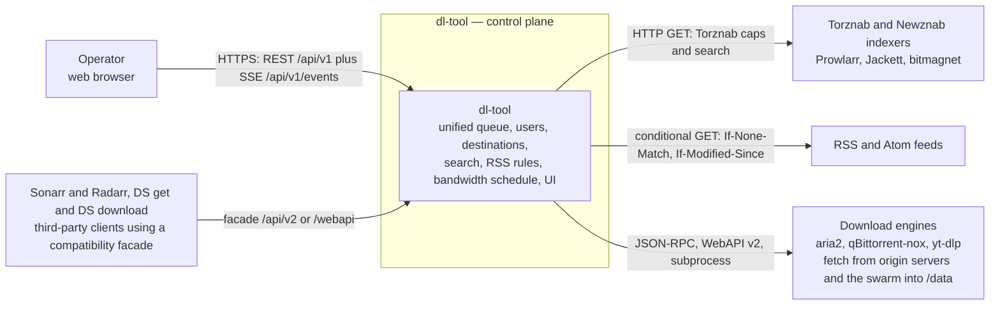
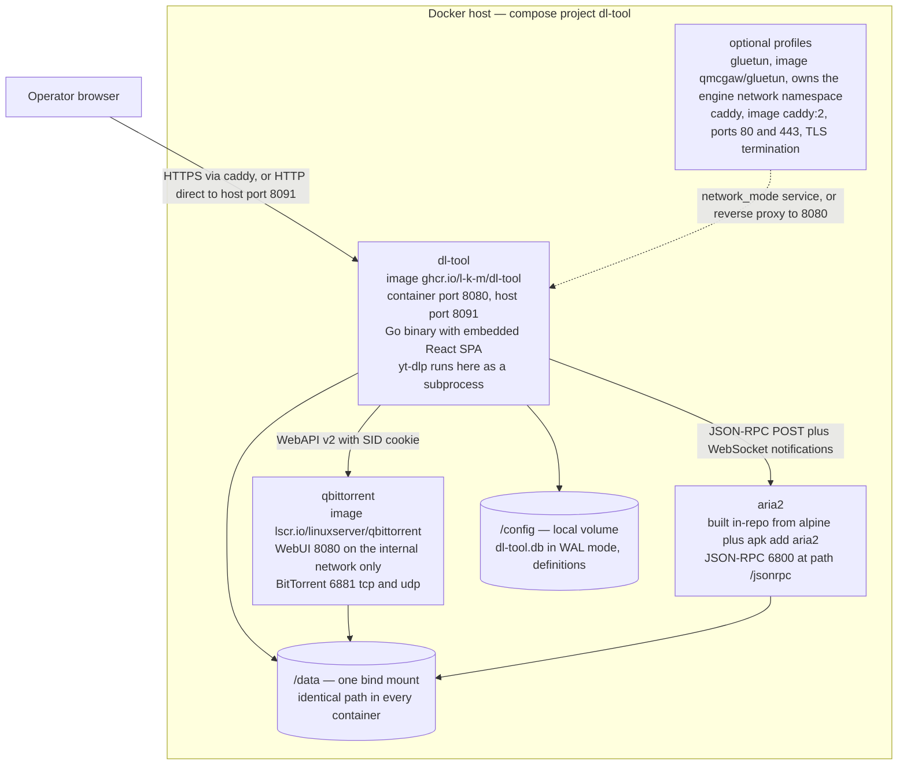
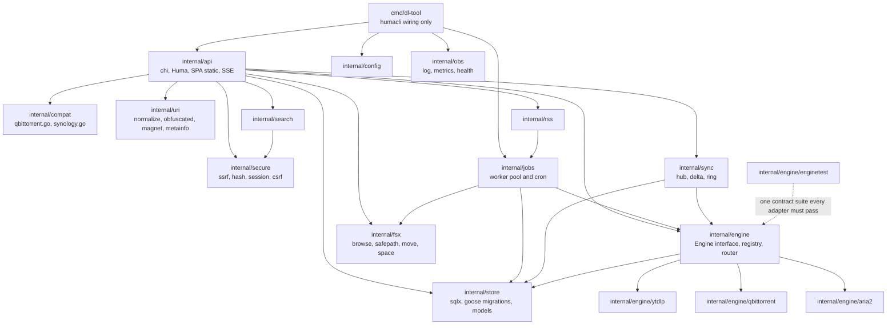
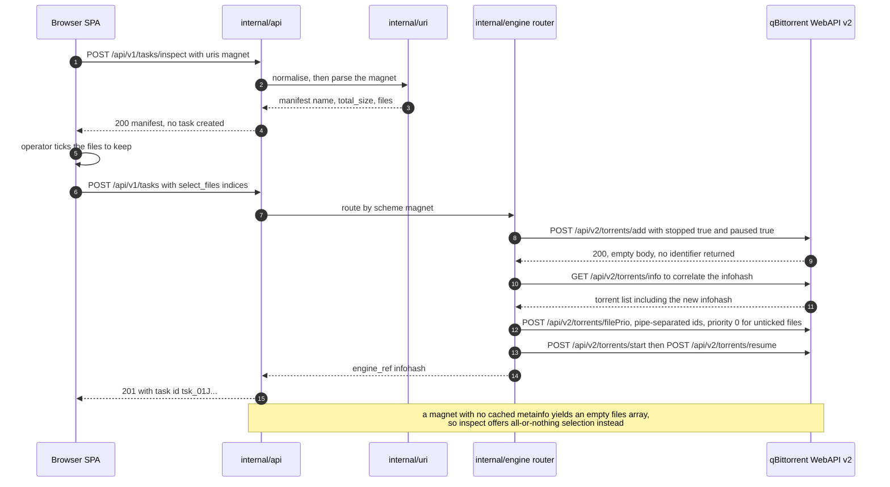
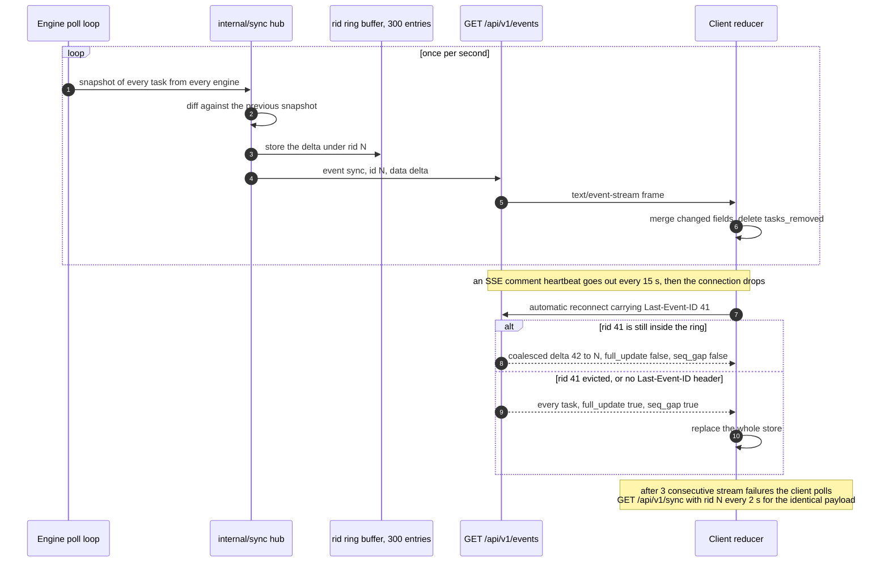
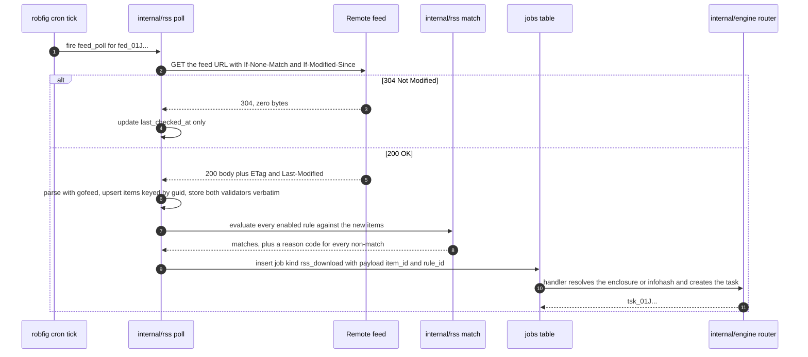
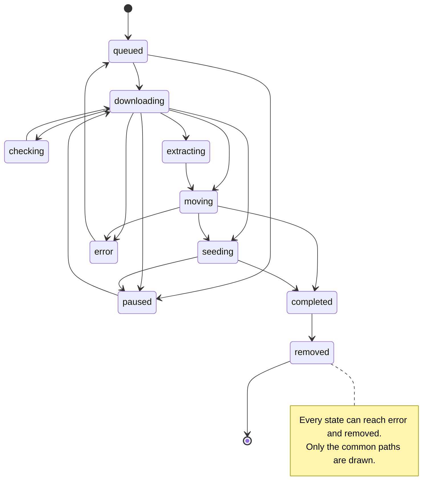

# 03 — Architecture

> **Status:** draft
> **Last reviewed:** 2026-09-01
> **Audience:** implementing agent
> **Read this before:** T001, T004, T015, T019, T028, T039, T065 — and before adding any package under `internal/`

## Purpose

Define the static and runtime structure of dl-tool: which processes and Go packages exist, how a task
travels from a browser click to an engine daemon, and which concepts every package shares. It does **not**
define DDL, HTTP payload shapes, the `Engine` interface body, or the compose file.

## Scope of this document

- In scope: system context, container topology, package decomposition, three runtime scenarios, the task
  state machine, the ID scheme, the error model, the units rule, job semantics, the SSE ring, risks.
- Out of scope, and where it lives instead: DDL and enums → [`04-data-model.md`](04-data-model.md);
  endpoints and payloads → [`05-api-contract.md`](05-api-contract.md); the `Engine` interface and engine
  status tables → [`06-download-engines.md`](06-download-engines.md); RSS rule schema →
  [`08-rss-automation.md`](08-rss-automation.md); compose, ports, volumes →
  [`10-deployment-and-compose.md`](10-deployment-and-compose.md); environment variables →
  [`11-config-reference.md`](11-config-reference.md); threat model →
  [`12-security-and-threat-model.md`](12-security-and-threat-model.md).

Headings follow [arc42](https://docs.arc42.org/home/) sections 3–8 and 11: section 9 lives in
[`decisions/`](decisions/), 10 in [`02-requirements.md`](02-requirements.md), 12 in
[`glossary.md`](glossary.md).

---

## 3. Context and Scope

dl-tool is one process that owns state and delegates transfers. Everything outside the box is a system it
talks to but does not control.

| External interface | Direction | Protocol | Detailed in |
|---|---|---|---|
| Operator browser | inbound | REST `/api/v1` plus SSE | [`05-api-contract.md`](05-api-contract.md) |
| Sonarr, Radarr, DS mobile apps | inbound | qBittorrent subset at `/api/v2/*` and Synology subset at `/webapi/*`, both default off | [`15-compatibility-apis.md`](15-compatibility-apis.md) |
| aria2 | outbound | JSON-RPC 2.0 over HTTP POST at `/jsonrpc`; notifications over WebSocket only | [`06-download-engines.md`](06-download-engines.md) |
| qBittorrent-nox, yt-dlp | outbound | WebAPI v2 with a `SID` cookie session; local subprocess with JSON on stdout | [`06-download-engines.md`](06-download-engines.md) |
| Indexers and feeds | outbound | Torznab/Newznab XML and RSS/Atom over HTTPS | [`07-search-and-indexers.md`](07-search-and-indexers.md) |

Non-goals: no BitTorrent, NNTP/par2 or hoster-scraping implementation, no DHT crawler, no interpreter for
third-party code. See [`01-vision-and-scope.md`](01-vision-and-scope.md).

---

## 4. Solution Strategy

**Control-plane thesis (D1).** dl-tool implements the layer no engine ships: one queue spanning
HTTP/FTP/SFTP, BitTorrent and media-site URLs; multi-user ownership with per-user destinations and quotas; a
server-side destination browser; pluggable search as a user feature; and a global bandwidth governor with a
24×7 schedule that fans out to every engine. Transferring bytes is delegated to existing daemons.

| # | Decision | ADR |
|---|---|---|
| D1 | Control plane over external engine daemons, not a new engine. | [ADR-0001](decisions/0001-build-a-control-plane-over-existing-download-engines.md) |
| D2 | Go 1.26 backend, single static binary built with `CGO_ENABLED=0`. | [ADR-0002](decisions/0002-go-for-the-backend.md) |
| D3 | chi v5 plus Huma v2; REST with OpenAPI 3.1 generated from the handler structs. | [ADR-0003](decisions/0003-chi-huma-with-code-first-openapi.md) |
| D4 | SQLite via `modernc.org/sqlite` at `/config/dl-tool.db` in WAL mode; no Postgres. | [ADR-0004](decisions/0004-sqlite-as-the-only-datastore.md) |
| D5 | Engines are aria2, qBittorrent-nox and yt-dlp behind one `Engine` interface. | [ADR-0005](decisions/0005-aria2-qbittorrent-and-yt-dlp-as-the-v1-engines.md) |
| D6 | SSE at `GET /api/v1/events` carrying rid deltas, with `GET /api/v1/sync?rid=` as the polling fallback. | [ADR-0006](decisions/0006-server-sent-events-with-rid-deltas-for-live-updates.md) |
| D7 | React 19 plus Vite plus TypeScript SPA, `//go:embed`-ed into the binary. | [ADR-0007](decisions/0007-react-spa-embedded-in-the-go-binary.md) |
| D8 | Search is a Torznab/Newznab client first, `dlsearch/v1` declarative YAML engines second. | [ADR-0008](decisions/0008-torznab-first-declarative-yaml-engines-second.md) |
| D9 | A native cross-protocol RSS rule engine, not a passthrough to qBittorrent's `rss/*`. | [ADR-0009](decisions/0009-a-native-cross-protocol-rss-rule-engine.md) |
| D10 | No third-party code execution; `.dlm` and qBittorrent `.py` plugins are statically analysed and converted. | [ADR-0010](decisions/0010-never-execute-third-party-definition-code.md) |
| D11 | Alpine 3.22 runtime image with `su-exec` for PUID/PGID/UMASK privilege drop. | [ADR-0011](decisions/0011-alpine-runtime-image-with-puid-pgid-privilege-drop.md) |
| D12 | A single `/data` bind mount plus `/config`, identical path in every container. | [ADR-0012](decisions/0012-a-single-data-mount.md) |
| D13 | Built-in local users and server-side sessions are mandatory; no anonymous mode, no default credentials. | [ADR-0013](decisions/0013-mandatory-built-in-authentication.md) |
| D14 | qBittorrent and Synology compatibility façades, both opt-in and default off. | [ADR-0014](decisions/0014-opt-in-qbittorrent-and-synology-compatibility-facades.md) |
| D15 | In-process worker pool plus a `jobs` table in SQLite plus `robfig/cron/v3`. | [ADR-0015](decisions/0015-db-backed-in-process-job-queue.md) |
| D16 | Declarative-only extensibility in v1; if v2 ever needs scripting it is Starlark. | [ADR-0010](decisions/0010-never-execute-third-party-definition-code.md) |

---

## 5. Building Block View

### 5.1 Level 2 — containers and deployment units

Ports, volumes and profile names are owned by [`10-deployment-and-compose.md`](10-deployment-and-compose.md);
the annotations here let this diagram double as a cross-check against `compose.yaml`.

- Engines report absolute paths (`aria2.getFiles` → `path`; qBittorrent → `content_path`), so `/data` must
  be the identical string in every container or dl-tool cannot `stat` what they wrote.
- Publish only dl-tool's port and the BitTorrent listen port; never an engine's API port.
- yt-dlp is not a container: it is a subprocess of dl-tool at `DLTOOL_YTDLP_PATH`.

### 5.2 Level 3 — Go packages

| Package | Responsibility |
|---|---|
| `cmd/dl-tool` | `humacli` wiring: load config, open the store, build the router, start workers. No business logic. |
| `internal/config` | Parse `DLTOOL_*` environment variables into one struct and validate them at boot. |
| `internal/store` | All SQL: `sqlx` access, goose migrations, and row structs with `db:` and `json:` tags. |
| `internal/api` | chi router, Huma operations, session and CSRF middleware, embedded SPA, the SSE endpoint. |
| `internal/compat` | Translate the qBittorrent `/api/v2/*` and Synology `/webapi/*` façades onto internal services. |
| `internal/engine` | The `Engine` interface, the adapter registry, and the URI-to-engine routing table. |
| `internal/engine/aria2`, `.../qbittorrent` | Protocol client plus status and field normalisation, one package per daemon. |
| `internal/engine/ytdlp` | yt-dlp subprocess runner and stdout JSON parser. |
| `internal/engine/enginetest` | One shared conformance suite that every adapter must pass. |
| `internal/uri` | Normalise input URIs, decode `thunder`/`flashget`/`qqdl`, parse magnets and `.torrent` metainfo. |
| `internal/search` | Torznab client, `dlsearch/v1` YAML engines, `.dlm` import, result normalisation. |
| `internal/rss` | Feed polling, feed parsing, rule matching, episode filters. |
| `internal/jobs` | Worker pool over the `jobs` table, cron entries, and the extract, move and notify handlers. |
| `internal/sync` | The delta hub: snapshot diffing, the rid ring buffer, SSE fan-out. |
| `internal/fsx` | Destination browsing, path jailing, free-space queries, EXDEV-safe moves. |
| `internal/secure` | SSRF guard, argon2id password hashing, session tokens, CSRF tokens. |
| `internal/obs` | `log/slog` setup, the Prometheus registry, `/healthz` and `/readyz` handlers. |

Layering rule: `internal/store` imports nothing from `internal/api`, `internal/engine` or `internal/jobs`,
and adapters import `internal/engine` only. Adding an engine touches one directory plus one `registry.go` line.

---

## 6. Runtime View

### 6.1 Add a magnet with file selection

Send `stopped` and `paused` with the same value and call both `start` and `resume`, so one adapter serves
qBittorrent 4.x and 5.x. Detail in [`06-download-engines.md`](06-download-engines.md).

### 6.2 The live-update loop

### 6.3 An RSS rule fires

Send a weak validator `W/"..."` back exactly as received, never stripping the `W/`. Around half of real
feeds supply neither validator, so a poll that always receives 200 is normal.

---

## 7. Deployment View

One Docker host, one compose project, two persistent paths. The §5.1 diagram is also the deployment
diagram; compose, profiles, PUID/PGID and NAS notes are in
[`10-deployment-and-compose.md`](10-deployment-and-compose.md).

| Node | Runs | Persistent state |
|---|---|---|
| `dl-tool` | Go binary, embedded SPA, worker pool, cron, yt-dlp subprocesses | `/config/dl-tool.db`, `/config/definitions` |
| `qbittorrent`, `aria2` | qBittorrent-nox and `aria2c --enable-rpc` | `/config/qbittorrent`, `/config/aria2` |
| `gluetun`, `caddy` (profiles) | VPN egress and TLS termination | certificate store only |

Rules that follow from D12:

- Mount one `/data`, never separate `/downloads` and `/media`: two bind mounts are two mount points, so
  `st_dev` differs, `link(2)` and `rename(2)` return `EXDEV`, and every move degrades to copy plus delete.
- At boot compare `st_dev` of the download and library roots, then actually create and unlink a test
  hardlink between them; warn in the UI on failure. The live test catches exFAT, CIFS and NFS.
- Never call `os.Rename` blindly: detect `EXDEV`, fall back to copy, fsync, rename, unlink, and report
  progress, because on a NAS a 40 GB copy takes minutes. Run every container with the same UID and GID.

---

## 8. Crosscutting Concepts

### 8.1 Task state machine

Ten canonical lowercase states, shared by the Go `TaskState` type, the `tasks.state` column and the API
`state` field.

| From | To | Trigger |
|---|---|---|
| `queued` | `downloading` | The engine accepted the task and reports an active transfer. |
| `downloading` | `checking` | The engine reports hash checking or integrity verification. |
| `downloading` | `extracting` / `moving` / `seeding` | Payload complete: extract if enabled, else move if the destination differs, else seed. |
| `moving` / `seeding` | `completed` | The move finished and was verified, or the share limit was reached. |
| any | `paused` | User pause, or the bandwidth schedule paused the task. |
| any | `error` | Engine error, post-processing failure or guard rejection; `tasks.error_code` is set. |
| `error` | `queued` | User retry, or automatic retry while `attempts < max_attempts`. |
| any | `removed` | User delete, with or without `delete_data`. |

Engine-status normalisation tables are in [`06-download-engines.md`](06-download-engines.md); sidebar filter
semantics over these states are in [`09-web-ui-spec.md`](09-web-ui-spec.md).

### 8.2 Identifier scheme

Every identifier is a lowercase prefix, an underscore, and a ULID in Crockford base32, 26 characters — for
example `tsk_01J8ZC4Y7N3Q2R5V8W0X1Y2Z3A`.

| Prefix | Entity | Prefix | Entity |
|---|---|---|---|
| `tsk_` | task | `sch_` | search job |
| `usr_` | user | `job_` | queue job |
| `fed_` | feed | `evt_` | event |
| `rul_` | RSS rule | `tok_` | API token |
| `idx_` | indexer | | |

Engine-side identifiers — aria2 GID, qBittorrent infohash, yt-dlp job id — live in the separate `engine` and
`engine_ref` columns, never in a URL. Columns are defined in [`04-data-model.md`](04-data-model.md).

### 8.3 Error model

- Every API error is RFC 9457 `application/problem+json`, the Huma default; shapes and status codes are in
  [`05-api-contract.md`](05-api-contract.md).
- Every task failure also sets `tasks.error_code` from the canonical enum: Download Station's 26 values plus
  `ssrf_blocked`, `path_rejected`, `quota_exceeded`, `engine_unavailable` and `unsupported_scheme`.
- Every state transition and job attempt writes one `task_events` row whose `code` is a stable machine
  string such as `engine.accepted` or `postprocess.extract.failed`, so the UI can translate it with i18next.
- Go errors wrap with `fmt.Errorf("...: %w", err)`; see [`14-conventions.md`](14-conventions.md).

### 8.4 Units and time

| Quantity | Representation | Applies to |
|---|---|---|
| Size | bytes, integer | DB, API, adapters, UI store |
| Rate | bytes per second, integer | DB, API, adapters, UI store |
| Timestamp | Unix milliseconds, integer | DB columns |
| Timestamp | RFC 3339 string, for example `2026-09-01T12:00:00Z` | API request and response bodies |
| Duration | seconds, integer | `eta`, `seeding_time`, in both DB and API |

Never store, transport or compute in KB/s; formatting to KiB/s or MiB/s happens in the browser only, which
deliberately fixes Download Station's split of KB/s for configuration and B/s for reporting.

### 8.5 Job queue and at-least-once semantics

The `jobs` table is the durable queue; an in-process pool claims rows with one `UPDATE ... RETURNING`
against the oldest eligible row, and `robfig/cron/v3` enqueues the periodic ones. No broker, no Redis. DDL
is in [`04-data-model.md`](04-data-model.md).

1. **At-least-once delivery.** Every handler must be idempotent, keyed off `task_id` plus `kind`. A job may
   run twice, and running twice must be harmless.
2. **Boot recovery.** On start-up run `UPDATE jobs SET state='pending', locked_at=NULL WHERE state='running';`
   so anything claimed but unfinished when the process died is retried.
3. **Backoff and terminal failure.** On failure set `run_after = now + min(600, 5 * 2^attempts)` seconds;
   once `attempts >= max_attempts` set `state='failed'` and write a `task_events` row. There is no
   dead-letter queue — the `failed` rows are the dead-letter queue.

Cron entries are code, not rows. The only DB-driven schedules are the RSS interval and the 24×7 bandwidth
grid, which the cron tick reads on each fire.

### 8.6 SSE ring buffer

| Parameter | Value | Reason |
|---|---|---|
| Ring depth | 300 deltas | About 5 minutes of history at the 1 Hz push rate. |
| Push rate | at most once per second | Bounds diff cost and client re-render cost. |
| Heartbeat | one SSE comment every 15 s | Defeats idle-timeout kills in reverse proxies. |
| `retry` | 3000 ms, sent on the first message | Client reconnect delay. |
| Reconnect key | the `Last-Event-ID` header is the `rid` | No client-side bookkeeping required. |
| Miss behaviour | `full_update: true` plus `seq_gap: true` | Client replaces the store instead of merging a partial view. |
| Fallback | `GET /api/v1/sync?rid=N` polled every 2 s after 3 stream failures | Identical envelope, identical reducer. |

The ring lives in `internal/sync/ring.go` and is memory-only; after a restart it is rebuilt from the current
task snapshot, which is exactly the `seq_gap` case every client already handles.

---

## 11. Risks and Technical Debt

| # | Risk | Mitigation |
|---|---|---|
| R1 | aria2 has shipped no tagged release since `1.37.0` on 2023-11-15, although `master` still receives commits, the most recent seen on 2026-06-25. Treat this as maintenance mode, not abandonment. | The `Engine` interface isolates aria2 in `internal/engine/aria2`; replacing it touches one directory plus one line of `registry.go`, and `enginetest` already defines what a replacement must satisfy. |
| R2 | yt-dlp breaks whenever a media site changes, so it needs updating far more often than the rest of the stack. | Install the standalone `yt-dlp_linux` binary at `DLTOOL_YTDLP_PATH`, document an update path that does not rebuild the dl-tool image, and report the yt-dlp version in `GET /system/info`. |
| R3 | qBittorrent's upstream wiki is stale in two places that break adapters: `torrents/add` reads `stopped`, not the documented `paused`; and the `state` enum returns `stoppedDL`/`stoppedUP` in 5.x where the wiki says `pausedDL`/`pausedUP`. | Send both parameter names, accept both spellings on read, and always provide a `default` branch mapping unknown states to `queued` with a logged warning rather than a crash. The exact parameter list and state enum are reproduced in [`06-download-engines.md`](06-download-engines.md). |
| R4 | SQLite WAL mode does not work on a network filesystem, because WAL requires all processes to share memory and processes on separate hosts cannot. | **IMPORTANT:** `/config`, and therefore `dl-tool.db`, must be a local path or local Docker volume — never NFS or SMB. Download destinations under `/data` may be network mounts. Detect a network filesystem at boot and refuse to start. |
| R5 | A wedged engine daemon stalls the poll loop and therefore the SSE stream for every task. | Poll each engine in its own goroutine with a per-call timeout; a failed poll marks that engine unhealthy in `/readyz` and leaves the last known snapshot in place instead of emptying the grid. |

Accepted v1 debt: no Usenet engine, no ed2k engine, no in-process BitTorrent, no Litestream replication, no
all-in-one s6-overlay image — all listed as out of scope in [`01-vision-and-scope.md`](01-vision-and-scope.md).

---

## Decisions referenced

The full D1–D16 map is the table in §4. ADRs that shape this document directly:

| ADR | Decision |
|---|---|
| [ADR-0001](decisions/0001-build-a-control-plane-over-existing-download-engines.md) | Build a control plane over existing download engines |
| [ADR-0004](decisions/0004-sqlite-as-the-only-datastore.md) | SQLite as the only datastore |
| [ADR-0005](decisions/0005-aria2-qbittorrent-and-yt-dlp-as-the-v1-engines.md) | aria2, qBittorrent and yt-dlp as the v1 engines |
| [ADR-0006](decisions/0006-server-sent-events-with-rid-deltas-for-live-updates.md) | Server-sent events with rid deltas for live updates |
| [ADR-0012](decisions/0012-a-single-data-mount.md) | A single `/data` mount |
| [ADR-0015](decisions/0015-db-backed-in-process-job-queue.md) | DB-backed in-process job queue |

## Open questions

- ADR filenames here are the kebab-cased ADR titles from the plan brief; `docs/decisions/` must use exactly
  these slugs, or fix these links in the same change.
- D16 (declarative-only extensibility) has no ADR of its own and is covered by ADR-0010; ADR-0016 is the
  licensing decision.
- [NEEDS CLARIFICATION: whether `extracting` and `moving` may run while a torrent is `seeding`, or whether
  seeding is suspended for their duration. The transition table assumes they are sequential.]

## Change log

| Date | Change |
|---|---|
| 2026-09-01 | Initial version |
