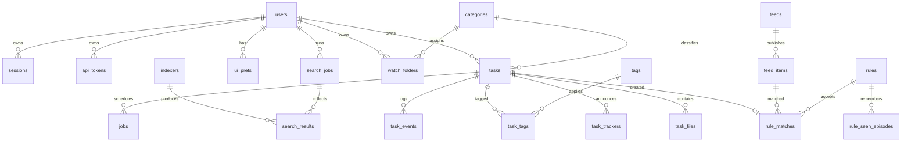

# 04 — Data Model

> **Status:** draft
> **Last reviewed:** 2026-09-01
> **Audience:** implementing agent
> **Read this before:** T001–T014 (M0), and every task that touches `internal/store/`

## Purpose
Define the complete SQLite schema of dl-tool: connection configuration, `CREATE TABLE` DDL, indices, enum
vocabularies, schema-migration policy, backup/restore and retention. It does not define HTTP payload shapes or
environment variables.

## Scope of this document
- In scope: DSN and pragmas, every table and index, every DB-level enum, the goose schema-migration policy, `VACUUM INTO`
  backup/restore, retention windows.
- Out of scope (lives instead in): HTTP JSON and status codes → [`05-api-contract.md`](05-api-contract.md);
  environment variables → [`11-config-reference.md`](11-config-reference.md); the `Engine` interface and engine
  status normalisation → [`06-download-engines.md`](06-download-engines.md); the `dlsearch/v1` YAML schema →
  [`07-search-and-indexers.md`](07-search-and-indexers.md); the RSS rule document and matching algorithm →
  [`08-rss-automation.md`](08-rss-automation.md); volumes and compose paths →
  [`10-deployment-and-compose.md`](10-deployment-and-compose.md).

---

## 1. SQLite configuration

Driver `modernc.org/sqlite v1.57.0`, registered under the driver name `"sqlite"`. Query layer
`github.com/jmoiron/sqlx v1.4.0` with `db:"col"` struct tags. Always write explicit column lists, never `SELECT *`.

### 1.1 DSN (exact string)

```
file:/config/dl-tool.db?_pragma=journal_mode(WAL)&_pragma=busy_timeout(5000)&_pragma=synchronous(NORMAL)&_pragma=foreign_keys(ON)&_txlock=immediate
```

The path segment comes from `DLTOOL_DB_PATH` (default `/config/dl-tool.db`). `modernc.org/sqlite` parses
`_pragma` (repeatable, executed verbatim) and `_txlock` with allowed values `deferred|immediate|exclusive`.

### 1.2 The four pragmas

| Pragma | Value | Reason |
|---|---|---|
| `journal_mode` | `WAL` | Readers do not block the writer. Persistent — survives reopen, unlike other modes. |
| `synchronous` | `NORMAL` | Safe in combination with WAL. |
| `foreign_keys` | `ON` | Per-connection; must be set on every connection, hence the DSN. |
| `busy_timeout` | `5000` | Milliseconds. WAL fixes reader/writer blocking, not writer/writer contention. |

### 1.3 Connection pool

```go
db.SetMaxOpenConns(1)   // serialise every statement; removes SQLITE_BUSY entirely
db.SetMaxIdleConns(1)
db.SetConnMaxLifetime(0)
```

One open connection is correct at dl-tool's write volume (order 10 writes/second). With `_txlock=immediate`
and short transactions it makes writer/writer contention structurally impossible. Do not raise it as a first
optimisation.

**IMPORTANT** The database file must live on a **local** volume (`/config`), never on NFS, SMB/CIFS or a FUSE
mount, because SQLite states: *"WAL does not work over a network filesystem. This is because WAL requires all
processes to share a small amount of memory and processes on separate host machines obviously cannot share
memory with each other."* Download destinations under `/data` may be network mounts; the database may not. At
boot, read the filesystem type of the database directory (`statfs` `f_type`, or `/proc/self/mountinfo`); if it
is `nfs`, `cifs`, `smb3` or `fuse.*`, refuse to start with a message naming the path and the mount type.

### 1.4 Type and unit conventions

| Concept | Storage | Note |
|---|---|---|
| Primary key | `TEXT` | Prefix + ULID (Crockford base32, 26 chars), e.g. `tsk_01J9Z3K7QF8N4V2XW6P0RSTBCD`. |
| Timestamp | `INTEGER` | Unix **milliseconds**. Never seconds, never a string. |
| Byte count | `INTEGER` | Bytes. |
| Rate or limit | `INTEGER` | Bytes per second; `0` means unlimited. Never KB/s. |
| Boolean | `INTEGER` | `0` or `1`, with `CHECK (col IN (0,1))`. |
| Enum | `TEXT` | With a `CHECK` constraint listing every allowed value. |
| Structured blob | `TEXT` | JSON document; the column name ends in `_json`. |

Every table except the join tables (`task_tags`, `rule_seen_episodes`) and goose's version table has
`id TEXT PRIMARY KEY`, `created_at INTEGER NOT NULL` and `updated_at INTEGER NOT NULL`.

### 1.5 ID prefix allocation

| Prefix | Table | Prefix | Table | Prefix | Table |
|---|---|---|---|---|---|
| `usr_` | `users` | `evt_` | `task_events` | `rul_` | `rules` |
| `ses_` | `sessions` | `idx_` | `indexers` | `mat_` | `rule_matches` |
| `tok_` | `api_tokens` | `sch_` | `search_jobs` | `job_` | `jobs` |
| `set_` | `settings` | `res_` | `search_results` | `bws_` | `bandwidth_schedule` |
| `eng_` | `engines` | `fed_` | `feeds` | `uip_` | `ui_prefs` |
| `cat_` | `categories` | `itm_` | `feed_items` | `wfd_` | `watch_folders` |
| `tag_` | `tags` | `tsk_` | `tasks` | `tfi_` | `task_files` |
| `ttr_` | `task_trackers` | `ntf_` | `notification_channels` | | |

---

## 2. Entity relationships



- `tasks.engine` stores the engine *kind*; `tasks.engine_ref` stores the engine-side handle (aria2 GID,
  qBittorrent infohash, yt-dlp job id). Engine-side IDs never appear in a URL.
- Peers are **not** persisted; `GET /tasks/{id}/peers` proxies the engine live.
- A rule's feed scope, patterns, episode filter, score and action all live inside `rules.definition_json`.
- `settings`, `engines`, `bandwidth_schedule` and `notification_channels` are standalone configuration tables
  with no foreign keys, so they carry no edge in the diagram.
- A task's BitTorrent identity is the pair `(infohash_v1, infohash_v2)`; a hybrid torrent populates both.

---

## 3. Schema DDL

All of the following is migration `00001_init.sql`, in this order. Do not reorder the statements.

### 3.1 Identity and access

```sql
CREATE TABLE users (
  id TEXT PRIMARY KEY,
  username TEXT NOT NULL UNIQUE COLLATE NOCASE,
  password_hash TEXT NOT NULL,          -- argon2id PHC string: $argon2id$v=19$m=19456,t=2,p=1$<salt>$<hash>
  enabled INTEGER NOT NULL DEFAULT 1 CHECK (enabled IN (0,1)),
  locale TEXT NOT NULL DEFAULT 'en', last_login_at INTEGER,
  created_at INTEGER NOT NULL, updated_at INTEGER NOT NULL);
```

**File modes are enforced, not inherited.** `UMASK` is an operator setting for downloaded data
([`10-deployment-and-compose.md`](10-deployment-and-compose.md) §4); a credential-bearing database must not
depend on it. Before `sql.Open`, the store creates or repairs the parent directory to `0700`, refuses an
existing symlink or non-regular file at `DLTOOL_DB_PATH`, and sets an existing database to `0600`. On a new
database it applies `0600` on the first connection, before migrations. SQLite's Unix VFS creates the `-wal`
and `-shm` sidecars with the database's own mode, so they follow it even under `UMASK=002`. Failure to
enforce a mode is fatal at boot, not a warning.

`users` holds **exactly one row**, created by the first-run setup wizard and never joined by another
([ADR-0019](decisions/0019-single-account-no-ownership.md)). The table shape is kept rather than collapsed
into a settings row so that adding accounts later is a migration, not a redesign. No other table references
it: there is no `owner_id` anywhere in the schema.

```sql
CREATE TABLE sessions (
  id TEXT PRIMARY KEY,
  user_id TEXT NOT NULL REFERENCES users(id) ON DELETE CASCADE,
  token_hash TEXT NOT NULL UNIQUE,      -- SHA-256 hex of the cookie value; the value itself is never stored
  csrf_token TEXT NOT NULL, expires_at INTEGER NOT NULL, last_seen_at INTEGER NOT NULL,
  ip TEXT, user_agent TEXT,
  created_at INTEGER NOT NULL, updated_at INTEGER NOT NULL);
CREATE INDEX idx_sessions_user ON sessions(user_id);
CREATE INDEX idx_sessions_expires ON sessions(expires_at);

CREATE TABLE api_tokens (
  id TEXT PRIMARY KEY,
  user_id TEXT NOT NULL REFERENCES users(id) ON DELETE CASCADE,
  name TEXT NOT NULL,
  token_hash TEXT NOT NULL UNIQUE,      -- SHA-256 hex; the bearer token is shown once, at creation
  prefix TEXT NOT NULL,                 -- first 8 characters, for display only
  last_used_at INTEGER, expires_at INTEGER, revoked_at INTEGER,
  created_at INTEGER NOT NULL, updated_at INTEGER NOT NULL);
CREATE INDEX idx_api_tokens_user ON api_tokens(user_id);
```

### 3.2 Configuration

```sql
CREATE TABLE settings (
  id TEXT PRIMARY KEY, key TEXT NOT NULL UNIQUE, value_json TEXT NOT NULL,
  created_at INTEGER NOT NULL, updated_at INTEGER NOT NULL);

CREATE TABLE engines (
  id TEXT PRIMARY KEY,
  kind TEXT NOT NULL UNIQUE CHECK (kind IN ('aria2','qbittorrent','ytdlp')),
  name TEXT NOT NULL, enabled INTEGER NOT NULL DEFAULT 1 CHECK (enabled IN (0,1)),
  url TEXT,                             -- aria2 JSON-RPC URL / qBittorrent base URL; NULL for ytdlp
  username TEXT,
  secret_enc TEXT,                      -- encrypted at rest; never returned by an API, never logged
  binary_path TEXT,                     -- ytdlp only
  version TEXT,                         -- written by the boot capability probe: the resolved engine version,
                                        -- and for 'ytdlp' the yt-dlp version and the JS runtime version
  last_seen_at INTEGER, last_error TEXT,
  created_at INTEGER NOT NULL, updated_at INTEGER NOT NULL);

CREATE TABLE categories (
  id TEXT PRIMARY KEY, name TEXT NOT NULL UNIQUE, save_path TEXT NOT NULL,
  created_at INTEGER NOT NULL, updated_at INTEGER NOT NULL);

CREATE TABLE tags (
  id TEXT PRIMARY KEY, name TEXT NOT NULL UNIQUE,
  created_at INTEGER NOT NULL, updated_at INTEGER NOT NULL);

CREATE TABLE notification_channels (
  id TEXT PRIMARY KEY,
  kind TEXT NOT NULL CHECK (kind IN ('webhook','ntfy','gotify','apprise')),
  name TEXT NOT NULL UNIQUE,
  enabled INTEGER NOT NULL DEFAULT 1 CHECK (enabled IN (0,1)),
  config_json TEXT NOT NULL,            -- non-secret channel configuration; shape per kind, see §4.8
  secret_enc TEXT,                      -- encrypted at rest; never returned by an API, never logged
  event_mask TEXT NOT NULL DEFAULT '["*"]',  -- JSON array of task_events.code values; ["*"] = every code
  last_send_at INTEGER,                 -- unix ms of the last delivery attempt; written by T077
  last_error TEXT,                      -- failure text of the last attempt, NULL after a success
  created_at INTEGER NOT NULL, updated_at INTEGER NOT NULL);
CREATE INDEX idx_notification_channels_enabled ON notification_channels(enabled);
```

There is no column, and no setting, describing what to do with a transfer dl-tool did not create. dl-tool
assumes exclusive control of every configured engine: such a transfer is never inserted into `tasks` and
never listed → [ADR-0017](decisions/0017-exclusive-control-of-engines.md).

Three `settings` rows carry the concurrency and disk-reservation limits. `00001_init.sql` seeds all three:

| `settings.key` | `value_json` shape | Seeded value |
|---|---|---|
| `max_active_total` | integer, `0` = unlimited | `5` |
| `max_active_per_engine` | integer, `0` = unlimited | `3` |
| `min_free_space` | object, data-root path → bytes | `{}` |

The empty `min_free_space` object keeps the SQL migration independent of host paths. A missing root entry
uses the default owned by [`11-config-reference.md` §5](11-config-reference.md#5-database-backed-settings).
The reserved zero-time ULIDs make these migration-owned rows stable while preserving the ID format:

```sql
INSERT INTO settings (id, key, value_json, created_at, updated_at) VALUES
  ('set_00000000000000000000000001', 'max_active_total', '5', 0, 0),
  ('set_00000000000000000000000002', 'max_active_per_engine', '3', 0, 0),
  ('set_00000000000000000000000003', 'min_free_space', '{}', 0, 0);
```

Tasks in state `seeding` count toward no `max_active_*` limit. The complete settings key list and its
defaults live in [`11-config-reference.md`](11-config-reference.md#5-database-backed-settings).

### 3.3 Tasks

```sql
CREATE TABLE tasks (
  id TEXT PRIMARY KEY,
  engine TEXT NOT NULL CHECK (engine IN ('aria2','qbittorrent','ytdlp')),
  engine_ref TEXT,                      -- aria2 GID | qBittorrent infohash | yt-dlp job id; NULL until accepted
  source_kind TEXT NOT NULL CHECK (source_kind IN ('http','ftp','sftp','magnet','torrent','metalink','media')),
  source_uri TEXT,                       -- server-only engine/recovery source; may contain provider credentials
  source_display_uri TEXT,               -- API-safe; search-result:<res_id> for a grabbed result
  name TEXT NOT NULL,
  infohash_v1 TEXT,                     -- exactly 40 lowercase hex chars, or NULL
  infohash_v2 TEXT,                     -- exactly 64 lowercase hex chars, or NULL
  state TEXT NOT NULL CHECK (state IN ('queued','downloading','seeding','paused','checking',
                                       'extracting','moving','completed','error','removed')),
  error_code TEXT CHECK (error_code IS NULL OR error_code IN (
    'broken_link','destination_not_exist','destination_denied','disk_full','quota_reached','timeout',
    'exceed_max_file_system_size','exceed_max_destination_size','exceed_max_temp_size',
    'encrypted_name_too_long','name_too_long','torrent_duplicate','file_not_exist',
    'required_premium_account','not_supported_type','try_it_later','task_encryption','missing_python',
    'private_video','ftp_encryption_not_supported_type','extract_failed','extract_failed_wrong_password',
    'extract_failed_invalid_archive','extract_failed_quota_reached','extract_failed_disk_full','unknown',
    'ssrf_blocked','path_rejected','engine_unavailable','unsupported_scheme',
    'concurrency_limit','js_runtime_missing')),
  error_message TEXT, destination TEXT NOT NULL,
  requested_destination TEXT,             -- what the client asked for, when the server resolved a
                                         -- different effective destination (FR-044); NULL when identical
  content_path TEXT,                    -- absolute path to the finished file or directory
  category_id TEXT REFERENCES categories(id) ON DELETE SET NULL,
  total_bytes INTEGER,                  -- NULL while metadata is unknown
  completed_bytes INTEGER NOT NULL DEFAULT 0, uploaded_bytes INTEGER NOT NULL DEFAULT 0,
  download_rate INTEGER NOT NULL DEFAULT 0, upload_rate INTEGER NOT NULL DEFAULT 0,
  eta_seconds INTEGER, ratio REAL NOT NULL DEFAULT 0,
  total_peers INTEGER NOT NULL DEFAULT 0, connected_seeders INTEGER NOT NULL DEFAULT 0,
  connected_leechers INTEGER NOT NULL DEFAULT 0,
  dl_limit INTEGER NOT NULL DEFAULT 0, ul_limit INTEGER NOT NULL DEFAULT 0,
  ratio_limit REAL, seeding_time_limit INTEGER,          -- seconds
  sequential INTEGER NOT NULL DEFAULT 0 CHECK (sequential IN (0,1)),
  queue_position INTEGER,
  unzip_progress INTEGER,               -- 0-100, only while state = 'extracting'
  extract_password TEXT,                -- secret: never returned by an API, never logged; encrypted
                                         -- at rest with DLTOOL_SECRET_KEY (11-config-reference.md §6)
  added_at INTEGER NOT NULL, started_at INTEGER, completed_at INTEGER,
  created_at INTEGER NOT NULL, updated_at INTEGER NOT NULL);
CREATE UNIQUE INDEX idx_tasks_engine_ref ON tasks(engine, engine_ref) WHERE engine_ref IS NOT NULL AND state <> 'removed';
CREATE UNIQUE INDEX idx_tasks_infohash_v1 ON tasks(infohash_v1) WHERE infohash_v1 IS NOT NULL AND state <> 'removed';
CREATE UNIQUE INDEX idx_tasks_infohash_v2 ON tasks(infohash_v2) WHERE infohash_v2 IS NOT NULL AND state <> 'removed';
CREATE INDEX idx_tasks_state ON tasks(state, added_at DESC);
CREATE INDEX idx_tasks_category ON tasks(category_id);
CREATE INDEX idx_tasks_updated ON tasks(updated_at);

CREATE TABLE task_tags (
  task_id TEXT NOT NULL REFERENCES tasks(id) ON DELETE CASCADE,
  tag_id TEXT NOT NULL REFERENCES tags(id) ON DELETE CASCADE,
  PRIMARY KEY (task_id, tag_id));
CREATE INDEX idx_task_tags_tag ON task_tags(tag_id);

CREATE TABLE task_files (
  id TEXT PRIMARY KEY,
  task_id TEXT NOT NULL REFERENCES tasks(id) ON DELETE CASCADE,
  file_index INTEGER NOT NULL,          -- engine-side index, 0-based
  path TEXT NOT NULL,                   -- relative to tasks.destination
  size_bytes INTEGER NOT NULL DEFAULT 0, completed_bytes INTEGER NOT NULL DEFAULT 0,
  selected INTEGER NOT NULL DEFAULT 1 CHECK (selected IN (0,1)),
  priority INTEGER CHECK (priority IS NULL OR priority IN (0,1,6,7)),
  created_at INTEGER NOT NULL, updated_at INTEGER NOT NULL);
CREATE UNIQUE INDEX idx_task_files_idx ON task_files(task_id, file_index);

CREATE TABLE task_trackers (
  id TEXT PRIMARY KEY,
  task_id TEXT NOT NULL REFERENCES tasks(id) ON DELETE CASCADE,
  url TEXT NOT NULL,
  status TEXT,                          -- engine-reported string, stored verbatim
  update_timer_seconds INTEGER, seeds INTEGER, peers INTEGER, message TEXT,
  created_at INTEGER NOT NULL, updated_at INTEGER NOT NULL);
CREATE UNIQUE INDEX idx_task_trackers_url ON task_trackers(task_id, url);

CREATE TABLE task_events (
  id TEXT PRIMARY KEY,
  task_id TEXT NOT NULL REFERENCES tasks(id) ON DELETE CASCADE,
  at INTEGER NOT NULL,                  -- unix ms
  level TEXT NOT NULL CHECK (level IN ('info','warn','error')),
  code TEXT NOT NULL,                   -- stable i18n key: 'engine.accepted', 'postprocess.unrar.failed', ...
  message TEXT NOT NULL, detail_json TEXT,
  created_at INTEGER NOT NULL, updated_at INTEGER NOT NULL);
CREATE INDEX idx_task_events_task ON task_events(task_id, at DESC);
CREATE INDEX idx_task_events_at ON task_events(at);
```

Every state transition and every job attempt writes one `task_events` row. `code` is machine-readable so the
UI can translate it with i18next.

Application-level removal never deletes a `tasks` row. In one transaction it inserts the removal event and
sets `state = 'removed'`, `engine_ref = NULL`, both rates to zero and `eta_seconds = NULL`. Child rows remain
attached so the event and file history stay queryable. Excluding tombstones from the unique indexes releases
their engine and infohash identities, allowing the same transfer to be submitted again.

**Infohash normalisation at ingest.** Every hash is stored lowercase hex, never base32 and never uppercase.

| Input | Stored |
|---|---|
| `xt=urn:btih:<40 hex>` | `infohash_v1` verbatim, lowercased |
| `xt=urn:btih:<32 base32 chars>` | base32-decoded to 20 bytes, hex-encoded → `infohash_v1` |
| `xt=urn:btmh:1220<64 hex>` | the 64 hex digits after the `1220` multihash prefix → `infohash_v2` |
| `.torrent` file, v1 | `infohash_v1` from the bencoded info dictionary |
| `.torrent` file, v2 or hybrid | `infohash_v2`, plus `infohash_v1` when the file is hybrid |

A hybrid torrent is one task carrying both columns, so a later submission by either magnet form resolves to
the same row and is rejected with `torrent_duplicate`. Resolve both hashes from metadata before inserting;
adding a hybrid torrent by its v2 magnet alone must not create a second row. Parsing is
`github.com/anacrolix/torrent/metainfo` in `internal/uri/`; the engine-side mapping is in
[`06-download-engines.md`](06-download-engines.md).

### 3.4 Search

```sql
CREATE TABLE indexers (
  id TEXT PRIMARY KEY, name TEXT NOT NULL,
  kind TEXT NOT NULL CHECK (kind IN ('torznab','newznab','dlsearch')),
  enabled INTEGER NOT NULL DEFAULT 0 CHECK (enabled IN (0,1)),   -- imported indexers start disabled
  url TEXT,                             -- Torznab/Newznab base URL
  api_key_enc TEXT,                     -- encrypted at rest; never returned by an API
  definition_id TEXT,                   -- dlsearch engine id, e.g. 'internet-archive'
  definition_source TEXT CHECK (definition_source IS NULL OR definition_source IN ('bundled','user','imported')),
  provenance TEXT,                      -- shown in the UI, e.g. 'imported from jackett.dlm'
  legal_tier TEXT NOT NULL DEFAULT 'user-supplied' CHECK (legal_tier IN ('legitimate','user-supplied')),
  priority INTEGER NOT NULL DEFAULT 50,
  allow_private_network INTEGER NOT NULL DEFAULT 0 CHECK (allow_private_network IN (0,1)),
  seeders_unknown INTEGER NOT NULL DEFAULT 0 CHECK (seeders_unknown IN (0,1)),
  settings_json TEXT, categories_json TEXT, last_test_at INTEGER, last_error TEXT,
  created_at INTEGER NOT NULL, updated_at INTEGER NOT NULL);
CREATE UNIQUE INDEX idx_indexers_definition ON indexers(definition_id) WHERE definition_id IS NOT NULL;

CREATE TABLE search_jobs (
  id TEXT PRIMARY KEY,
  query TEXT NOT NULL,
  indexer_ids_json TEXT NOT NULL,       -- JSON array of indexers.id
  categories_json TEXT,                 -- JSON array of newznab category ids
  finished INTEGER NOT NULL DEFAULT 0 CHECK (finished IN (0,1)),
  total INTEGER NOT NULL DEFAULT 0, last_error TEXT,
  started_at INTEGER NOT NULL, finished_at INTEGER,
  created_at INTEGER NOT NULL, updated_at INTEGER NOT NULL);
CREATE INDEX idx_search_jobs_created ON search_jobs(created_at);

CREATE TABLE search_results (
  id TEXT PRIMARY KEY,
  search_job_id TEXT NOT NULL REFERENCES search_jobs(id) ON DELETE CASCADE,
  indexer_id TEXT NOT NULL REFERENCES indexers(id) ON DELETE CASCADE,
  -- Provider URLs and magnets are server-only acquisition data; never serialize them.
  title TEXT NOT NULL, download_url TEXT, magnet_uri TEXT, info_hash TEXT, size_bytes INTEGER,
  seeders INTEGER,                      -- NULL when unknown; never -1, never a fabricated 1
  leechers INTEGER,                     -- leechers = peers - seeders when only peers is given
  grabs INTEGER, published_at INTEGER, details_url TEXT,
  category_ids_json TEXT, category_desc TEXT,
  download_volume_factor REAL NOT NULL DEFAULT 1.0, upload_volume_factor REAL NOT NULL DEFAULT 1.0,
  minimum_ratio REAL, minimum_seed_time_seconds INTEGER,
  imdb_id TEXT, tmdb_id TEXT, tvdb_id TEXT, year INTEGER,
  genre TEXT, language TEXT, publisher TEXT, author TEXT, album TEXT, artist TEXT,
  created_at INTEGER NOT NULL, updated_at INTEGER NOT NULL);
CREATE INDEX idx_search_results_job ON search_results(search_job_id);
```

### 3.5 RSS

```sql
CREATE TABLE feeds (
  id TEXT PRIMARY KEY, url TEXT NOT NULL UNIQUE, title TEXT,
  enabled INTEGER NOT NULL DEFAULT 1 CHECK (enabled IN (0,1)),
  refresh_interval_s INTEGER NOT NULL DEFAULT 0,   -- 0 = use the global RSS interval setting
  item_cap INTEGER NOT NULL DEFAULT 50,            -- retained feed_items per feed
  priority INTEGER NOT NULL DEFAULT 0,             -- per-run tie-break in 08 §5 step 13; lower wins
  etag TEXT,
  last_modified TEXT,                   -- verbatim HTTP-date string, replayed as If-Modified-Since
  ttl_minutes INTEGER, last_fetch_at INTEGER, last_success_at INTEGER,
  next_fetch_at INTEGER NOT NULL, escalation_level INTEGER NOT NULL DEFAULT 0,
  disabled_till INTEGER, last_error TEXT,
  created_at INTEGER NOT NULL, updated_at INTEGER NOT NULL);
CREATE INDEX idx_feeds_next_fetch ON feeds(next_fetch_at) WHERE enabled = 1;

CREATE TABLE feed_items (
  id TEXT PRIMARY KEY,
  feed_id TEXT NOT NULL REFERENCES feeds(id) ON DELETE CASCADE,
  guid TEXT,                            -- raw <guid>/<id>, NULL when absent
  identity TEXT NOT NULL,               -- resolved dedup identity
  title TEXT NOT NULL,
  title_norm TEXT NOT NULL,             -- lowercased, [._] -> space, whitespace collapsed
  link TEXT,
  download_url TEXT,                    -- .torrent URL or magnet:
  info_hash TEXT,                       -- lowercase hex: 40 chars (v1) or 64 chars (v2); NULL when unknown
  size_bytes INTEGER, published_at INTEGER, first_seen_at INTEGER NOT NULL,
  read INTEGER NOT NULL DEFAULT 0 CHECK (read IN (0,1)),  -- 1 once the user marks the item read
  raw_json TEXT,                        -- full parsed item; feeds the dry-run panel
  created_at INTEGER NOT NULL, updated_at INTEGER NOT NULL);
CREATE UNIQUE INDEX idx_feed_items_identity ON feed_items(feed_id, identity);
CREATE INDEX idx_feed_items_read ON feed_items(feed_id, read, published_at DESC);
CREATE INDEX idx_feed_items_hash ON feed_items(info_hash);
CREATE INDEX idx_feed_items_norm ON feed_items(title_norm);
CREATE INDEX idx_feed_items_pub ON feed_items(feed_id, published_at DESC);

CREATE TABLE rules (
  id TEXT PRIMARY KEY, name TEXT NOT NULL UNIQUE,
  enabled INTEGER NOT NULL DEFAULT 1 CHECK (enabled IN (0,1)),
  priority INTEGER NOT NULL DEFAULT 0,  -- lower is evaluated first; ties broken by name
  definition_json TEXT NOT NULL,        -- the rule document; schema in 08-rss-automation.md
  last_match_at INTEGER,
  created_at INTEGER NOT NULL, updated_at INTEGER NOT NULL);

CREATE TABLE rule_matches (
  id TEXT PRIMARY KEY,
  rule_id TEXT REFERENCES rules(id) ON DELETE SET NULL,
  feed_item_id TEXT REFERENCES feed_items(id) ON DELETE SET NULL,
  task_id TEXT REFERENCES tasks(id) ON DELETE SET NULL,
  info_hash TEXT,                       -- back-filled after the .torrent is fetched; 40 or 64 lowercase hex
  content_key TEXT,                     -- e.g. 'tv:the-show:s01e05'
  title TEXT NOT NULL,
  status TEXT NOT NULL CHECK (status IN ('queued','sent','failed','rejected','fallback')),
  reason TEXT,                          -- rejection reason code; vocabulary in 08-rss-automation.md
  score INTEGER NOT NULL DEFAULT 0, matched_at INTEGER NOT NULL,
  created_at INTEGER NOT NULL, updated_at INTEGER NOT NULL);
CREATE UNIQUE INDEX idx_rule_matches_hash ON rule_matches(info_hash) WHERE info_hash IS NOT NULL;
CREATE INDEX idx_rule_matches_key ON rule_matches(content_key) WHERE content_key IS NOT NULL;
CREATE INDEX idx_rule_matches_rule ON rule_matches(rule_id, matched_at DESC);

CREATE TABLE rule_seen_episodes (
  rule_id TEXT NOT NULL REFERENCES rules(id) ON DELETE CASCADE,
  episode_key TEXT NOT NULL,            -- '1x5', '1x5-REPACK', '2017.01.01'
  seen_at INTEGER NOT NULL,
  PRIMARY KEY (rule_id, episode_key));
```

`rule_matches` and `rule_seen_episodes` are the correctness boundary for dedup; never prune them
automatically. Expose a per-row "forget" action instead.

`feed_items.info_hash` and `rule_matches.info_hash` accept both widths so a v2-only or hybrid release
deduplicates against `tasks.infohash_v1` and `tasks.infohash_v2`. Compare a 40-hex value against
`infohash_v1` and a 64-hex value against `infohash_v2`; never truncate a v2 hash to 40 characters for
comparison.

### 3.6 Jobs, schedule and preferences

```sql
CREATE TABLE jobs (
  id TEXT PRIMARY KEY,
  kind TEXT NOT NULL,                   -- 'postprocess' | 'extract' | 'move' | 'webhook' | 'rss_poll' | ...
  task_id TEXT REFERENCES tasks(id) ON DELETE CASCADE,
  payload_json TEXT NOT NULL,
  state TEXT NOT NULL DEFAULT 'pending' CHECK (state IN ('pending','running','done','failed')),
  attempts INTEGER NOT NULL DEFAULT 0, max_attempts INTEGER NOT NULL DEFAULT 5,
  run_after INTEGER NOT NULL,           -- unix ms
  locked_at INTEGER,                    -- unix ms, NULL when unclaimed
  last_error TEXT,
  created_at INTEGER NOT NULL, updated_at INTEGER NOT NULL);
CREATE INDEX idx_jobs_claim ON jobs(state, run_after);

CREATE TABLE bandwidth_schedule (
  id TEXT PRIMARY KEY,
  day INTEGER NOT NULL CHECK (day BETWEEN 0 AND 6),      -- 0 = Monday
  hour INTEGER NOT NULL CHECK (hour BETWEEN 0 AND 23),
  mode TEXT NOT NULL CHECK (mode IN ('no_download','default','alternative')),
  created_at INTEGER NOT NULL, updated_at INTEGER NOT NULL);
CREATE UNIQUE INDEX idx_bandwidth_schedule_cell ON bandwidth_schedule(day, hour);

CREATE TABLE ui_prefs (
  id TEXT PRIMARY KEY,
  user_id TEXT NOT NULL REFERENCES users(id) ON DELETE CASCADE,
  key TEXT NOT NULL, value_json TEXT NOT NULL,
  created_at INTEGER NOT NULL, updated_at INTEGER NOT NULL);
CREATE UNIQUE INDEX idx_ui_prefs_key ON ui_prefs(user_id, key);

CREATE TABLE watch_folders (
  id TEXT PRIMARY KEY, path TEXT NOT NULL UNIQUE,
  enabled INTEGER NOT NULL DEFAULT 1 CHECK (enabled IN (0,1)),
  destination TEXT NOT NULL,
  category_id TEXT REFERENCES categories(id) ON DELETE SET NULL,
  delete_after_load INTEGER NOT NULL DEFAULT 0 CHECK (delete_after_load IN (0,1)),
  poll_interval_s INTEGER NOT NULL DEFAULT 10,   -- polling fallback when inotify registration fails
  last_scan_at INTEGER, last_error TEXT,
  created_at INTEGER NOT NULL, updated_at INTEGER NOT NULL);
```

`bandwidth_schedule` holds exactly 168 rows, seeded by `00001_init.sql` with `mode = 'default'`. Its reserved
zero-time ULIDs encode `day * 24 + hour` in the last three digits:

```sql
WITH RECURSIVE
  days(day) AS (VALUES (0) UNION ALL SELECT day + 1 FROM days WHERE day < 6),
  hours(hour) AS (VALUES (0) UNION ALL SELECT hour + 1 FROM hours WHERE hour < 23)
INSERT INTO bandwidth_schedule (id, day, hour, mode, created_at, updated_at)
-- Prefix + 23 zeros + 3 digits is one 30-character prefixed ULID.
SELECT printf('bws_00000000000000000000000%03d', day * 24 + hour),
       day, hour, 'default', 0, 0
FROM days CROSS JOIN hours;
```

`PUT /settings/schedule` replaces all 168 in one transaction.

Job worker rules — see [ADR-0015](decisions/0015-db-backed-in-process-job-queue.md):
1. **At-least-once.** Every handler must be idempotent, keyed on `(kind, task_id)`.
2. **On boot**, run `UPDATE jobs SET state='pending', locked_at=NULL WHERE state='running';`.
3. **Backoff:** `run_after = now_ms + min(600000, 5000 * 2^attempts)`. At `attempts >= max_attempts` set
   `state='failed'` and write a `task_events` row; the `failed` rows are the dead-letter queue.

Claim statement (SQLite supports `RETURNING` since 3.35):

```sql
UPDATE jobs
   SET state = 'running', locked_at = :now, attempts = attempts + 1, updated_at = :now
 WHERE id = (SELECT id FROM jobs
              WHERE state = 'pending' AND run_after <= :now
              ORDER BY run_after LIMIT 1)
RETURNING id, kind, task_id, payload_json, attempts, max_attempts;
```

---

## 4. Enum vocabularies

### 4.1 `tasks.state`

| Value | Meaning | Sidebar filter membership |
|---|---|---|
| `queued` | Accepted, not transferring. | All, Inactive |
| `downloading` | Bytes are arriving. | All, Downloading, Active |
| `seeding` | Complete, uploading. | All, Completed, Active |
| `paused` | Paused by a user. | All, Inactive, Stopped |
| `checking` | Hash-checking existing data. | All |
| `extracting` | Post-processing archive extraction. | All |
| `moving` | Post-processing move to the final destination. | All |
| `completed` | Finished, not seeding. | All, Completed |
| `error` | Terminal failure; `error_code` is set. | All, Inactive, Error |
| `removed` | Soft-deleted; the row is retained for the event log. | none |

Download Station status mapping: `waiting`→`queued`, `filehosting_waiting`→`queued`, `finishing`→`moving`,
`finished`→`completed`, `hash_checking`→`checking`. The aria2, qBittorrent and Transmission normalisation
tables live in [`06-download-engines.md`](06-download-engines.md).

### 4.2 `tasks.error_code`

Twenty-six values adopted verbatim from Download Station's `error_detail` vocabulary:

```
broken_link                    destination_not_exist          destination_denied
disk_full                      quota_reached                  timeout
exceed_max_file_system_size    exceed_max_destination_size    exceed_max_temp_size
encrypted_name_too_long        name_too_long                  torrent_duplicate
file_not_exist                 required_premium_account       not_supported_type
try_it_later                   task_encryption                missing_python
private_video                  ftp_encryption_not_supported_type
extract_failed                 extract_failed_wrong_password  extract_failed_invalid_archive
extract_failed_quota_reached   extract_failed_disk_full       unknown
```

Plus six dl-tool additions:

| Value | Raised when |
|---|---|
| `ssrf_blocked` | The source URL resolved to a blocked address range. |
| `path_rejected` | The destination failed path-safety validation. |
| `concurrency_limit` | A `max_active_*` limit holds the task in `queued`; distinct from `disk_full`. |
| `engine_unavailable` | The routed engine did not respond. |
| `unsupported_scheme` | The URI scheme has no engine, for example `ed2k://`. |
| `js_runtime_missing` | The yt-dlp JS runtime (`DLTOOL_JS_RUNTIME_PATH`) is absent, so the media lane is disabled. |

`missing_python`, `required_premium_account` and `private_video` are inherited from Download Station's
vocabulary for completeness; dl-tool itself never raises them.

### 4.3 `task_files.priority`

The stored values are the qBittorrent WebAPI vocabulary, verified in `release-5.2.3`
`src/base/bittorrent/downloadpriority.h` (`Ignored = 0, Normal = 1, High = 6, Maximum = 7, Mixed = -1`).
That enum's fifth member, `Mixed = -1`, is never stored by dl-tool.

| Value | Canonical name | Meaning |
|---|---|---|
| `0` | `skip` | The file is not downloaded; this is how deselection is expressed. |
| `1` | `normal` | Default priority. |
| `6` | `high` | Downloaded ahead of `normal` files. |
| `7` | `maximum` | Downloaded first. |

There is no distinct `low`: Download Station's four-level skip/low/normal/high collapses `low` → `normal`,
so the UI offers skip, normal, high and maximum only. aria2 has no per-file numeric
priority — only `--select-file`, which is a selection — so an aria2 task stores `priority` as `NULL` and
drives `selected` alone. The per-engine mapping is in [`06-download-engines.md`](06-download-engines.md).

### 4.4 `jobs.state`

| Value | Meaning |
|---|---|
| `pending` | Claimable once `run_after <= now`. |
| `running` | Claimed by a worker; reset to `pending` on boot. |
| `done` | The handler returned without error. |
| `failed` | `attempts >= max_attempts`; acts as the dead-letter queue. |

### 4.5 `indexers.kind`

| Value | Meaning |
|---|---|
| `torznab` | Torznab endpoint (Prowlarr, Jackett, bitmagnet). |
| `newznab` | Newznab endpoint; same client, NZB result payloads. |
| `dlsearch` | A `dlsearch/v1` YAML definition; `definition_id` names it. |

### 4.6 `rules.definition_json` → `match.mode`

| Value | Semantics |
|---|---|
| `wildcard` | Default. `*` → `.*`, `?` → `.`, unanchored; whitespace splits an entry into AND-ed tokens. |
| `regex` | The entry is one regular expression, used as-is. |
| `plain` | The entry is escaped literally; whitespace still splits it into AND-ed tokens. |

### 4.7 Concurrency limit versus disk space

Two independent reasons a task waits, two error codes. Never conflate them.

| Dimension | Concurrency limit | Disk space |
|---|---|---|
| Where it lives | `settings` keys `max_active_total` and `max_active_per_engine` | `settings` key `min_free_space`, per data root |
| What it measures | Count of started tasks, that is states `downloading`, `checking`, `extracting` and `moving`; `seeding` is excluded | Free bytes on the destination's filesystem, less the committed-but-unwritten bytes of active tasks sharing it |
| Breach at creation | Accept the task and hold it in `queued`, `error_code = 'concurrency_limit'` | Accept the task and hold it in `queued`, `error_code = 'disk_full'` |
| Breach later | The task starts as soon as a slot frees | A running task is paused with `disk_full`; `ENOSPC` never deletes partial data |
| Scope | Global and per engine | Per data root |

There is no per-user storage quota and no per-user concurrency limit: dl-tool has one account
([ADR-0019](decisions/0019-single-account-no-ownership.md)).

### 4.8 `notification_channels.kind`

| Value | `config_json` keys | `secret_enc` holds |
|---|---|---|
| `webhook` | `url`, `method`, `headers`, `body_template` | Any secret header value or bearer token |
| `ntfy` | `server_url`, `topic`, `priority`, `tags`, `click_url` | The access token |
| `gotify` | `server_url`, `priority` | The application token |
| `apprise` | `base_url`, `config_key`, `urls`, `tag`, `type`, `format` | Credentials embedded in `urls` |

`event_mask` is a JSON array of `task_events.code` values; `["*"]` selects every code. The column has no
`CHECK` because `task_events.code` is an open, additive vocabulary. Delivery is one `jobs` row per channel
per event, so a failing channel retries on the standard backoff without blocking the others.

---

## 5. Schema migration policy

Library `github.com/pressly/goose/v3 v3.27.3`, embedded, run at boot before the HTTP listener starts.

```go
//go:embed migrations/*.sql
var embedMigrations embed.FS

goose.SetBaseFS(embedMigrations)
goose.SetDialect("sqlite3")
goose.Up(db, "migrations")
```

- Files live in `internal/store/migrations/`, named `00001_init.sql`, `00002_<change>.sql`, … Five digits,
  monotonically increasing, never renumbered and never edited once merged.
- Each file contains `-- +goose Up` and `-- +goose Down` markers. A `Down` section is mandatory, even when it
  only drops the tables the `Up` created.
- Read the applied and highest embedded versions before taking a backup or running goose.
- Refuse to start when the applied version is newer, logging both versions; never attempt a downgrade.
- When both versions match, skip both backup and migration. On a new database at version `0`, migrate without
  creating an empty rollback backup.
- Only when `0 < applied < embedded` take a `VACUUM INTO` backup before migration. Name it
  `/config/backups/dl-tool.db.pre-migration-<from>-to-<to>.<UTC>.bak`, where `<UTC>` is the backup start time
  converted to UTC and formatted with `20060102T150405.000000000Z`. Write to a unique temporary path in that
  directory, then atomically rename it. Abort before goose if any backup step fails. After the rename and
  directory fsync succeed, log the final path used for rollback.

```sql
SELECT MAX(version_id) FROM goose_db_version WHERE is_applied = 1;
```

A missing version table or a `NULL` applied maximum is schema version `0` only when `sqlite_schema` contains
no object — table, view, trigger or index — except `goose_db_version` and SQLite-owned names beginning
`sqlite_`. Refuse any other database without applied goose history as an unrecognised schema; never migrate
into a foreign database. No other query error is suppressed. The table name is verified
against goose v3.27.3: `version.go` initializes its package-level table name to
`goose_db_version`, and the SQLite dialect creates `version_id` as an integer.

- Run `PRAGMA integrity_check;` once per `store.Open` invocation at boot, not per pooled connection,
  including when goose had nothing to apply. Read every result row and fail `Open` unless the result is
  exactly one row equal to `ok`.

---

## 6. Backup and restore

```sql
VACUUM INTO '/config/backups/dl-tool.db.20260901T120000Z.bak';
```

- SQLite: *"The VACUUM INTO command is transactional in the sense that the generated output database is a
  consistent snapshot of the original database."*
- **The target file must not already exist**, or must be an empty file, or the command fails with an error.
  Generate a fresh UTC timestamp for every run; never reuse a name.
- An interrupted `VACUUM INTO` (unplanned shutdown, power loss) can leave an incomplete and corrupt output.
  Create the unique temporary target inside `/config/backups/` with `O_CREATE|O_EXCL` and mode `0600` and
  close it before running the statement; then check its integrity, enforce `0600`, fsync it, `rename()` it
  into place and fsync the directory. `O_EXCL` is what makes a colliding name an error rather than a
  silent overwrite of somebody else's backup.
- Schedule: nightly via `github.com/robfig/cron/v3 v3.0.1`, retaining the newest 7 files matching exactly
  `dl-tool.db.<UTC>.bak`. Pre-migration and replaced-database backups are never counted or pruned by this job.
  The same operation is exposed at `POST /system/backup`.
- The server and restore CLI acquire an exclusive non-blocking `flock` on `DLTOOL_DB_PATH + ".lock"`. The
  stable mode-`0600` lock file is never replaced or removed; the server holds its descriptor until shutdown.

Restore is supported only through `dl-tool restore --from <file>`. The command acquires the process lock,
integrity-checks the source, stages and fsyncs a mode-`0600` copy beside the database, preserves a consistent
copy of the current database, checkpoints it, clears its sidecars, then atomically renames the staged file
over `DLTOOL_DB_PATH` and fsyncs the directory. It accepts schema versions at or below the embedded maximum;
boot migrates an older restore forward. Directly deleting or copying the live database or its WAL sidecars is
unsupported. The exact procedure is in [`17-operations-and-runbook.md` §3.4](17-operations-and-runbook.md#34-dl-tool-restore---from-file).

---

## 7. Retention

| Table | Window | Job |
|---|---|---|
| `task_events` | 90 days | Nightly cron: `DELETE FROM task_events WHERE at < :cutoff_ms;` |
| `feed_items` | Newest `feeds.item_cap` rows per feed, default 50 | After each successful feed poll |
| `search_jobs` | 24 hours from `created_at` | Hourly cron |
| `search_results` | 24 hours, via the `search_jobs` cascade | Follows `ON DELETE CASCADE` |
| `jobs` | `state = 'done'` older than 7 days | Nightly cron; `failed` rows are kept |

`rule_matches`, `rule_seen_episodes`, `tasks` and every configuration table are never pruned automatically.

---

## 8. Table reachability

Every table is reachable from [`05-api-contract.md`](05-api-contract.md) or is marked internal-only here. A
new table added by a later migration must be added to this list in the same change.

| Table | Reached through |
|---|---|
| `users` | `/account`, `/auth/me` |
| `sessions` | **internal-only** — written by `/auth/login` and expired by the reaper; no endpoint enumerates rows |
| `api_tokens` | `/api-tokens` |
| `settings` | `/settings`, `/settings/export`, `/settings/import` |
| `engines` | `/engines`, `/engines/{id}/test` |
| `categories` | `/categories` |
| `tags` | `/tags` |
| `notification_channels` | `/notifications`, `/notifications/{id}/test` |
| `tasks` | `/tasks`, `/tasks/{id}` |
| `task_tags` | `/tasks` and `PATCH /tasks/{id}`, through the Task object's `tags[]` |
| `task_files` | `/tasks/{id}/files` |
| `task_trackers` | `/tasks/{id}/trackers` |
| `task_events` | `/tasks/{id}/events` |
| `indexers` | `/indexers`, `/indexers/{id}/test`, `/indexers/import` |
| `search_jobs` | `/search`, `/search/{id}` |
| `search_results` | metadata through `GET /search/{id}`; acquisition through `POST /tasks` by opaque result id |
| `feeds` | `/feeds`, `/feeds/{id}/refresh` |
| `feed_items` | `/feeds/{id}/items` |
| `rules` | `/rules`, `/rules/{id}/run` |
| `rule_matches` | `POST /rules/test`, `GET /feeds/{id}/items` |
| `rule_seen_episodes` | `POST /rules/test`, as `previouslyMatchedEpisodes` |
| `jobs` | **internal-only** — worker state; only aggregate counts leave the process, on `GET /system/info` |
| `bandwidth_schedule` | `GET /settings/schedule`, `PUT /settings/schedule` |
| `ui_prefs` | `GET /prefs`, `PUT /prefs` |
| `watch_folders` | `/watch-folders`, `/watch-folders/{id}/scan` |
| `goose_db_version` | **internal-only** — owned by goose; the applied version is reported by `GET /system/info` |

---

## Decisions referenced
| ADR | Decision |
|---|---|
| [ADR-0004](decisions/0004-sqlite-as-the-only-datastore.md) | SQLite as the only datastore |
| [ADR-0005](decisions/0005-aria2-qbittorrent-ytdlp-engines.md) | aria2, qBittorrent and yt-dlp as the v1 engines |
| [ADR-0008](decisions/0008-torznab-first-declarative-yaml-second.md) | Torznab first, declarative YAML engines second |
| [ADR-0009](decisions/0009-native-cross-protocol-rss-rules.md) | A native cross-protocol RSS rule engine |
| [ADR-0013](decisions/0013-mandatory-built-in-authentication.md) | Mandatory built-in authentication |
| [ADR-0015](decisions/0015-db-backed-in-process-job-queue.md) | DB-backed in-process job queue |
| [ADR-0017](decisions/0017-exclusive-control-of-engines.md) | dl-tool assumes exclusive control of its engines |
| [ADR-0018](decisions/0018-pin-ytdlp-by-version-and-hash.md) | Pin yt-dlp by version and hash; never self-update at runtime |

## Open questions
- [NEEDS CLARIFICATION: `rule_seen_episodes` has a documented per-row "forget" action but no endpoint in
  [`05-api-contract.md`](05-api-contract.md); it is currently read-only through `POST /rules/test`.]

## Change log
| Date | Change |
|---|---|
| 2026-09-01 | Initial version |
| 2026-09-01 | File priority corrected to `IN (0,1,6,7)` with the qBittorrent names `skip/normal/high/maximum`; added `tasks.infohash_v1`/`infohash_v2` with partial unique indices and the ingest normalisation table; widened `feed_items.info_hash` and `rule_matches.info_hash` to 64 hex; added `notification_channels`; added `engines.foreign_task_policy` and the boot-probe meaning of `engines.version`; added the concurrency and `min_free_space` settings rows; separated the storage quota from the concurrency limit and added `concurrency_limit` and `js_runtime_missing` to `error_code`; added the table-reachability list; corrected the ADR-0005/0008/0009 filenames. |
| 2026-09-01 | Migration subsystem cut: deleted the `engines.foreign_task_policy` column, its `CHECK` constraint and enum section §4.9, replacing them with the single exclusive-control rule; removed every link to the withdrawn migration document and the "imported task" framing of the inherited `error_code` values; §5 retitled "Schema migration policy" to keep goose migrations unambiguous. `notification_channels`, `infohash_v1`/`infohash_v2` and `priority IN (0,1,6,7)` are unchanged. |
| 2026-09-01 | `tasks.extract_password` noted as encrypted at rest with `DLTOOL_SECRET_KEY`, closing the "encrypted at rest — with what key?" gap on the `*_enc` columns. |
| 2026-09-01 | Added `rules.owner_id`: a rule creates tasks on someone's behalf (the watch-folder privilege rule), so rule-grabbed tasks are owned, quota-accounted and jailed to that user. |
| 2026-09-01 | Review pass: `rules.owner_id` is `ON DELETE RESTRICT`, not CASCADE — deleting a user must not silently destroy shared automation and match history; `DELETE /users/{id}` answers `409` instead. |
| 2026-09-01 | Added `tasks.requested_destination` (the column behind FR-044 and the Task object's field of the same name in `05-api-contract.md` §3) and `feeds.priority` (the per-run tie-break `08-rss-automation.md` §5 step 13 sorts on). |
| 2026-09-01 | Made task removal durable and released unique identities held by removed rows. |
| 2026-09-01 | Made migration backups idempotent and database restore lock-protected and atomic. |
| 2026-09-01 | Security review: separated server-only acquisition sources from API display references. |
| 2026-09-02 | Multi-user model dropped: removed `owner_id` from `tasks`, `rules`, `search_jobs` and `sessions`, their indexes, `users.role`, `users.default_destination`, `users.quota_bytes`, the `max_active_per_user` setting and the `quota_exceeded` error code. `users` now holds exactly one operator row. §4.7 recast as concurrency versus disk space ([ADR-0019](decisions/0019-single-account-no-ownership.md)). |
| 2026-09-02 | The store now enforces `0700` on the configuration directory and `0600` on the database, its sidecars and every backup, independent of `UMASK`; `VACUUM INTO` creates its target with `O_CREATE\|O_EXCL` at `0600`. |
| 2026-09-02 | Review pass: added `notification_channels.last_send_at` and `.last_error`, which four consumers already read; removed the orphaned `rules.owner_id` comment block left inside `CREATE TABLE rules` by the multi-user cut, which T006 would otherwise have transcribed into `00001_init.sql`; corrected §4.2's count of the dl-tool `error_code` additions from seven to six. |
| 2026-09-02 | Made the initial migration executable: corrected the post-account-removal settings count, defined host-independent seed values and stable IDs, supplied the 168-cell insert, kept explanatory prose outside the SQL fence, defined version zero without accepting foreign databases, filtered the version probe to applied rows, pinned integrity-check cadence and success, pinned and logged the backup path, and verified goose's version-table name against v3.27.3. |
