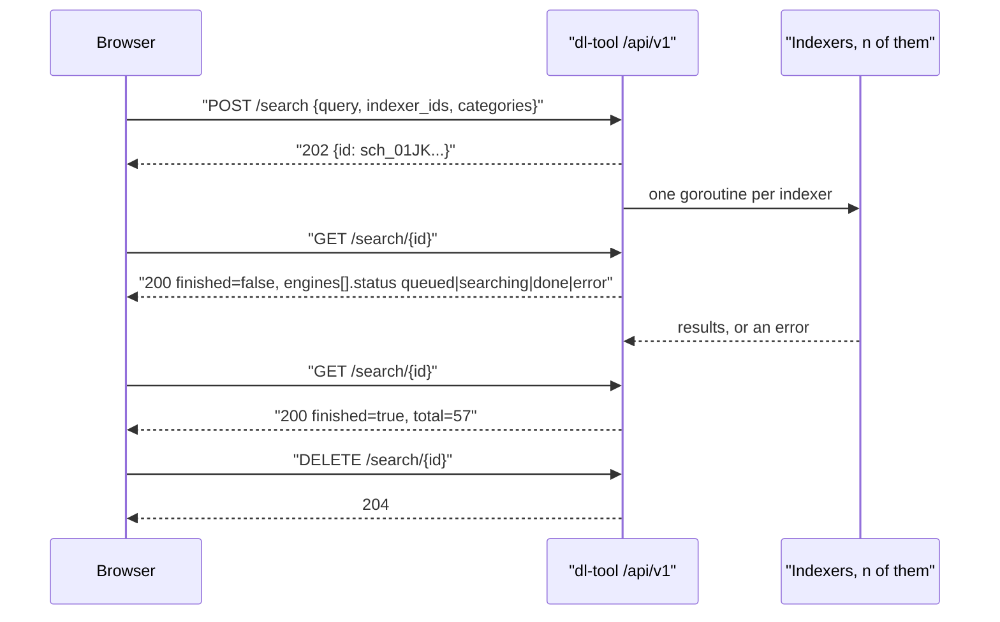

# 05 — API contract

> **Status:** draft
> **Last reviewed:** 2026-09-01
> **Audience:** implementing agent
> **Read this before:** T007, T008, T009, T016, T021, T031, T039, T045, T054, T061, T069, T084, T092,
> T098, T106, T107, T108, T109, T110, T111

## Purpose

Define every HTTP request and response dl-tool serves under `/api/v1`, plus the three unauthenticated
process endpoints. This file is the single source for paths, query parameters, request bodies, response
bodies, status codes and error slugs; it does not explain why the surface looks like this and does not
define storage.

## Scope of this document

- In scope: base path, authentication, the RFC 9457 error envelope, cursor pagination, units, the canonical
  Task object, every endpoint in the canonical API surface, and the SSE/polling live-update contract.
- Out of scope (lives instead in): DDL, columns and enums → [`04-data-model.md`](04-data-model.md); the
  `Engine` Go interface and engine capabilities → [`06-download-engines.md`](06-download-engines.md); the
  dlsearch YAML schema and Torznab client → [`07-search-and-indexers.md`](07-search-and-indexers.md); the
  RSS rule schema, matching algorithm and reason-code enum → [`08-rss-automation.md`](08-rss-automation.md);
  grid columns and dialog fields → [`09-web-ui-spec.md`](09-web-ui-spec.md); environment variables →
  [`11-config-reference.md`](11-config-reference.md); operator procedures and the `dl-tool restore` CLI →
  [`17-operations-and-runbook.md`](17-operations-and-runbook.md).

dl-tool serves one HTTP API, `/api/v1`. There is no qBittorrent-compatible and no Synology-compatible
surface. Outside it the process serves only the embedded SPA's static assets and the three process
endpoints in §13.1; no other program's wire protocol is implemented, at any path, opt-in or otherwise.

There is also no migration surface: no endpoint imports tasks, feeds or rules from another download
product, and dl-tool never calls another product's API to fetch them. Tasks arrive through
`POST /tasks` — pasted URIs, an uploaded `.torrent`, an uploaded `.txt` URL list — through a watch folder
(§15), through a search result or through an RSS rule. `GET /settings/export` and `POST /settings/import`
(§11.5) carry dl-tool's own configuration between dl-tool instances and nothing else.

---

## 1. Conventions

### 1.1 Base path and media types

| Item | Value |
|---|---|
| Base path | `/api/v1`, prefixed by `DLTOOL_BASE_PATH` when set. Every path below is relative to it. |
| Request body | `application/json`, except `POST /tasks`, `POST /tasks/inspect` and `POST /indexers/import`, which also accept `multipart/form-data` |
| Response body | `application/json`; `text/event-stream` for `GET /events`; `application/problem+json` for every error |
| Spec | OpenAPI 3.1 generated by Huma from the handler structs, committed at `api/openapi.json`; never hand-written ([ADR-0003](decisions/0003-chi-huma-code-first-openapi.md)) |
| Outside `/api/v1` | `GET /healthz`, `GET /readyz` (main listener), `GET /metrics` (metrics listener) — all unauthenticated |

### 1.2 Authentication and authorisation

Two credentials, both accepted on every authenticated endpoint. There is no anonymous mode
([ADR-0013](decisions/0013-mandatory-built-in-authentication.md)).

| Credential | How it is sent | Extra requirement |
|---|---|---|
| Session cookie | `Cookie: dltool_session=<opaque>` | `POST`/`PATCH`/`PUT`/`DELETE` must also send `X-DLTOOL-CSRF: <csrf_token>` |
| API token | `Authorization: Bearer dlt_<secret>` | None — bearer requests are exempt from CSRF |

- The cookie is issued by `POST /auth/login` with `HttpOnly`, `SameSite=Lax`, `Path=<base path>/`, and
  `Secure` whenever the request arrived over TLS. Lifetime `DLTOOL_SESSION_TTL`, default `720h`.
- The matching `csrf_token` is returned in the body of `POST /auth/setup`, `POST /auth/login` and
  `GET /auth/me`, and is never set as a cookie.
- Cookie-authenticated mutation without a matching `X-DLTOOL-CSRF` → `403` `/problems/csrf-token-missing`.
- Missing or invalid credential → `401` `/problems/unauthenticated`.
- Non-admins act on their own tasks only; another user's task returns `404`, never `403`. Endpoints marked
  `admin` in §2 return `403` `/problems/forbidden` to everyone else.
- While no user row exists, every endpoint except `POST /auth/setup` returns `401`
  `/problems/setup-required`.
- When `DLTOOL_CONFIG_LOCK=true`, mutations under `/settings`, `/engines`, `/indexers`, `/feeds`,
  `/rules`, `/categories`, `/tags`, `/watch-folders` and `/notifications` return `403`
  `/problems/config-locked`. Reads and task, user, authentication, token and backup operations remain
  available.

### 1.3 Errors — RFC 9457 `application/problem+json`

| Member | Type | Always | Meaning |
|---|---|---|---|
| `type` | string, relative URI | yes | Stable machine slug `/problems/<slug>`. Match on this, never on `title`. |
| `title` | string | yes | Short human summary, English, not localised. |
| `status` | integer | yes | Repeats the HTTP status code. |
| `detail` | string | yes | What went wrong with this request. Never contains a secret or a path outside the configured roots. |
| `instance` | string | no | Request path plus request id, for log correlation. |
| `errors` | array | no | Field-level failures: `{"message","location","value"}`. |

```http
HTTP/1.1 403 Forbidden
Content-Type: application/problem+json

{"type":"/problems/path-rejected","title":"Destination rejected","status":403,
 "detail":"destination \"/data/../etc\" resolves outside every configured data root",
 "instance":"/api/v1/tasks#01JCP6M0S6Z9Q0T4V8W2X6Y3A1",
 "errors":[{"message":"must resolve inside a configured root","location":"body.destination","value":"/data/../etc"}]}
```

Slug registry. No endpoint may invent a slug outside this table.

| `type` | Status | Raised when |
|---|---|---|
| `/problems/setup-required` | 401 | No user exists yet; only `POST /auth/setup` is callable. |
| `/problems/unauthenticated` | 401 | Absent, expired or revoked cookie or bearer token. |
| `/problems/forbidden` | 403 | Authenticated but not permitted (non-admin on an admin endpoint). |
| `/problems/config-locked` | 403 | An environment lock forbids this configuration mutation. |
| `/problems/csrf-token-missing` | 403 | Cookie auth on a mutating request without a valid `X-DLTOOL-CSRF`. |
| `/problems/path-rejected` | 403 | A path resolves outside `DLTOOL_DATA_ROOTS`, or is not writable. |
| `/problems/ssrf-blocked` | 403 | An outbound URL resolved to a blocked address ([`12-security-and-threat-model.md`](12-security-and-threat-model.md)). |
| `/problems/quota-exceeded` | 403 | The owner's **storage** quota (`users.quota_bytes`) would be exceeded. |
| `/problems/not-found` | 404 | Unknown id, or a resource owned by another user. |
| `/problems/conflict` | 409 | Uniqueness violation (category name, tag name, feed URL, username, channel name, watch-folder path). |
| `/problems/concurrency-limit` | 409 | A **concurrency** limit (`max_active_total`, `max_active_per_engine`, `max_active_per_user`) blocks starting this task now. Task creation never raises it — see §5.11. |
| `/problems/setup-already-complete` | 409 | `POST /auth/setup` after the first user exists. |
| `/problems/payload-too-large` | 413 | Upload above the endpoint's documented cap. |
| `/problems/unsupported-media-type` | 415 | Wrong `Content-Type`. |
| `/problems/validation-failed` | 422 | Body or query failed schema validation; `errors[]` is populated. |
| `/problems/unsupported-scheme` | 422 | A submitted URI uses a scheme v1 does not implement, `ed2k:` included. |
| `/problems/rate-limited` | 429 | Login throttling; `Retry-After` is set. |
| `/problems/internal` | 500 | Unhandled fault. `detail` is generic; the cause is in the logs only. |
| `/problems/engine-unavailable` | 503 | The engine daemon required for this request did not answer. |
| `/problems/not-ready` | 503 | `GET /readyz` before migrations completed. |

<!-- UNVERIFIED: the exact Huma v2.39.1 ErrorModel member names (`$schema`, `errors[].location`) were not
     read from source during research. Confirm against the generated api/openapi.json in T007. -->

### 1.4 Cursor pagination

Every unbounded list endpoint takes `limit` (integer, optional, default `100`, range `1..500`) and `cursor`
(string, optional, opaque) and returns the same envelope:

```json
{"items":[], "next_cursor":"eyJhIjoxNzU2NzM0ODAwMDAwLCJpIjoidHNrXzAxSks...", "total":412}
```

`next_cursor` is `null` on the last page; `total` counts the filter, ignoring the cursor. A cursor is bound
to the filter and sort that produced it — reusing it with a different `sort` or filter returns `422`.
Offsets are not supported anywhere; do not add `offset`.

### 1.5 Identifiers

Prefix plus a 26-character Crockford base32 ULID, e.g. `tsk_01JKQ8Z9YV6M3P0R2S4T6V8W0X`. The complete
prefix allocation, including the `itm_` feed item, `res_` search result, `ntf_` notification channel and
`wfd_` watch folder prefixes used below, lives in [`04-data-model.md`](04-data-model.md) §1.5 and is not
restated here. Categories and tags are addressed by their unique `name`. Engine-side references (aria2
GID, qBittorrent infohash, yt-dlp job id) never appear in a URL and are never returned.

### 1.6 Units, timestamps and nulls

| Quantity | Wire representation |
|---|---|
| Sizes | Integer **bytes**. Never KB, never a formatted string. |
| Rates and limits | Integer **bytes per second**; `0` means unlimited, globally and per task. |
| Durations | Integer **seconds** (`eta_seconds`, `seeding_time_limit`), except `elapsed_ms` on test endpoints. |
| Timestamps | **RFC 3339** UTC strings ending in `Z`. The database stores Unix milliseconds; conversion happens at the API boundary. |
| Progress | Float `0.0`–`1.0`, never a percentage. The single deliberate exception is `unzip_progress`, an integer `0`–`100` mirroring Download Station's own extraction progress, and `null` outside `state = "extracting"`. |
| Unknown | `null`. Never `-1`, never `0` standing in for unknown, never a fabricated `1`. |
| Secrets | Absent, or the literal `"__redacted__"` where a field must exist to show a value is set. Sending `"__redacted__"` back in a `PATCH` leaves the stored secret unchanged. |

---

## 2. Endpoint summary

`session|token` means either credential; `admin` additionally requires `role = admin`.

| Method | Path | Auth | Purpose |
|---|---|---|---|
| POST | `/auth/setup` | setup token | Create the first admin; 409 afterwards. |
| POST | `/auth/login` | none | Exchange credentials for a session cookie and CSRF token. |
| POST | `/auth/logout` | session | Destroy the current session. |
| GET | `/auth/me` | session\|token | Current user, role and CSRF token. |
| GET | `/tasks` | session\|token | List and filter tasks. |
| POST | `/tasks` | session\|token | Create tasks from URIs, a blob or multipart files. |
| POST | `/tasks/inspect` | session\|token | Parse a submission into a manifest, creating nothing. |
| GET | `/tasks/{id}` | session\|token | One task. |
| PATCH | `/tasks/{id}` | session\|token | Destination, category, tags, limits, sequential, name. |
| DELETE | `/tasks/{id}` | session\|token | Remove one task, optionally with its data. |
| POST | `/tasks/actions` | session\|token | Bulk pause/resume/remove/recheck/queue moves. |
| GET·PATCH | `/tasks/{id}/files` | session\|token | File list; select and prioritise files. |
| GET·POST·DELETE | `/tasks/{id}/trackers` | session\|token | List, add and remove trackers. |
| GET | `/tasks/{id}/peers` | session\|token | Connected peers. |
| GET | `/tasks/{id}/events` | session\|token | Per-task event log. |
| GET | `/events` | session\|token | SSE stream of `sync` deltas. |
| GET | `/sync` | session\|token | Identical delta payload by polling. |
| GET | `/fs/roots` | session\|token | Configured data roots. |
| GET | `/fs/browse` | session\|token | Directories under a path, jailed to the roots. |
| POST | `/fs/mkdir` | session\|token | Create one directory. |
| GET | `/fs/free-space` | session\|token | Free and total bytes for a path. |
| GET·POST·PATCH·DELETE | `/watch-folders[/{id}]` | admin | Watch-folder CRUD. |
| POST | `/watch-folders/{id}/scan` | admin | Scan one watch folder now. |
| GET | `/categories` | session\|token | List categories and their save paths. |
| POST·PATCH·DELETE | `/categories[/{name}]` | admin | Category create, update, delete — per-category default paths are admin-managed. |
| GET | `/tags` | session\|token | Every tag with its task count. |
| PATCH·DELETE | `/tags/{name}` | admin | Rename a tag everywhere; detach and delete it. |
| GET | `/indexers` | session\|token | List indexers. |
| POST·PATCH·DELETE | `/indexers[/{id}]` | admin | Indexer create, update, delete. |
| POST | `/indexers/{id}/test` | admin | One capability probe, with timing. |
| POST | `/indexers/import` | admin | Import `.dlsearch.yaml`, `.dlm`, `.py`, or a Torznab URL. |
| GET | `/indexers/categories` | session\|token | Newznab category tree for the search filter. |
| POST | `/search` | session\|token | Start an asynchronous search job. |
| GET | `/search/{id}` | session\|token | Poll partial results and per-engine status. |
| DELETE | `/search/{id}` | session\|token | Discard a search job and its results. |
| GET | `/feeds[/{id}]` | session\|token | Feed and item reads — feeds are global. |
| POST·PATCH·DELETE | `/feeds[/{id}]` | admin | Feed writes; a feed is shared state every rule can see. |
| POST | `/feeds/{id}/refresh` | session\|token | Force one poll now. |
| PATCH | `/feeds/{id}/items` | session\|token | Mark items read or unread. |
| POST | `/feeds/{id}/items/read-all` | session\|token | Mark every item of the feed read. |
| GET | `/feeds/{id}/items` | session\|token | Items of one feed. |
| GET | `/rules[/{id}]` | session\|token | Rule reads. |
| POST·PATCH·DELETE | `/rules[/{id}]` | admin | Rule writes — a rule creates tasks on someone's behalf, the same reason `/watch-folders` is admin (§15). |
| POST | `/rules/test` | session\|token | Dry-run an unsaved rule; takes an optional `owner_id` (**admins only** — a non-admin tests as themselves) so the jail checks match the rule as it will run. Creates nothing. |
| POST | `/rules/{id}/run` | admin | Applies a saved rule — it creates tasks as the rule's owner, so it carries the same privilege as a rule write. |
| GET | `/settings` | session\|token | Read settings, secrets redacted. |
| PATCH | `/settings` | admin | Partial settings update. |
| GET | `/settings/schedule` | session\|token | The 24×7 bandwidth grid. |
| PUT | `/settings/schedule` | admin | Replace all 168 cells. |
| GET·PUT | `/prefs` | session\|token | The caller's server-side UI preference document. |
| GET | `/settings/export` | admin | Versioned portable settings document. |
| POST | `/settings/import` | admin | Apply such a document, dry-run first. |
| GET | `/engines` | session\|token | Engines, capabilities and health. |
| POST | `/engines/{id}/test` | admin | Connectivity probe against one engine. |
| GET·POST·PATCH·DELETE | `/notifications[/{id}]` | admin | Notification-channel CRUD. |
| POST | `/notifications/{id}/test` | admin | Deliver a test event; returns the raw upstream reply. |
| GET·POST·PATCH·DELETE | `/users[/{id}]` | admin | User CRUD. |
| GET·POST·DELETE | `/api-tokens[/{id}]` | session\|token | Token list, create, revoke. |
| GET | `/system/info` | session\|token | Version, engine health, task counts. |
| GET | `/system/logs` | admin | Recent structured logs, redacted. |
| POST | `/system/backup` | admin | `VACUUM INTO` a consistent copy. |

---

## 3. The canonical Task object

Returned by `GET /tasks` (inside `items`), `GET /tasks/{id}`, `POST /tasks` and `PATCH /tasks/{id}`, and
carried — partially — by every SSE delta.

| Field | Type | Nullable | Notes |
|---|---|---|---|
| `id` | string | no | `tsk_` + ULID. |
| `owner_id`, `owner_username` | string | no | `usr_` + ULID, and the name denormalised for the grid's `user` column. |
| `engine` | string | no | `aria2` \| `qbittorrent` \| `ytdlp`. |
| `source_kind` | string | no | `http` \| `ftp` \| `sftp` \| `magnet` \| `torrent` \| `metalink` \| `media`. |
| `source_uri` | string | yes | Safe display reference. Search-result tasks use `search-result:<res_id>`; provider acquisition data is never returned. |
| `infohash_v1` | string | yes | 40 lowercase hex characters, or `null`. Base32 magnets are decoded to hex at ingest. |
| `infohash_v2` | string | yes | 64 lowercase hex characters (BEP 52), or `null`. A hybrid torrent carries both. |
| `name` | string | no | Display name; editable through `PATCH /tasks/{id}`. |
| `state` | string | no | `queued` \| `downloading` \| `seeding` \| `paused` \| `checking` \| `extracting` \| `moving` \| `completed` \| `error` \| `removed`. |
| `error_code` | string | yes | Canonical error-detail enum, set only while `state = "error"`; values in [`04-data-model.md`](04-data-model.md). |
| `error_message` | string | yes | Redacted engine text, for the detail pane; never contains credentials or acquisition URLs. |
| `destination` | string | no | The destination the server actually resolved. |
| `requested_destination` | string | yes | What the client asked for, when it differs from `destination`. |
| `content_path` | string | yes | Absolute path of the finished file or directory; `null` until completion. |
| `category` | string | yes | Category **name**, not an id. |
| `tags` | string[] | no | Empty array when untagged. |
| `total_bytes` | integer | yes | `null` while metadata is unknown (magnet before metadata, chunked HTTP). |
| `completed_bytes`, `uploaded_bytes` | integer | no | Bytes. |
| `progress` | number | no | Derived `completed_bytes / total_bytes`; `0.0` when `total_bytes` is null. |
| `download_rate`, `upload_rate` | integer | no | Bytes/second. |
| `eta_seconds` | integer | yes | `null` when unknown or infinite. |
| `ratio` | number | no | |
| `total_peers`, `connected_seeders`, `connected_leechers` | integer | no | `0` for non-BitTorrent tasks. |
| `dl_limit`, `ul_limit` | integer | no | Per-task bytes/second, `0` = unlimited. |
| `ratio_limit` | number | yes | `null` = use the global default. |
| `seeding_time_limit` | integer | yes | Seconds; `null` = use the global default. |
| `sequential` | boolean | no | |
| `queue_position` | integer | yes | `null` for tasks not in a queue. |
| `unzip_progress` | integer | yes | `0`–`100`, only while `state = "extracting"`. |
| `file_count` | integer | yes | `null` until metadata is known. |
| `added_at`, `updated_at` | string | no | RFC 3339. `updated_at` changes on every delta. |
| `started_at`, `completed_at` | string | yes | RFC 3339. |

Never present in any Task object: `extract_password`, `ftp_credentials`, `engine_ref`, raw acquisition data.

```json
{"id":"tsk_01JKQ8Z9YV6M3P0R2S4T6V8W0X","owner_id":"usr_01JKQ7X1AA0000000000000000","owner_username":"alice",
 "engine":"qbittorrent","source_kind":"magnet",
 "source_uri":"magnet:?xt=urn:btih:8f9c3a2b1d4e5f60718293a4b5c6d7e8f9a0b1c2",
 "infohash_v1":"8f9c3a2b1d4e5f60718293a4b5c6d7e8f9a0b1c2","infohash_v2":null,
 "name":"ubuntu-26.04-desktop-amd64.iso","state":"downloading","error_code":null,"error_message":null,
 "destination":"/data/iso","requested_destination":null,"content_path":null,
 "category":"linux","tags":["iso"],
 "total_bytes":5583457280,"completed_bytes":2310451200,"uploaded_bytes":104857600,"progress":0.4137,
 "download_rate":12582912,"upload_rate":348160,"eta_seconds":312,"ratio":0.045,
 "total_peers":118,"connected_seeders":42,"connected_leechers":58,
 "dl_limit":0,"ul_limit":0,"ratio_limit":null,"seeding_time_limit":null,
 "sequential":false,"queue_position":3,"unzip_progress":null,"file_count":1,
 "added_at":"2026-08-30T14:02:11Z","started_at":"2026-08-30T14:02:13Z","completed_at":null,
 "updated_at":"2026-09-01T09:41:52Z"}
```

In an SSE delta a task object carries **only the fields that changed**. Generate the delta
type with every field optional (Go `*T` plus `omitempty`, TypeScript `Partial<Task>`); a client that
requires any field to be present will crash on the first delta.

---

## 4. Authentication endpoints

### 4.1 `POST /auth/setup`

Create the first admin. Callable only while `users` is empty. The one-time setup token is printed to stdout
at boot and written to `<config>/setup-token` with mode `0600`; it is deleted on success.

Body: `setup_token` (string, required) · `username` (string, required) · `password` (string, required,
≥ 12 characters) · `locale` (string, optional, default `"en"`).

```http
POST /api/v1/auth/setup
Content-Type: application/json

{"setup_token":"9f2c...","username":"alice","password":"correct horse battery","locale":"en"}
```

```http
HTTP/1.1 201 Created
Set-Cookie: dltool_session=6f1c...; Path=/; HttpOnly; SameSite=Lax

{"user":{"id":"usr_01JKQ7X1AA0000000000000000","username":"alice","role":"admin","enabled":true,
 "default_destination":null,"quota_bytes":0,"locale":"en","last_login_at":null,
 "created_at":"2026-09-01T09:00:00Z"},
 "csrf_token":"K7sB2h1QpVmNc0aZ"}
```

Statuses: `201` · `401` `/problems/unauthenticated` (wrong token) · `409`
`/problems/setup-already-complete` · `422` `/problems/validation-failed` (password under 12 characters) ·
`429` `/problems/rate-limited` — the login throttle of
[`12-security-and-threat-model.md`](12-security-and-threat-model.md) §6.3 covers this endpoint while it is
callable, because a guessed token mints the admin account.

### 4.2 `POST /auth/login`, `POST /auth/logout`, `GET /auth/me`

`POST /auth/login` takes `username` and `password`, both required, and returns `200` with the identical
`{"user":…,"csrf_token":…}` envelope shown above plus the session cookie. `401`
`/problems/unauthenticated` carries an identical `detail` for a wrong password and for a disabled or unknown
account, so the endpoint cannot be used to enumerate users; `429` `/problems/rate-limited` sets
`Retry-After`.

`POST /auth/logout` takes no body, deletes the server-side session row and expires the cookie: `204` ·
`401`. `GET /auth/me` returns the same envelope and is what the SPA calls on boot to choose between the
login screen, the setup wizard (`401` `/problems/setup-required`) and the app shell: `200` · `401`.

---

## 5. Task endpoints

### 5.1 `GET /tasks`

| Query | Type | Required | Default | Notes |
|---|---|---|---|---|
| `state` | string | no | — | A canonical state, or a sidebar filter: `all`, `downloading`, `completed`, `active`, `inactive`, `stopped`, `error`. Membership is defined in [`04-data-model.md`](04-data-model.md). |
| `category` | string | no | — | Category name; `""` selects uncategorised tasks. |
| `tag` | string | no | — | Tag name; `""` selects untagged tasks. |
| `owner` | string | no | — | `usr_` id. Ignored for non-admins. |
| `q` | string | no | — | Case-insensitive substring of `name`. |
| `sort` | string | no | `-added_at` | `added_at`, `completed_at`, `name`, `total_bytes`, `progress`, `state`, `download_rate`, `upload_rate`, `eta_seconds`, `ratio`, `queue_position`; a leading `-` reverses. |
| `limit`, `cursor` | — | no | §1.4 | |

```http
GET /api/v1/tasks?state=active&sort=-download_rate&limit=2
```

```json
{"items":[{"id":"tsk_01JKQ8Z9YV6M3P0R2S4T6V8W0X","state":"downloading"}],"next_cursor":null,"total":8}
```

`items` entries are full Task objects; the fragment above is abbreviated.

Normal task lists and every sidebar filter omit `removed` tombstones. An explicit `state=removed` query lists
them; `GET /tasks/{id}` and its event endpoint remain available after removal.

Statuses: `200` · `401` · `422`
`/problems/validation-failed` (unknown `sort`, `limit` out of range, stale `cursor`).

### 5.2 `POST /tasks`

Create one task per accepted URI, blob, file part or owned search-result ID.

| Body field | Type | Required | Default | Notes |
|---|---|---|---|---|
| `uris` | string[] | one of `uris`/`blob`/`search_result_ids`/file parts | `[]` | Maximum 50. `http(s)`, `ftp(s)`, `sftp`, `magnet:`, bare 40-hex or 32-base32 infohash, `thunder://`, `flashget://`, `qqdl://`. `ed2k:` is parsed and rejected. |
| `search_result_ids` | string[] | see above | `[]` | Maximum 50 opaque `res_` ids from the caller's live search jobs. The server resolves their acquisition data. |
| `blob` | string | see above | — | Base64 `.torrent` or `.metalink`; maximum 10 MiB decoded. |
| `filename` | string | no | `null` | Original name of `blob`, for the display name. |
| `destination` | string | no | user default, else global default | Must resolve inside a configured root. |
| `category` | string | no | `null` | Must already exist. |
| `tags` | string[] | no | `[]` | Created on demand. |
| `paused` | boolean | no | `false` | Create in `paused` instead of `queued`. |
| `sequential` | boolean | no | `false` | |
| `create_subfolder` | boolean | no | `false` | Place content in `<destination>/<manifest name>/`. |
| `select_files` | object[] | no | `null` | `[{"index":int,"selected":bool,"priority":"skip"\|"normal"\|"high"\|"maximum"}]`, applied to the first multi-file manifest. `422` when the routed engine lacks `per_file_select`. |
| `ftp_credentials` | object | no | `null` | `{"username":string,"password":string}`, used for this request's `ftp`/`ftps`/`sftp` URIs only; never returned. |
| `extract_password` | string | no | `null` | Stored for auto-extract; never returned. |
| `engine` | string | no | auto-routed by scheme | `aria2` \| `qbittorrent` \| `ytdlp`; the routing table is in [`06-download-engines.md`](06-download-engines.md). |

Multipart form: a `payload` part holding the JSON above without `blob`, plus one or more `file` parts.
A `file` part is a `.torrent` or `.metalink`, which becomes one task each, or a `.txt` whose every
non-empty line that does not start with `#` is treated as one entry of `uris` and routed by scheme. Total
request cap 32 MiB, and the 50-URI cap applies to the lines of a `.txt` as well.

Exactly one source family may be present. For `search_result_ids`, the task service authorises each result
through its job's `owner_id`, copies the acquisition source into server-only task state and records
`search-result:<res_id>` as its display source. Provider URLs and magnets never re-enter an API payload.

```http
POST /api/v1/tasks
Content-Type: application/json
X-DLTOOL-CSRF: K7sB2h1QpVmNc0aZ

{"uris":["magnet:?xt=urn:btih:8f9c3a2b1d4e5f60718293a4b5c6d7e8f9a0b1c2",
         "https://releases.ubuntu.com/26.04/ubuntu-26.04-desktop-amd64.iso",
         "ed2k://|file|x|1|AA|/"],
 "destination":"/data/iso","category":"linux","tags":["iso"],"paused":false,"create_subfolder":false}
```

```http
HTTP/1.1 201 Created

{"created":[{"id":"tsk_01JKQ8Z9YV6M3P0R2S4T6V8W0X","state":"queued","engine":"qbittorrent"},
            {"id":"tsk_01JKQ8Z9YV6M3P0R2S4T6V8W0Y","state":"queued","engine":"aria2"}],
 "rejected":[{"uri":"ed2k://|file|x|1|AA|/","type":"/problems/unsupported-scheme",
              "detail":"ed2k links are not supported in v1"}]}
```

`created[]` holds full Task objects. Partial success is normal: the response is `201` when at least one task
was created, even if others were rejected.

A rejected search source carries only `search_result_id`; its `uri` member is absent, and its detail never
contains provider data. Unknown, expired and another user's result are indistinguishable `not-found` errors.

Statuses: `201` · `403` `/problems/path-rejected` · `403` `/problems/quota-exceeded` · `403`
`/problems/ssrf-blocked` (see the note below) · `413` `/problems/payload-too-large` · `422` `/problems/validation-failed` (empty
submission, mixed source families, over 50 sources, unknown category, `select_files` on an incapable engine) ·
`404` `/problems/not-found` when every search-result id is unavailable · `422`
`/problems/unsupported-scheme` when **every** URI was rejected · `503` `/problems/engine-unavailable`.

`/problems/ssrf-blocked` on this endpoint and on §5.3 arrives late: T020 and T031 land in M1/M2, before
`internal/secure/ssrf.go` exists (T123, M4). T122 wires the guard into both handlers in M4. Do not delete
the status: it is required by
[`12-security-and-threat-model.md` §2.3](12-security-and-threat-model.md#23-private-addresses-and-the-engine-sidecars).

### 5.3 `POST /tasks/inspect`

Parse a submission into a manifest so the UI can show the file-selection step. Takes the same `uris`,
`blob`, `filename`, `search_result_ids` fields and multipart form as `POST /tasks`; all else is ignored.

Inspecting **never creates a task**, never writes to `tasks` and never writes to the destination. The only
engine contact permitted is a metadata-only fetch for `magnet:` submissions, whose temporary engine handle
is removed before the response is sent.

```http
POST /api/v1/tasks/inspect
Content-Type: application/json
X-DLTOOL-CSRF: K7sB2h1QpVmNc0aZ

{"uris":["magnet:?xt=urn:btih:8f9c3a2b1d4e5f60718293a4b5c6d7e8f9a0b1c2"]}
```

```json
{"manifests":[
  {"source_uri":"magnet:?xt=urn:btih:8f9c3a2b1d4e5f60718293a4b5c6d7e8f9a0b1c2",
   "kind":"magnet","name":"Ubuntu 26.04 LTS Desktop","total_size":5583457280,"file_count":3,
   "metadata_pending":false,
   "infohash_v1":"8f9c3a2b1d4e5f60718293a4b5c6d7e8f9a0b1c2","infohash_v2":null,
   "files":[{"index":0,"path":"ubuntu-26.04-desktop-amd64.iso","size":5583403008},
            {"index":1,"path":"extras/SHA256SUMS","size":1024},
            {"index":2,"path":"extras/README.txt","size":53248}]}],
 "rejected":[]}
```

- `kind` uses the `source_kind` vocabulary. For `http`, `ftp` and `media` submissions `files` holds one
  entry whose `size` may be `null`, and both infohashes are `null`.
- `infohash_v2` is populated only for BEP 52 v2 or hybrid torrents; `infohash_v1` is `null` for v2-only.
- `metadata_pending: true` with `files: null` means magnet metadata did not arrive inside the 60-second
  deadline; the UI then offers "add paused" instead of a file selection.
- `source_uri` follows the Task display rule: a search result returns `search-result:<res_id>`, never its
  provider URL or magnet.
- `rejected[]` uses the same URI-or-search-result shape as `POST /tasks`.

Statuses: `200` · `403` `/problems/ssrf-blocked` · `404` `/problems/not-found` · `413`
`/problems/payload-too-large` · `422` `/problems/validation-failed` or `/problems/unsupported-scheme` ·
`503` `/problems/engine-unavailable` (magnet metadata needs qBittorrent and it is down).

### 5.4 `GET /tasks/{id}`

One Task object. `200` · `404` `/problems/not-found` for an unknown id or another user's task.

### 5.5 `PATCH /tasks/{id}`

Partial update; omitted fields are untouched, `null` clears a nullable field.

| Field | Type | Notes |
|---|---|---|
| `name` | string | Display name only; does not rename files on disk. |
| `destination` | string | Moves the data; the task enters `moving`. |
| `category` | string \| null | Must exist. |
| `tags` | string[] | Replaces the whole set. |
| `dl_limit` | integer | Bytes/second, `0` = unlimited. Applied immediately, including to a running task. |
| `ul_limit` | integer | As above. |
| `ratio_limit` | number \| null | |
| `seeding_time_limit` | integer \| null | Seconds. |
| `sequential` | boolean | |

```http
PATCH /api/v1/tasks/tsk_01JKQ8Z9YV6M3P0R2S4T6V8W0X
X-DLTOOL-CSRF: K7sB2h1QpVmNc0aZ

{"dl_limit":2097152,"category":"linux","sequential":true}
```

`200` with the updated Task · `403` `/problems/path-rejected` · `404` · `422`
`/problems/validation-failed` (negative limit, unknown category) · `503` `/problems/engine-unavailable`.

### 5.6 `DELETE /tasks/{id}`

Query: `delete_data` (boolean, optional, default `false`) also unlinks the downloaded data;
`force_complete` (boolean, optional, default `false`) moves the incomplete data to the destination and marks
the task `completed` instead of removing it.

```http
DELETE /api/v1/tasks/tsk_01JKQ8Z9YV6M3P0R2S4T6V8W0X?delete_data=true
X-DLTOOL-CSRF: K7sB2h1QpVmNc0aZ
```

**IMPORTANT** `delete_data=true` is the **only irreversible operation in the product**. Implement it exactly
in this order, and never approximate any step:

| # | Step | Rule |
|---|---|---|
| 1 | Enumerate the targets | Only rows of `task_files` for this task, resolved against `tasks.destination`. Never a glob, never a directory walk, never `content_path` alone. |
| 2 | Validate every target | Before any side effect, each resolved path, symlinks included, must lie inside `DLTOOL_DATA_ROOTS` **and** the caller's jail (§7.2). One failure returns `403` `/problems/path-rejected`; the engine and filesystem remain untouched. |
| 3 | Remove the engine handle | Call `Engine.Remove`, which always instructs the engine to retain payload data. This must finish before any unlink so no file remains open by the engine. |
| 4 | Unlink through `internal/fsx` | One `unlink(2)` per validated file. Then remove the task's own directory only while empty; leave a non-empty directory in place. Engine adapters never perform this step. |
| 5 | Record it | In a database transaction write `task.removed`; for `delete_data=true`, also write `task.data_deleted` with the file count and byte total. |
| 6 | Mark the tombstone | In the same transaction set `state="removed"`, clear `engine_ref`, zero both rates, clear ETA, and commit. Retain the task and all child rows. |

- **Hardlinks are expected and safe.** A file dl-tool downloaded and then hardlinked into a media library is
  one inode with two names; unlinking dl-tool's name leaves the library copy byte-for-byte intact and fully
  readable. This is the normal outcome of the single `/data` mount
  ([ADR-0012](decisions/0012-single-data-mount.md)) and is not a partial deletion — do not warn about it and
  do not try to detect it.
- `delete_data=false`, the default, skips steps 1, 2 and 4: the retained task enters `removed` and every byte stays.
- A file recorded in `task_files` that no longer exists is not an error; it is counted in `missing`.
- The response body reports what happened, so a client never has to guess:

```json
{"removed":true,"delete_data":true,"files_unlinked":3,"bytes_unlinked":5583457280,"missing":0}
```

`200` with that body · `404` · `422` `/problems/validation-failed` when both flags are true · `403`
`/problems/path-rejected` (step 2) · `503` `/problems/engine-unavailable` when step 3 could not be
completed — the task is **not** removed and no file is unlinked.

### 5.7 `POST /tasks/actions`

Bulk action over a selection, with per-id outcomes so one bad id never fails the batch.

Body: `ids` (string[], required, 1–500) · `action` (string, required: `pause` \| `resume` \| `remove` \|
`recheck` \| `force_complete` \| `queue_top` \| `queue_up` \| `queue_down` \| `queue_bottom`) ·
`delete_data` (boolean, optional, default `false`, only meaningful with `remove`, and executed by the exact
six steps in §5.6 for every id in the batch).

```http
POST /api/v1/tasks/actions
X-DLTOOL-CSRF: K7sB2h1QpVmNc0aZ

{"ids":["tsk_01JKQ8Z9YV6M3P0R2S4T6V8W0X","tsk_01JKQ8Z9YV6M3P0R2S4T6V8W0Z"],"action":"pause"}
```

```json
{"results":[{"id":"tsk_01JKQ8Z9YV6M3P0R2S4T6V8W0X","ok":true},
            {"id":"tsk_01JKQ8Z9YV6M3P0R2S4T6V8W0Z","ok":false,
             "type":"/problems/engine-unavailable","detail":"aria2 did not answer within 5s"}]}
```

`200` whenever the batch was accepted, whatever the per-id outcomes · `422` (empty `ids`, unknown `action`,
more than 500 ids).

### 5.8 `GET /tasks/{id}/files` and `PATCH /tasks/{id}/files`

```json
{"files":[
 {"index":0,"path":"ubuntu-26.04-desktop-amd64.iso","size_bytes":5583403008,
  "completed_bytes":2310451200,"progress":0.4138,"selected":true,"priority":"maximum"},
 {"index":1,"path":"extras/SHA256SUMS","size_bytes":1024,
  "completed_bytes":1024,"progress":1.0,"selected":true,"priority":"normal"},
 {"index":2,"path":"extras/sample.mkv","size_bytes":109051904,
  "completed_bytes":0,"progress":0.0,"selected":false,"priority":"skip"}]}
```

`path` is relative to the task's `destination`. `priority` is one of `skip`, `normal`, `high`, `maximum` on
the wire — there is no `low`; the integer mapping `skip=0`, `normal=1`, `high=6`, `maximum=7` is the
qBittorrent WebAPI vocabulary and is applied in the engine adapter, never in the API
([`04-data-model.md`](04-data-model.md)). An aria2 task reports `priority: null` for every file and drives
`selected` alone.

`PATCH` body: `files` (object[], required) of `{"index":int,"selected":bool,"priority":string}` where
`selected` and `priority` are each optional but at least one must be present per entry. `selected:false` and
`priority:"skip"` are one concept — setting either sets both. Unlisted indices are untouched.

```http
PATCH /api/v1/tasks/tsk_01JKQ8Z9YV6M3P0R2S4T6V8W0X/files
X-DLTOOL-CSRF: K7sB2h1QpVmNc0aZ

{"files":[{"index":2,"selected":false},{"index":0,"priority":"high"}]}
```

Both verbs return `200` with the full list. `404` · `422` (unknown index, unknown priority, or the task's
engine does not declare `per_file_priority`) · `503`.

### 5.9 Trackers and peers

```json
GET /tasks/{id}/trackers →
{"trackers":[
 {"url":"udp://tracker.example.org:6969/announce","status":"working","seeds":412,"peers":118,
  "message":"","update_timer_seconds":1420},
 {"url":"** [DHT] **","status":"working","seeds":null,"peers":37,"message":"","update_timer_seconds":null}]}

GET /tasks/{id}/peers →
{"peers":[{"address":"203.0.113.7:51413","client":"qBittorrent 5.1.2","progress":1.0,
           "download_rate":0,"upload_rate":262144,"flags":"u K","country":"CH"}]}
```

Tracker `status` is the engine's own string, stored and returned verbatim; pseudo-trackers (DHT, PeX, LSD)
appear as rows and cannot be removed. Peer `client`, `flags` and `country` are `null` when the engine does
not report them.

`POST /tasks/{id}/trackers` with `{"urls":["udp://tracker.example.org:6969/announce"]}` → `201` with the
updated list; `DELETE /tasks/{id}/trackers?url=<url>` (repeatable) → `204`. All four endpoints return `404`
for an unknown task and `422` when the task is not a BitTorrent task.

### 5.10 `GET /tasks/{id}/events`

Cursor-paginated, newest first; one row per state transition and job attempt.

```json
{"items":[{"id":"evt_01JKQ9...","at":"2026-09-01T09:41:52Z","level":"info",
           "code":"engine.accepted","message":"qbittorrent accepted the torrent","detail":null},
          {"id":"evt_01JKQ8...","at":"2026-09-01T09:41:50Z","level":"info",
           "code":"task.created","message":"task created by alice","detail":null}],
 "next_cursor":null,"total":2}
```

`code` is a stable i18n key; the UI translates it and falls back to `message`. `200` · `404`.

### 5.11 Quotas and concurrency limits

Two independent limits with two distinct error codes and two distinct HTTP behaviours. Never conflate them;
the storage side is `users.quota_bytes`, the concurrency side is the `settings` keys `max_active_total`,
`max_active_per_engine` and `max_active_per_user` ([`04-data-model.md`](04-data-model.md)).

| | Storage quota | Concurrency limit |
|---|---|---|
| Error code on the task | `quota_exceeded` | `concurrency_limit` |
| Problem type | `/problems/quota-exceeded`, `403` | `/problems/concurrency-limit`, `409` |
| `POST /tasks` when breached | Rejected. The task is never created; the URI appears in `rejected[]`. | Accepted. `201`, `state: "queued"`, `error_code: "concurrency_limit"`. |
| `POST /tasks/actions` `resume` when breached | Per-id `ok:false` with `/problems/quota-exceeded`. | Per-id `ok:false` with `/problems/concurrency-limit`; the task stays `queued` and starts on its own once a slot frees. |
| Measured over | `SUM(total_bytes)` across the owner's tasks whose `state` is not `removed`. | Tasks that are running. Tasks in `seeding` count toward **no** concurrency limit. |
| `0` means | Unlimited. | Unlimited. |

**A task whose size only becomes known when metadata resolves is paused, never deleted.** A magnet has no
`total_bytes` at creation, so the quota cannot be checked then. When metadata arrives and the resolved size
puts the owner over `quota_bytes`, dl-tool sets `state: "paused"` and `error_code: "quota_exceeded"`, writes
a `task_events` row and pushes the change as an ordinary SSE delta. The downloaded bytes stay on disk. No
API call and no background job may delete such a task; the owner or an admin resolves it by raising the
quota, removing other tasks, or deleting this one deliberately through §5.6.

```json
{"id":"tsk_01JKQ8Z9YV6M3P0R2S4T6V8W0X","state":"paused","error_code":"quota_exceeded",
 "error_message":"resolved size 5583457280 B exceeds the remaining quota of 1073741824 B",
 "total_bytes":5583457280,"completed_bytes":8388608}
```

---

## 6. Live updates: SSE and the polling fallback

One event type, `sync`, so the client needs exactly one reducer
([ADR-0006](decisions/0006-sse-with-rid-deltas.md)).

### 6.1 `GET /events`

`Content-Type: text/event-stream`. The server pushes at most once per second, and only when something
changed.

```
retry: 3000

event: sync
id: 42
data: {"rid":42,"full_update":false,"tasks":{"tsk_01JKQ8Z9YV6M3P0R2S4T6V8W0X":{"progress":0.4137,"download_rate":1048576,"eta_seconds":312}},"tasks_removed":["tsk_01JKQ0AAAA0000000000000000"],"stats":{"speed_down":2097152,"speed_up":131072,"active":3,"queued":11},"seq_gap":false}

: hb

event: sync
id: 43
data: {"rid":43,"full_update":false,"tasks":{"tsk_01JKQ8Z9YV6M3P0R2S4T6V8W0X":{"state":"completed","progress":1.0,"download_rate":0}},"tasks_removed":[],"stats":{"speed_down":0,"speed_up":131072,"active":2,"queued":11},"seq_gap":false}
```

| Field | Type | Always | Meaning |
|---|---|---|---|
| `rid` | integer | yes | Response id. Identical to the SSE `id:` line. |
| `full_update` | boolean | yes | `true` ⇒ `tasks` is the complete set, replace the store; `false` ⇒ deep-merge. |
| `tasks` | object | yes | Map of task id → **partial** Task; only changed fields are present. |
| `tasks_removed` | string[] | yes | Task ids deleted since the client's rid. |
| `categories` | object | no | Map of category name → category object, for categories added or changed. |
| `categories_removed` | string[] | no | Category names deleted. |
| `stats` | object | yes | `{"speed_down":int,"speed_up":int,"active":int,"queued":int}` — bytes/second and counts. |
| `seq_gap` | boolean | yes | The server could not honour `Last-Event-ID`; treat exactly like `full_update`. |

Server rules:

- Keep an in-memory ring buffer of the last **300** deltas keyed by rid (≈5 minutes at 1 Hz).
- Keep owner ids as internal metadata for every changed or removed task. Before serialization, project the
  coalesced delta through the authenticated caller: an admin receives all tasks; a non-admin receives only
  their tasks. Strip the internal metadata from the response.
- Scope `tasks_removed`, `stats`, and category or tag task counts to the same caller. An id enters
  `tasks_removed` when a task that was visible to that caller is removed or reassigned away from them.
- On connect, read the `Last-Event-ID` request header. That header **is** the rid; there is no separate
  client-side bookkeeping.
- If `Last-Event-ID` is inside the ring, send the coalesced diff from that rid onward. If it is absent,
  unparseable or older than the ring, send one message with `full_update: true`, `seq_gap: true` and the
  entire task list.
- Emit `retry: 3000` on the first message of every connection.
- Emit a comment line every 15 seconds while idle (`send.Comment("hb")` → the wire bytes `: hb`) so proxies
  do not time the stream out.
- `rid` is monotonic per process and resets to `0` on restart, so the first message after a restart carries
  `full_update: true` and `seq_gap: true`.

Client rules: `full_update || seq_gap` ⇒ replace the store, otherwise deep-merge `tasks` and delete
`tasks_removed`; after 3 consecutive stream failures switch to polling `GET /sync?rid=N` every 2 seconds
with the last rid received, keeping the same reducer.

Statuses: `200` with the stream · `401` before the stream opens. Once open, errors are not signalled
in-band — the server closes the connection and `EventSource` reconnects.

### 6.2 `GET /sync`

Query: `rid` (integer, optional, default `0`) — the last rid the client holds. `0`, or a rid outside the
ring, forces a full update. The response body is **byte-for-byte the same JSON object** as an SSE `data:`
payload for the same authenticated caller and rid, delivered as `application/json` with no event framing.

```http
GET /api/v1/sync?rid=42
```

```json
{"rid":43,"full_update":false,
 "tasks":{"tsk_01JKQ8Z9YV6M3P0R2S4T6V8W0X":{"state":"completed","progress":1.0}},
 "tasks_removed":[],"stats":{"speed_down":0,"speed_up":131072,"active":2,"queued":11},"seq_gap":false}
```

`200` · `401` · `422` (negative `rid`).

---

## 7. Filesystem endpoints

Every path parameter is resolved, symlinks included, and must lie inside `DLTOOL_DATA_ROOTS`; otherwise the
answer is `403` `/problems/path-rejected`. Paths are never concatenated from request input — see
[`12-security-and-threat-model.md`](12-security-and-threat-model.md).

### 7.1 Endpoints

```json
GET /fs/roots →
{"roots":[{"path":"/data","writable":true,"free_bytes":442381537280,"total_bytes":2000398934016}]}
```

```json
GET /fs/browse?path=/data/iso →
{"path":"/data/iso","parent":"/data","separator":"/","writable":true,
 "free_bytes":442381537280,"total_bytes":2000398934016,
 "directories":[{"name":"archive","path":"/data/iso/archive","writable":true},
                {"name":"incoming","path":"/data/iso/incoming","writable":false}]}
```

Directories only; files are never listed. `parent` is `null` when `path` is itself a root. Optional query
`show_hidden` (boolean, default `false`) includes dot-directories.

```json
POST /fs/mkdir  {"path":"/data/iso","name":"new-folder"} →
{"path":"/data/iso/new-folder","writable":true}

GET /fs/free-space?path=/data/iso →
{"path":"/data/iso","free_bytes":442381537280,"total_bytes":2000398934016}
```

`mkdir` applies the process umask and returns `201`. Statuses across this group: `200`/`201` · `403`
`/problems/path-rejected` · `404` (inside a root but absent or unreadable) · `409` `/problems/conflict`
(`mkdir` onto an existing name) · `422` (missing `path`, or a `name` containing `/` or `..`).

### 7.2 The per-user jail

All four endpoints above apply a second containment check on top of the root check, and it is the same check
that validates a task `destination`
([FR-124](02-requirements.md#fr-124-jail-non-admins-to-their-own-destination-subtree)).

| Caller | Visible subtree |
|---|---|
| `role = "admin"` | Every path in `DLTOOL_DATA_ROOTS`. |
| `role = "user"` with `default_destination` set | That directory and its descendants, and nothing else. |
| `role = "user"` with `default_destination` unset | Nothing. Every call in this group returns `403` `/problems/path-rejected` until an admin sets one. |

- For a jailed caller `GET /fs/roots` returns exactly one entry, their own `default_destination`, so the
  folder browser has exactly one root to open at.
- `GET /fs/browse` above the jail returns `403` `/problems/path-rejected` — never `404`, and never a
  filtered listing. A jailed caller's `parent` is `null` at their jail root, so the browser cannot walk
  upwards. Another user's directory names are never enumerable through any of these four endpoints.
- The check runs after symlink resolution, so a symlink inside the jail pointing outside it is rejected
  exactly like a `..` path.
- `POST /tasks`, `PATCH /tasks/{id}` and `POST /watch-folders` reject a destination outside the caller's
  jail with the same `403` `/problems/path-rejected`.
- Categories are global and their `save_path` is admin-managed. A jailed caller creating a task in a
  category whose save path lies outside their jail receives their own `default_destination` as the effective
  `destination`, with the category path reported in `requested_destination`.

---

## 8. Categories and tags

### 8.1 Categories

```json
GET /categories → {"categories":[{"name":"linux","save_path":"/data/iso","task_count":12}]}
POST /categories  {"name":"linux","save_path":"/data/iso"} → 201, the category object
PATCH /categories/{name}  {"new_name":"linux-iso","save_path":"/data/iso"} → 200
DELETE /categories/{name} → 204
```

Both `PATCH` fields are optional. Deleting a category leaves its tasks' data alone and makes them
uncategorised. Categories are global and every user may read and select one; creating, renaming and deleting
them is admin-only, because `save_path` sets a default destination for other people's tasks. Statuses:
`200`/`201`/`204` · `403` `/problems/forbidden` (non-admin write) · `403` `/problems/path-rejected` (a
`save_path` outside the roots) · `404` · `409` `/problems/conflict` (duplicate name) · `422` (empty name, or
a name containing `/`).

### 8.2 Tags

Tags are created implicitly by `POST /tasks` and `PATCH /tasks/{id}`; this group exists to list, rename and
delete them ([FR-033](02-requirements.md#fr-033-list-rename-and-delete-tags)). There is no `POST /tags`.

```json
GET /tags → {"tags":[{"name":"iso","task_count":12},{"name":"weekly","task_count":0}]}
PATCH /tags/{name}  {"new_name":"isos"} → 200, the tag object
DELETE /tags/{name} → 204
```

- `GET /tags` lists every row of `tags`, including tags with `task_count: 0`, sorted by `name` ascending. It
  is not paginated. For a non-admin, `task_count` counts that caller's tasks only.
- `PATCH` renames the tag in place, so every task carrying it carries the new name at once; the tag id is
  unchanged and no task is touched. Renaming onto an existing name is `409` `/problems/conflict`, never a
  silent merge.
- `DELETE` detaches the tag from every task and deletes the row. **No task is ever deleted by this call.**
- `PATCH` and `DELETE` are admin-only: a tag is global, so a rename or a delete reaches other users' tasks.
  `GET` is open to every authenticated caller.
- `{name}` is percent-encoded in the path. Statuses: `200`/`204` · `403` `/problems/forbidden` · `404` ·
  `409` · `422` (empty `new_name`, or a name containing `,` or `/`).

---

## 9. Indexers and search

### 9.1 Indexer CRUD

```json
{"id":"idx_01JKQ7...","name":"Internet Archive","kind":"dlsearch","enabled":true,
 "url":null,"api_key_set":false,"definition_id":"internet-archive","definition_source":"bundled",
 "provenance":"shipped with dl-tool","legal_tier":"legitimate","priority":50,
 "allow_private_network":false,"seeders_unknown":true,
 "categories":[{"id":8000,"name":"Other"}],"last_test_at":"2026-09-01T08:12:04Z","last_error":null}
```

`api_key_set` is a boolean because the key itself is never returned. `POST /indexers` and
`PATCH /indexers/{id}` accept `name`, `kind` (`torznab` \| `newznab` \| `dlsearch`), `enabled`, `url`,
`api_key`, `definition_id`, `priority`, `allow_private_network` and `settings` (per-engine values, schema in
[`07-search-and-indexers.md`](07-search-and-indexers.md)). `allow_private_network` is required for an
indexer on a private-network address such as a Prowlarr, Jackett or bitmagnet instance on the same host or
LAN; it lifts the SSRF private-range denial and, for that indexer's configured origin only, the 80/443
port restriction — a redirect hop to any other host stays limited to 80 and 443
([`12-security-and-threat-model.md`](12-security-and-threat-model.md) §2.3). A private-network `url` without the
flag is not rejected at save time; the failure surfaces at probe and search time as `403`
`/problems/ssrf-blocked` whose `detail` names `allow_private_network` as the remedy, and the import flow of
[`07-search-and-indexers.md`](07-search-and-indexers.md) §2.7 sets the flag automatically on the rows it
discovers. Imported indexers are created with `enabled: false`.

**Key-bearing indexers are admin-only.** An indexer with a stored `api_key` is invisible to a non-admin:
it does not appear in `GET /indexers` or `GET /indexers/categories`, its id in `POST /search` returns
`404`, and its results never reach a non-admin search job. Private-tracker download URLs and enclosure
links embed the operator's per-user passkey ([`12-security-and-threat-model.md`](12-security-and-threat-model.md) §1
lists tracker passkeys as an asset); a shared household account must not be able to read one. Keyless
indexers — the four bundled engines, bitmagnet — stay searchable by every authenticated user.
Even an admin receives metadata and opaque result ids only; §9.2 never returns provider URLs or magnets.
Task creation resolves them inside the service.

Statuses: `200`/`201`/`204` · `403` `/problems/forbidden` (non-admin write) · `403`
`/problems/ssrf-blocked` · `404` · `409` `/problems/conflict` (duplicate `definition_id`) · `422` (unknown
`kind`, missing `url` for a Torznab indexer, invalid definition).

`POST /indexers/{id}/test` performs exactly one capability probe (`t=caps`, or the definition equivalent).
A reachable-but-broken indexer is data, not a transport error: the response is `200` with `ok:false` and the
upstream status and message in `error`. Use `503` `/problems/engine-unavailable` only when dl-tool could not
attempt the probe at all.

`POST /indexers/import` takes `multipart/form-data` with a `file` part (`.dlsearch.yaml`, `.dlm` or `.py`),
or `application/json` with `{"torznab_url":string,"api_key":string}`. Imports are static analysis only; no
third-party code is executed ([ADR-0010](decisions/0010-never-execute-third-party-definitions.md)).

```json
POST /indexers/{id}/test → {"ok":true,"elapsed_ms":214,"categories_found":9,"server":"Jackett 0.24.x","error":null}

POST /indexers/import → 201
{"indexer":{"id":"idx_01JKQ8...","enabled":false,"provenance":"imported from jackett.dlm"},
 "warnings":["search.php used a POST form; converted to a GET query"]}
```

`GET /indexers/categories` returns the Newznab tree used by the search filter —
`{"categories":[{"id":2000,"name":"Movies","subcategories":[{"id":2040,"name":"HD"}]}]}`. The canonical id
list is in [`07-search-and-indexers.md`](07-search-and-indexers.md).

### 9.2 Search job lifecycle

A search is asynchronous: start it, poll while indexers answer, delete it when the user leaves the screen.
Partial results and per-indexer failures are both visible on every poll.



**`POST /search`** — body: `query` (string, required) · `indexer_ids` (string[], optional, default every
enabled indexer) · `categories` (integer[], optional, default `[]` = no category filter).

```http
POST /api/v1/search
X-DLTOOL-CSRF: K7sB2h1QpVmNc0aZ

{"query":"ubuntu 26.04","indexer_ids":["idx_01JKQ7...","idx_01JKQ8..."],"categories":[4020]}
```

```http
HTTP/1.1 202 Accepted

{"id":"sch_01JKQ9Z0YV6M3P0R2S4T6V8W0X"}
```

`202` · `422` (empty query, unknown indexer id) · `503` `/problems/engine-unavailable` when no indexer is
enabled at all.

**`GET /search/{id}`** — poll every second while `finished` is `false`. Query: `sort` (default `-seeders`;
also `title`, `size_bytes`, `leechers`, `published_at`, `indexer`, each reversible with `-`) plus `limit`
and `cursor`, which apply to `results` only.

```json
{"id":"sch_01JKQ9Z0YV6M3P0R2S4T6V8W0X","query":"ubuntu 26.04","finished":false,"total":42,
 "engines":[
   {"id":"idx_01JKQ7...","name":"Internet Archive","status":"done","count":42,"error":null},
   {"id":"idx_01JKQ8...","name":"Arch Linux","status":"searching","count":0,"error":null},
   {"id":"idx_01JKQ9...","name":"Academic Torrents","status":"error","count":0,
    "error":"HTTP 503 from https://academictorrents.com/rss.xml"}],
 "results":[
   {"id":"res_01JKQA...","indexer_id":"idx_01JKQ7...","indexer_name":"Internet Archive",
    "title":"ubuntu-26.04-desktop-amd64.iso",
    "info_hash":"8f9c3a2b1d4e5f60718293a4b5c6d7e8f9a0b1c2",
    "size_bytes":5583457280,"seeders":null,"leechers":null,"grabs":null,
    "published_at":"2026-08-21T00:00:00Z",
    "category_ids":[4020],"category_desc":"PC/ISO",
    "download_volume_factor":1.0,"upload_volume_factor":1.0,
    "minimum_ratio":null,"minimum_seed_time_seconds":null,
    "imdb_id":null,"tmdb_id":null,"tvdb_id":null,"year":null,"genre":null,"language":null,
    "publisher":null,"author":null,"album":null,"artist":null}],
 "next_cursor":null}
```

- `engines[].status` is `queued` \| `searching` \| `done` \| `error`. A failing indexer keeps
  `status:"error"` with the upstream status and redacted message; the job still finishes.
- A search in which every indexer failed returns `finished:true`, `total:0` and an `engines` array of
  errors — never a bare empty result set.
- `seeders`, `leechers`, `grabs` and `published_at` are `null` when the source did not supply them; never
  `-1`, never a fabricated `1`. Indexers with `seeders_unknown:true` always report `null`.
- `leechers` is computed as `peers - seeders` when the source supplies only `peers`.
- Results contain metadata and an opaque `res_` id only. `download_url`, `magnet_uri` and `details_url`
  are absent from the response schema for every role.

`200` · `404` (unknown, deleted, or another user's job). `DELETE /search/{id}` → `204` · `404`; it cascades
to the job's results. To turn results into tasks, `POST /tasks` with
`search_result_ids: ["res_…"]`.

---

## 10. RSS feeds and rules

### 10.1 Feeds

```json
{"id":"fed_01JKQ7...","url":"https://archlinux.org/feeds/releases/","title":"Arch Linux releases",
 "enabled":true,"refresh_interval_s":0,"item_cap":50,"priority":0,"unread_count":3,
 "last_fetch_at":"2026-09-01T09:30:00Z","last_success_at":"2026-09-01T09:30:00Z",
 "next_fetch_at":"2026-09-01T10:30:00Z","escalation_level":0,"disabled_till":null,"last_error":null}
```

`refresh_interval_s: 0` means "use the global RSS interval". `POST /feeds` requires `url` and accepts
`title`, `enabled`, `refresh_interval_s`, `item_cap`, `priority` and `auto_download`;
`PATCH /feeds/{id}` accepts the same set. On both verbs `auto_download: true` creates the
`auto:<feed_id>` rule when it does not exist and `false` deletes it, so a misticked box is undone without
deleting the feed and its read state; `DELETE /feeds/{id}` returns `204`, deletes the `auto:` rule and
cascades to the feed's items. `priority` is only the per-run tie-break of the rule engine
([`08-rss-automation.md`](08-rss-automation.md) §5 step 13): when two feeds carry the same content, the
lower `priority` feed's copy wins; it affects neither polling nor display.

The add-dialog's *Automatically download all items* checkbox
([`09-web-ui-spec.md`](09-web-ui-spec.md) §8.1, Download Station's own option) is **not** a `feeds`
column: `POST /feeds` accepts it as `auto_download` (boolean, default `false`) and, when true, creates an
enabled rule named `auto:<feed_id>` scoped to that one feed, with an empty `match` block — which passes
every item ([`08-rss-automation.md`](08-rss-automation.md) §4.2) — and the caller's default destination
as `action.destination`.

**Credential-bearing feeds are admin-only**, mirroring §9.1's key-bearing-indexer rule: a feed whose URL
contains userinfo (`https://user:pass@…`) or a `passkey`, `apikey` or `token` query parameter — the same
patterns the log redactor already matches — is invisible to a non-admin, along with its items, because
both the URL and the item enclosure links embed the operator's per-user tracker passkey. Non-admins see
the remaining feeds read-only (§2).

`POST /feeds/{id}/refresh` forces one conditional GET now, bypassing the backoff ladder:

```json
200 → {"fetched":true,"not_modified":false,"items_added":2,"elapsed_ms":318,"error":null}
```

`GET /feeds/{id}/items` is cursor-paginated, newest first, with an optional `unread` (boolean) query.
`unread_count` on the feed object counts the feed's items with `read = 0`, and the `unread` filter selects
exactly those rows.

`PATCH /feeds/{id}/items` marks a batch of items read or unread; `POST /feeds/{id}/items/read-all` marks
every item of the feed read. Both are idempotent.

```http
PATCH /api/v1/feeds/fed_01JKQ7.../items
X-DLTOOL-CSRF: K7sB2h1QpVmNc0aZ

{"ids":["itm_01JKQ8...","itm_01JKQ9..."],"read":true}
```

```json
{"updated":2}
```

`PATCH` body: `ids` (string[], required, 1–500) and `read` (boolean, required). `POST /read-all` takes no
body. Both return `{"updated":n}`, where `n` counts the rows whose state actually changed; an id that does
not exist, or belongs to another feed, is silently skipped. Statuses: `200` · `404` · `422` (empty `ids`,
more than 500).

```json
{"items":[{"id":"itm_01JKQ8...","feed_id":"fed_01JKQ7...","title":"archlinux-2026.09.01-x86_64.iso",
           "link":"https://archlinux.org/releng/releases/2026.09.01/",
           "download_url":"https://archlinux.org/releng/releases/2026.09.01/torrent/",
           "info_hash":null,"size_bytes":1181116006,"published_at":"2026-09-01T02:15:00Z","read":false,
           "matched_rules":[{"id":"rul_01JKQ9...","name":"Linux ISOs"}]}],
 "next_cursor":null,"total":50}
```

Statuses across this group: `200`/`201`/`204` · `403` `/problems/ssrf-blocked` · `404` · `409`
`/problems/conflict` (duplicate feed URL) · `422`.

### 10.2 Rule CRUD

A rule object is `{"id","name","enabled","priority","definition","last_match_at","created_at","updated_at"}`.
The rule document's schema, the matching algorithm and the rejection-reason enum are owned by
[`08-rss-automation.md`](08-rss-automation.md); this file fixes only how the document travels over HTTP — it
is a JSON object in the `definition` member, never a YAML string.

`POST /rules` requires `name` and `definition` and accepts `owner_id` (a `usr_` id, default the calling
admin); `PATCH /rules/{id}` accepts `name`, `enabled`, `priority`, `owner_id` and `definition`;
`DELETE /rules/{id}` → `204`. A malformed `episode.filter` is rejected **at save time**
with `422` and an `errors[]` entry pointing at `body.definition.episode.filter` — never accepted and
silently ignored at match time.

**Ownership and the jail.** A rule creates tasks on someone's behalf, exactly like a watch folder (§15),
so writes are admin-only and every rule carries an `owner_id`:

- `action.destination` is validated at save time against the **owner's** jail (§7.2), not merely against
  the configured roots: a rule may not write outside the subtree its owner could reach by hand. When the
  member is omitted it resolves to the owner's `users.default_destination`, else the global default — the
  resolved value, not just the submitted one, must lie inside the owner's jail or the save is `403`
  `/problems/path-rejected`.
- The check runs again at grab time on every item, because `PATCH /users/{id}` can move a jail after the
  rule was saved. `POST /rules/test` takes the same `owner_id` so the dry run's destination checks target
  the jail the saved rule will actually run under. A non-admin supplying an `owner_id` other than their
  own is `403` `/problems/forbidden` — a non-admin always tests as themselves, so the dry run cannot
  probe another user's jail.
- Tasks a rule creates are owned by `owner_id`, count against that user's storage quota and concurrency
  limits (§5.11), and appear only in that user's listings — the grabbed item is processed through the
  ordinary task-creation path, so a quota breach leaves the item ungrabbed with `rule_matches.status =
  'failed'`, never a task that escapes accounting. A `failed` row is retryable, like a failed hand-off:
  it does not mark the episode seen, and the item re-enters the candidate set on later runs.

`POST /rules/{id}/run` applies a saved rule to the items already stored:

```json
200 → {"evaluated":250,"matched":4,
       "created_task_ids":["tsk_01JKQB...","tsk_01JKQC..."],"elapsed_ms":96}
```

`created_task_ids` is shorter than `matched` when the dedup ladder suppressed a duplicate.

### 10.3 `POST /rules/test` — the dry run

Evaluate an **unsaved** rule document against recent items and return every evaluated item, matched and
unmatched, each with the reason it was rejected. Nothing is created, nothing is stored.

| Body field | Type | Required | Default | Notes |
|---|---|---|---|---|
| `rule` | object | yes | — | The full rule document, unsaved; same schema as `rules.definition`. |
| `feeds` | string[] | no | `rule.feeds`, else every enabled feed | Feed ids (`fed_…`). |
| `limit` | integer | no | `200` | Items per feed, newest first; range `1..500`. |
| `ignore_state` | boolean | no | `true` | Ignore the grab and seen-episode tables so the preview is reproducible while the user edits. |

```http
POST /api/v1/rules/test
Content-Type: application/json
X-DLTOOL-CSRF: K7sB2h1QpVmNc0aZ

{"rule":{"name":"Ubuntu LTS ISOs","enabled":true,"priority":10,
         "match":{"mode":"wildcard","case_sensitive":false,"fields":["title"],
                  "any_of":["ubuntu *desktop* amd64"],"none_of":["daily","*beta*"],
                  "min_size":"1GiB","max_size":"8GiB"},
         "action":{"destination":"/data/iso","category":"linux","paused":false}},
 "feeds":["fed_01JKQ7..."],"limit":200,"ignore_state":true}
```

```json
{"evaluated":200,"matched":3,"elapsed_ms":41,
 "results":[
  {"feed_id":"fed_01JKQ7...","feed":"DistroWatch",
   "title":"xubuntu-26.04.1-desktop-amd64.iso.torrent","published_at":"2026-09-01T03:58:00Z",
   "download_url":"https://distrowatch.com/dwres/torrents/xubuntu-26.04.1-desktop-amd64.iso.torrent",
   "matched":true,"score":20,
   "matched_by":{"any_of":"ubuntu *desktop* amd64"},
   "would_do":{"destination":"/data/iso","category":"linux","paused":false}},
  {"feed_id":"fed_01JKQ7...","feed":"DistroWatch",
   "title":"ubuntu-26.10-daily-desktop-amd64.iso.torrent","published_at":"2026-08-31T22:04:00Z",
   "download_url":"https://distrowatch.com/dwres/torrents/ubuntu-26.10-daily-desktop-amd64.iso.torrent",
   "matched":false,"reason":"excluded","reason_detail":"none_of[0] = \"daily\""}]}
```

Contract details the UI depends on:

- **Every** evaluated item appears in `results`, including non-matches. Returning only matches is a defect.
- `reason` is one of `excluded`, `no_match`, `size`, `episode_filter`, `unparseable_episode`,
  `duplicate_episode`, `duplicate_infohash`, `already_have`, `below_minimum_score`, `cooldown`; the enum's
  home is [`08-rss-automation.md`](08-rss-automation.md).
- `reason_detail` names the exact clause and index responsible, so the editor can highlight it.
- `matched_by` is present only when `matched` is `true`; `reason`/`reason_detail` only when it is `false`.
- `evaluated`, `matched` and `elapsed_ms` are always present, so a pathological regex is visible at once.
- The endpoint is called on every keystroke behind a 250 ms debounce: it must stay side-effect free and be
  safe to call with an invalid rule.

`200` whatever the per-item outcomes · `404` (a named feed id does not exist) · `422` when the rule document
fails schema validation, including an unparseable regex or a malformed `episode.filter`, with
`errors[].location` pointing at the offending member.

---

## 11. Settings, schedule, engines and preferences

### 11.1 `GET /settings` and `PATCH /settings`

`GET /settings` returns every user-changeable setting as one flat object, secrets replaced by
`"__redacted__"`. `PATCH /settings` accepts any subset of the same keys. The authoritative key list,
defaults and environment counterparts live in [`11-config-reference.md`](11-config-reference.md).

```json
{"download_rate_limit":0,"upload_rate_limit":0,
 "alt_download_rate_limit":5242880,"alt_upload_rate_limit":1048576,
 "schedule_enabled":true,"default_destination":"/data",
 "rss_enabled":true,"rss_interval_s":1800,
 "auto_extract":true,"extract_passwords":"__redacted__",
 "process_order":"by_date_created","confirm_on_delete":true}
```

`200` · `403` `/problems/forbidden` on `PATCH` by a non-admin · `422` for an unknown key or an out-of-range
value.

### 11.2 `GET /settings/schedule` and `PUT /settings/schedule`

```json
GET /settings/schedule →
{"enabled":true,"timezone":"Europe/Zurich","active_mode":"default",
 "cells":[1,1,1,1,1,1,0,0,2,2,2,2,2,2,2,2,2,2,1,1,1,1,1,1, "…144 more…"]}
```

`cells` is exactly 168 integers indexed `day * 24 + hour`, day `0 = Monday`, hour `0`–`23` in the configured
timezone; values `0` no download, `1` default speed, `2` alternative speed. `timezone` is the container's
`TZ` as an IANA name and is **read-only**: it is returned so the UI can label the grid, and any value a
client sends is ignored. `active_mode` is likewise read-only and is the cell in force at the moment of the
call — `no_download` \| `default` \| `alternative`, the same vocabulary as `schedule.active_mode` on
`GET /system/info` (§13) — so the status bar never has to resolve the grid itself across a DST boundary. `PUT /settings/schedule` replaces all 168 cells in one transaction with the same
body shape and returns the stored grid. `200` · `403` ·
`422` when the array is not exactly 168 elements or holds a value outside `0..2`.

### 11.3 `GET /engines` and `POST /engines/{id}/test`

```json
GET /engines →
{"engines":[
 {"id":"eng_aria2","kind":"aria2","name":"aria2","enabled":true,"url":"http://aria2:6800/jsonrpc",
  "connected":true,"version":"1.37.0",
  "capabilities":["http","ftp","sftp","metalink","per_task_limits"],
  "last_seen_at":"2026-09-01T09:41:50Z","last_error":null},
 {"id":"eng_qbittorrent","kind":"qbittorrent","name":"qBittorrent","enabled":true,
  "url":"http://qbittorrent:8080","connected":false,"version":null,
  "capabilities":["bittorrent","per_file_select","per_file_priority","trackers","peers","recheck"],
  "last_seen_at":"2026-09-01T09:12:03Z","last_error":"dial tcp: connection refused"}]}
```

The capability vocabulary is owned by [`06-download-engines.md`](06-download-engines.md); engine secrets are
never returned. `POST /engines/{id}/test` → `200`
`{"ok":true,"version":"1.37.0","elapsed_ms":12,"error":null}`; a failed probe is still `200` with
`ok:false` and the transport error in `error`. `403` for a non-admin · `404` for an unknown engine id.

### 11.4 `GET /prefs` and `PUT /prefs`

One server-side preference document per user, so the same account sees the same grid in every browser
([FR-144](02-requirements.md#fr-144-persist-server-side-ui-preferences-per-user)). It is stored as `ui_prefs`
rows keyed by the document's top-level members; the API travels the whole document.

- `GET /prefs` returns the caller's document, or the server defaults when they have never saved one. It never
  returns another user's document and takes no `user_id` parameter — the caller's identity is the key.
- `PUT /prefs` **replaces** the document wholesale; there is no `PATCH`. Unknown members are stored verbatim
  and returned unchanged, so the SPA can add a preference without a server change.
- `version` is an integer the SPA owns and bumps when it migrates its own shape; the server never inspects
  it. The member list and its meaning belong to [`09-web-ui-spec.md`](09-web-ui-spec.md) §3.3.

```http
PUT /api/v1/prefs
Content-Type: application/json
X-DLTOOL-CSRF: K7sB2h1QpVmNc0aZ

{"version":1,
 "grid":{"order":["select","queuePos","name","size","progress","status","dlSpeed","ulSpeed","eta"],
         "visibility":{"category":false,"tags":false,"user":false},
         "sizing":{"name":420,"destination":240},
         "sorting":[{"id":"addedOn","desc":true}],"density":"comfortable"},
 "sidebarWidth":220,"sidebarCollapsed":false,"detailHeight":260,"detailTab":"general",
 "theme":"system","lastDestination":"/data/iso"}
```

Both verbs return `200` with the stored document. `401` · `413` `/problems/payload-too-large` above 64 KiB ·
`422` `/problems/validation-failed` when the body is not a JSON object.

Saved searches ([FR-057](02-requirements.md#fr-057-save-and-re-run-a-search)) ride in this document
rather than owning endpoints: the SPA stores them under the `search` member (`{indexerIds, categories,
saved[]}`), the server stores and returns it verbatim like every unknown member, and re-running is
`POST /search` with the stored selection. The 50-entry cap is client-enforced (T064's
`TestFiftyEntryCap`); the server's only bound on the whole document is the 64 KiB cap above. The member's
shape is owned by [`09-web-ui-spec.md`](09-web-ui-spec.md) §3.3 and built by task T064; no `/search/saved`
surface exists. Like the rest of `/prefs`, the member is per-user UI state and is **not** part of the
`GET /settings/export` document (§11.5).

### 11.5 `GET /settings/export` and `POST /settings/import`

A portable, versioned settings document, so an instance can be rebuilt without carrying a database file
([FR-145](02-requirements.md#fr-145-export-and-import-portable-settings)). Restoring a whole instance from a
backup file is a different operation and belongs to the CLI →
[`17-operations-and-runbook.md`](17-operations-and-runbook.md).

`GET /settings/export` is admin-only and returns exactly seven collections plus a header:

| Member | Contents |
|---|---|
| `document_version` | Integer, currently `1`. An importer refusing a version it does not know is correct. |
| `exported_at` | RFC 3339. |
| `schema_version` | The database migration version the export was taken at. |
| `settings` | The flat object of §11.1, secrets **omitted entirely** — not `"__redacted__"`. |
| `categories` | `name`, `save_path`. |
| `indexers` | `name`, `kind`, `enabled`, `url`, `definition_id`, `priority`, `settings`; never `api_key`. |
| `feeds` | `url`, `title`, `enabled`, `refresh_interval_s`, `item_cap`. |
| `rules` | `name`, `enabled`, `priority`, `definition`. |
| `watch_folders` | `path`, `enabled`, `destination`, `category`, `delete_after_load`, `poll_interval_s`; `owner` as a username. |
| `schedule` | The 168-element `cells` array and `enabled`, exactly as §11.2. |

**Deliberately excluded, in every export, without an option to include them:** `sessions`, `users` (and
therefore every `password_hash`), `api_tokens`, `notification_channels.secret_enc`, `engines.secret_enc`,
`indexers.api_key`, `tasks` and every task-derived table. An export is safe to attach to a bug report.

```json
GET /settings/export →
{"document_version":1,"exported_at":"2026-09-01T09:45:00Z","schema_version":1,
 "settings":{"download_rate_limit":0,"rss_interval_s":1800,"auto_extract":true},
 "categories":[{"name":"linux","save_path":"/data/iso"}],
 "indexers":[{"name":"Internet Archive","kind":"dlsearch","enabled":true,"url":null,
              "definition_id":"internet-archive","priority":50,"settings":{}}],
 "feeds":[{"url":"https://archlinux.org/feeds/releases/","title":"Arch Linux releases",
           "enabled":true,"refresh_interval_s":0,"item_cap":50}],
 "rules":[{"name":"Linux ISOs","enabled":true,"priority":10,"definition":{}}],
 "watch_folders":[{"path":"/data/watch","enabled":true,"destination":"/data/iso","category":"linux",
                   "delete_after_load":true,"poll_interval_s":10,"owner":"alice"}],
 "schedule":{"enabled":true,"cells":[1,1,1,"…165 more…"]}}
```

`POST /settings/import` is admin-only and takes that document plus two flags:

| Body field | Type | Required | Default | Notes |
|---|---|---|---|---|
| `document` | object | yes | — | An export document. |
| `dry_run` | boolean | no | `true` | Report what would change and write nothing. |
| `on_conflict` | string | no | `"skip"` | `skip` keeps the existing row, `overwrite` replaces it. Matching is by `categories.name`, `indexers.definition_id` (else `name`), `feeds.url`, `rules.name` and `watch_folders.path`. |

```json
POST /settings/import  {"document":{…},"dry_run":true} → 200
{"dry_run":true,"document_version":1,
 "totals":{"created":9,"updated":0,"skipped":2,"rejected":1},
 "collections":{"settings":{"created":0,"updated":6,"skipped":0,"rejected":0},
                "categories":{"created":1,"updated":0,"skipped":1,"rejected":0},
                "watch_folders":{"created":0,"updated":0,"skipped":0,"rejected":1}},
 "rejected":[{"collection":"watch_folders","key":"/mnt/other/watch",
              "type":"/problems/path-rejected","detail":"outside every configured data root"}]}
```

- A `dry_run: true` call is side-effect free and returns exactly the report a committing call would produce.
- Import is transactional: with `dry_run: false` either every accepted row lands or none does.
- Paths are re-validated against the importing host's roots and the caller's jail (§7.2); a path that fails
  is `rejected`, never silently rewritten.
- `200` · `403` `/problems/forbidden` · `409` `/problems/conflict` when `document_version` is newer than the
  binary understands · `413` · `422` `/problems/validation-failed` for a malformed document, with
  `errors[].location` naming the offending collection and index.

---

## 12. Users and API tokens

```json
{"id":"usr_01JKQ7X1AA0000000000000000","username":"alice","role":"admin","enabled":true,
 "default_destination":"/data/alice","quota_bytes":0,"locale":"en",
 "last_login_at":"2026-09-01T09:41:00Z","created_at":"2026-09-01T09:00:00Z"}
```

`POST /users` requires `username`, `password` (≥ 12 characters) and `role`, and accepts `enabled`,
`default_destination`, `quota_bytes` and `locale`. `PATCH /users/{id}` accepts every field plus `password`.
`password_hash` is never returned.

`quota_bytes` is a **storage** quota in bytes, per user, `0` = unlimited. It is not a task count. The
per-user limit on how many tasks may run at once is the separate global setting `max_active_per_user`
(§11.1), it is not a property of a user row, and it never appears in this object. The two are enforced
independently and report different error codes — see §5.11 and
[`04-data-model.md`](04-data-model.md). `default_destination` doubles as the user's filesystem jail (§7.2),
so setting it is what makes a non-admin able to browse and download at all.

`tasks.owner_id` is `ON DELETE RESTRICT` ([`04-data-model.md`](04-data-model.md) §3.1), so
`DELETE /users/{id}` for a user who still owns tasks is `409` `/problems/conflict` naming the task count;
the caller deletes or re-assigns the tasks first. A user may always be disabled instead
(`{"enabled":false}` on `PATCH`), which keeps the rows and revokes access at once.

Statuses: `200`/`201`/`204` · `403` `/problems/forbidden` (caller is not an admin, or the request would
delete or disable the last enabled admin) · `404` · `409` `/problems/conflict` (username exists,
case-insensitively, or the user still owns tasks or rules — both foreign keys are `ON DELETE RESTRICT`,
so delete or re-assign those rows first) · `422` (short password, unknown role,
`default_destination` outside the roots).

```json
GET /api-tokens →
{"items":[{"id":"tok_01JKQ8...","name":"bookmarklet","prefix":"dlt_9f2c",
           "last_used_at":"2026-09-01T09:40:00Z","expires_at":null,"created_at":"2026-08-01T10:00:00Z"}],
 "next_cursor":null,"total":1}

POST /api-tokens  {"name":"bookmarklet","expires_at":null} → 201
{"id":"tok_01JKQ8...","name":"bookmarklet","prefix":"dlt_9f2c",
 "token":"dlt_9f2c8b1e5a4d3c2b1a09f8e7d6c5b4a3","expires_at":null,"created_at":"2026-09-01T09:45:00Z"}
```

The `token` member appears **only** in that creation response: it is never stored in clear text, never
logged and never returned again. Callers see only their own tokens, admins included.
`DELETE /api-tokens/{id}` revokes immediately — the next request carrying it gets `401`.

A bearer token plus `POST /tasks` is the whole integration surface: the documented bookmarklet posts one
`uris` array with that header and nothing else. dl-tool implements no other program's wire protocol, so no
third-party download client, mobile app or browser extension is expected to work against it.

---

## 13. System endpoints

```json
GET /system/info →
{"version":"0.1.0","commit":"a1b2c3d","built_at":"2026-09-01T08:00:00Z","go_version":"go1.26",
 "started_at":"2026-09-01T08:30:00Z","uptime_s":4320,
 "database":{"path":"/config/dl-tool.db","size_bytes":4194304,"schema_version":1},
 "engines":[{"kind":"aria2","connected":true,"version":"1.37.0"},
            {"kind":"qbittorrent","connected":false,"version":null}],
 "tasks":{"total":42,"by_state":{"downloading":6,"seeding":4,"queued":11,"paused":2,"completed":17,"error":2}},
 "schedule":{"enabled":true,"active_mode":"default","timezone":"Europe/Zurich"},
 "limits":{"max_active_total":5,"max_active_per_engine":3,"max_active_per_user":3},
 "jobs":{"pending":2,"running":1,"failed":0}}
```

`GET /system/logs` is admin-only and cursor-paginated, newest first. Query: `level` (string, optional,
default `info`, minimum level of `debug` \| `info` \| `warn` \| `error`) · `since` (RFC 3339, optional) ·
`limit` · `cursor`.

```json
{"items":[{"at":"2026-09-01T09:41:52Z","level":"info","msg":"engine accepted task",
           "attrs":{"task_id":"tsk_01JKQ8Z9YV6M3P0R2S4T6V8W0X","engine":"qbittorrent",
                    "url":"https://indexer.example.org/api?apikey=__redacted__"}}],
 "next_cursor":null,"total":1}
```

`Authorization`, `Cookie`, `X-Api-Key`, `apikey`, `token` and `passkey` values are replaced by
`__redacted__` before a record is stored, not at read time.

`POST /system/backup` is admin-only, takes no body, runs `VACUUM INTO` and returns `201`
`{"path":"/config/backups/dl-tool.db.20260901T094500Z.bak","size_bytes":4194304,"created_at":"2026-09-01T09:45:00Z"}`.
`403` · `409` `/problems/conflict` when a backup is already running · `500` `/problems/internal`.

### 13.1 Process endpoints outside `/api/v1`

| Method | Path | Listener | Response |
|---|---|---|---|
| GET | `/healthz` | main | `200 {"status":"ok"}` as soon as the HTTP listener is up. |
| GET | `/readyz` | main | `200 {"status":"ready"}` once migrations are applied and the database answers; otherwise `503` `/problems/not-ready`. |
| GET | `/metrics` | metrics (`DLTOOL_METRICS_ADDR`, default `127.0.0.1:9090`) | Prometheus text exposition. On the main listener this path returns `404`. |

All three are unauthenticated.

---

## 14. Notification channels

CRUD over `notification_channels`, admin-only throughout. The channel kinds and the `config_json` keys each
one takes are owned by [`04-data-model.md`](04-data-model.md) §4.8; the event vocabulary is the
`task_events.code` vocabulary, so a mask needs no separate enum
([FR-107](02-requirements.md#fr-107-manage-notification-channels)).

```json
GET /notifications →
{"channels":[
  {"id":"ntf_01JKQ8...","kind":"ntfy","name":"phone","enabled":true,
   "config":{"server_url":"https://ntfy.sh","topic":"dl-tool-alice","priority":3,"tags":["inbox_tray"],
             "click_url":null},
   "secret_set":true,"event_mask":["task.completed","task.error"],
   "last_send_at":"2026-09-01T09:30:00Z","last_error":null,
   "created_at":"2026-08-01T10:00:00Z","updated_at":"2026-09-01T09:30:00Z"}]}
```

`POST /notifications` requires `kind` and `name` and accepts `enabled`, `config`, `secret` and `event_mask`;
`PATCH /notifications/{id}` accepts the same set; `DELETE /notifications/{id}` → `204`.

| Field | Type | Notes |
|---|---|---|
| `kind` | string | `webhook` \| `ntfy` \| `gotify` \| `apprise`. Immutable after creation — `PATCH` with a different `kind` is `422`. |
| `name` | string | Unique; `409` `/problems/conflict` on a duplicate. |
| `enabled` | boolean | A disabled channel is skipped by delivery but is still testable. |
| `config` | object | Non-secret configuration; the key set is fixed per `kind`, and an unknown key is `422`. |
| `secret` | string | Write-only. Never returned; `secret_set` reports whether one is stored. Sending `"__redacted__"` leaves it unchanged; sending `null` clears it. |
| `event_mask` | string[] | `task_events.code` values, or the single element `["*"]` for every code. Default `["*"]`. |

Every URL in `config` is subject to the SSRF policy in
[`12-security-and-threat-model.md`](12-security-and-threat-model.md), at save time and again at send time.

### 14.1 `POST /notifications/{id}/test`

Deliver one synthetic event to exactly this channel and hand back **the raw upstream reply**, so a channel
that fails is diagnosable without reading the server log. Body is optional: `code` (string, default
`"task.completed"`) selects which event template is rendered.

```json
POST /notifications/{id}/test → 200
{"ok":false,"elapsed_ms":214,
 "request":{"method":"POST","url":"https://ntfy.sh/dl-tool-alice"},
 "response":{"status_line":"HTTP/1.1 403 Forbidden","status":403,
             "headers":{"content-type":"application/json"},
             "body":"{\"code\":40301,\"http\":403,\"error\":\"forbidden\"}"},
 "error":null}
```

- A channel that answered is **always** `200` with `ok` reflecting the upstream status; `error` is `null`.
- A channel that could not be reached at all is `200` with `ok:false`, `response:null` and the transport
  failure in `error` (`"dial tcp 10.0.0.9:443: i/o timeout"`).
- `status_line` is the upstream status line verbatim; `body` is the first 8 KiB of the upstream body
  verbatim, neither parsed nor reformatted. A longer body is truncated at that cap, never summarised.
- `request.url` has its credentials and query secrets redacted; the stored `secret` is never echoed.
- A test send is not recorded against `event_mask` and writes no `task_events` row.

`200` · `403` `/problems/forbidden` · `403` `/problems/ssrf-blocked` when the target resolves to a blocked
address · `404`.

---

## 15. Watch folders

CRUD over `watch_folders`, admin-only throughout: a watch folder creates tasks on someone's behalf, so only
an admin may point one at a directory and name its owner
([FR-046](02-requirements.md#fr-046-manage-watch-folders-and-scan-one-on-demand)).

```json
GET /watch-folders →
{"watch_folders":[
  {"id":"wfd_01JKQ8...","path":"/data/watch","enabled":true,
   "owner_id":"usr_01JKQ7X1AA0000000000000000","owner_username":"alice",
   "destination":"/data/iso","category":"linux","delete_after_load":true,"poll_interval_s":10,
   "last_scan_at":"2026-09-01T09:40:00Z","last_error":null,
   "created_at":"2026-08-01T10:00:00Z","updated_at":"2026-09-01T09:40:00Z"}]}
```

`POST /watch-folders` requires `path` and `destination` and accepts `enabled`, `owner_id` (default: the
calling admin), `category`, `delete_after_load` and `poll_interval_s`; `PATCH /watch-folders/{id}` accepts
the same set; `DELETE /watch-folders/{id}` → `204` and never touches the directory or its contents.

- `path` and `destination` are both resolved and both checked against the roots **and** against the named
  owner's jail (§7.2): a watch folder may not write outside the subtree the owner could reach by hand.
- `path` is unique; a second watch folder on the same directory is `409` `/problems/conflict`.
- Tasks created by a watch folder are owned by `owner_id` and count against that user's quota and
  concurrency limits (§5.11).
- `delete_after_load: true` unlinks the source `.torrent` only after the engine has accepted the task.
- `poll_interval_s` is the fallback interval used when inotify registration fails; leave it at `10`.

`POST /watch-folders/{id}/scan` scans that one directory immediately, without waiting for the interval, and
returns what it did:

```json
POST /watch-folders/{id}/scan → 200
{"scanned":3,"created":["tsk_01JKQB...","tsk_01JKQC..."],
 "skipped":[{"file":"partial.torrent.part","reason":"not_a_torrent"}],
 "elapsed_ms":86}
```

- The scan is synchronous and idempotent: a file already imported is skipped with `reason:"already_loaded"`,
  never imported twice.
- `reason` is one of `not_a_torrent`, `already_loaded`, `unreadable`, `torrent_duplicate`, `quota_exceeded`,
  `path_rejected`.
- A disabled watch folder still scans on demand; the scan is what the button does, not the schedule.

Statuses across this group: `200`/`201`/`204` · `403` `/problems/forbidden` · `403`
`/problems/path-rejected` · `404` · `409` `/problems/conflict` · `422` (unknown category, unknown
`owner_id`, `poll_interval_s` below `1`).

---

## Decisions referenced

| ADR | Decision |
|---|---|
| [ADR-0003](decisions/0003-chi-huma-code-first-openapi.md) | chi + Huma with code-first OpenAPI |
| [ADR-0006](decisions/0006-sse-with-rid-deltas.md) | Server-sent events with rid deltas for live updates |
| [ADR-0008](decisions/0008-torznab-first-declarative-yaml-second.md) | Torznab first, declarative YAML engines second |
| [ADR-0009](decisions/0009-native-cross-protocol-rss-rules.md) | A native cross-protocol RSS rule engine |
| [ADR-0010](decisions/0010-never-execute-third-party-definitions.md) | Never execute third-party definition code |
| [ADR-0012](decisions/0012-single-data-mount.md) | A single `/data` mount — why a hardlinked file survives `delete_data` |
| [ADR-0013](decisions/0013-mandatory-built-in-authentication.md) | Mandatory built-in authentication |

## Open questions

- (none — the two former items were resolved 2026-09-01: `requested_destination` is a `tasks` column in
  [`04-data-model.md`](04-data-model.md) §3.3, and saved searches are a `search` member of the `/prefs`
  document per §11.4, built by T064)

## Change log

| Date | Change |
|---|---|
| 2026-09-01 | Initial version |
| 2026-09-01 | Compatibility façades cut: `/api/v2/*`, `/webapi/*`, §14 and the `compat` block on `GET /system/info` removed; dl-tool serves `/api/v1` only. Added `/tags`, `/watch-folders`, `/prefs`, `/notifications`, `/settings/export` and `/settings/import`. Added `/problems/concurrency-limit` and §5.11 quota-versus-concurrency semantics. Specified `delete_data` step by step and the per-user filesystem jail. Corrected the file-priority vocabulary to `skip`/`normal`/`high`/`maximum` = `0`/`1`/`6`/`7`. Added `infohash_v1` and `infohash_v2` to the Task object. ADR links moved to the canonical slugs. |
| 2026-09-01 | Migration subsystem cut: §16 and the `/migrations/download-station`, `/migrations/qbittorrent` and `/migrations/files` endpoints deleted, together with their report envelope and every Synology Web API call. `GET /settings/export`, `POST /settings/import`, `POST /tasks` file uploads, `POST /tasks/inspect` and the watch folders are unaffected. Spelled out the `.torrent`/`.txt` multipart parts on `POST /tasks`; dropped the ADR-0017 row and the `/migrations/*` open question; removed T114 from the read-before list. |
| 2026-09-01 | Consistency review: `GET`/`PUT /settings/schedule` now document the read-only `timezone` and `active_mode` members that `09-web-ui-spec.md` and T080/T110 rely on. |
| 2026-09-01 | `POST /auth/setup` gains `429 /problems/rate-limited`: the login throttle covers it while it is callable. |
| 2026-09-01 | Privilege review: rule and feed **writes** are admin-only (a rule creates tasks on someone's behalf, mirroring the watch-folder rule), `POST /rules` gains `owner_id` with save-time and grab-time jail validation of `action.destination`, and rule-grabbed tasks are owned by and quota-accounted to that owner through §5.11. Indexers with a stored API key are admin-only across `GET /indexers`, `GET /indexers/categories` and `POST /search`, because their download URLs embed the operator's tracker passkey. |
| 2026-09-01 | Review pass: `POST /rules/{id}/run` is admin-only like rule writes (it creates tasks as the owner); `POST /rules/test` takes `owner_id` so dry-run jail checks target the right jail; an omitted `action.destination` resolves to the owner's default destination and the resolved value must pass the jail check; credential-bearing feeds (URL userinfo or `passkey`/`apikey`/`token`) are admin-only like key-bearing indexers; `DELETE /users/{id}` is `409` while the user owns tasks or rules (`ON DELETE RESTRICT`). |
| 2026-09-01 | Review pass 2: `POST /rules/test`'s `owner_id` is admin-only (a non-admin tests as themselves, so the dry run cannot probe another user's jail or read their resolved default destination). |
| 2026-09-01 | Review pass 3: the `/rules/test` `owner_id` rejection is spelled out — a non-admin naming anyone but themselves gets `403 /problems/forbidden`. |
| 2026-09-01 | Contradiction fix: the `POST /system/backup` example path now uses the `dl-tool.db.<UTC>.bak` form owned by `04-data-model.md` §6. |
| 2026-09-01 | Review pass: the two settings examples carry `rss_interval_s: 1800`, matching the corrected default. |
| 2026-09-01 | Closed both open questions: `requested_destination` became a `tasks` column, and saved searches are specified as a `search` member of the `/prefs` document (§11.4, task T064) — no `/search/saved` surface. The feed object gains `priority` (the rule engine's per-run tie-break) and `POST /feeds` gains `auto_download`, which creates the `auto:<feed_id>` rule behind the dialog's Download-Station checkbox. `DELETE /users/{id}` for a user who still owns tasks is `409`, matching `ON DELETE RESTRICT`. |
| 2026-09-01 | Review pass: the users-group `409` enumeration now names the owned-rows case; the saved-search 50-entry cap is stated as client-enforced (the server's bound is the 64 KiB document cap) and `/prefs` is excluded from the settings export; `PATCH /feeds/{id}` accepts `auto_download` so the checkbox is reversible without deleting the feed. |
| 2026-09-01 | Review pass 2: both feed verbs list `auto_download` explicitly — the earlier "plus" wording read as if `POST /feeds` rejected the field the add dialog sends. |
| 2026-09-01 | Scoped live task deltas, removals and aggregates to the authenticated caller. |
| 2026-09-01 | Replaced destructive task-row deletion with retained tombstones and confined filesystem removal. |
| 2026-09-01 | Aligned the backup API filename with the canonical recovery format. |
| 2026-09-01 | Security review: specified the environment-only configuration lock and its stable error slug. |
| 2026-09-01 | Security review: replaced client-visible search acquisition URLs with opaque result ids. |
