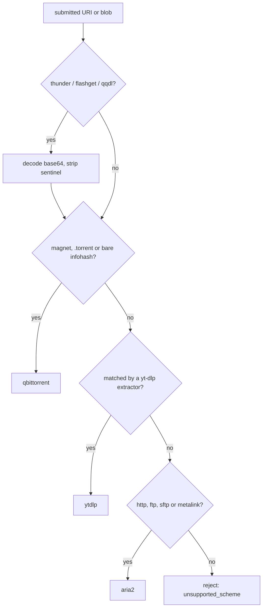

# 06 — Download Engines

> **Status:** draft
> **Last reviewed:** 2026-09-01
> **Audience:** implementing agent
> **Read this before:** T015–T019, T026–T030, T037, T038, T087–T090, T100, T101, T110, T113, and any task under `internal/engine/` or `internal/uri/`

## Purpose
Define the Go `Engine` interface every download adapter implements, the URI-to-engine routing table, the URI
normalisation algorithms, the ownership and conformance rules dl-tool imposes on an engine, the bandwidth
precedence chain, and the exact wire protocol of each v1 adapter (aria2, qBittorrent, yt-dlp). It does not
define HTTP payloads, DB columns or environment variables.

## Scope of this document
- In scope: the `Engine` interface and its value types, capability names, the file-priority vocabulary, the
  routing table, obfuscated-scheme decoding, magnet/bencode/BEP 52 parsing, aria2 JSON-RPC, qBittorrent
  WebAPI v2, the yt-dlp subprocess contract, engine→dl-tool state normalisation, engine ownership and the
  handling of foreign tasks, the boot conformance probe, the bandwidth precedence chain and its per-engine
  fan-out calls, and the shared adapter contract test suite.
- Out of scope (lives instead in): columns and enums → [`04-data-model.md`](04-data-model.md); HTTP shapes →
  [`05-api-contract.md`](05-api-contract.md); env vars → [`11-config-reference.md`](11-config-reference.md);
  compose services, ports, volumes → [`10-deployment-and-compose.md`](10-deployment-and-compose.md); search →
  [`07-search-and-indexers.md`](07-search-and-indexers.md); RSS → [`08-rss-automation.md`](08-rss-automation.md);
  operator procedures, boot reconciliation order and shutdown →
  [`17-operations-and-runbook.md`](17-operations-and-runbook.md); Definition of Done →
  [`13-testing-and-verification.md`](13-testing-and-verification.md).

---

## 1. The `Engine` interface

File `internal/engine/engine.go`. Every adapter in `internal/engine/<name>/` implements exactly this.
`context.Context` is the first parameter of every I/O method; `error` is the last return value; an unsupported
optional method returns `ErrNotSupported` and mutates nothing.

Engine task ids are **namespaced by engine**, because aria2 GIDs, qBittorrent infohashes and yt-dlp job ids are
different shapes: `"aria2:2089b05ecca3d829"`, `"qbittorrent:8c212779b4abde7c6bc608063a0d008b7e40ce32"`,
`"ytdlp:01JB0Q7M8W…"`. The store splits them into the `engine` and `engine_ref` columns defined in
[`04-data-model.md`](04-data-model.md); neither half ever appears in a URL.

```go
package engine

import ("context"; "errors"; "time")

var (
	ErrNotSupported = errors.New("engine: capability not supported") // optional method, Capability absent
	ErrNotFound     = errors.New("engine: task not found")
	ErrUnavailable  = errors.New("engine: daemon unreachable or session refused")
)

// TaskState is the canonical state. Same values as tasks.state (DB) and `state` (API).
type TaskState string

const (
	StateQueued      TaskState = "queued"
	StateDownloading TaskState = "downloading"
	StateSeeding     TaskState = "seeding"
	StatePaused      TaskState = "paused"
	StateChecking    TaskState = "checking"
	StateExtracting  TaskState = "extracting"
	StateMoving      TaskState = "moving"
	StateCompleted   TaskState = "completed"
	StateError       TaskState = "error"
	StateRemoved     TaskState = "removed"
)

type Capability string

const (
	CapHTTP            Capability = "http"
	CapFTP             Capability = "ftp"
	CapSFTP            Capability = "sftp"
	CapBitTorrent      Capability = "bittorrent"
	CapMagnet          Capability = "magnet"
	CapMetalink        Capability = "metalink"
	CapMediaSite       Capability = "media_site"
	CapNZB             Capability = "nzb"
	CapPerFileSelect   Capability = "per_file_select"   // can (de)select files
	CapPerFilePriority Capability = "per_file_priority" // can set a numeric per-file priority
	CapCategories      Capability = "categories"
	CapTags            Capability = "tags"
	CapSequential      Capability = "sequential"
	CapSetLocation     Capability = "set_location"
	CapRename          Capability = "rename"
	CapShareLimits     Capability = "share_limits"
	CapSearch          Capability = "search"
	CapRSSRules        Capability = "rss_rules"
	CapBTV2            Capability = "bt_v2"
	CapPushEvents      Capability = "push_events"
)

// AddRequest is the engine-independent submission. Exactly one of URIs or Blob is set.
type AddRequest struct {
	URIs        []string          // http/ftp/sftp/magnet/metalink URLs
	Blob        []byte            // raw .torrent / .metalink bytes
	BlobKind    string            // "torrent" | "metalink" | "nzb"
	SaveDir     string            // absolute, already validated by internal/fsx
	Filename    string            // rename / output-template override
	Category    string
	Tags        []string
	StartPaused bool
	Sequential  bool
	SelectFiles []int             // file indices to download; nil means all
	Extra       map[string]string // engine-specific escape hatch, never surfaced in the API
}

type FileEntry struct {
	Index     int    // 0-based in every adapter
	Path      string // relative to SaveDir
	Size      int64
	Completed int64
	Selected  bool
	Priority  *int // 0=skip 1=normal 6=high 7=maximum (§1.1); nil when the engine has no priorities
}

// TaskInfo is one engine task, normalised. Pointer fields are nil when the engine does not know yet.
type TaskInfo struct {
	ID             string // engine-namespaced, e.g. "aria2:2089b05ecca3d829"
	Engine         string
	Name           string
	State          TaskState
	TotalBytes     *int64 // nil while metadata is still unknown
	CompletedBytes int64
	UploadedBytes  int64
	DownloadRate   int64 // bytes/second
	UploadRate     int64 // bytes/second
	ETASeconds     *int64
	SaveDir        string
	ContentPath    string // absolute path to the finished file or directory; "" if unknown
	ErrorCode      string // a tasks.error_code value; "" when no error
	ErrorMessage   string
	InfohashV1     string // lowercase hex, 40 chars; "" if not a torrent
	InfohashV2     string // lowercase hex, 64 chars; "" unless v2 or hybrid
	NumSeeds       *int
	NumPeers       *int
	Ratio          *float64
	CreatedAt      *time.Time
	CompletedAt    *time.Time
}

type EventKind string

const (
	EventAdded     EventKind = "added"
	EventStarted   EventKind = "started"
	EventProgress  EventKind = "progress"
	EventPaused    EventKind = "paused"
	EventCompleted EventKind = "completed"
	EventError     EventKind = "error"
	EventRemoved   EventKind = "removed"
)

type TaskEvent struct {
	TaskID string
	Kind   EventKind
	Info   *TaskInfo // nil for EventRemoved
}

type Engine interface {
	Name() string               // "aria2" | "qbittorrent" | "ytdlp"
	Capabilities() []Capability // declared, sorted, stable
	Accepts(uri string) bool    // true if this engine should handle this URI; used by the router

	Connect(ctx context.Context) error
	Close() error
	Health(ctx context.Context) (version string, err error) // ErrUnavailable when down

	Add(ctx context.Context, req AddRequest) (id string, err error)
	List(ctx context.Context) ([]TaskInfo, error)
	Get(ctx context.Context, id string) (TaskInfo, error) // ErrNotFound when absent
	Files(ctx context.Context, id string) ([]FileEntry, error)

	Pause(ctx context.Context, id string) error
	Resume(ctx context.Context, id string) error
	Remove(ctx context.Context, id string, deleteData bool) error

	// Optional: return ErrNotSupported when the backing Capability is absent.
	SetFiles(ctx context.Context, id string, selected []int, priorities map[int]int) error
	SetLocation(ctx context.Context, id, path string) error
	Rename(ctx context.Context, id, name string) error
	SetCategory(ctx context.Context, id, category string) error
	// SetRateLimits applies bytes/second. id == "" means the global limit; a nil direction is
	// left unchanged; 0 means unlimited.
	SetRateLimits(ctx context.Context, id string, down, up *int64) error
	SetShareLimits(ctx context.Context, id string, ratio *float64, seedMinutes *int64) error

	// Events pushes where possible (aria2 WebSocket notifications), else runs a polling loop that
	// yields the same TaskEvent shape (qBittorrent sync/maindata rid deltas). The channel closes
	// when ctx is cancelled or the engine is closed.
	Events(ctx context.Context) (<-chan TaskEvent, error)
}
```

No engine ever reports `extracting` or `moving`: those two belong to dl-tool's post-processing jobs, which
overwrite the engine state while a job holds the task. Adapters return only the other eight.

Capabilities are **declared, not guessed**, so the UI can grey out what an engine cannot do. `CapSearch` and
`CapRSSRules` stay in the enum but no v1 adapter declares them — dl-tool implements both natively
([ADR-0008](decisions/0008-torznab-first-declarative-yaml-second.md),
[ADR-0009](decisions/0009-native-cross-protocol-rss-rules.md)). `CapNZB` is reserved so a v2 Usenet
adapter is not precluded.

| Capability | aria2 | qBittorrent | yt-dlp |
|---|---|---|---|
| `http` `ftp` `sftp` `metalink` | ✅ | ❌ | ❌ |
| `bittorrent` `magnet` | ❌ — never used: no BEP 52, no uTP | ✅ | ❌ |
| `bt_v2` | ❌ | ✅ | ❌ |
| `media_site` | ❌ | ❌ | ✅ |
| `per_file_select` | ✅ `--select-file` | ✅ | ❌ |
| `per_file_priority` | ❌ selection only, no numeric priority | ✅ `0/1/6/7` | ❌ |
| `categories` `tags` `sequential` `share_limits` | ❌ | ✅ | ❌ |
| `set_location` | ✅ but restarts the transfer (§4.6) | ✅ | ❌ |
| `rename` | ❌ — `out` names the output at add time only, so `Rename` on a running transfer returns `ErrNotSupported` and aria2 does **not** declare `CapRename` | ✅ | ✅ — `Rename` rewrites the `-o` template for the next spawn (T090) |
| `push_events` | ✅ WebSocket notifications | ❌ poll `sync/maindata` | ✅ subprocess stdout |
| `nzb` `search` `rss_rules` | ❌ | ❌ | ❌ |

`internal/engine/registry.go` holds `map[string]Engine` keyed by `Name()`; adding an engine touches one
directory plus one registry line. `internal/engine/router.go` implements §2.

### 1.1 File priority vocabulary

The canonical vocabulary is qBittorrent's, verified in `release-5.2.3`
`src/base/bittorrent/downloadpriority.h`: `Ignored = 0, Normal = 1, High = 6, Maximum = 7, Mixed = -1`.

| `FileEntry.Priority` | Name | Meaning |
|---|---|---|
| `0` | `skip` | Not downloaded. `Selected = false`. |
| `1` | `normal` | Downloaded at normal priority. |
| `6` | `high` | Downloaded before `normal` files. |
| `7` | `maximum` | Downloaded first. |

- There is **no distinct `low`** level. Download Station's four-level skip/low/normal/high has no `low`
  equivalent here; `low` maps onto `normal`.
- `4` is libtorrent's *internal* scale, not the WebAPI vocabulary: **never send `4`**, and reject a request
  carrying it ([FR-007](02-requirements.md#fr-007-select-and-prioritise-individual-files)). The DDL constraint
  is `priority IN (0,1,6,7)` → [`04-data-model.md`](04-data-model.md).
- `-1` (`Mixed`) is a read-only aggregate qBittorrent may return for a folder row; never send it and never
  treat it as an error (§5.7).

Per-engine translation, applied by each adapter:

| Priority | qBittorrent `torrents/filePrio` | aria2 `select-file` | yt-dlp |
|---|---|---|---|
| `0` skip | `0` | index **omitted** from the list | n/a |
| `1` normal | `1` | index **included** | n/a |
| `6` high | `6` | index included — value discarded | n/a |
| `7` maximum | `7` | index included — value discarded | n/a |

- qBittorrent is an identity mapping in both directions; it is the only engine that declares
  `per_file_priority`.
- **aria2 supports only skip versus selected.** It has no numeric per-file priority, so `FileEntry.Priority`
  is `nil` for every aria2 file, a submitted priority of `0` deselects the index at add time, any other value
  selects it, and `SetFiles` returns `ErrNotSupported` when its `priorities` map is non-nil (§4.3).
- yt-dlp has no per-file model at all: it declares neither `per_file_select` nor `per_file_priority`, and
  `Files` returns the single output file with `Priority = nil`.

---

## 2. Routing table

`router.go` evaluates these rows **in order** and stops at the first match.

| # | Input | Engine |
|---|---|---|
| 1 | `thunder://`, `flashget://`, `qqdl://` | **decode first (§3.1), then re-route the recovered inner URI from row 2** |
| 2 | `magnet:?…`, a URL whose path ends `.torrent`, raw `.torrent` bytes, a bare 40-hex or 64-hex infohash | `qbittorrent` |
| 3 | A URL matched by a yt-dlp extractor | `ytdlp` — must run **before** row 4 and must be cheap (§7.2) |
| 4 | `http://`, `https://` | `aria2` |
| 5 | `ftp://`, `ftps://`, `sftp://` | `aria2` |
| 6 | A URL whose path ends `.metalink` or `.meta4`, or raw Metalink bytes | `aria2` (`addMetalink` returns an **array** of GIDs) |
| 7 | `ed2k://` | none — parse for display, reject with `unsupported_scheme` and the message `ed2k is not supported in v1` ([FR-004](02-requirements.md#fr-004-reject-ed2k-links-with-a-clear-message)) |
| 8 | `.nzb`, `nzb://` | none — v2 only; reject with `unsupported_scheme` |
| 9 | anything else | none — reject with `unsupported_scheme` |



An explicit `engine` field on the create request overrides the router, but only when that engine's `Accepts()`
returns true for the URI; otherwise the request is rejected.

---

## 3. URI normalisation (`internal/uri/`)

```go
package uri

// Kind mirrors the tasks.source_kind enum in 04-data-model.md.
type Kind string

const (
	KindHTTP Kind = "http"; KindFTP Kind = "ftp"; KindSFTP Kind = "sftp"
	KindMagnet Kind = "magnet"; KindTorrent Kind = "torrent"
	KindMetalink Kind = "metalink"; KindMedia Kind = "media"
)

var ErrUnsupportedScheme = errors.New("uri: unsupported scheme")

type Normalized struct {
	Kind           Kind
	URI            string // the plain, canonical URI handed to the engine
	OriginalScheme string // "thunder" | "flashget" | "qqdl" | "" — provenance for the UI
	DisplayName    string // magnet dn, torrent info.name, or ""
	InfohashV1     string // lowercase hex, 40 chars
	InfohashV2     string // lowercase hex, 64 chars
	Trackers       []string
}

// Normalize decodes obfuscated schemes, lowercases infohashes and classifies the URI.
// It returns ErrUnsupportedScheme for ed2k:// and nzb sources.
func Normalize(raw string) (Normalized, error)

// DecodeObfuscated returns the plain URL behind a thunder://, flashget:// or qqdl:// link.
// ok is false when the scheme is not one of the three or the payload does not decode to a URL.
func DecodeObfuscated(raw string) (plain string, ok bool)
```

### 3.1 Obfuscated schemes (`obfuscated.go`)

Three legacy Chinese download-manager schemes are plain Base64 wrappers round an ordinary URL.

| Scheme | Encoding | Decode |
|---|---|---|
| `thunder://` | base64( `"AA"` + url + `"ZZ"` ) | base64-decode, strip leading `AA` and trailing `ZZ` |
| `flashget://` | base64( `"[FLASHGET]"` + url + `"[FLASHGET]"` ) | base64-decode, strip leading and trailing `[FLASHGET]` |
| `qqdl://` | base64( url ) | base64-decode, nothing to strip |

Worked examples, round-trip verified upstream. Input URL `http://example.org/file.iso`:

| Scheme | Encoded link | Payload decodes to | Final URL |
|---|---|---|---|
| thunder | `thunder://QUFodHRwOi8vZXhhbXBsZS5vcmcvZmlsZS5pc29aWg==` | `AAhttp://example.org/file.isoZZ` | `http://example.org/file.iso` |
| flashget | `flashget://W0ZMQVNIR0VUXWh0dHA6Ly9leGFtcGxlLm9yZy9maWxlLmlzb1tGTEFTSEdFVF0=` | `[FLASHGET]http://example.org/file.iso[FLASHGET]` | `http://example.org/file.iso` |
| qqdl | `qqdl://aHR0cDovL2V4YW1wbGUub3JnL2ZpbGUuaXNv` | `http://example.org/file.iso` | `http://example.org/file.iso` |

A second, independently sourced thunder example that must go in `testdata/`:
`thunder://QUFodHRwOi8vd3d3LmZyZWUtei5uZXQvMS5yYXJaWg==` → `AAhttp://www.free-z.net/1.rarZZ` →
`http://www.free-z.net/1.rar`.

Algorithm, in this order:

1. Split on the first `://`; lowercase and trim the scheme; return `("", false)` unless it is `thunder`,
   `flashget` or `qqdl`.
2. Trim whitespace, then **cut everything from the first `&`**. Generators append site-specific junk after the
   Base64 — the reference Ruby implementation strips a literal `&freeznet` suffix. *(Real-world observation, not
   a specification.)*
3. Strip a **trailing `/`** if present; links are frequently pasted with one.
4. **Re-pad** to a multiple of four with `=`. Padding is frequently missing in the wild. *(Real-world
   observation, not a specification.)*
5. Decode with the standard alphabet; on failure retry with the **URL-safe alphabet** (`-` and `_`). Decode
   leniently — do not reject on trailing garbage.
6. Strip the scheme's sentinel prefix and suffix only when present, then trim whitespace.
7. Accept the result only if it begins with `http://`, `https://`, `ftp://`, `ftps://`, `sftp://` or `ed2k://`
   (case-insensitive); otherwise return `("", false)`.

An `ed2k://` recovered from a thunder link is a valid decode but still an unsupported task: return it here, then
let `Normalize` reject it with `ErrUnsupportedScheme`.

### 3.2 `ed2k://` — parsed, never downloaded

No v1 engine speaks eDonkey2000/Kad. Parse for display, then reject. Grammar (de-facto; there is no RFC):
`ed2k://|file|<filename>|<filesize-in-bytes>|<ed2k-hash>|/`, where `<ed2k-hash>` is 32 hexadecimal characters (an
MD4 root hash). Optional trailing segments are `|h=<AICH-root>|` and `|sources,<ip>:<port>|/`. Parsing is a
`strings.Split(s, "|")` whose `parts[1]` must equal `file`. Verbatim example:
`ed2k://|file|The_Two_Towers-The_Purist_Edit-Trailer.avi|14997504|965c013e991ee246d63d45ea71954c4d|/`

### 3.3 Magnet URIs (`magnet.go`)

```
magnet:?xt=urn:btih:<info-hash>&dn=<name>&tr=<tracker-url>&x.pe=<peer-address>
```

| Param | Meaning |
|---|---|
| `xt` | "exact topic" — the **only mandatory parameter**; appears twice on a hybrid magnet |
| `dn` | display name, "used for client display while awaiting metadata" |
| `tr` | tracker URL; "multiple entries may be included" |
| `x.pe` | peer address hint (`host:port`), bootstraps without a tracker |
| `ws` | web seed (BEP 19 HTTP source) <!-- UNVERIFIED: documented by libtorrent, not by BEP 9 --> |

- `xt`, `tr`, `x.pe` and `ws` may all repeat: parse with `url.Values` (a slice per key), never a single-valued map.
- v1 hash: "hex encoded, for a total of 40 characters"; clients "should also support the 32 character base32
  encoded" form. Decode base32 (32 chars) → hex (40 chars) and lowercase everything at ingest.
- v2 hash: `xt=urn:btmh:<tagged-info-hash>` — the SHA-256 digest in multihash form, so the string starts `1220`
  (`0x12` = sha2-256, `0x20` = 32-byte length) and is **68 hex characters total**.
  <!-- UNVERIFIED: the 1220 prefix is documented by libtorrent, not by BEP 52. -->
- A hybrid magnet carries **both** `xt=urn:btih:<40hex>` and `xt=urn:btmh:1220<64hex>`.
- "If no tracker is specified, the client SHOULD use the DHT to acquire peers."

### 3.4 Bencode and the v1 infohash (`metainfo.go`)

Parsing uses `github.com/anacrolix/torrent/metainfo` (version pinned by **T004**; **parsing only** — dl-tool
never runs a BitTorrent engine in-process). Bencode rules, verbatim from BEP 3: **strings** are length-prefixed
base ten followed by a colon (`4:spam` is `'spam'`); **integers** are `i`, the base-10 number, `e` (`i3e` is `3`,
`i-3e` is `-3`); **lists** are `l`, the bencoded elements, `e` (`l4:spam4:eggse` is `['spam', 'eggs']`);
**dictionaries** are `d`, alternating keys and values, `e`, and "keys must be strings and appear in sorted order".

Metainfo top-level keys are `announce` and `info`. Info-dict keys: `name`, `piece length`, `pieces` ("a string
whose length is a multiple of 20 … each of which is the SHA1 hash of the piece"), and either `length`
(single-file) or `files` (list of `{length, path}`).

Compute the v1 infohash as SHA-1 over the **raw bencoded bytes of the `info` value exactly as they appeared in
the file**. Never re-encode: unknown keys and non-canonical ordering in the wild make a re-encode differ, so the
parser must expose the original `(start, end)` byte offsets of the `info` value.

```go
type Manifest struct {
	Name       string
	TotalSize  int64
	Files      []ManifestFile // Index, Path, Size
	InfohashV1 string
	InfohashV2 string
	Private    *bool // nil when unknown
}

// InspectTorrent backs POST /tasks/inspect. It must not touch disk or any engine.
func InspectTorrent(b []byte) (Manifest, error)
```

### 3.5 BitTorrent v2 (BEP 52) identity

Verbatim from BEP 52: `meta version` is "An integer value, set to 2" and lives **in the info dictionary**; "For
meta version 2 SHA2-256 is used"; "For some uses as torrent identifier it is truncated to 20 bytes". A hybrid
torrent carries both formats — "the `pieces` field and `files` or `length` in the info dictionary must be
generated to describe the same data in the same order". New info-dict keys: `file tree`, `piece layers`,
`pieces root`.

| Torrent kind | v1 infohash | v2 infohash | Key on |
|---|---|---|---|
| v1-only | ✅ 40 hex (SHA-1) | — | v1 hash |
| v2-only | — | ✅ 64 hex (SHA-256) | v2 hash; **aria2 cannot open these at all** |
| hybrid | ✅ | ✅ | **both** — one torrent, two valid identifiers |

- Normalise every hash to **lowercase hex** at ingest, decoding base32 v1 hashes to hex first.
- A magnet with `urn:btmh` and **no** `urn:btih` is v2-only: route it to qBittorrent, never to aria2.
- The same hybrid torrent added once by v1 magnet and once by v2 magnet is the **same** torrent; deduplicate when
  *either* hash matches, never on one column alone.
- qBittorrent's `hash` field is the *TorrentID*, which for a v2-only torrent is **not** the v1 infohash. Fill
  `InfohashV1`/`InfohashV2` from the `infohash_v1`/`infohash_v2` keys of `torrents/info`, not from `hash`.

**What `engine_ref` holds for qBittorrent.** `tasks.engine_ref` stores the value the engine's own API keys on,
because every mutating call takes `hashes=` and must round-trip verbatim: the **`hash` (TorrentID)** returned
by `torrents/info`. Store it exactly as returned; never reconstruct or re-case it.

| Torrent kind | `engine_ref` mirrors | `tasks.infohash_v1` | `tasks.infohash_v2` |
|---|---|---|---|
| v1-only | `infohash_v1` (40 hex) | set | empty |
| hybrid | `infohash_v1` (40 hex) | set | set |
| v2-only | the 40-hex truncation of `infohash_v2` | empty | set (64 hex) |

<!-- INFERRED: BEP 52 documents the 20-byte truncation of the v2 hash "for some uses as torrent identifier";
     that qBittorrent's TorrentID for a v2-only torrent is exactly that truncation was not read verbatim.
     T100 must confirm it against a v2-only fixture. -->

Deduplication, lookup and the `torrent_duplicate` decision run on `infohash_v1`/`infohash_v2`
([FR-022](02-requirements.md#fr-022-record-both-bittorrent-infohash-forms),
[FR-023](02-requirements.md#fr-023-reject-a-duplicate-torrent-by-either-infohash)) — **never on `engine_ref`**,
which is an opaque engine handle. aria2 `engine_ref` is the GID and yt-dlp `engine_ref` is the job id; neither
is an infohash.

---

## 4. aria2 adapter (`internal/engine/aria2/`)

**Maintenance risk, stated plainly:** aria2 has shipped **no tagged release since 1.37.0 on 2023-11-15**, although
`master` still receives commits (most recent seen 2026-06-25) and issue #2337 asking for a release has sat
unanswered since 2026-01-02. Debian and Alpine both ship 1.37.0. This is low-maintenance mode, not abandonment,
and 1.37.0 is feature-complete for HTTP/FTP/SFTP. dl-tool builds its aria2 image in-repo from `alpine` +
`apk add aria2`; `p3terx/aria2-pro` was last pushed 2022-09-06 and must not be depended on. See
[ADR-0005](decisions/0005-aria2-qbittorrent-ytdlp-engines.md).

### 4.1 Daemon flags

```
aria2c \
  --enable-rpc --rpc-listen-all --rpc-listen-port=6800 \
  --rpc-secret=${ARIA2_RPC_SECRET} --rpc-allow-origin-all \
  --dir=/data --continue=true \
  --max-concurrent-downloads=5 --max-connection-per-server=8 --split=8 \
  --file-allocation=falloc \
  --save-session=/config/aria2.session \
  --input-file=/config/aria2.session \
  --save-session-interval=30 --auto-save-interval=30 \
  --conf-path=/config/aria2.conf
```

| Flag | Documented default | Why |
|---|---|---|
| `--enable-rpc` | `false` | Required; upstream "strongly recommended" pairing with `--rpc-secret`. |
| `--rpc-listen-all` | `false` | Otherwise aria2 listens only on loopback and dl-tool cannot reach it. |
| `--rpc-listen-port` | `6800` | Left at the default. |
| `--dir` | (cwd) | Must be the single `/data` mount ([ADR-0012](decisions/0012-single-data-mount.md)). |
| `--file-allocation` | **`prealloc`** | `prealloc` blocks for a long time on large files on some filesystems; `falloc` suits ext4/xfs. *(Inferred from the option list, not an upstream recommendation.)* |
| `--save-session` + `--input-file`, same path | (none) | The documented restart-persistence idiom: "You can pass this output file to aria2c with `--input-file` option on restart." |
| `--pause` | `false` | Per-task add-paused; "effective only when `--enable-rpc=true` is given". Not changeable later via `changeOption`. |

Do **not** use the `--on-download-*` exec hooks. The WebSocket notifications of §4.5 give the same events with no
script to mount and no PATH or permission problems inside the container.

### 4.2 Endpoint and the `token:` convention

| Transport | URL | Use |
|---|---|---|
| JSON-RPC over HTTP | `http://aria2:6800/jsonrpc` (POST) | every command |
| JSON-RPC over WebSocket | `ws://aria2:6800/jsonrpc` | receiving notifications only |
| XML-RPC | `http://aria2:6800/rpc` | not used |

Verbatim: "For each RPC method call, the caller has to include the token prefixed with `token:`." The token is
the **first positional element of `params`** for every `aria2.*` method.

```json
{
  "jsonrpc": "2.0",
  "id": "dl-tool-1",
  "method": "aria2.addUri",
  "params": ["token:MYSECRET", ["https://example.org/file.iso"], {"dir": "/data/movies", "out": "file.iso"}]
}
```

Two documented exceptions, each a bug if got wrong: `system.listMethods` and `system.listNotifications` take **no**
token; and `system.multicall` is special-cased — verbatim, "we don't specify the token in the call. Instead,
**each nested method call** has to provide the token as the first parameter." Prepending `token:` to
`system.multicall`'s own params is a bug.

JSON-RPC 2.0 **batch requests** are supported (POST a JSON array of request objects); prefer them over
`system.multicall`, whose results are wrapped in a **one-item array** per call. On error aria2 returns a JSON
object with `code` and `message`. In an options struct the key is the long option name **without the leading
`--`** and every value is a **string**: `{"split": "8", "dir": "/data/movies", "pause": "true"}`.

### 4.3 Methods dl-tool calls

| `Engine` method | aria2 call | Notes |
|---|---|---|
| `Health` | `aria2.getVersion` | Returns `version` and `enabledFeatures[]`; this is the health probe. |
| `Add` (URIs) | `aria2.addUri([secret], uris, options)` | Returns a **single GID string**. |
| `Add` (metalink) | `aria2.addMetalink([secret], metalink, options)` | `metalink` is base64. Returns an **array of GIDs**; record the first and follow `followedBy`. |
| `Add` (torrent) | `aria2.addTorrent` | **Never called** — torrents go to qBittorrent. |
| `List` | `aria2.tellActive`, `aria2.tellWaiting(offset,num)`, `aria2.tellStopped(offset,num)` | Three calls in one JSON-RPC batch. |
| `Get` | `aria2.tellStatus([secret], gid[, keys])` | Pass `keys` to keep responses small. |
| `Files` | `aria2.getFiles([secret], gid)` | |
| `Pause` | `aria2.pause([secret], gid)` | "If the download was active, the download is placed in the front of waiting queue." |
| `Resume` | `aria2.unpause([secret], gid)` | Changes `paused` → `waiting`. |
| `Remove` | `aria2.remove`, then `aria2.removeDownloadResult` | "If the specified download is in progress, it is first stopped. The status of the removed download becomes `removed`." Use `aria2.forceRemove` only after `remove` times out. |
| `SetFiles` (select) | `aria2.changeOption([secret], gid, {"select-file": "1,3,5"})` | Selection only; a non-nil `priorities` map returns `ErrNotSupported`. |
| `SetLocation` | `aria2.changeOption([secret], gid, {"dir": "…"})` | ⚠️ Restarts the download — §4.6. |
| `SetRateLimits` (task) | `aria2.changeOption([secret], gid, {"max-download-limit": …, "max-upload-limit": …})` | Both are in the safe list that does **not** restart the download. |
| `SetRateLimits` (global) | `aria2.changeGlobalOption([secret], {"max-overall-download-limit": …})` | `0` means unrestricted. |
| — | `aria2.getGlobalStat` | `downloadSpeed`, `uploadSpeed`, `numActive`, `numWaiting`, `numStopped`, `numStoppedTotal`. |
| — | `aria2.saveSession` | Called before a graceful shutdown. |

`Rename` on an existing task, `SetCategory`, per-task `SetShareLimits` and per-file priorities all return
`ErrNotSupported`.

### 4.4 `tellStatus` keys dl-tool reads

| Key | Documented meaning | Maps to |
|---|---|---|
| `gid` | GID of the download | `ID` (after namespacing) |
| `status` | `active` \| `waiting` \| `paused` \| `error` \| `complete` \| `removed` | `State` via §4.6 |
| `totalLength` | "Total length of the download in bytes." | `TotalBytes` (nil while `"0"` and metadata pending) |
| `completedLength` | "Completed length of the download in bytes." | `CompletedBytes` |
| `uploadLength` | "Uploaded length of the download in bytes." | `UploadedBytes` |
| `downloadSpeed` / `uploadSpeed` | "measured in bytes/sec" | `DownloadRate` / `UploadRate` |
| `dir` | "Directory to save files." | `SaveDir` |
| `files` | Same structs as `aria2.getFiles`. | `ContentPath` (first selected `path`) |
| `errorCode` | "only available for stopped/completed downloads" | `ErrorCode` via §4.7 |
| `errorMessage` | "The (hopefully) human readable error message" | `ErrorMessage` |
| `infoHash` | "InfoHash. BitTorrent only." | `InfohashV1` — **v1 only; aria2 has no BEP 52** |
| `numSeeders`, `seeder` | BitTorrent only; `seeder` is `"true"`/`"false"` | `NumSeeds`, and the `seeding` branch of §4.6 |
| `connections` | "The number of peers/servers aria2 has connected to." | `NumPeers` |
| `followedBy`, `following`, `belongsTo` | Parent/child links for Metalink and `.torrent`-follow expansions | Child-task correlation |
| `verifiedLength` | "This key exists only when this download is being hash checked." | `checking` |
| `verifyIntegrityPending` | "`true` if this download is waiting for the hash check in a queue." | `checking` |

**Type rule, corrected against the implementation.** The manual's blanket "Values are strings" is wrong. *Scalar*
values are strings — including numeric ones, so parse them — but `files`, `uris`, `followedBy` and
`bittorrent.announceList` are arrays, `bittorrent` and each `files[]` element are structs, and
`bittorrent.creationDate` is emitted as a **JSON integer**. `bitfield`, `followedBy`, `belongsTo`,
`verifiedLength`, `verifyIntegrityPending` and `bittorrent.creationDate` are each **conditionally absent**: use
optional access everywhere, never a required field.

`aria2.getFiles` element keys: `index` ("Index of the file, **starting at 1**"), `path`, `length`,
`completedLength` (counts only **completed pieces**, so it may be less than `tellStatus.completedLength`),
`selected`, `uris`. `FileEntry.Index` is aria2's index minus one, so every adapter exposes 0-based indices.

```json
{"id": "qwer", "jsonrpc": "2.0",
 "result": [{"index": "1", "length": "34896138", "completedLength": "34896138",
             "path": "/data/file", "selected": "true",
             "uris": [{"status": "used", "uri": "http://example.org/file"}]}]}
```

### 4.5 WebSocket notifications

Notifications are **unidirectional** — "the client which receives the notification must not respond to it" — and
lack the `id` key. The payload is always one struct with a single string key, `gid`; call `aria2.tellStatus(gid)`
to learn anything else.

```json
{"jsonrpc":"2.0","method":"aria2.onDownloadComplete","params":[{"gid":"2089b05ecca3d829"}]}
```

| Notification | Trigger | `TaskEvent.Kind` |
|---|---|---|
| `aria2.onDownloadStart` | "when a download is started" | `started` |
| `aria2.onDownloadPause` | "when a download is paused" | `paused` |
| `aria2.onDownloadStop` | "when a download is stopped **by the user**" | `removed` |
| `aria2.onDownloadComplete` | "when a download is complete. For BitTorrent downloads, this notification is sent when the download is complete **and seeding is over**." | `completed` |
| `aria2.onDownloadError` | "when a download is stopped due to an error" | `error` |
| `aria2.onBtDownloadComplete` | "when a torrent download is complete but **seeding is still going on**" | `progress` |

`Events()` opens the WebSocket, reconnects with exponential backoff on drop, and also emits a `progress` event
from a 1 s `tellActive` batch so rates keep moving between notifications.

### 4.6 State normalisation — reproduce exactly

| aria2 `tellStatus.status` | dl-tool `TaskState` |
|---|---|
| `active` **and** `seeder == "true"` | `seeding` |
| `active` | `downloading` |
| `waiting` | `queued` |
| `paused` | `paused` |
| `complete` | `completed` |
| `error` | `error` |
| `removed` | `removed` |
| (`verifyIntegrityPending` present or `verifiedLength` present) | `checking` |

Evaluate the `checking` row **first**: it is a key-presence test, not a `status` value.

⚠️ `aria2.changeOption` restarts an active download for every option except `bt-max-peers`,
`bt-request-peer-speed-limit`, `bt-remove-unselected-file`, `force-save`, `max-download-limit` and
`max-upload-limit`. `SetLocation` therefore restarts the transfer; log a warning and surface it in the UI.
`dry-run`, `metalink-base-uri`, `parameterized-uri`, `pause`, `piece-length` and `rpc-save-upload-metadata` cannot
be changed at all.

### 4.7 `errorCode` mapping

`tellStatus.errorCode` carries aria2's exit-status values as a string. `0` means success and sets no error code.

| aria2 code (verbatim meaning) | `tasks.error_code` |
|---|---|
| 3 "resource was not found", 4 "saw the specified number of 'resource not found' error", 6 "network problem occurred" | `broken_link` |
| 2 "time out occurred", 5 "aborted because download speed was too slow" | `timeout` |
| 8 "remote server did not support resume when resume was required" | `not_supported_type` |
| 9 "not enough disk space available" | `disk_full` |
| 11 "downloading same file at that moment", 12 "downloading same info hash torrent at that moment" | `torrent_duplicate` |
| 1 "unknown error", 7 "unfinished downloads", 10 "piece length was different", and 13+ | `unknown` |

<!-- UNVERIFIED: the upstream list continues past 12; only codes 0-12 were read verbatim. -->

---

## 5. qBittorrent adapter (`internal/engine/qbittorrent/`)

Target `lscr.io/linuxserver/qbittorrent`, qBittorrent **5.2.3**. All paths sit under `/api/v2/`.

**IMPORTANT** — two upstream documentation bugs silently break a wiki-faithful adapter. The add parameter is
**`stopped`**, not the documented `paused`; and the state enum returns **`stoppedDL`/`stoppedUP`** where the wiki
says `pausedDL`/`pausedUP`. dl-tool **sends both spellings and accepts both**, so one adapter works on 4.x and
5.x with no branching.

### 5.1 Version probe

Call both at adapter start; record them for `GET /system/info` and for bug reports.

| Endpoint | 5.2.3 returns |
|---|---|
| `GET /api/v2/app/version` | `"v5.2.3"` |
| `GET /api/v2/app/webapiVersion` | `"2.15.1"` |

The wiki's "latest WebAPI version 2.11.3" is stale — that is only the newest heading on the wiki page, while the
shipping constant in `release-5.2.3` is `{2, 15, 1}`. Never gate a feature on `>= 2.11.3`.

### 5.2 Login and the session cookie

`POST /api/v2/auth/login`, `Content-Type: application/x-www-form-urlencoded`, fields `username` and `password`.

```sh
curl -i --header 'Referer: http://qbittorrent:8080' \
     --data 'username=admin&password=adminadmin' \
     http://qbittorrent:8080/api/v2/auth/login
```
```http
HTTP/1.1 204 No Content
Set-Cookie: QBT_SID_8080=hBc7TxF76ERhvIw0jQQ4LZ7Z1jQUV0tQ; path=/; HttpOnly
```
```sh
curl http://qbittorrent:8080/api/v2/torrents/info --cookie "QBT_SID_8080=hBc7TxF76ERhvIw0jQQ4LZ7Z1jQUV0tQ"
```

Give the adapter's `http.Client` a standards-compliant cookie jar; never parse, rename or manually copy the
cookie. qBittorrent 5.2.3 names it `QBT_SID_<WebUI port>`, not `SID`
([source](https://github.com/qbittorrent/qBittorrent/blob/release-5.2.3/src/webui/webapplication.cpp#L438)).
Accept login only after the jar captures the response cookie and an authenticated `GET /api/v2/app/version`
succeeds. Neither the login status nor its body alone proves that the session works.

| qBittorrent | login OK | bad credentials | banned IP |
|---|---|---|---|
| ≤ 5.1.x | `200` + body `Ok.` + a session cookie | `200` + body `Fails.` | `403` |
| ≥ 5.2.0 | **`204` No Content** + `QBT_SID_<port>` | **`401`** | `403` |

Always send `Referer: <scheme>://<host>:<port>` matching the request's own `Host` header: the wiki instructs it
and 4.x needs it. It is **not** strictly required by 5.2.x — a request sending neither `Origin` nor `Referer`
passes CSRF, and only a **mismatched** header is rejected, with `401` — but the matching header is correct on
every version. Re-login and retry once on any `401` or `403`; the session expires.

Two further failure modes look identical to an auth failure: `HostHeaderValidation` defaults to `true` and
survives only because `ServerDomains` defaults to `*`, so a user who narrowed `ServerDomains` makes every
dl-tool request `401`; and a `Host` header whose port differs from the listening port is rejected outright. Log
the response body on `401` so this is diagnosable.

General rules: "All API methods follows the format `/api/v2/APIName/methodName`"; use `POST` when mutating and
`GET` otherwise, because "starting with qBittorrent v4.4.4, server will return `405 Method Not Allowed` when you
used the wrong request method"; every method except `auth/login` requires the session.

### 5.3 `torrents/add`

`POST /api/v2/torrents/add`, `Content-Type: multipart/form-data`.

```
---------------------------acebdf13572468
Content-Disposition: form-data; name="torrents"; filename="file.torrent"
Content-Type: application/x-bittorrent

[binary_file_data]
---------------------------acebdf13572468
Content-Disposition: form-data; name="savepath"

/data/linux-isos
---------------------------acebdf13572468--
```

| Parameter | Type | Notes |
|---|---|---|
| `urls` | string | Newline-separated; accepts `http(s)` `.torrent` URLs **and** magnet links |
| `torrents` | file part(s) | Raw `.torrent` bytes, `Content-Type: application/x-bittorrent`; multiple allowed |
| `savepath` | string | Download folder |
| `category` | string | |
| `tags` | string | **Comma**-separated |
| `stopped` | bool | Add without starting — the 5.x name |
| `paused` | bool | The 4.x name; **send it too, same value** |
| `contentLayout` | enum | `Original` \| `Subfolder` \| `NoSubfolder`; replaces the old boolean `root_folder` |
| `root_folder` | bool | The 4.x name; send it too |
| `skip_checking` | bool | The name every **released** 5.x reads |
| `seedMode` | bool | The `master` (5.3.0alpha1) rename of `skip_checking`; **send both** |
| `rename` | string | Rename the torrent |
| `autoTMM` | bool | Automatic Torrent Management |
| `sequentialDownload`, `firstLastPiecePrio`, `forced`, `addToTopOfQueue` | bool | |
| `upLimit`, `dlLimit` | int | bytes/second |
| `ratioLimit` | float | |
| `seedingTimeLimit`, `inactiveSeedingTimeLimit` | int | minutes |
| `filePriorities` | string | Comma-separated priorities, one per file index |
| `stopCondition` | enum | e.g. `MetadataReceived`, `FilesChecked` |
| `downloadPath`, `useDownloadPath` | string / bool | Incomplete-download folder |
| `shareLimitAction` | enum | Present in 5.2.3 |
| `shareLimitsMode` | enum | `master`-only; harmless to send |

Unknown parameters are ignored, which is exactly why sending both spellings of every renamed parameter is safe.

WebAPI 2.15.1 returns the JSON result introduced in the
[2.14 changelog](https://github.com/qbittorrent/qBittorrent/blob/release-5.2.3/WebAPI_Changelog.md#2140):

| Status | Meaning |
|---|---|
| `200` | At least one immediate success and `pending_count == 0`. |
| `202` | At least one URL or magnet remains pending. |
| `409` | Every submitted torrent failed. |
| `415` | An uploaded file is invalid torrent metadata. |

The `200` and `202` bodies contain `success_count`, `pending_count`, `failure_count` and
`added_torrent_ids`. Resolve identity before adding through `fetchMetadata`/`parseMetadata` or the local
§3.4 parser. For an immediate single add, require one returned id and verify it equals the expected engine
reference. For a pending add, retain the expected identity and reconcile when it appears. Treat malformed
JSON, inconsistent counts or an unexpected id as a protocol error; never infer success from a 2xx status or
recover identity by choosing an arbitrary later `torrents/info` row.

### 5.4 `sync/maindata` — the delta protocol

`GET /api/v2/sync/maindata?rid=<N>`, polled every **1 s**. This is what the qBittorrent WebUI itself uses and it
is dramatically cheaper than polling `torrents/info`.

| Property | Type | Description |
|---|---|---|
| `rid` | integer | Response ID |
| `full_update` | bool | "Whether the response contains all the data or partial data" |
| `torrents` | object | "Property: torrent hash, value: same as torrent list" |
| `torrents_removed` | array | "List of hashes of torrents removed since last request" |
| `categories` / `categories_removed` | object / array | |
| `tags` / `tags_removed` | array / array | |
| `server_state` | object | Global transfer info |

"If not provided, `rid=0` will be assumed. If the given `rid` is different from the one of last server reply,
`full_update` will be `true`." Only changed fields appear in a partial:

```json
{
    "rid":15,
    "torrents":
    {
        "8c212779b4abde7c6bc608063a0d008b7e40ce32":
        {
            "state":"pausedUP"
        }
    }
}
```

Algorithm: hold `rid` in adapter memory; send it on every poll; if `full_update` is true **replace** the cache,
else **deep-merge** each per-hash partial and then apply the `*_removed` arrays. Decode and merge into a copy,
then publish the cache and new rid together so a truncated body cannot advance either one. Emit one
`TaskEvent` per changed hash.

After a timeout, transport failure, non-2xx response or decode failure, set the next request's rid to `0`.
Also force `rid=0` after the named `qbtFullSyncInterval` of five minutes. Pinned 5.2.3 can
[omit an earlier unacknowledged field](https://github.com/qbittorrent/qBittorrent/issues/24845) from a later
delta, so only a full response repairs a lost update. This `rid` is the engine's own and is unrelated to
dl-tool's SSE `rid`
([ADR-0006](decisions/0006-sse-with-rid-deltas.md)).

### 5.5 `torrents/info`

`GET /api/v2/torrents/info`. Params: `filter`, `category`, `tag`, `sort`, `reverse`, `limit`, `offset`, `hashes`,
`private`, `includeFiles`, `includeTrackers`.

Fields dl-tool reads: `hash`, `infohash_v1`, `infohash_v2`, `has_metadata`, `name`, `state`, `progress`, `size`
("Total size (bytes) of files **selected for download**"), `total_size` ("including unselected ones"),
`completed`, `downloaded`, `uploaded`, `dlspeed`, `upspeed`, `eta`, `ratio` ("Max ratio value: 9999"),
`save_path`, `content_path`, `category`, `tags` ("**Comma-concatenated** tag list"), `num_seeds` ("Number of
seeds connected to"), `num_complete` ("Number of seeds in the swarm"), `num_leechs`, `num_incomplete`,
`added_on`, `completion_on`, `dl_limit`, `up_limit`, `seq_dl`, `priority`, `auto_tmm`, `max_ratio`,
`max_seeding_time`, `tracker`, `private`.

Two wiki errors to avoid: there is **no `isPrivate` field** — the JSON key is `private` and it is **tri-state**,
emitting `null` until metadata arrives; and `infohash_v1`/`infohash_v2` exist in 5.2.3 but are absent from the
wiki's field list.

### 5.6 State normalisation — reproduce exactly, accept both spellings

| qBittorrent `state` | dl-tool `TaskState` |
|---|---|
| `downloading`, `metaDL`, `forcedDL`, `forcedMetaDL`, `stalledDL` | `downloading` |
| `uploading`, `forcedUP`, `stalledUP` | `seeding` |
| `queuedDL`, `queuedUP`, `allocating` | `queued` |
| `pausedDL` **or** `stoppedDL` | `paused` |
| `pausedUP` **or** `stoppedUP` | `completed` when `progress == 1`, else `paused` |
| `checkingDL`, `checkingUP`, `checkingResumeData`, `moving` | `checking` |
| `error`, `missingFiles` | `error` |
| `unknown` / anything unrecognised | `queued` **and log a warning — never crash** |

The 5.2.3 serialiser emits exactly: `error`, `missingFiles`, `uploading`, `stoppedUP`, `queuedUP`, `stalledUP`,
`checkingUP`, `forcedUP`, `downloading`, `metaDL`, `forcedMetaDL`, `stoppedDL`, `queuedDL`, `stalledDL`,
`checkingDL`, `forcedDL`, `checkingResumeData`, `moving`, plus `unknown` as the `default:` branch. `pausedUP`,
`pausedDL` and `allocating` come from 4.x and from the stale wiki; the table keeps them for compatibility.

### 5.7 Files, priorities, trackers, peers, lifecycle

`GET /api/v2/torrents/files?hash=…&indexes=…` (`indexes` is `|`-separated). Per-file object: `index` (integer,
0-based), `name` ("Filename including relative path"), `size` (bytes), `progress` (float, "percentage/100"),
`priority` (integer), `is_seed` (bool), `piece_range` ("[start_piece, end_piece] inclusive"), `availability`.

Priorities are an **identity mapping** in both directions — the canonical vocabulary of §1.1 *is*
qBittorrent's. Never send `4`.

| qBittorrent priority | Meaning | `FileEntry.Priority` |
|---|---|---|
| `0` | Do not download | `0` (skip), `Selected = false` |
| `1` | Normal priority | `1` (normal) |
| `6` | High priority | `6` (high) |
| `7` | Maximal priority | `7` (maximum) |

`POST /api/v2/torrents/filePrio` takes `hash`, `id` ("File **IDs separated by pipes**") and `priority`; all three
are required. Out-of-range indices give `409`; a non-integer id gives `400 "File IDs must be integers"`. `-1`
(`Mixed`) is accepted by the validator — **never send it**, and never treat a returned `-1` as an error.

| `Engine` method | Endpoint | Params |
|---|---|---|
| trackers list / add / remove | `GET torrents/trackers`, `torrents/addTrackers`, `torrents/removeTrackers` | `hash`; `hash`+`urls` |
| peers | `GET sync/torrentPeers` | `hash`, `rid` |
| `SetLocation` | `torrents/setLocation` | `hashes`, `location` |
| `Rename` | `torrents/rename` | `hash`, `name` |
| `SetCategory` | `torrents/setCategory` | `hashes`, `category` |
| tags | `torrents/addTags`, `torrents/removeTags` | `hashes`, `tags` |
| `SetShareLimits` | `torrents/setShareLimits` | `hashes`, `ratioLimit`, `seedingTimeLimit`, `inactiveSeedingTimeLimit`, `shareLimitAction` |
| `SetRateLimits` (task) | `torrents/setDownloadLimit`, `torrents/setUploadLimit` | `hashes`, `limit` |
| `SetRateLimits` (global) | `transfer/setDownloadLimit`, `transfer/setUploadLimit` | `limit` |
| recheck | `torrents/recheck` | `hashes` |
| queue moves | `torrents/topPrio`, `bottomPrio`, `increasePrio`, `decreasePrio` | `hashes` |
| sequential | `torrents/toggleSequentialDownload` | `hashes` |
| `Remove` | `torrents/delete` | `hashes`, `deleteFiles` ("If set to `true`, the downloaded data will also be deleted") |

**The pause/resume rename.** There are **no back-compat aliases** in 5.x — a 4.x client calling
`POST /api/v2/torrents/pause` against 5.x gets a `404`, not a silent no-op. Probe `app/version` once, call the
matching pair, and on a `404` retry with the other spelling and cache the result.

| Operation | 4.x | 5.x |
|---|---|---|
| `Pause` | `POST /api/v2/torrents/pause` | **`POST /api/v2/torrents/stop`** |
| `Resume` | `POST /api/v2/torrents/resume` | **`POST /api/v2/torrents/start`** |

Both take `hashes`: "`hashes` can contain multiple hashes separated by `|` … or set to `all`".

```http
POST /api/v2/torrents/stop?hashes=8c212779b4abde7c6bc608063a0d008b7e40ce32|54eddd830a5b58480a6143d616a97e3a6c23c439
POST /api/v2/torrents/delete?hashes=8c212779b4abde7c6bc608063a0d008b7e40ce32&deleteFiles=false
```

`GET /api/v2/transfer/info` supplies the global counters `dl_info_speed`, `up_info_speed`, `dl_rate_limit`,
`up_rate_limit`, `dht_nodes`, `connection_status` (`connected` | `firewalled` | `disconnected`) and
`use_alt_speed_limits`. dl-tool calls **no** `search/*` and **no** `rss/*` endpoint
([ADR-0008](decisions/0008-torznab-first-declarative-yaml-second.md),
[ADR-0009](decisions/0009-native-cross-protocol-rss-rules.md)).

---

## 6. Transmission — deferred to v2

Transmission is not a v1 engine. It is dominated by qBittorrent for this product — flat `labels` instead of
categories with save paths — and it has just been through a breaking protocol migration that doubles an
adapter's test matrix: 4.1.0 (`rpc_version_semver` 6.0.0) added JSON-RPC 2.0 and converted every RPC string to
`snake_case`, while the old bespoke envelope with its mix of kebab-case and camelCase is deprecated but still
accepted. A v2 adapter must therefore **version-detect before its first real call**: fire one bare
`POST http://host:9091/transmission/rpc`, read the `409`, and take both `X-Transmission-Session-Id` (the CSRF
token to echo) and `X-Transmission-Rpc-Version` (e.g. `6.0.0`) from that single round trip, then send either
`{"method":"torrent-get","arguments":{…},"tag":N}` or `{"jsonrpc":"2.0","method":"torrent_get","params":{…},"id":N}`.
Two further traps: pin `>= 4.1.3` (2026-06-30), which fixes a CORS bug that leaked the anti-CSRF nonce; and key
task records on `hashString`, because "integer torrent ids are not stable across Transmission daemon restarts".
The table below is fixed now so the v2 adapter cannot re-derive it differently.

| Transmission `status` | dl-tool `TaskState` |
|---|---|
| 0 | `paused` (or `completed` if `isFinished`) |
| 1, 2 | `checking` |
| 3 | `queued` |
| 4 | `downloading` |
| 5 | `queued` |
| 6 | `seeding` |
| any, with `error != 0` | `error` (`errorString` → `ErrorMessage`) |

---

## 7. yt-dlp adapter (`internal/engine/ytdlp/`)

### 7.1 Subprocess only, never in-process

The backend is Go ([ADR-0002](decisions/0002-go-for-the-backend.md)) and yt-dlp is a Python program shipped as
a standalone binary (§7.6), so there is no in-process option: dl-tool shells out, as Pinchflat does and for the
same reason. `runner.go` owns process
lifecycle, `parse.go` owns the JSON. One OS process per task, killed by `exec.CommandContext` cancellation on
pause or remove.

Build the argument **array** with `exec.CommandContext(ctx, path, args...)`. Never build a shell string, never
pass a user-supplied URL through `sh -c`, and never interpolate a URL into any argument other than its own final
positional slot. The binary path comes from `DLTOOL_YTDLP_PATH`.

```go
args := []string{
	"--no-colors", "--newline", "--no-playlist",
	"--paths", req.SaveDir,
	"--output", outputTemplate,        // default "%(title)s [%(id)s].%(ext)s"
	"--download-archive", archivePath, // /config/archives/<task-or-subscription-id>.txt
	"--progress-template", progressTemplate,
	"--print-to-file", "%()j", infoJSONPath,
	"--no-simulate",
	uri, // always last, always its own element
}
```

### 7.2 Routing check

Row 3 of §2 must be **cheap** and must answer without a network call. Shell out once at start-up to enumerate
extractor URL patterns, cache them, and make `Accepts(uri)` a regexp match against that cache, **skipping the
`generic` extractor, which matches everything**. Never run a metadata extraction to answer `Accepts`.
<!-- UNVERIFIED: the exact enumeration flag was not verbatim-confirmed; T088 must confirm it against the pinned yt-dlp build. -->

### 7.3 Reading progress: files, not stdout

Upstream is explicit: "Your program should **avoid parsing the normal stdout** since they may change in future
versions. Instead, they should use options such as `-J`, `--print`, `--progress-template`, `--exec` to create
console output that you can reliably reproduce and parse." Pinchflat's source gives the operational reason:
"yt-dlp will return warnings to stdout even if the command is successful, but these will break JSON parsing" —
so it writes structured output to a file with `--print-to-file` and reads the file back. dl-tool does the same:
line-delimited JSON progress on stdout via `--progress-template`, and the final info document written to
`<task-dir>/.dl-tool-info.json` via `--print-to-file`.

`--progress-template` is "Template for progress outputs, optionally prefixed with one of `download:` (default),
`download-title:`, `postprocess:`, or `postprocess-title:`. The video's fields are accessible under the `info`
key and the progress attributes are accessible under the `progress` key."

```
--newline --progress-template 'download:{"status":"%(progress.status)s","downloaded":%(progress.downloaded_bytes)d,"total":%(progress.total_bytes)d,"est":%(progress.total_bytes_estimate)d,"speed":%(progress.speed)d,"eta":%(progress.eta)d,"frag":%(progress.fragment_index)d,"frags":%(progress.fragment_count)d,"file":"%(progress.filename)s"}'
```
<!-- UNVERIFIED: the `%(progress)j` whole-dict conversion was not verbatim-confirmed; the per-field form above and -j/-J/--print-json are the safe interfaces. -->

Progress field semantics, verbatim from `yt_dlp/YoutubeDL.py`:

| Field | Meaning | Maps to |
|---|---|---|
| `status` | One of `"downloading"`, `"error"`, `"finished"`. "**Check this first and ignore unknown values.**" | `downloading` → `downloading`; `finished` → `completed`; `error` → `error`; anything else → ignore the line |
| `filename` | "The final filename (**always present**)" | `ContentPath` |
| `downloaded_bytes` | "Bytes on disk" | `CompletedBytes` |
| `total_bytes` | "Size of the whole file, **None if unknown**" | `TotalBytes` |
| `total_bytes_estimate` | "Guess of the eventual file size, None if unavailable." | `TotalBytes` fallback |
| `speed` | "The download speed in bytes/second, None if unknown" | `DownloadRate` |
| `eta` | "The estimated time in seconds, None if unknown" | `ETASeconds` |
| `fragment_index` / `fragment_count` | "The counter of the currently downloaded video fragment" / "The number of fragments" | percentage fallback |

`total_bytes` is `None` for many live, HLS and DASH sources: fall back to `total_bytes_estimate`, then to
`fragment_index`/`fragment_count`, and leave `TotalBytes` nil rather than guessing zero. A successful download is
"guaranteed to be called at least once (with status 'finished')".

### 7.4 Exit codes

| Code | Meaning | dl-tool treatment |
|---|---|---|
| `0` | Everything is successful | success |
| `101` | Download cancelled by `--max-downloads` etc. | **success** — it means "stopped early on purpose", e.g. `--break-on-existing` hit an archived item |
| `2` | Error in user-provided options | `error`, `error_code = unknown`, log the full argv |
| `100` | yt-dlp must restart for update to complete | `error`, `error_code = engine_unavailable`; do not retry the task |
| `1` | Any other error | `error`; map a private-video message to `private_video`, otherwise `unknown` |

### 7.5 Dedup with `--download-archive`

`--download-archive FILE`: "Download only videos **not listed in the archive file**. Record the IDs of all
downloaded videos in it." Keep **one archive file per subscription or playlist** on the persistent config volume
at `/config/archives/<id>.txt`; re-running a playlist then fetches only new items. Companions:
`--break-on-existing` ("Stop the download process when encountering a file that is in the archive supplied with
the `--download-archive` option"), `--max-downloads NUMBER`, `--no-download-archive` (the default). Let yt-dlp own
the file's contents; dl-tool only persists it.
<!-- UNVERIFIED: the archive line format "<extractor> <id>" is inferred from behaviour, not read from the writer source. dl-tool never parses or writes the file. -->

### 7.6 Packaging, pinning and the boot capability probe

Per [ADR-0018](decisions/0018-pin-ytdlp-by-version-and-hash.md), owned by task **T113**:

| Rule | Detail |
|---|---|
| Binary | The standalone **`yt-dlp_musllinux`** (`yt-dlp_musllinux_aarch64` on arm64), selected by `TARGETARCH`. Alpine runs it: upstream ships musl 1.2+ builds alongside the glibc ones. |
| Pin | An **exact version, verified by SHA-256** at image build time. Python is never installed. The build recipe lives in [`10-deployment-and-compose.md`](10-deployment-and-compose.md). |
| Self-update | **Disabled at runtime.** dl-tool never invokes `yt-dlp -U` or `--update-to`, and exposes no update button or update job. `yt-dlp -U` is an unreviewed remote code fetch → [`12-security-and-threat-model.md`](12-security-and-threat-model.md). |
| Freshness | A **weekly scheduled image rebuild** bumps the pin, CI smoke-tests it and a human merges; `docker compose pull` is the update mechanism. Upstream ships stable on a "(mostly) monthly schedule" and nightlies "shortly before midnight UTC on any day that sees changes to the codebase", so extractors rot fast — the rebuild cadence, not a runtime updater, is the answer. |
| Path | `DLTOOL_YTDLP_PATH`, JS runtime `DLTOOL_JS_RUNTIME_PATH` → [`11-config-reference.md`](11-config-reference.md). |

**The JavaScript runtime.** The yt-dlp README lists one under "Strongly recommended", verbatim: "A JavaScript
runtime/engine like deno (recommended), node.js, bun, or QuickJS is also required to run yt-dlp-ejs." It is
**required for full YouTube support**. The runtime image ships **`nodejs`**, not deno, because deno does not
build reliably on musl ([ADR-0011](decisions/0011-alpine-runtime-with-puid-pgid.md)).

**Boot capability probe** (`runner.go`), run once at `Connect()` and recorded in `engines.version`
([`04-data-model.md`](04-data-model.md)):

| Probe | Command | On success | On failure |
|---|---|---|---|
| yt-dlp | `<DLTOOL_YTDLP_PATH> --version` | Record the version string; surface it in `GET /system/info` and the UI. | Mark the engine unavailable with `engine_unavailable`; the rest of dl-tool keeps running. |
| JS runtime | `<DLTOOL_JS_RUNTIME_PATH> --version` | Record the version string alongside the yt-dlp version. | Raise the task-event code **`js_runtime_missing`**, disable the media lane and show a visible warning. |

A missing JS runtime never fails a download silently and never crashes the process: the media lane is disabled
and the warning names the missing binary and its env var.

---

## 8. Engine ownership

dl-tool assumes **exclusive control** of every engine it is configured with
([ADR-0017](decisions/0017-exclusive-control-of-engines.md)). An engine is a private back end, not a shared
daemon: adding transfers through the qBittorrent WebUI or a second aria2 client is outside the supported
configuration, because two controllers over one queue produce irreproducible bugs.

**A transfer dl-tool did not create is ignored.** There is one rule, it has no options and no setting: there
is no adopt mode and no `foreign_task_policy` column.

| Aspect | Behaviour for a transfer dl-tool did not create |
|---|---|
| Visibility | Never surfaces. Absent from `GET /tasks`, from SSE deltas and from `GET /tasks/{id}`. |
| Accounting | Counts toward no quota and no `max_active_*` limit. |
| Control | The schedule, the global limit and the alternative-speed limits are never applied to it; it is never paused, resumed, relocated or deleted by dl-tool. It keeps running under the engine's own settings. |
| Data | dl-tool **never deletes** a foreign transfer and never deletes data it did not record in `task_files`. |

- Detection is by handle: a transfer is foreign when its `engine_ref` matches no `tasks` row for that engine —
  the aria2 GID, the qBittorrent `hash`, the yt-dlp job id.
- The check runs at `Connect()` and again on every `full_update` from `sync/maindata` (§5.4) or full
  `tellActive`/`tellWaiting`/`tellStopped` sweep (§4.3). It only filters; it creates nothing.
- A foreign transfer therefore never becomes a dl-tool task. The one way a task enters the queue is
  `POST /tasks` → [`05-api-contract.md`](05-api-contract.md).

Requirement: [FR-148](02-requirements.md).

---

## 9. Engine conformance at boot

At `Connect()` every adapter runs a conformance probe that asserts the engine's own competing automation is
off, and forces it off where the API allows. Two schedulers or two RSS engines against one feed produce
irreproducible bugs, and Automatic Torrent Management silently relocates files by category, which would
override `tasks.destination`.

**A conformance failure is a visible warning with a "fix it for me" action, never a crash.** dl-tool boots,
the engine stays usable, `GET /engines` reports every failed check by key name, and the UI offers the
correction ([FR-147](02-requirements.md#fr-147-assert-engine-conformance-at-boot), task **T101**).

### 9.1 qBittorrent

Read with `GET /api/v2/app/preferences`; fix with `POST /api/v2/app/setPreferences`, whose body is a single
`json` form field carrying **only the keys being changed**.

| Check | Preference key | Required value | Why |
|---|---|---|---|
| RSS auto-downloading | `rss_processing_enabled` | `false` | dl-tool owns RSS across every engine ([ADR-0009](decisions/0009-native-cross-protocol-rss-rules.md)); a second rule engine would double-add. |
| Bandwidth scheduler | `scheduler_enabled` | `false` | dl-tool owns the 24×7 grid (§10); qBittorrent's own from/to window would fight it. |
| Automatic Torrent Management | `auto_tmm_enabled` | `false` | ATM relocates files by category behind dl-tool's back and would override `tasks.destination`. |
| Search plugins | none — `GET /api/v2/search/plugins` must return an empty list | no plugin installed | dl-tool calls no `search/*` endpoint ([ADR-0008](decisions/0008-torznab-first-declarative-yaml-second.md)); an installed plugin means third-party Python in the engine image ([ADR-0010](decisions/0010-never-execute-third-party-definitions.md)). Warn only — dl-tool never uninstalls a plugin. |
| Queue limits | the queueing preference keys | raised above dl-tool's own ceilings, or queueing disabled | dl-tool owns concurrency; qBittorrent must never hold a torrent back that dl-tool has decided to start. |

<!-- UNVERIFIED: the exact qBittorrent preference keys for the queueing limits were not read verbatim from
     release-5.2.3. `rss_processing_enabled`, `scheduler_enabled` and `auto_tmm_enabled` are settled; T101
     must confirm the queueing key names against `GET /api/v2/app/preferences` before writing them. -->

Also send `torrents/add` with `autoTMM=false` explicitly (§5.3), so a torrent cannot inherit ATM from a
category even if the preference is flipped behind dl-tool's back.

### 9.2 aria2

| Check | Read | Required value | Fix |
|---|---|---|---|
| Concurrency | `aria2.getGlobalOption` → `max-concurrent-downloads` | at or above `max_active_total` | `aria2.changeGlobalOption([secret], {"max-concurrent-downloads": "<n>"})` |
| Save directory | `aria2.getGlobalOption` → `dir` | inside a configured data root | Warn only: `--dir` is a daemon flag set in `compose.yaml` → [`10-deployment-and-compose.md`](10-deployment-and-compose.md). |
| Session persistence | `aria2.getGlobalOption` → `save-session` | non-empty | Warn only: same daemon flag (§4.1). |
| Reachability | `aria2.getVersion` | responds | None — `ErrUnavailable`. |

### 9.3 yt-dlp

The capability probe of §7.6 *is* the conformance check: binary present, JS runtime present, self-update never
invoked.

### 9.4 Why the engine queues are raised, not used

dl-tool enforces `max_active_total`, `max_active_per_engine` and `max_active_per_user` itself
([`11-config-reference.md`](11-config-reference.md), task **T098**). Each engine can see only its own queue,
so an engine-side limit would silently reorder a queue dl-tool believes it owns and would make
`process_order` meaningless. Tasks in state `seeding` count toward none of the three limits.

---

## 10. Bandwidth precedence and fan-out

**This is the single home of the precedence rule.** Every other document links here.

```
effective_rate = min(schedule cell limit, global limit, per-task limit)
```

evaluated in that order, per direction (download and upload), in **bytes per second**. `0` means unlimited and
is excluded from the `min()`; if every term is `0` the effective rate is unlimited. The chain is re-evaluated
when the active cell changes, when a global or alternative limit is edited, and when a task's own limit is
edited ([FR-096](02-requirements.md#fr-096-combine-schedule-global-and-per-task-limits-by-minimum)).

| Active schedule cell | Global values used | Effect |
|---|---|---|
| `0` No Download | — | **Every task dl-tool started is paused.** It is never throttled to 1 byte/s. dl-tool records which tasks it paused and resumes exactly those when the cell changes; a task the user paused stays paused. |
| `1` Default speed | `download_rate_limit`, `upload_rate_limit` | Fan out the values below. |
| `2` Alternative speed | `alt_download_rate_limit`, `alt_upload_rate_limit` | Identical fan-out with the second value pair. |

Cell encoding, the 168-cell grid and its time zone live in
[`05-api-contract.md`](05-api-contract.md) and
[FR-092](02-requirements.md#fr-092-store-and-edit-a-247-schedule-grid); the settings keys live in
[`11-config-reference.md`](11-config-reference.md).

**Alternative speed is not an engine feature.** aria2 and yt-dlp have no alternative-speed concept at all, and
dl-tool does not use qBittorrent's, so "alternative speed" is simply *a second global limit value* that
dl-tool applies through the same calls. Unlike Download Station, it therefore applies to HTTP, FTP, SFTP,
BitTorrent and media-site tasks alike ([FR-091](02-requirements.md#fr-091-apply-alternative-speeds-to-every-engine)).

### 10.1 The fan-out call per engine

| Engine | Global limit | Per-task limit | No Download |
|---|---|---|---|
| aria2 | `aria2.changeGlobalOption([secret], {"max-overall-download-limit": "<B/s>", "max-overall-upload-limit": "<B/s>"})`; `0` is unrestricted | `aria2.changeOption([secret], gid, {"max-download-limit": "<B/s>", "max-upload-limit": "<B/s>"})` — both are in the safe list that does **not** restart the transfer (§4.6) | `aria2.pause([secret], gid)` per GID |
| qBittorrent | `POST /api/v2/transfer/setDownloadLimit` and `.../setUploadLimit`, form field `limit` in bytes/second | `POST /api/v2/torrents/setDownloadLimit` and `.../setUploadLimit`, form fields `hashes` and `limit` | `POST /api/v2/torrents/stop` (5.x) / `.../pause` (4.x), `hashes=all` or a pipe-joined list (§5.7) |
| yt-dlp | Applied to the argument vector at spawn time; a running process is never re-limited, so a changed limit takes effect on the next spawn | Same argument, computed per task | Cancel the `exec.CommandContext` (§7.1) and mark the task `paused`; the resume respawn continues the partial file |

<!-- UNVERIFIED: the yt-dlp rate-limit flag was not read verbatim from the pinned build. T113 must confirm it
     against `yt-dlp --help` before writing it into `runner.go`. -->

- dl-tool **never** calls `transfer/toggleSpeedLimitsMode` or `transfer/speedLimitsMode`. qBittorrent's own
  alternative-speed mode is a second source of truth for the same number; dl-tool always pushes one absolute
  value it computed itself.
- `GET /api/v2/transfer/info` (`dl_rate_limit`, `up_rate_limit`, `use_alt_speed_limits`) and
  `aria2.getGlobalStat` are read back after a fan-out to verify it landed, and a mismatch is logged.
- A per-task limit is applied to a task that is already `downloading`, without restarting it
  ([FR-094](02-requirements.md#fr-094-apply-per-task-limits-to-already-running-tasks)).

---

## 11. The shared contract test suite

One table-driven conformance suite lives in `internal/engine/enginetest/contract.go`. Every adapter calls it from
its own `*_test.go`; an adapter that does not pass it is not done.

```go
package enginetest

// RunContract exercises the full Engine interface against a live daemon.
// newEngine must return a connected Engine bound to a throwaway container.
func RunContract(t *testing.T, newEngine func(t *testing.T) engine.Engine) {
	t.Run("AddURL/Progress/Pause/Resume/Remove", ...)
	t.Run("ListReturnsStableIDs", ...)
	t.Run("UnknownIDReturnsErrNotFound", ...)
	t.Run("SpeedLimitRoundTrips", ...)
	t.Run("UnsupportedCapabilityReturnsErrNotSupported", ...)
	t.Run("StateNormalisationCoversEveryEngineState", ...)
}
```

- Start the **real daemon** with `github.com/testcontainers/testcontainers-go v0.44.0`. qBittorrent uses
  `lscr.io/linuxserver/qbittorrent:5.2.3`; aria2 uses a five-line in-repo `Dockerfile FROM alpine RUN apk add aria2`
  fixture, because `p3terx/aria2-pro` was last pushed 2022-09-06.
- Wait on readiness explicitly, e.g.
  `testcontainers.WithWaitStrategy(wait.ForHTTP("/api/v2/app/version").WithPort("8080/tcp"))`; the default wait
  deadline is 60 s.
- The qBittorrent integration test logs in through the cookie jar, asserts the pinned daemon returns
  `QBT_SID_8080`, and proves the jar authenticates an `app/version` request.
- The add test covers `200`, `202`, `409` and malformed counts. A truncating test proxy drops one maindata
  response after qBittorrent generated it; the next request must send `rid=0` and repair the cache.
- Gate the suite behind `//go:build integration` so plain `go test ./...` stays fast and needs no Docker. CI runs
  the tagged suite on every PR.
- `UnsupportedCapabilityReturnsErrNotSupported` asserts, for every `Capability` the adapter does **not** declare,
  that the corresponding method returns `ErrNotSupported` **and changes nothing**.
- `StateNormalisationCoversEveryEngineState` is a pure table test with no container, driving every row of §4.6,
  §5.6 and §6 and asserting the unknown-state fallback to `queued` plus a warning log.
- Engine ownership (§8), the boot conformance probe (§9) and the bandwidth fan-out (§10) are asserted per
  engine by T026 and T030, by T101, and by T110 rather than by `RunContract`, because each needs an
  engine-specific fixture.

**Golden-file fixture policy.** Capture one real response per engine into `internal/engine/<x>/testdata/*.json`
and compare parser output with `github.com/google/go-cmp v0.7.0`:

```go
got := parseTorrents(mustRead(t, "testdata/qb_info_5.2.3.json"))
want := loadGolden(t, "testdata/qb_info_5.2.3.golden.json")
if diff := cmp.Diff(want, got); diff != "" { t.Fatalf("mismatch (-want +got):\n%s", diff) }
```

Fixtures to capture, each named after the version it came from: `qb_info_5.2.3.json`,
`qb_add_5.2.3.json`, `qb_maindata_full_5.2.3.json`, `qb_maindata_delta_5.2.3.json`, `qb_files_5.2.3.json`,
`aria2_tellstatus_1.37.0.json`, `aria2_getfiles_1.37.0.json`, `ytdlp_info_<version>.json`, plus the
`thunder`/`flashget`/`qqdl` links and the `.torrent` inputs of §3. Every golden file regenerates behind a
`-update` flag, and the diff on an upstream change is the alarm. The full test pyramid and Definition of Done
live in [`13-testing-and-verification.md`](13-testing-and-verification.md).

---

## Decisions referenced
| ADR | Decision |
|---|---|
| [ADR-0001](decisions/0001-control-plane-over-existing-engines.md) | Build a control plane over existing download engines |
| [ADR-0002](decisions/0002-go-for-the-backend.md) | Go for the backend — hence yt-dlp is a subprocess, never in-process |
| [ADR-0005](decisions/0005-aria2-qbittorrent-ytdlp-engines.md) | aria2, qBittorrent and yt-dlp as the v1 engines |
| [ADR-0006](decisions/0006-sse-with-rid-deltas.md) | Server-sent events with rid deltas for live updates |
| [ADR-0008](decisions/0008-torznab-first-declarative-yaml-second.md) | Torznab first — so no `search/*` passthrough |
| [ADR-0009](decisions/0009-native-cross-protocol-rss-rules.md) | A native cross-protocol RSS rule engine — so no `rss/*` passthrough |
| [ADR-0010](decisions/0010-never-execute-third-party-definitions.md) | Never execute third-party code — hence no qBittorrent search plugin is tolerated (§9.1) |
| [ADR-0011](decisions/0011-alpine-runtime-with-puid-pgid.md) | Alpine runtime — hence the musl yt-dlp binary and `nodejs` as the JS runtime |
| [ADR-0012](decisions/0012-single-data-mount.md) | A single `/data` mount, identical in every engine container |
| [ADR-0017](decisions/0017-exclusive-control-of-engines.md) | dl-tool assumes exclusive control of its engines — §8 and §9 |
| [ADR-0018](decisions/0018-pin-ytdlp-by-version-and-hash.md) | Pin yt-dlp by version and hash; never self-update at runtime — §7.6 |

## Open questions
- [NEEDS CLARIFICATION: T088 must confirm, against the pinned `yt-dlp_musllinux` build, the exact flag that
  enumerates extractor URL patterns for the cheap `Accepts()` check in §7.2.]
- [NEEDS CLARIFICATION: T101 must confirm the qBittorrent queueing-limit preference key names against
  `GET /api/v2/app/preferences` on `release-5.2.3` before §9.1 names them.]
- [NEEDS CLARIFICATION: T113 must confirm the yt-dlp rate-limit flag used by the fan-out in §10.1.]
- [NEEDS CLARIFICATION: T100 must confirm, against a v2-only fixture, that qBittorrent's `hash` for a v2-only
  torrent is the 40-hex truncation of `infohash_v2` (§3.5).]

## Change log
| Date | Change |
|---|---|
| 2026-09-01 | Initial version |
| 2026-09-01 | File-priority vocabulary corrected to `skip=0 normal=1 high=6 maximum=7` with the per-engine translation table (§1.1) and the §5.7 identity mapping; added the `engine_ref` rule for BitTorrent v1/v2/hybrid identity (§3.5); added §8 engine ownership and the foreign-task policy, §9 engine conformance at boot, and §10 the bandwidth precedence chain with its per-engine fan-out calls; rewrote §7.6 for the pinned `yt-dlp_musllinux` binary, disabled self-update, the weekly rebuild, the boot capability probe and `js_runtime_missing`; renumbered the contract test suite to §11; corrected the ADR filenames. |
| 2026-09-01 | Migration subsystem cut: §8 restated as one rule with no options — a transfer dl-tool did not create is ignored; the `adopt` mode and `engines.foreign_task_policy` are deleted, as is every link to the withdrawn migration document. §9 engine conformance is unchanged. |
| 2026-09-01 | M2 task allocation: §11 now attributes the §8 ownership assertion to T026 and T030; task identifier T102 is retired with the foreign-task policy. |
| 2026-09-01 | Corrected qBittorrent 5.2.3 session, add-result and delta-recovery contracts. |
