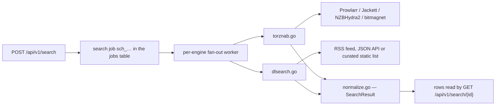

# 07 — Search and Indexers

> **Status:** draft
> **Last reviewed:** 2026-09-01
> **Audience:** implementing agent
> **Read this before:** T054, T055, T056, T057, T058, T059, T060, T061, T062, T063, T064, T105

## Purpose
Define the whole indexer subsystem: the Torznab/Newznab client, the `dlsearch/v1` declarative YAML
engine format, the `.dlm` and qBittorrent `.py` import paths, the normalised search-result model, and
the four bundled default engines. This file does not define HTTP endpoints, database columns or UI
layout.

## Scope of this document
- In scope: Torznab wire format, `dlsearch/v1` schema and limits, static import/conversion rules,
  `SearchResult` normalisation, bundled engine set, engine storage and provenance.
- Out of scope (lives instead in):
  - endpoint shapes, status codes, request/response JSON → [`05-api-contract.md`](05-api-contract.md)
  - `indexers` / `search_jobs` DDL → [`04-data-model.md`](04-data-model.md)
  - search screen, result grid columns, dialogs → [`09-web-ui-spec.md`](09-web-ui-spec.md)
  - SSRF dialer, secret encryption, archive-extraction rules → [`12-security-and-threat-model.md`](12-security-and-threat-model.md)
  - env vars → [`11-config-reference.md`](11-config-reference.md)
  - turning a result into a task → [`06-download-engines.md`](06-download-engines.md)

Implementation lives in `internal/search/`: `torznab.go`, `dlsearch.go`, `definition.go`,
`dlm_import.go`, `normalize.go`. Bundled definitions live in `definitions/engines/`.

---

## 1. Two-tier design

**dl-tool never executes third-party code.** No PHP, no Python, no Lua, no JavaScript, no shell, no
scripting runtime of any kind. Every extension point in this document is data that dl-tool *parses*.
See [ADR-0010](decisions/0010-never-execute-third-party-definitions.md).

| Tier | Mechanism | Role | Code path |
|---|---|---|---|
| Primary | Torznab/Newznab HTTP client | Speaks the ecosystem lingua franca; inherits Prowlarr, Jackett, NZBHydra2 and bitmagnet for free | `internal/search/torznab.go` |
| Secondary | `dlsearch/v1` declarative YAML | Covers sources that do not speak Torznab: RSS feeds, JSON APIs, curated static lists, and HTML result pages | `internal/search/dlsearch.go` |
| Import only | `.dlm` (Synology), `.py` (qBittorrent nova3) | Statically analysed, mechanically converted where possible, otherwise metadata-only and disabled | `internal/search/dlm_import.go` |



The search job model is asynchronous and copies Download Station's BT-search shape, which is the
shape its users already know: start a job, poll until `finished` is true, then delete it.
`POST /search` → `{id}`; `GET /search/{id}` → `{finished, total, results[]}`; `DELETE /search/{id}`.
Endpoint details: [`05-api-contract.md`](05-api-contract.md).

---

## 2. The Torznab/Newznab client

### 2.1 Endpoint shape

Every Torznab operation is one `GET` against a single base path, discriminated by `t=`:

```
GET {base}?t=caps&apikey=KEY
GET {base}?t=search&apikey=KEY&q=ubuntu&cat=4000,4020&limit=100&offset=0
GET {base}?t=tvsearch&apikey=KEY&q=Show+Title&season=1&ep=2&cat=5000
GET {base}?t=movie&apikey=KEY&imdbid=tt1234567&cat=2000
GET {base}?t=music&apikey=KEY&artist=Name&album=Title
GET {base}?t=book&apikey=KEY&author=Name&title=Title
```

Compare parameter names case-insensitively. Servers silently ignore unknown categories and unknown
extended attributes, so their absence is never an error.

| `t=` | Required | Optional parameters dl-tool sends |
|---|---|---|
| `caps` | `t` | `o=json\|xml` |
| `search` | `t`, `apikey` | `q`, `cat`, `limit`, `offset`, `extended`, `maxage`, `minsize`, `maxsize`, `sort` |
| `tvsearch` | `t`, `apikey` | `q`, `cat`, `limit`, `offset`, `season`, `ep`, `rid`, `tvdbid`, `tvmazeid` |
| `movie` | `t`, `apikey` | `q`, `cat`, `limit`, `offset`, `imdbid`, `genre` |
| `music` | `t`, `apikey` | `q`, `cat`, `limit`, `offset`, `artist`, `album`, `label`, `track`, `year`, `genre` |
| `book` | `t`, `apikey` | `q`, `limit`, `offset`, `title`, `author` |

Torznab 1.3 adds `tag` (comma-separated, `-` prefix excludes). Only `caps` and `search` are required
of a conforming server; `details`, `getnfo`, `get`, `comments`, `register`, `user` and friends are
newznab-only and normally answer `203 Function Not Available`. Do not implement them.

### 2.2 `t=caps` document

Fetch caps once per engine on save and on `POST /indexers/{id}/test`, then cache it in the
`indexers` row. Structure (Torznab 1.3 spec, verbatim shape):

```xml
<?xml version="1.0" encoding="UTF-8"?>
<caps>
   <server version="1.1" title="..." strapline="..." email="..." url="http://indexer.local/"
           image="http://indexer.local/content/banner.jpg" />
   <limits max="100" default="50" />
   <retention days="400" />
   <registration available="yes" open="yes" />
   <searching>
      <search available="yes" supportedParams="q" />
      <tv-search available="yes" supportedParams="q,rid,tvdbid,season,ep" />
      <movie-search available="no" supportedParams="q,imdbid,genre" />
      <audio-search available="no" supportedParams="q" />
      <book-search available="no" supportedParams="q" />
   </searching>
   <categories>
      <category id="2000" name="Movies"><subcat id="2010" name="Foreign" /></category>
      <category id="5000" name="TV">
         <subcat id="5040" name="HD" /><subcat id="5070" name="Anime" />
      </category>
   </categories>
   <groups><group id="1" name="alt.binaries...." description="..." lastupdate="..." /></groups>
   <genres><genre id="1" categoryid="5000" name="Kids" /></genres>
   <tags><tag name="internal" description="Uploader is an internal release group" /></tags>
</caps>
```

Parsing rules:
- If `supportedParams` is absent on a `<*-search>` element, fall back to the newznab defaults:
  `q,rid,season,ep` for `tv-search`, `q` for `search`.
- `available="no"` means dl-tool must not offer that mode for that engine.
- `<limits max>` caps the `limit` dl-tool may send; default to 100 when absent.
- Store the flattened `categories`/`subcat` tree; it feeds `GET /indexers/categories`. `groups`,
  `genres` and `tags` are parsed and stored but unused in v1.

### 2.3 Standard newznab category IDs

| Root | Name | Subcategories |
|---|---|---|
| 1000 | Console | 1010 NDS, 1020 PSP, 1030 Wii, 1040 XBox, 1050 XBox 360, 1060 Wiiware, 1070 XBox 360 DLC |
| 2000 | Movies | 2010 Foreign, 2020 Other, 2030 SD, 2040 HD, 2045 UHD, 2050 BluRay, 2060 3D |
| 3000 | Audio | 3010 MP3, 3020 Video, 3030 Audiobook, 3040 Lossless |
| 4000 | PC | 4010 0day, 4020 ISO, 4030 Mac, 4040 Mobile-Other, 4050 Games, 4060 Mobile-iOS, 4070 Mobile-Android |
| 5000 | TV | 5020 Foreign, 5030 SD, 5040 HD, 5045 UHD, 5050 Other, 5060 Sport, 5070 Anime, 5080 Documentary |
| 6000 | XXX | 6010 DVD, 6020 WMV, 6030 XviD, 6040 x264, 6050 Pack, 6060 ImgSet, 6070 Other |
| 7000 | Books | 7010 Mags, 7020 EBook, 7030 Comics |
| 8000 | Other | 8010 Misc |
| 9000–99999 | Reserved for future expansion | do not assign |
| 100000+ | Site-specific / custom, declared in the engine's caps | per engine |

"Add 100000 to the tracker's own id" is a Sonarr-wiki convention, **not** part of the newznab spec —
the spec only reserves `100000-` as a custom range and its own example uses `1000001`. Treat any id
≥ 100000 as opaque and engine-scoped. The nine user-facing category buttons map to roots exactly as
qBittorrent's `jackett.py` does; reuse it verbatim: `all` → no cat, `anime` → 5070, `books` → 8000,
`games` → 1000,4000, `movies` → 2000, `music` → 3000, `software` → 4000, `tv` → 5000.

### 2.4 Search response and `torznab:attr`

Real fixture (Sonarr repo, `torznab_hdaccess_net.xml`), private-tracker style with a `.torrent`
enclosure:

```xml
<?xml version="1.0" encoding="UTF-8" ?>
<rss version="1.0" xmlns:atom="http://www.w3.org/2005/Atom" xmlns:torznab="http://torznab.com/schemas/2015/feed">
  <channel>
    <title>HDAccess</title>
    <item>
      <title>Better Call Saul S01E05 Alpine Shepherd 1080p NF WEBRip DD5.1 x264</title>
      <guid isPermaLink="true">https://hdaccess.net/details.php?id=11515</guid>
      <link>https://hdaccess.net/download.php?torrent=11515&amp;passkey=123456</link>
      <comments>https://hdaccess.net/details.php?id=11515&amp;hit=1#comments</comments>
      <pubDate>Sat, 14 Mar 2015 17:10:42 -0400</pubDate>
      <category>HDTV 1080p</category>
      <size>2538463390</size>
      <enclosure url="https://hdaccess.net/download.php?torrent=11515&amp;passkey=123456"
                 length="2538463390" type="application/x-bittorrent" />
      <torznab:attr name="category" value="5000" />
      <torznab:attr name="category" value="5040" />
      <torznab:attr name="category" value="100009" />
      <torznab:attr name="seeders" value="7" />
      <torznab:attr name="peers" value="7" />
      <torznab:attr name="infohash" value="63e07ff523710ca268567dad344ce1e0e6b7e8a3" />
      <torznab:attr name="minimumratio" value="1.0" />
      <torznab:attr name="minimumseedtime" value="172800" />
      <torznab:attr name="imdb" value="3032476" />
      <torznab:attr name="tvdbid" value="273181" />
    </item>
  </channel>
</rss>
```

Public/magnet style (`torznab_tpb.xml`) instead carries
`type="application/x-bittorrent;x-scheme-handler/magnet"` on the enclosure plus
`<torznab:attr name="magneturl" value="magnet:?xt=urn:btih:…"/>`.

Full `torznab:attr` name enum (Sonarr `torznab.xsd`):

```
size, category, guid, poster, team, grabs, comments, year, season, episode, rageid, tvtitle,
tvairdate, video, audio, resolution, framerate, language, subs, imdb, imdbscore, imdbtitle,
imdbtagline, imdbplot, imdbyear, imdbdirector, imdbactors, genre, artist, album, publisher, tracks,
coverurl, backdropcoverurl, review, booktitle, publishdate, author, pages, type, tvdbid, bannerurl,
nzbhash, infohash, magneturl, seeders, leechers, peers, seedtype, minimumratio, minimumseedtime,
downloadvolumefactor, uploadvolumefactor
```

Torznab 1.3 additionally documents `files`, `tag`, `password` (0/1/2), `nfo` (0/1), `info`,
`tvmazeid`, `backdropurl`.

Parser rules — implement all of them in `torznab.go`:

| Rule | Detail |
|---|---|
| Ignore `<rss version>` | Jackett emits `2.0`, Prowlarr emits `1.0`. The attribute carries no meaning for dl-tool. |
| Size | `<torznab:attr name="size">` is the authoritative value; `<size>` is the widely emitted convenience copy. Read the attr first, fall back to the element. Bytes, always. |
| `category` repeats | Collect every occurrence into `category_ids[]`. `size` and `category` are the only non-optional predefined attrs. |
| Leechers | `peers = seeders + leechers`. When `leechers` is absent and `peers` is present, compute `leechers = peers - seeders`. When neither is present, leave both `null`. |
| Download target | Prefer `magneturl`; else `<enclosure url>`; else `<link>`. |
| Details page | `<comments>` when present, else `<guid>` when it is an absolute URL. |
| `pubDate` | RFC 1123 with numeric offset: Go layout `Mon, 02 Jan 2006 15:04:05 -0700`. |
| Volume factors | `downloadvolumefactor` 0 = freeleech, 0.5 = half; `uploadvolumefactor` 0 = neutral leech, 2 = double upload. Default both to `1.0`. |

### 2.5 Errors

Spec error XML, returned by conforming servers with HTTP 200:

```xml
<error code="200" description="Missing parameter (t)"/>
```

| Code | Meaning | dl-tool behaviour |
|---|---|---|
| 100, 101, 102 | Incorrect credentials, account suspended, insufficient privileges | mark the engine `error`, surface "check API key" |
| 200, 201, 900 | Missing parameter, incorrect parameter, unknown error | log and fail this engine only |
| 202, 203 | No such function, function not available | disable that mode for this engine |
| 300 | No such item | empty result set, not an error |
| 910 | API disabled | mark the engine `error` |

Prowlarr deviates and dl-tool must handle it: it returns real HTTP status codes, `400` with
`<error code="200"…>` for a missing `t`, `410 Gone` with `<error code="410" description="Indexer is
disabled"/>`, and `429` with a non-spec `<error code="429" …>` plus a `Retry-After` header for both
indexer backoff and the user's query limit. Honour `Retry-After`; treat `410` as "engine disabled
upstream", not as a transport failure.

### 2.6 Provider URL shapes

| Provider | Base URL to store | Notes |
|---|---|---|
| Jackett, single indexer | `http://127.0.0.1:9117/api/v2.0/indexers/<indexer-id>/results/torznab/api` | default port 9117 |
| Jackett, aggregate | `http://127.0.0.1:9117/api/v2.0/indexers/all/results/torznab/api` | categories ≥ 100000 unusable; total results capped at 1000 |
| Jackett, filtered | `http://127.0.0.1:9117/api/v2.0/indexers/tag:group1,!type:private+lang:en/results/torznab/api` | same limits as `all` |
| Prowlarr | `http://prowlarr:9696/<indexerId>/api` | default port 9696; routes are `{id:int}/api` and `/api/v1/indexer/{id}/newznab` |
| bitmagnet | `http://bitmagnet:3333/torznab/api` | no API key |

Add `&cache=false` to Jackett requests when the user ticks "bypass provider cache".

**IMPORTANT** Prowlarr indexer id `0` is a synthetic self-test indexer: `t=caps` returns every
standard category mapped to site id `1`, and any search returns one hard-coded release titled
`Test Release` pointing at `https://prowlarr.com`. Never store id `0` as a real indexer, and never
implement `POST /indexers/{id}/test` as "results were non-empty".

### 2.7 Adding a Prowlarr or Jackett instance as a provider

`POST /indexers/import` with `{torznab_url, api_key}` creates one `idx_…` row per upstream indexer,
not one row for the whole instance. Enumeration:

| Provider | Enumeration request | Parse |
|---|---|---|
| Jackett | `GET {host}/api/v2.0/indexers/all/results/torznab/api?apikey=KEY&t=indexers&configured=true` | one child element per configured indexer; build each per-indexer base URL as `{host}/api/v2.0/indexers/<id>/results/torznab/api` |
| Prowlarr | `GET {host}/api/v1/indexer` with `X-Api-Key: KEY` | JSON array; build each base URL as `{host}/<id>/api`; skip `id == 0` |

Then, for each discovered indexer: fetch `t=caps`, store the caps document, and create the row with
`enabled = false`. The user enables what they want. Encrypt the API key before writing it
(see [`04-data-model.md`](04-data-model.md) for the column, [`12-security-and-threat-model.md`](12-security-and-threat-model.md) for the scheme).

Provider hosts are normally private-network addresses on the same Compose network, so a Prowlarr or
Jackett engine record requires `allow_private_network: true`. This is the only routine reason to set
that flag.

---

## 3. `dlsearch/v1` — the declarative YAML engine format

One YAML file per engine. Bundled definitions are `definitions/engines/<id>.yaml` in the repository;
user-supplied definitions are `/config/engines/<id>.dlsearch.yaml`. Four `kind`s share one result
model. There are no expressions beyond the closed template set in §3.3 and no regex in URLs.

### 3.1 Field table

| Path | Type | Required | Rules |
|---|---|---|---|
| `dlsearch` | integer | yes | must equal `1` |
| `id` | string | yes | `^[a-z0-9][a-z0-9-]{1,63}$`, unique across bundled + user engines |
| `name` | string | yes | display name |
| `description` | string | yes | one or two sentences, shown in the engine list |
| `homepage` | string (URL) | yes | `http`/`https` only |
| `kind` | enum | yes | `torznab` \| `rss` \| `json` \| `html` \| `static` |
| `version` | string | yes | semver, used for update comparison |
| `legal_tier` | enum | yes | `legitimate` \| `user-supplied` |
| `maintainer` | string | no | free text |
| `license_note` | string | no | shown next to results |
| `allow_private_network` | boolean | no | default `false`; when `false` every resolved peer IP must be public |
| `caps.modes` | map | yes | keys `search`, `tv-search`, `movie-search`, `music-search`, `book-search`; each value is a list of supported query fields; `search` is mandatory |
| `caps.categories` | map | yes | site value → newznab id (integer) |
| `caps.seeders_unknown` | boolean | no | default `false`; `true` means the engine cannot report seeders |
| `settings[]` | list | no | `{name, type, label, default, options}`; `type ∈ {info, text, password, checkbox, select}` |
| `request.base_url` | string (URL) | yes for `rss`/`json`/`html` | `http`/`https` only; the whole `request` block is forbidden for `torznab` and `static` |
| `request.path` | string | no | appended to `base_url` |
| `request.method` | enum | no | `GET` only in v1 |
| `request.query` | map | no | values are templates (§3.3) |
| `request.headers` | map | no | values are templates; `Authorization` and `Cookie` are rejected |
| `request.rate_limit_per_minute` | integer | no | default `30`, hard maximum `120` |
| `request.timeout_seconds` | integer | no | default `20`, hard maximum `30` |
| `response.rows` | string | yes for `rss`/`json`/`html` | JSONPath (`json`), CSS selector (`html`), element path (`rss`); forbidden for `torznab` and `static` |
| `response.total` | string | no | same dialect as `rows`; absent means "count the rows" |
| `response.fields` | map | yes for `rss`/`json`/`html` | see below |
| `response.transforms` | map | no | field name → ordered list of ops (§3.4) |
| `entries[]` | list | yes for `static` | the curated result records, §3.8; forbidden for every other kind |
| `refresh_note` | string | yes for `static` | one line naming the event that invalidates `entries[]` and who refreshes it |

`response.fields.<name>` is one of `{path: …}`, `{path: …, attr: …}`, `{template: …}` or
`{const: …}`, plus optional `type`, `format`, `optional`, `default`. Field names beginning with `_`
are private temporaries usable from later `template` values.

Required fields: `title`, `size`, and at least one of `download` / `magnet` / `infohash`. Plus
`category`, unless every result maps to a single id via a one-entry `caps.categories`.

`type ∈ {string, int, float, bytes, datetime}`. `bytes` accepts `"1.4 GiB"`, `"1400000000"` and
plain integers. `datetime` needs `format ∈ {iso8601, rfc1123, unix, relative, strptime:<fmt>}`.

If `default` is set, `optional` must be `true`.

Unknown keys anywhere are a hard validation error (`additionalProperties: false`), matching how
Prowlarr validates Cardigann definitions.

### 3.2 Kinds

| `kind` | `response.rows` dialect | Parser |
|---|---|---|
| `torznab` | not used | §2 client. The whole definition is metadata plus two settings — `{name: base_url, type: text}` and `{name: api_key, type: password}` — and `caps.modes`; `response` is forbidden. |
| `rss` | element path, e.g. `rss > channel > item` | `github.com/mmcdole/gofeed` for feed shape, `encoding/xml` for extension elements |
| `json` | JSONPath, e.g. `$.response.docs` | `encoding/json` + a JSONPath evaluator |
| `html` | CSS selector | `github.com/PuerkitoBio/goquery`. User-supplied definitions only — **no bundled engine may use `kind: html`** (§6.1). |
| `static` | not used | no HTTP request at search time; `entries[]` is filtered in process. `request` and `response` are forbidden. |

`dlsearch/v1` has exactly one `request.path`, so a scraper that walks several directory indexes is not
expressible. `request.paths[]` and a dedicated directory-index kind are v2.

### 3.3 Template placeholders — a FIXED CLOSED SET

Templates are expanded by an explicit `switch` over these tokens in `internal/search/definition.go`.
There is no reflection, no arbitrary property access, no user-defined function, and no fallthrough to
`text/template`. Anything not in this table is a validation error at load time.

| Placeholder | Value |
|---|---|
| `{{ .Keywords }}` | the user's query string, already URL-unescaped |
| `{{ .Page }}` | 1-based page number |
| `{{ .Limit }}` | results requested for this page |
| `{{ .Offset }}` | `(.Page - 1) * .Limit` |
| `{{ .Categories }}` | list of site-side category values mapped from the requested newznab ids |
| `{{ .Query.<Field> }}` | one of `Q`, `Season`, `Ep`, `Year`, `Genre`, `IMDBID`, `IMDBIDShort`, `TMDBID`, `TVDBID`, `TVMazeID`, `Artist`, `Album`, `Label`, `Track`, `Author`, `Title`, `Publisher` |
| `{{ .Config.<setting> }}` | value of a declared `settings[].name`; a `checkbox` yields `true` or empty |
| `{{ .Result.<field> }}` | a field already resolved for the current row; fields resolve in declaration order |
| `{{ .Today.Year }}` | current year, four digits |

Control constructs: `{{ if <expr> }}…{{ else }}…{{ end }}` (the `else` branch is mandatory) and
`{{ range .Categories }}…{{ . }}…{{ end }}`.
Functions: `join`, `eq`, `ne`, `and`, `or`, `not`. Nothing else.

### 3.4 Transform ops — a FIXED CLOSED SET

`response.transforms.<field>` is an ordered list of `{op, args}`. The op set is closed — exactly
these twelve, dispatched by an explicit `switch`:

| Op | Args | Behaviour |
|---|---|---|
| `trim` | optional cutset | trims whitespace, or the given cutset |
| `lower` / `upper` | – | Unicode case fold |
| `html_decode` / `url_decode` | – | entity / percent decoding |
| `prepend` / `append` | string | template-expanded, then concatenated |
| `replace` | `[from, to]` | literal, all occurrences |
| `regex_capture` | pattern | returns **capture group 1 only** |
| `split` | `[sep, index]` | negative index counts from the end |
| `query_param` | name | reads one parameter out of a URL |
| `strip_html` | – | removes tags, keeps text |

There is no arbitrary regex substitution with backreference templates in v1.

### 3.5 Hard limits

Enforce every one of these in `internal/search/dlsearch.go`; they are not configurable per engine.

| Limit | Value | Reason |
|---|---|---|
| Response body cap | 8 MiB, enforced while streaming | a lying `Content-Length` must not bypass it |
| Selector/regex input cap | 2 MiB of parsed document | bounds parser and matcher cost |
| Redirects | 5 maximum, SSRF checks re-run on **every** hop | redirect-based SSRF bypass |
| Schemes | `http`, `https` only, including after redirect | |
| Ports | 80 and 443 only by default | |
| Rate limit | `request.rate_limit_per_minute`, default 30, maximum 120, per engine | politeness and back-off |
| Total deadline | 15 s per engine per search, including all redirects and parsing | one hostile definition cannot starve the pool |
| Results per page | 1000 maximum | matches Jackett's own per-indexer cap |
| Regex engine | Go `regexp` — RE2 semantics, linear time, **no backreferences, no lookaround** | ReDoS is structurally impossible |
| Regex pattern length | 512 bytes per `regex_capture` pattern | bounds compile cost |
| Template expansion | 64 KiB output, 1000 loop iterations, nesting depth 8 | bounds expansion |

Back off on HTTP 429 and 503 and honour `Retry-After`. Send an honest `User-Agent` identifying
dl-tool and its version. Never forward dl-tool session cookies to an engine.

### 3.6 Worked example — `kind: rss`

`definitions/engines/arch-linux.yaml`. Endpoint verified 2026-09-01: `https://archlinux.org/feeds/releases/`
returns `application/rss+xml` whose items carry
`<enclosure length="1597014016" type="application/x-bittorrent" url="https://archlinux.org//releng/releases/2026.08.01/torrent/"/>`.

```yaml
dlsearch: 1
id: arch-linux
name: Arch Linux Releases
description: "Monthly Arch Linux installation images, distributed as torrents by the Arch Linux project."
homepage: https://archlinux.org/
version: "1.0.0"
legal_tier: legitimate
kind: rss
caps:
  modes: {search: [q]}
  categories: {release: 4020}   # PC/ISO
  seeders_unknown: true
request:
  base_url: https://archlinux.org/
  path: feeds/releases/
  method: GET
  rate_limit_per_minute: 6
  timeout_seconds: 20
response:
  rows: "rss > channel > item"
  fields:
    title:     {path: "title"}
    details:   {path: "link"}
    published: {path: "pubDate", type: datetime, format: rfc1123}
    download:  {path: "enclosure", attr: "url"}
    size:      {path: "enclosure", attr: "length", type: bytes}
    category:  {const: "release"}
  transforms:
    title:
      - {op: trim}
```

The feed has no search parameter, so dl-tool fetches the whole feed and filters rows client-side by
`{{ .Keywords }}` against `title` (case-insensitive substring). Engines whose `request.query` never
references `{{ .Keywords }}` are automatically treated this way and labelled "browse" in the UI.

### 3.7 Worked example — `kind: json`

`definitions/engines/internet-archive.yaml`. Endpoint verified 2026-09-01:
`https://archive.org/advancedsearch.php?q=format%3A%22Archive+BitTorrent%22+AND+mediatype%3Atexts&fl[]=identifier&fl[]=title&fl[]=item_size&fl[]=btih&fl[]=publicdate&rows=2&output=json`
returns `application/json` with `"numFound": 46032028`. Per-item torrents follow the pattern
`https://archive.org/download/<id>/<id>_archive.torrent` (verified: `Euler_201701`, 1 610 B,
`application/x-bittorrent`).

```yaml
dlsearch: 1
id: internet-archive
name: Internet Archive
description: "Public-domain and openly licensed books, films, music and software, served as .torrent."
homepage: https://archive.org/
license_note: "Content licensing varies per item; check each item page."
version: "1.0.0"
legal_tier: legitimate
kind: json
caps:
  modes:
    search: [q]
    book-search: [q]
    movie-search: [q]
    music-search: [q]
  categories: {texts: 7000, movies: 2000, audio: 3000, software: 4000, image: 8010, data: 8000}
  seeders_unknown: true
settings:
  - name: title_only
    type: checkbox
    label: Search titles only
    default: true
  - name: sort
    type: select
    label: Sort by
    default: publicdate
    options: {publicdate: Newest, downloads: Most downloaded, item_size: Largest}
request:
  base_url: https://archive.org/
  path: advancedsearch.php
  method: GET
  rate_limit_per_minute: 30
  timeout_seconds: 20
  query:
    q: '{{ if .Config.title_only }}title:({{ .Keywords }}){{ else }}{{ .Keywords }}{{ end }} AND format:("Archive BitTorrent"){{ if .Categories }} AND mediatype:({{ join .Categories " OR " }}){{ else }}{{ end }}'
    "fl[]": "identifier,title,mediatype,item_size,downloads,btih,publicdate"
    sort: "-{{ .Config.sort }}"
    rows: "{{ .Limit }}"
    page: "{{ .Page }}"
    output: json
response:
  rows: "$.response.docs"
  total: "$.response.numFound"
  fields:
    _id:       {path: "identifier"}
    title:     {path: "title", optional: true, default: "Untitled {{ .Result._id }}"}
    category:  {path: "mediatype"}
    size:      {path: "item_size", type: bytes}
    published: {path: "publicdate", type: datetime, format: iso8601}
    infohash:  {path: "btih", optional: true}
    grabs:     {path: "downloads", optional: true, type: int}
    details:   {template: "https://archive.org/details/{{ .Result._id }}"}
    download:  {template: "https://archive.org/download/{{ .Result._id }}/{{ .Result._id }}_archive.torrent"}
  transforms:
    title:
      - {op: trim}
      - {op: html_decode}
```

The upstream Cardigann definition writes `seeders: {text: 1}`. dl-tool does not: it sets
`caps.seeders_unknown: true` and emits `seeders: null`. See §5.

### 3.8 Worked example — `kind: static`

A `static` engine carries its results inside the definition file. dl-tool makes **no HTTP request at
search time**: it filters `entries[]` in process by `{{ .Keywords }}` (case-insensitive substring over
`title`), so every `static` engine is browse-style in the UI. `request` and `response` are forbidden.

**Why the bundled `linux-distributions` engine is static and not a scraper.** The post-mortem of the
`.dlm` ecosystem in §4.1 is that per-site scrapers rot: the site changes its markup, the definition
silently returns zero rows, and the user blames the downloader. Shipping a scraper as a *default*
would contradict that finding. A curated list of the publishers' own torrent URLs cannot silently
mis-parse; it can only 404, which is loud, testable and fixed by a one-line edit. Scraping a
directory index is deferred to v2 together with `request.paths[]` (§3.2).

`entries[]` record fields — no templates, no transforms, no private `_` temporaries:

| Field | Type | Required | Rules |
|---|---|---|---|
| `title` | string | yes | shown verbatim; the client-side keyword filter matches against it |
| `download` | string (URL) | at least one of `download` / `magnet` / `infohash` | `https` only |
| `magnet` | string | see `download` | `magnet:` scheme |
| `infohash` | string | see `download` | 40 or 64 lowercase hex |
| `size` | bytes | no | default `0` = unknown, rendered `—` |
| `category` | string | yes | must be a key of `caps.categories` |
| `details` | string (URL) | no | `https` only |
| `published` | datetime | no | `format` as in §3.1 |

Limits: at most 500 `entries[]` per definition, and every URL is re-checked against the SSRF rules at
grab time, never trusted from the file. `POST /indexers/{id}/test` on a `static` engine validates the
definition and issues one request per distinct `download` URL, reporting each URL that no longer
resolves.

`definitions/engines/linux-distributions.yaml`:

```yaml
dlsearch: 1
id: linux-distributions
name: Linux Distributions
description: "Official Ubuntu and Debian installation-image torrents, curated per release."
homepage: https://releases.ubuntu.com/
version: "1.0.0"
legal_tier: legitimate
kind: static
refresh_note: "Refreshed by the maintainer on each Ubuntu and Debian point release."
caps:
  modes: {search: [q]}
  categories: {iso: 4020}       # PC/ISO
  seeders_unknown: true
entries:
  - title: "Ubuntu 24.04.4 LTS Desktop (amd64)"
    download: "https://releases.ubuntu.com/24.04/ubuntu-24.04.4-desktop-amd64.iso.torrent"
    details: "https://releases.ubuntu.com/24.04/"
    category: iso
    size: 0
  - title: "Ubuntu 24.04.4 LTS Live Server (amd64)"
    download: "https://releases.ubuntu.com/24.04/ubuntu-24.04.4-live-server-amd64.iso.torrent"
    details: "https://releases.ubuntu.com/24.04/"
    category: iso
    size: 0
  - title: "Debian 13.6.0 netinst (amd64)"
    download: "https://cdimage.debian.org/debian-cd/current/amd64/bt-cd/debian-13.6.0-amd64-netinst.iso.torrent"
    details: "https://cdimage.debian.org/debian-cd/current/amd64/bt-cd/"
    category: iso
    size: 0
```

<!-- UNVERIFIED: the three `download` URLs are constructed from directory indexes probed 2026-09-01
(`https://releases.ubuntu.com/24.04/` lists `ubuntu-24.04.4-desktop-amd64.iso.torrent` and
`ubuntu-24.04.4-live-server-amd64.iso.torrent`; `https://cdimage.debian.org/debian-cd/current/amd64/bt-cd/`
lists `debian-13.6.0-amd64-netinst.iso.torrent`). The `.torrent` files themselves were not fetched.
Re-probe each URL in T105 before shipping the definition. -->

Neither publisher exposes a size, seeder count or publication date next to the torrent, so `size: 0`
renders as an em dash exactly like a `null` seeder count, and `caps.seeders_unknown` is `true`.

### 3.9 Refreshing the curated list

Ubuntu and Debian rewrite these filenames at every point release, and Debian's `current/` path
repoints, so an unmaintained entry 404s. The refresh is a maintenance task, not a runtime feature —
definitions are never auto-downloaded (§7).

| Step | Action |
|---|---|
| Trigger | An Ubuntu release or point release, or a Debian point release. |
| 1 | Re-probe `https://releases.ubuntu.com/<version>/` and `https://cdimage.debian.org/debian-cd/current/amd64/bt-cd/` and read the current `*.iso.torrent` filenames. |
| 2 | Replace `entries[]` in `definitions/engines/linux-distributions.yaml` and bump `version` by one semver minor. |
| 3 | Run the definition fixture test, which asserts every entry parses, every `download` URL is unique, `https` and ends in `.torrent`, and every `category` is a declared `caps.categories` key. Target and command: [`13-testing-and-verification.md`](13-testing-and-verification.md). |
| 4 | Ship in the next image. Users on an older image keep the older list; nothing breaks except the removed URLs. |

---

## 4. Import paths

### 4.1 `.dlm` — Synology Download Station search module

Format, per the official *Synology Download Station Search Module Development Guide* (2011-03-14,
never revised): a `.dlm` is a **gzip-compressed tar archive**. The guide's own packing command is
`tar zcf mymodule.dlm INFO search.php` and its listing shows exactly two root members. "Exactly two
files" is a **convention of the guide's example, not a rule of the format**: `INFO.module` is
documented as "Usually It is `search.php`, but you can use other file names". The parser therefore
reads `INFO`, then the member named by `INFO.module`, and silently ignores any other member.

`INFO` is UTF-8 JSON:

```json
{
  "name": "mininova",
  "displayname": "mininova",
  "description": "The ultimate BitTorrent source!",
  "version": "1.0",
  "site": "http://www.mininova.org",
  "module": "search.php",
  "type": "search",
  "class": "SynoDLMSearchMininova"
}
```

| Key | Meaning | Status |
|---|---|---|
| `name` | unique module name; a duplicate name means DS refuses the install | mandatory |
| `displayname` | UI label; falls back to `name` | recommended |
| `description` | UI description | recommended |
| `version` | module version | mandatory |
| `site` | URL of the original search site | optional |
| `module` | filename of the PHP module inside the archive | mandatory |
| `type` | only `search` is supported | mandatory |
| `class` | PHP class name inside the module | mandatory |
| `accountsupport` | unlocks a 4-argument `prepare()` and a `VerifyAccount()` hook | <!-- UNVERIFIED: absent from the 2011 guide; observed only in third-party modules such as jackett.dlm v1.0.2. Which DSM introduced it is unknown. --> |

Tar-member validation rules — all mandatory, all enforced before any member is read:

| Rule | Action on violation |
|---|---|
| Upload size ≤ 1 MiB compressed | reject |
| Member count ≤ 16 | reject |
| Per-member uncompressed size ≤ 1 MiB; total uncompressed ≤ 4 MiB | reject |
| Member type must be a regular file | reject; never accept symlink, hardlink, device, FIFO or directory entries |
| Member name must not be absolute, must not contain `..`, must not contain `/` or `\` | reject |
| Member name must be valid UTF-8, ≤ 255 bytes | reject |
| `INFO` must be present and parse as a JSON object | reject |
| The member named by `INFO.module` must be present | reject |

Nothing is ever written to disk during import and nothing is ever executed. The PHP source is stored
as an inert blob on the engine record for the user to read in a "view source" pane.

**Static analysis, two mechanically convertible shapes:**

| Shape | Detection | Conversion |
|---|---|---|
| `addRSSResults` module | `parse()` body calls `addRSSResults`, and the class has one string literal containing `http` used as a URL prefix | emit `kind: rss`: the literal becomes `request.base_url` + `request.path`, and the query parameter it is concatenated with becomes `{{ .Keywords }}`; fields default to the RSS mapping in §4.3 |
| Torznab-proxy module (`jackett.dlm` shape) | `parse()` contains `simplexml_load_string` **and** the literal `torznab:attr` | emit `kind: torznab`: extract the URL template and its `<host>` / `<apikey>` / `<query>` placeholders, map `<host>` → the `base_url` setting and `<apikey>` → the `api_key` setting |

`jackett.dlm` is the canonical second case. Its URL template is
`http://<host>/api/v2.0/indexers/all/results/torznab/api?apikey=<apikey>&t=search&cat=&q=<query>`,
and it abuses Download Station's per-engine credential row so that **username = the Jackett host and
password = the Jackett API key**. Map them to `base_url` and `api_key` respectively and tell the user
that is what happened.

**Everything else** imports as **metadata-only and disabled**: `name`, `displayname`, `description`,
`version`, `site` become the engine record, `enabled = false`, and the UI shows
"This module contains custom PHP that dl-tool does not execute. Re-express it as a dl-tool YAML
engine." with the source visible read-only. There is no partial execution and no fallback.

Do not implement `.dlm` export.

### 4.2 `.dlm` `addResult` → Torznab → dl-tool field mapping

`addResult($title, $download, $size, $datetime, $page, $hash, $seeds, $leechs, $category)` is a
positional nine-tuple and is the canonical Download Station result record. Map it as:

| `.dlm` argument | Type per the guide | Torznab equivalent | dl-tool `SearchResult` field |
|---|---|---|---|
| `$title` | string | `<title>` | `title` |
| `$download` | string, "URL of the torrent file" | `<link>` / `enclosure@url` / `magneturl` | `download_url` |
| `$size` | integer or float | `<size>` / `torznab:attr size` | `size_bytes` (int) |
| `$datetime` | string, `"2010-12-30 13:20:10"` | `<pubDate>` RFC 1123Z | `published_at` (RFC 3339) |
| `$page` | string, details page URL | `<comments>` / `<guid>` | `details_url` |
| `$hash` | string, "The value could be empty string." | `torznab:attr infohash` | `infohash` (empty ⇒ `null`) |
| `$seeds` | integer | `torznab:attr seeders` | `seeders` |
| `$leechs` | integer | `peers - seeders` | `leechers` |
| `$category` | free string, "returned by server" | `torznab:attr category` (int) | `category_desc`, plus `category_ids[]` when it maps |

`addJsonResults($response, $resultKey, $fieldmapping)` uses the same nine names as map keys:
`title, download, hash, size, page, date, seeds, leechs, category`. `addRSSResults($response)` takes
the whole RSS body.

### 4.3 qBittorrent nova3 `.py` plugins — metadata only

Same posture, shorter path: parse the file, never run it, always import disabled.

| Extracted | How |
|---|---|
| Version | scan every line; strip **all** spaces; take the first line that starts with `#VERSION:` case-insensitively; the version is the remainder after 9 characters. Only 16 bytes per line are read upstream, so treat anything longer as absent. |
| `name` | string literal assigned to the class attribute `name` |
| `url` | string literal assigned to the class attribute `url` |
| `supported_categories` | dict literal assigned to that class attribute; keys are the nine friendly names `all, anime, books, games, movies, music, pictures, software, tv` |
| Class name | must equal the module name — qBittorrent resolves the plugin as `getattr(module, module_name)` |

Parse the Python with a literal-only reader: accept assignments of string, integer and dict literals
at class scope and nothing else. Never `exec`, never `eval`, never import the module. The result is
always an engine record with `enabled = false` and a message pointing the user at `dlsearch/v1`.

The qBittorrent project says of its own plugins: *"Install only from sources you trust, and review
the script before installing."* dl-tool removes that decision by never running them.
See [ADR-0010](decisions/0010-never-execute-third-party-definitions.md).

---

## 5. The normalised `SearchResult`

Every tier produces exactly this struct, in `internal/search/normalize.go`.

```go
type SearchResult struct {
    ID       string `json:"id"`        // row id within the search job
    EngineID string `json:"engine_id"` // idx_<ULID>
    Title    string `json:"title"`

    DownloadURL string `json:"download_url,omitempty"`
    MagnetURI   string `json:"magnet_uri,omitempty"`
    Infohash    string `json:"infohash,omitempty"`

    SizeBytes   int64   `json:"size_bytes"`
    Seeders     *int    `json:"seeders"`      // null when unknown
    Leechers    *int    `json:"leechers"`     // null when unknown
    Grabs       *int    `json:"grabs"`
    PublishedAt *string `json:"published_at"` // RFC 3339, null when unknown

    DetailsURL   string `json:"details_url,omitempty"`
    CategoryIDs  []int  `json:"category_ids"`
    CategoryDesc string `json:"category_desc,omitempty"`

    DownloadVolumeFactor float64  `json:"download_volume_factor"` // default 1.0
    UploadVolumeFactor   float64  `json:"upload_volume_factor"`   // default 1.0
    MinimumRatio         *float64 `json:"minimum_ratio"`
    MinimumSeedTimeSecs  *int     `json:"minimum_seed_time_seconds"`

    IMDBID string `json:"imdb_id,omitempty"`
    TMDBID string `json:"tmdb_id,omitempty"`
    TVDBID string `json:"tvdb_id,omitempty"`
    Year   *int   `json:"year"`
    // Genre, Language, Publisher, Author, Album, Artist: all string, all `omitempty`,
    // all snake_case JSON names, all populated only from the torznab:attr of the same name.
}
```

Normalisation rules — all five are mandatory:

1. **Leechers from peers.** When an engine reports `peers` but not `leechers`, set
   `leechers = peers - seeders`; `peers` means seeders + leechers, per the Torznab XSD comment
   `<!-- seeders + leechers -->`. When neither is present, both stay `null`.
2. **Null, never `-1`.** Unknown numeric fields are `null` in JSON and a nil pointer in Go. `-1` is
   qBittorrent's and Download Station's sentinel; dl-tool does not use it.
3. **Render an em dash.** The UI renders every `null` numeric cell as `—`.
   See [`09-web-ui-spec.md`](09-web-ui-spec.md).
4. **Never fabricate a seeder count.** The upstream `internetarchive.yml` writes `seeders: 1`, which
   corrupts sorting. Set `caps.seeders_unknown: true` on the engine, emit `null`, and grey out the
   seeders and leechers columns for that engine's rows.
5. **At least one acquisition handle.** A row with no `download_url`, no `magnet_uri` and no
   `infohash` is dropped and counted in the engine's error tally.

Deduplicate across engines by `infohash` when present, otherwise by `(normalised title, size_bytes)`;
keep the row with the highest `seeders` and list every engine that returned it. Adding a result to
the queue reuses `POST /tasks` and normal scheme routing
(see [`06-download-engines.md`](06-download-engines.md)); an `infohash`-only result becomes
`magnet:?xt=urn:btih:<infohash>&dn=<title>`.

---

## 6. Bundled engines and content policy

### 6.1 Policy

- Ship **zero** piracy indexers. Not disabled, not commented out — absent.
- Ship no "engine marketplace" and no pointer to any third-party definition repository.
- Bundle exactly four engines, all `legal_tier: legitimate`, all enabled by default.
- Adding any other engine is a deliberate, documented user action. Every imported engine is created
  with `enabled = false` and displays its provenance (§7).
- No bundled engine may use `kind: html`. A default that scrapes someone else's markup rots exactly
  the way the `.dlm` modules did (§4.1); the bundled set uses `torznab`, `rss`, `json` and `static`
  only.
- No telemetry and no phone-home update check for definitions.
- Honour politeness: per-engine rate limit, an honest `User-Agent`, back off on 429 and 503.

### 6.2 The four bundled engines

| id | kind | Verified endpoint (probed 2026-09-01) | Notes |
|---|---|---|---|
| `internet-archive` | `json` | `https://archive.org/advancedsearch.php` → 200 `application/json`, `"numFound": 46032028` torrent-bearing items; per-item torrent at `https://archive.org/download/<id>/<id>_archive.torrent` → 200 `application/x-bittorrent` | Highest-value default; real `btih`, `item_size`, `publicdate`. `seeders_unknown: true`. |
| `arch-linux` | `rss` | `https://archlinux.org/feeds/releases/` → 200 `application/rss+xml`; items carry `<enclosure length="…" type="application/x-bittorrent" url="…"/>` | Reference fixture for `kind: rss`. Browse-style feed, no query parameter. `seeders_unknown: true`. |
| `academic-torrents` | `rss` | `https://academictorrents.com/rss.xml` → 200 `text/xml`; items carry `<title>`, `<category>Dataset</category>`, `<infohash>`, `<guid>`, `<link>`, `<description>`, `<size>` — **no `<enclosure>`, no seeders**. Fetch via `https://academictorrents.com/download/<infohash>.torrent` → 200 `application/x-bittorrent` (verified with `dcb9178653b651c7ca4526e11fa8e22f74e2fd7a`) | `download` is templated from the infohash. Recent-items feed, so expose it as browse/latest. `seeders_unknown: true`. |
| `linux-distributions` | `static` | `https://releases.ubuntu.com/24.04/` → 200 HTML index containing `ubuntu-24.04.4-desktop-amd64.iso.torrent` and `ubuntu-24.04.4-live-server-amd64.iso.torrent`; `https://cdimage.debian.org/debian-cd/current/amd64/bt-cd/` → 200 HTML index containing `debian-13.6.0-amd64-netinst.iso.torrent` | Curated static list of those three torrent URLs (§3.8), **not** a scraper. No HTTP request at search time, no API key, no sizes, no seeders. Refreshed per release (§3.9); task T105. |

Sources deliberately **not** bundled because their machine-readable endpoints could not be confirmed
on 2026-09-01: Fedora (`https://torrent.fedoraproject.org/` renders client-side, no `.torrent` links
in the initial HTML), Linux Mint (`https://linuxmint.com/torrents/` → 404), Kiwix
(`https://download.kiwix.org/zim/wikipedia/` lists `.zim` but no `.torrent`), Tails
(`https://tails.net/torrents/files/` exists but the `.torrent` files are one level in — partially
verified only). Do not add engines for these without re-verifying the endpoint first.

### 6.3 bitmagnet — optional, external, never embedded

bitmagnet is a self-hosted BitTorrent DHT crawler with a local index that exposes a Torznab endpoint,
so from dl-tool's side it is an ordinary user-added Torznab provider at
`http://bitmagnet:3333/torznab/api` with no API key. dl-tool does **not** embed a DHT crawler:
DHT crawling is content-agnostic and would make dl-tool a piracy search engine by default.
Documentation ships as a commented-out Compose snippet the user must deliberately uncomment; see
[`10-deployment-and-compose.md`](10-deployment-and-compose.md).

| Property | Value (from the bitmagnet FAQ and its official compose file) |
|---|---|
| Image | `ghcr.io/bitmagnet-io/bitmagnet:latest` |
| Datastore | **PostgreSQL 16** required (`postgres:16-alpine`, `shm_size: 1g`) — a second database dl-tool itself refuses to have, see [ADR-0004](decisions/0004-sqlite-as-the-only-datastore.md) |
| Ports | 3333/tcp HTTP API, WebUI and Torznab; 3334/tcp and 3334/udp BitTorrent/DHT |
| Command | `worker run --all`, or selectively `--keys=http_server`, `--keys=queue_server`, `--keys=dht_crawler` |
| RAM | "around 300MB RAM for BitMagnet, and at least 1GB RAM for the Postgres database" |
| Disk | "roughly 80GB of disk space per 10 million torrents, which should suffice for several months of crawling"; the database "tends to grow indefinitely" |
| Crawl rate | "anything from 100 to 1,000 torrents per minute" |
| Seeder quality | "a BEP33 scrape request to provide a very rough estimate" — treat its seeder counts as advisory only |

<!-- UNVERIFIED: bitmagnet CPU usage is not stated in official documentation; community reports of
2-10% of an Apple M2 are low confidence and must not be quoted as a figure. -->

---

## 7. Storage, hot reload and provenance

| Concern | Rule |
|---|---|
| Bundled definitions | The four files in `definitions/engines/` are compiled into the binary with `//go:embed` and are read-only at runtime. A user cannot edit or delete them; they can disable them. |
| User definitions | `/config/engines/*.dlsearch.yaml`, bind-mounted. Validate on load; a schema error disables that one engine and surfaces the message in the UI — it never crashes the process or blocks the other engines. |
| Hot reload | Watch `/config/engines` and re-validate on change. A definition whose `id` collides with a bundled one is rejected with an explicit "id already in use" error. |
| Per-engine state | `enabled`, priority, settings values and secrets live in the `indexers` table, never in the YAML. Secrets are encrypted at rest, never logged and never returned by any API. See [`04-data-model.md`](04-data-model.md). |
| Imported engines | Always created with `enabled = false`, whatever the source. |
| Provenance | Every engine row records `source ∈ {bundled, file, url, dlm, qbt-py, torznab-provider}`, the original filename or URL, `legal_tier`, whether it was auto-converted, and the inert original blob. The engine list shows all of it, with a "view source" pane. |
| Export | Any engine can be exported as `.dlsearch.yaml` with secrets stripped. |
| Definition updates | No auto-download of definitions from any URL. Bundled definitions change only when the image is updated. |

---

## Decisions referenced
| ADR | Decision |
|---|---|
| [ADR-0008](decisions/0008-torznab-first-declarative-yaml-second.md) | Torznab first, declarative YAML engines second |
| [ADR-0010](decisions/0010-never-execute-third-party-definitions.md) | Never execute third-party definition code |
| [ADR-0004](decisions/0004-sqlite-as-the-only-datastore.md) | SQLite as the only datastore — cited for why bitmagnet's PostgreSQL stays external |

## Open questions
- [NEEDS CLARIFICATION: the `linux-distributions` `entries[]` list must be re-probed and, at each
  Ubuntu or Debian point release, refreshed by hand (§3.9). Confirm who owns that recurring task and
  whether CI should probe the three URLs on a schedule so a 404 is caught before a user hits it.]
- [NEEDS CLARIFICATION: `Prowlarr/Indexers` ships no LICENSE file and its content is machine-synced
  from GPLv2 Jackett. dl-tool vendors none of it and supports only the format, but a human should
  confirm that reading the schema to build `dlsearch/v1` raises no licensing concern.]
- [NEEDS CLARIFICATION: a Cardigann → `dlsearch/v1` importer is described in the research but is not
  in the M4 task range; confirm whether it is v1 scope or deferred.]

## Change log
| Date | Change |
|---|---|
| 2026-09-01 | Initial version |
| 2026-09-01 | Bundled `linux-distributions` changed from an HTML directory-index scraper to a curated `kind: static` list (§3.8) with a documented per-release refresh (§3.9); `static` added to the `dlsearch/v1` kind set; bundled engines forbidden from using `kind: html`; directory-index scraping and `request.paths[]` deferred to v2; ADR link slugs corrected to the canonical filenames. |
