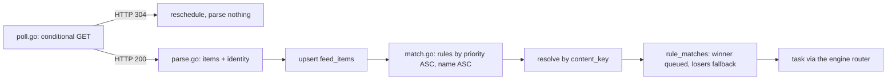

# 08 — RSS Automation

> **Status:** draft
> **Last reviewed:** 2026-09-01
> **Audience:** implementing agent
> **Read this before:** T065–T073, and any task under `internal/rss/`

## Purpose
Define how dl-tool polls RSS/Atom feeds, extracts a download URI from each item, evaluates rule documents
against those items, deduplicates grabs, and explains every decision in a dry run. It does not define HTTP
payloads, table columns or environment variables.

## Scope of this document
- In scope: feed polling schedule and etiquette, conditional GET, the backoff ladder, item parsing and the
  download-URI extraction ladder, the rule document schema, the fourteen-step matching algorithm, the
  rejection-reason enum, episode-filter syntax, smart-episode-filter semantics, the dedup ladder, the dry-run
  contract, and the feeds shipped as examples and fixtures.
- Out of scope (lives instead in): table columns and DDL → [`04-data-model.md`](04-data-model.md); request and
  response shapes, status codes → [`05-api-contract.md`](05-api-contract.md); URI normalisation and engine
  routing → [`06-download-engines.md`](06-download-engines.md); indexer search →
  [`07-search-and-indexers.md`](07-search-and-indexers.md); the rule editor and dry-run panel layout →
  [`09-web-ui-spec.md`](09-web-ui-spec.md); env vars → [`11-config-reference.md`](11-config-reference.md);
  Definition of Done → [`13-testing-and-verification.md`](13-testing-and-verification.md).

---

## 1. Subsystem map

Package `internal/rss/`, four files, no other package writes to `feeds`, `feed_items`, `rule_matches` or
`rule_seen_episodes`.

| File | Owns |
|---|---|
| `internal/rss/poll.go` | Scheduling, conditional GET, size cap, backoff ladder, feed row updates. |
| `internal/rss/parse.go` | RSS 2.0 / Atom decoding, the extraction ladder, identity, date fallback. |
| `internal/rss/match.go` | The fourteen-step algorithm, reason codes, scoring, per-run resolution. |
| `internal/rss/episode.go` | Episode-filter grammar, token semantics, smart-filter episode keys. |



Feed polling runs as a `jobs` row of kind `rss_poll`; the job queue is described in
[`04-data-model.md`](04-data-model.md#36-jobs-schedule-and-preferences).

---

## 2. Feed model and polling

### 2.1 Recommended defaults

Reproduce these values exactly; all are user-visible in Settings → RSS except the timeouts and response cap.

| Setting | Default | Rationale |
|---|---|---|
| Global poll interval | **30 min** | matches qBittorrent's `RSS/Session/RefreshInterval` = 30 |
| Minimum allowed interval | **5 min** | Sonarr's floor is 10; 5 is a safe hard floor for a self-hosted tool |
| Per-feed override | seconds, `0` = use global | qBittorrent's exact model (`feeds.refresh_interval_s`) |
| Jitter | **±10 %**, deterministic per feed (`hash(feed_id)`) | avoid thundering herd across many feeds and across many dl-tool installs |
| Effective interval | `max(configured, ttl_minutes*60, sy_implied_seconds, 300)` | never poll faster than the publisher asks |
| Timeout | connect 10 s, total 60 s | |
| Max response size | 16 MiB | a feed larger than this is a bug or an attack |
| Retries within a poll | 0 | let the backoff ladder handle it |
| Backoff | `[0, 60, 300, 900, 1800, 3600, 10800, 21600, 43200, 86400]` s, level ±1 | Sonarr, verbatim |
| Startup grace | 15 min before a feed can be auto-disabled | Sonarr, verbatim |
| `User-Agent` | `dl-tool/<version> (+https://github.com/L-K-M/dl-tool)` | identifiable and contactable |
| `Accept` | `application/rss+xml, application/atom+xml, application/xml;q=0.9, text/xml;q=0.9, */*;q=0.5` | |
| `Accept-Encoding` | `gzip, deflate` | |
| Max articles retained per feed | **50** (configurable, `0` = unlimited) | qBittorrent's `MaxArticlesPerFeed` = 50 (`feeds.item_cap`) |
| Concurrency | 4 feeds in parallel, **1 per host** | |

Jitter is deterministic, not random: `jitter = ((int64(fnv1a(feed_id)) % 2001) - 1000) / 10000.0`, giving a
stable value in `[-0.10, +0.10]` per feed. Compute `next_fetch_at = now + effective_interval * (1 + jitter)`.

### 2.2 Publisher hints feeding `effective_interval`

| Element | Namespace | Interpretation |
|---|---|---|
| `<ttl>` | RSS 2.0 core | **Minutes**, clamped to `[5, 1440]`. Stored in `feeds.ttl_minutes`. |
| `sy:updatePeriod` | `http://purl.org/rss/1.0/modules/syndication/` | `hourly=3600, daily=86400, weekly=604800, monthly=2592000, yearly=31536000` seconds; omitted ⇒ `daily`. |
| `sy:updateFrequency` | same | Positive integer; omitted ⇒ `1`. Implied interval = `period_seconds / updateFrequency`. |
| `<skipHours>` / `<skipDays>` | RSS 2.0 core | Honour when present: skip the poll and reschedule to the next allowed hour/day. `skipHours` values are `0..23` GMT; `skipDays` are `Monday`…`Sunday`. |

**IMPORTANT** BEP 36 redefines `<ttl>` as *seconds* while RSS 2.0 defines it as *minutes*. Real feeds
overwhelmingly mean minutes (`https://feeds.twit.tv/floss.xml` ships `<ttl>720</ttl>` = 12 h, which is only
sensible as minutes). Interpret `<ttl>` as **minutes** and clamp to `[5, 1440]`.

### 2.3 Conditional GET

Store both validators per feed and send whichever exist. `feeds.etag` and `feeds.last_modified` hold the
header values **verbatim**, including a weak `W/"…"` prefix — never strip the `W/`.

```http
GET /rss.xml HTTP/1.1
Host: academictorrents.com
User-Agent: dl-tool/1.0.0 (+https://github.com/L-K-M/dl-tool)
Accept: application/rss+xml, application/atom+xml, application/xml;q=0.9, text/xml;q=0.9, */*;q=0.5
Accept-Encoding: gzip, deflate
If-None-Match: W/"6a953dfc-9443"
If-Modified-Since: Mon, 31 Aug 2026 08:40:28 GMT
```

`304 Not Modified` ⇒ set `last_fetch_at` and `last_success_at`, decrement `escalation_level`, reschedule, and
parse nothing. Measured behaviour of the candidate feeds on 2026-09-01:

| Feed | `ETag` | `Last-Modified` | `If-None-Match` | `If-Modified-Since` |
|---|---|---|---|---|
| `https://academictorrents.com/rss.xml` | `W/"6a953dfc-9443"` | present | **304**, 0 bytes | **304**, 0 bytes |
| `https://feeds.twit.tv/floss.xml` | `"6a2c4ed7-5d091"` | present | **304**, 0 bytes | **304**, 0 bytes |
| `https://www.gutenberg.org/cache/epub/feeds/today.rss` | none | present | n/a | **304**, 0 bytes |
| `https://distrowatch.com/news/torrents.xml`, `https://librivox.org/rss/latest_releases` | none | none | n/a | n/a |

Roughly half of real feeds offer neither validator; the poller must work without them.

### 2.4 Failure handling

Copy Sonarr's escalation model exactly:

- `escalation_level` starts at `0`, **increments by one on failure and decrements by one on success** — it is
  never reset to zero.
- Clamp to `len(periods)-1 == 9`. `disabled_till = now + periods[level]`.
- A feed is *disabled until* a timestamp, not merely delayed: the scheduler skips any feed whose
  `disabled_till` is in the future.
- No feed may be auto-disabled within **15 minutes of process start**.
- `POST /feeds/{id}/refresh` bypasses `disabled_till` and the ladder; see
  [`05-api-contract.md`](05-api-contract.md#101-feeds).
- Store the failure text in `feeds.last_error`; clear it on success.

Every fetch of a feed URL, and of any `.torrent` URL taken from an item, goes through the SSRF guard in
`internal/secure/ssrf.go` — see [`12-security-and-threat-model.md`](12-security-and-threat-model.md).

---

## 3. Item parsing

Library: `github.com/mmcdole/gofeed` (version pinned by T004). Fetch the bytes yourself — timeout, 16 MiB cap,
User-Agent and SSRF guard stay under dl-tool's control — then hand the bytes to the parser.

### 3.1 Download-URI extraction ladder

Four tiers, evaluated per item. Tiers **A**, **B** and **D** reproduce qBittorrent's *actual* parser
behaviour (`rss_parser.cpp`, `parseRssArticle` + `addArticle`); tier **C** is dl-tool's addition, inserted
between tier B and tier D. A tier is consulted only when every earlier tier yielded nothing.

| Tier | Source | Selection rule |
|---|---|---|
| **A** | `enclosure[@type ^= "application/x-bittorrent"]/@url` **and** `<link>` whose value starts with `magnet:` (case-insensitive) | **Document order, last one wins.** The two are not ranked against each other — both write the same slot, so the element appearing **last inside the `<item>`** is the one kept. Two `x-bittorrent` enclosures behave the same way: the last, not the first. |
| **B** | `enclosure` whose `type` attribute is empty or absent | First such enclosure in document order. |
| **C** | The six synthesised sources listed below | First hit wins, in the listed order. |
| **D** | `<link>` (RSS) / `link[@rel="alternate"]/@href` or the first `<link>` (Atom), resolved against `xml:base`; then `<guid>` when `isPermaLink != "false"` and it looks like a URL | Last resort. |

Tier C, in order:

1. `torznab:attr[@name="magneturl"]/@value`.
2. `torznab:attr[@name="infohash"]/@value` → synthesise `magnet:?xt=urn:btih:<hash>&dn=<urlencoded title>`.
3. `<infohash>` child element (Academic Torrents ships this) → synthesise the same magnet.
4. `<torrent>/<magneturi>` or `<torrent>/<infohash>` (BEP 36).
5. `media:content/@url` where the URL ends in `.torrent`, or `media:hash[@algo="sha1"]` → magnet.
6. Atom `link[@rel="enclosure"]/@href` whose `type` qualified it for neither tier A nor tier B.

Torznab sets `type="application/x-bittorrent"` on the enclosure (the specification also permits
`application/x-bittorrent;x-scheme-handler/magnet`), so a Torznab item resolves in **tier A** and never
reaches tier C.

Where dl-tool deviates from qBittorrent, and where it deliberately does not:

| qBittorrent behaviour | dl-tool |
|---|---|
| Enclosure `type` compared with **exact string equality**, so `application/x-bittorrent;x-scheme-handler/magnet` qualifies for neither branch and the item is discarded entirely | Prefix match (`^=`), so both Torznab type strings qualify for tier A. |
| An `x-bittorrent` enclosure and a `magnet:` `<link>` overwrite each other; last in document order wins | **Copied verbatim** — tier A above. |
| No synthesis from Torznab attributes, `<infohash>` or BEP 36 elements | Added as tier C. |

An item that yields no URI at all is discarded and not stored (FR-072). Parse `<infohash>` and `<size>` by
**local name**, not qualified name: Academic Torrents declares `xmlns:academictorrents` but emits both
elements unprefixed.

### 3.2 Item identity fallback chain

Resolve `feed_items.identity` with the first non-empty value:

1. `<guid>` (RSS) or `<id>` (Atom), raw string, also stored in `feed_items.guid`.
2. The info-hash, from any source in §3.1, normalised to lowercase hex — 40 characters for a v1 hash, 64 for
   a v2 hash. Stored in `feed_items.info_hash`, which accepts either width.
3. The resolved download URI.
4. `sha1(title + "\x00" + feed_id)`, hex-encoded.

If all four are empty the item is unidentifiable — drop it. Within one fetch, keep a set of seen identities and
drop repeats before the upsert; `UNIQUE (feed_id, identity)` makes the upsert idempotent. DDL:
[`04-data-model.md`](04-data-model.md#35-rss).

### 3.3 Format coverage

| Format | What dl-tool reads |
|---|---|
| RSS 2.0 | `<title>`, `<link>`, `<guid isPermaLink>`, `<description>`, `<category>`, `<pubDate>`, `<enclosure url length type>`, `<ttl>`, `<skipHours>`, `<skipDays>`. |
| RSS 0.91 | `<title>`, `<link>`, `<description>` only — no `<guid>`, no `<pubDate>`. Identity falls to step 3 or 4. |
| Atom (RFC 4287) | `<id>`, `<title>`, `<updated>` (ISO 8601), `<summary>` or `<content>`, `link[@rel]`, `xml:base` for relative hrefs. Atom has no `<enclosure>`; the equivalent is `link[@rel="enclosure"]`. |
| BEP 36 | `<enclosure type="application/x-bittorrent">` is the primary carrier; `<torrent><infohash>`, `<torrent><magneturi>`, `media:content`, `media:hash` are the alternates. BEP 36 also recommends that `<guid>` be the info-hash so GUIDs match across feeds. |
| Torznab | `<torznab:attr name="…"/>` for `infohash`, `magneturl`, `size`, `seeders`, `leechers`, `peers`. Prefer `attr name="size"` over `enclosure/@length`, which the spec itself calls ambiguous (it may be 0, the `.torrent` size, or the media size). |

`<enclosure>` has three required attributes — `url`, `length` (bytes) and `type` (a MIME type). Treat `length`
as a hint only.

### 3.4 Dates and text

- Parse `<pubDate>` as RFC 822/1123 first. On failure fall back to a permissive parser that accepts
  `31/08/2026 18:47:19` (Linuxtracker emits exactly this). On a second failure use *now* and log at debug.
- Strip CDATA everywhere; LibriVox wraps every field, including `<pubDate>`, in CDATA.
- `feed_items.title_norm` = title lowercased, `.` and `_` replaced by a space, runs of whitespace collapsed,
  trimmed. It is the index for cheap near-duplicate lookups.

---

## 4. The rule document

One document, YAML in the editor and JSON in `rules.definition_json`. `POST /rules` carries it as a JSON
object in the `definition` member, never as a YAML string.

### 4.1 Schema

```yaml
name: "Ubuntu LTS ISOs"
enabled: true
priority: 10                  # lower number = evaluated first; ties broken by name
feeds:                        # empty/omitted = all enabled feeds
  - "https://distrowatch.com/news/torrents.xml"

match:
  mode: wildcard              # wildcard | regex | plain   (default: wildcard)
  case_sensitive: false       # default false, like qBittorrent, unlike Synology
  fields: [title]             # title | description | category  (default: [title])
  any_of:                     # OR across entries; each entry is AND across whitespace tokens
    - "ubuntu *desktop* amd64"
    - "kubuntu *amd64*"
  none_of:                    # OR: any hit rejects
    - "daily"
    - "*beta*"
  min_size: "1GiB"            # optional, parsed from enclosure length / torznab size
  max_size: "8GiB"
  published_after: "2026-01-01T00:00:00Z"   # optional absolute floor

episode:                      # optional; omit entirely for non-TV rules
  smart: false                # true => dedup by parsed (season,episode)/date key
  filter: "1x01-;"            # qBittorrent-compatible syntax
  allow_repack_proper: true

score:                        # optional Sonarr-style additive preferences
  minimum: 0
  formats:
    - { name: "prefer-64bit", pattern: "amd64|x86_64", weight: 20 }
    - { name: "avoid-rc",     pattern: "\\brc\\d?\\b",  weight: -100 }

action:
  destination: "/data/iso"
  category: "linux"
  paused: false
  content_layout: original    # original | subfolder | no_subfolder
  engine: "eng_01JKQ4..."     # optional; omit to use the routing table in 06

throttle:
  cooldown_days: 0            # qBittorrent's ignoreDays
  max_per_run: 5              # safety valve absent from every tool surveyed
```

### 4.2 Field reference

| Key | Type | Default | Meaning |
|---|---|---|---|
| `name` | string | — | Required, unique. Stored in `rules.name`, not inside the document. |
| `enabled` | bool | `true` | Disabled rules are skipped by the poller but still testable via the dry run. |
| `priority` | int | `0` | Evaluation order, ascending; ties broken by `name` ascending. Also the third sort key in per-run resolution. |
| `feeds` | string[] | `[]` | Feed URLs. Empty means every enabled feed. |
| `match.mode` | enum | `wildcard` | `wildcard` \| `regex` \| `plain`. Semantics in [`04-data-model.md`](04-data-model.md#46-rulesdefinition_json--matchmode). |
| `match.case_sensitive` | bool | `false` | When false, lowercase both haystack and patterns before compiling. |
| `match.fields` | string[] | `["title"]` | Any of `title`, `description`, `category`. Joined with `\n` to form the haystack. |
| `match.any_of` | string[] | `[]` | OR across entries. Empty passes. |
| `match.none_of` | string[] | `[]` | OR across entries; any hit rejects. Empty never rejects. |
| `match.min_size` | string | unset | IEC size, e.g. `1GiB`, `700MiB`. Compared against `feed_items.size_bytes`. |
| `match.max_size` | string | unset | As above. |
| `match.published_after` | RFC 3339 | unset | Absolute floor on `published_at`. |
| `episode.smart` | bool | `false` | Enable episode-key dedup (§6.3). |
| `episode.filter` | string | `""` | Grammar in §6.1. Empty passes everything. |
| `episode.allow_repack_proper` | bool | `true` | Allow one re-grab of an already-seen episode when the title contains `REPACK` or `PROPER`. |
| `score.minimum` | int | `0` | Reject when the summed weight is below this. |
| `score.formats[].name` | string | — | Label shown in the dry run. |
| `score.formats[].pattern` | string | — | Regex, always case-insensitive, matched against the haystack. |
| `score.formats[].weight` | int | — | Added once when the pattern matches. Negative values are outright vetoes when large enough to sink the total below `minimum`. |
| `action.destination` | string | server default | Absolute path under a configured data root. |
| `action.category` | string | `""` | Category name; must exist. |
| `action.paused` | bool | `false` | Create the task in `paused` state. |
| `action.content_layout` | enum | `original` | `original` \| `subfolder` \| `no_subfolder`. |
| `action.engine` | string | unset | Engine id. Omitted ⇒ the routing table in [`06-download-engines.md`](06-download-engines.md#2-routing-table) chooses. |
| `throttle.cooldown_days` | int | `0` | Skip items published within this many days of `rules.last_match_at`. |
| `throttle.max_per_run` | int | `0` | `0` = unlimited. Caps grabs committed by one rule in one poll cycle. |

### 4.3 Arrays, not pipe-splitting

qBittorrent stores `mustContain` as a **single string** that it splits on `|` only when `useRegex` is false.
dl-tool uses real arrays: `any_of` and `none_of` are JSON arrays and are never split on `|`.

That hack has two traps dl-tool therefore cannot reproduce: an empty expression always matches, so
`mustContain = "Ubuntu|"` matches everything, and — far worse — `mustNotContain = "web-dl|"`, the most natural
typo when editing an exclusion list, silently rejects **every** article. Reject empty strings inside `any_of`
and `none_of` at save time with `422`.

---

## 5. The matching algorithm

For each enabled rule, ordered by `(priority ASC, name ASC)`, over the candidate item set:

1. **Feed scope.** If `rule.feeds` is non-empty and `item.feed.url ∉ rule.feeds`, skip.
2. **Cooldown.** If `throttle.cooldown_days > 0` and `rule.last_match_at` is set and `item.published_at < rule.last_match_at + cooldown_days`, skip. (Exactly qBittorrent's `ignoreDays`.)
3. **Date floor.** If `match.published_after` is set and `item.published_at` is earlier, skip.
4. **Build the haystack.** Concatenate the configured `match.fields` with `\n`. Unless `case_sensitive`, lowercase both haystack and patterns.
5. **`none_of` (evaluate first — it is the cheap rejector).** For each entry: compile per `match.mode` (`wildcard` → fnmatch-to-regex, unanchored, `*`→`.*`, `?`→`.`; `regex` → as-is; `plain` → escaped literal). If **any** entry matches, reject `excluded`.
6. **`any_of`.** Empty ⇒ pass. Otherwise, for each entry: split on `\s+` into tokens (only in `wildcard`/`plain` mode — in `regex` mode the entry is one pattern), require **all** tokens to be found; the entry passes if all its tokens matched. The rule passes if **any** entry passed. Otherwise reject `no_match`.
7. **Size.** If `min_size`/`max_size` set and `item.size_bytes` is known, enforce; if the size is unknown, **pass** (do not reject on missing data).
8. **`episode.filter`.** If set, parse `^(\d{1,4})x(.*;)$`. Malformed ⇒ **reject the rule at save time with a validation error**, not silently at match time (this is dl-tool's improvement over qBittorrent). Then apply the token semantics of §6.2 against the item title.
9. **`episode.smart`.** Parse an episode key. No key ⇒ reject `unparseable_episode` (and surface that reason in the UI — qBittorrent's silent version of this confuses everyone). Key already in `rule_seen_episodes` ⇒ apply the REPACK/PROPER rules of §6.3, else reject `duplicate_episode`.
10. **Dedup ladder** (§7): identity → info-hash → content key.
11. **Score.** Sum the weights of every `score.formats` entry whose `pattern` matches the haystack. If `total < score.minimum`, reject `below_minimum_score`.
12. **Collect.** Do **not** grab yet.
13. **Per-run resolution.** Group all accepted candidates by `content_key`; within each group sort by `(score DESC, rule.priority ASC, feed_priority ASC, published_at DESC)` and grab only the winner. `feed_priority` is `feeds.priority` (default `0`, lower preferred); when two feeds carry the same content, the lower-priority feed's copy wins the group. Record the losers as `fallback` rows so a failed hand-off to the download client can be retried with the runner-up.
14. **Commit.** Insert `rule_matches`, insert `rule_seen_episodes`, set `rule.last_match_at = item.published_at`, enforce `throttle.max_per_run`.

Steps 1 and 3 remove an item from the candidate set before evaluation; they produce no reason code and the
item does not appear in a dry run's `results`. Losers from step 13 are written with
`rule_matches.status = 'fallback'` and the winner with `'queued'`, then `'sent'` once the task exists.

### 5.1 Rejection reason codes

Every rejection carries one of exactly these ten codes. The set is closed; the API repeats it but does not own
it — see [`05-api-contract.md`](05-api-contract.md#103-post-rulestest--the-dry-run).

| Code | Emitted by step | `reason_detail` example |
|---|---|---|
| `cooldown` | 2 | `cooldown_days=3, last_match_at=2026-08-30T00:00:00Z` |
| `excluded` | 5 | `none_of[0] = "daily"` |
| `no_match` | 6 | `any_of[1] token "amd64" not found` |
| `size` | 7 | `size_bytes=9663676416 > max_size=8GiB` |
| `episode_filter` | 8 | `no token of "2x5;9;12-14;" matched` |
| `unparseable_episode` | 9 | `smart filter found no season/episode in the title` |
| `duplicate_episode` | 9 | `episode_key "1x5" already seen for this rule` |
| `duplicate_infohash` | 10 | `infohash dcb9178653b651c7ca4526e11fa8e22f74e2fd7a already grabbed` |
| `already_have` | 10 | `content_key "tv:the-show:s01e05" already grabbed with score 40` |
| `below_minimum_score` | 11 | `score=-80 < minimum=0` |

### 5.2 Regex safety

Compile every user pattern with Go's `regexp` (RE2, no catastrophic backtracking). Still cap pattern length at
1024 bytes and `score.formats` at 32 entries, reject an uncompilable pattern at save time with `422`, and
report `elapsed_ms` on every dry run.

---

## 6. Episode filters

### 6.1 Syntax

```
<season:1-4 digits> "x" <token> ";" [ <token> ";" ]...
```

The whole filter must match `^(\d{1,4})x(.*;)$`. **The trailing `;` is mandatory.** Capture group 2 is split on
`;`; empty tokens are skipped, so the trailing empty element is harmless. Each token has leading zeros
stripped, keeping at least one character.

dl-tool also **normalises the season** by stripping its leading zeros at parse time. qBittorrent does not: it
interpolates the raw captured season into the single-number branch, so `01x05;` compiles to a pattern that
matches `Show.S01E05` but **cannot** match `Show 1x05`, silently halving the rule's coverage. Normalising
removes that trap.

### 6.2 Token forms

| Token | Meaning | Matching |
|---|---|---|
| `5` | exactly S{season}E5 | regex `\b(?:s0?{S}[ -_\.]?e0?{E}\|{S}x0?{E})(?:\D\|\b)` |
| `12-14` | episodes 12..14 of that season | parse `(season, episode)` from the title, require `seasonTheirs == seasonOurs && 12 <= epTheirs <= 14` |
| `01-` | episode 1 onward, **and every later season** | `(seasonTheirs == seasonOurs && episodeTheirs >= episodeOurs) \|\| seasonTheirs > seasonOurs` |

For range tokens parse the title with, in order:

```
partialPattern1 = \bs0?(\d{1,4})[ -_\.]?e(0?\d{1,4})(?:\D|\b)
partialPattern2 = \b(\d{1,4})x(0?\d{1,4})(?:\D|\b)
```

An inverted range such as `14-12` is skipped, not an error: it neither matches nor fails the rule.

### 6.3 Worked examples

| `episode.filter` | Item title | Result | Why |
|---|---|---|---|
| `1x01-;` | `Show.S01E01.1080p` | match | infinite range, S1E1 ≥ S1E1 |
| `1x01-;` | `Show.S03E07.1080p` | match | `seasonTheirs(3) > seasonOurs(1)` |
| `1x01-;` | `Show 1x00 Pilot` | reject `episode_filter` | ep 0 < 1 |
| `2x5;9;12-14;` | `Show.S02E09` | match | single-number token `9` → `s0?2[ -_.]?e0?9` |
| `2x5;9;12-14;` | `Show 2x13` | match | range token, `12 ≤ 13 ≤ 14`; `Show.S03E13` would fail on the season |
| `1x;` | anything | reject `episode_filter` | group 2 is `";"` ⇒ every token empty ⇒ nothing can match |
| `1x01` | — | **422 at save time** | no trailing `;`; qBittorrent would accept it and match nothing |
| `01x05;` | `Show 1x05` | match | dl-tool normalises the season; qBittorrent would miss this |
| `` (empty) | anything | pass | an empty filter is a no-op |

### 6.4 Smart episode filter

`episode.smart: true` enables key-based dedup. Compute the key from the title with these four patterns, joined
into one case-insensitive alternation `(?:_|\b)(?:P1|P2|P3|P4)(?:_|\b)`:

```
s(\d+)e(\d+)                        # Format 1: s01e01
(\d+)x(\d+)                         # Format 2: 01x01
(\d{4}[.\-]\d{1,2}[.\-]\d{1,2})     # Format 3: 2017.01.01
(\d{1,2}[.\-]\d{1,2}[.\-]\d{4})     # Format 4: 01.01.2017
```

Key construction: take capture groups `1..n`, skip empties, convert numeric captures with an integer parse
(this **strips leading zeros**), keep non-numeric captures verbatim, and join with the literal character `x`.

Worked keys: `Show.S01E05.1080p` → `1x5`, `Show 1x05 1080p` → `1x5`, `Show.2017.01.01` → `2017.01.01`. The
first two collapsing to one key is the entire point: two notations of one episode dedup against each other.
Decision table once a key exists:

| Condition | Outcome |
|---|---|
| `episode.smart == false` | Step 9 is a no-op. |
| No key parsed | Reject `unparseable_episode`. Turning the smart filter on therefore rejects everything that is not TV-shaped — say so in the UI. |
| Key not in `rule_seen_episodes` | Accept; stage the key. |
| Key seen, `allow_repack_proper == false` | Reject `duplicate_episode`. |
| Key seen, title contains neither `REPACK` nor `PROPER` (case-insensitive) | Reject `duplicate_episode`. |
| Key seen, title is a REPACK or PROPER | Build `key + "-REPACK"` / `key + "-PROPER"`; if that variant is already stored, reject `duplicate_episode`, else accept and stage it. A title that is both stages `key-REPACK` **and** `key-PROPER` so neither can be grabbed later. |

Staged keys are committed only in step 14. Storing them as `rule_seen_episodes` rows instead of an array
inside the rule fixes qBittorrent's unbounded `previouslyMatchedEpisodes` list, which is never pruned.

---

## 7. Dedup

Three keys, checked in this order at step 10. Each is cheaper and less authoritative than the next is
expensive and more authoritative.

| Order | Key | Table and column | Effect on a hit |
|---|---|---|---|
| 1 | Feed item GUID, resolved through the identity chain of §3.2 | `feed_items.identity`, unique with `feed_id` | The item is not new. It is never re-evaluated in a poll cycle, so no reason code is produced. |
| 2 | BitTorrent info-hash, lowercase hex, **40 characters (v1) or 64 characters (v2)** | `feed_items.info_hash` for the item and `rule_matches.info_hash` (unique partial index) for the grab — both columns accept either width | Reject `duplicate_infohash`. This is the only cross-feed authoritative check. |
| 3 | Normalised episode / content key | `rule_seen_episodes.episode_key` (per rule) and `rule_matches.content_key` (global) | Reject `duplicate_episode` (step 9) or `already_have` (step 10) unless the new release beats the stored one on score. |

The DDL, indices and retention policy for `feeds`, `feed_items`, `rules`, `rule_matches` and
`rule_seen_episodes` are owned by [`04-data-model.md`](04-data-model.md#35-rss); do not restate them here.

Info-hash comparison rules for step 2, all inherited from the widened columns:

- Normalise at ingest before comparing: a 32-character base32 `xt=urn:btih:` value is decoded to 20 bytes and
  hex-encoded, and `xt=urn:btmh:1220<64 hex>` yields the v2 hash. The full table is in
  [`04-data-model.md`](04-data-model.md#33-tasks).
- Compare a 40-hex value against `tasks.infohash_v1` and a 64-hex value against `tasks.infohash_v2`. **Never
  truncate a 64-hex v2 hash to 40 characters to make a comparison work.**
- A hybrid release announced by one feed as a v1 magnet and by another as a v2 magnet therefore collides on
  whichever hash both carry, and produces one `duplicate_infohash` rejection instead of two tasks.

Back-fill rule: when an item was grabbed from a `.torrent` URL with no known info-hash, write
`rule_matches.info_hash` once the metainfo is parsed — the v2 hash for a v2 or hybrid torrent, the v1 hash
otherwise; the unique partial index then makes a later magnet-only item for the same content collide
naturally.

Do **not** dedup on the download URL: Download Station does, and rotating passkeys or CDN paths make it
re-download the same item forever (Jackett issue 13312).

---

## 8. Dry run

Endpoint and payloads are owned by
[`05-api-contract.md`](05-api-contract.md#103-post-rulestest--the-dry-run): `POST /rules/test` takes an
**unsaved** rule document plus optional `feeds`, `limit` (default 200 items per feed, newest first) and
`ignore_state` (default `true`), and returns every evaluated item — matched and unmatched — with `matched`,
`score`, `matched_by`, `reason` and `reason_detail`. It creates nothing and stores nothing.

Behavioural contract the rule engine must satisfy:

- `ignore_state: true` bypasses `rule_matches` and `rule_seen_episodes` entirely, so repeated calls over an
  unchanged item set return byte-identical results while the user edits.
- `reason_detail` names the responsible clause **and its index** (`none_of[0]`, `any_of[1]`), so the editor can
  point at one input.
- Evaluation must be side-effect free and safe to call with an invalid rule; a bad regex or a malformed
  `episode.filter` returns `422`, never a panic.

UI requirements, in priority order (layout lives in [`09-web-ui-spec.md`](09-web-ui-spec.md)):

1. **Live re-evaluation as the user types**, debounced 250 ms. No Save button in the loop.
2. **Show non-matches too**, each with its reason code and the exact pattern index responsible. Showing only
   matches — qBittorrent's `matchingArticles` — leaves users guessing why something was skipped.
3. **Highlight the matched substring** inside the title, using the offsets the engine returns.
4. **"Ignore already-downloaded" toggle**, bound to `ignore_state`; without it dedup hides every item on a rule
   the user is editing.
5. **"Apply to existing items"** action on save, with a count and a confirmation, calling
   `POST /rules/{id}/run`. Download Station cannot do this at all: its Download Filter "only works for
   newly-added feeds", which is its single biggest usability complaint.
6. Show `evaluated`, `matched` and `elapsed_ms` so a pathological rule is visible immediately.

---

## 9. Feeds shipped as examples and used in tests

All probed with `curl` on 2026-09-01. The first three are offered in the "Add feed" dialog as one-click
examples; all eight are golden fixtures in `internal/rss/testdata/`.

| # | Feed URL | Format | Torrent link? | Conditional GET | Why it is in the set |
|---|---|---|---|---|---|
| 1 | `https://archlinux.org/feeds/releases/` | RSS 2.0 | Yes — `<enclosure type="application/x-bittorrent" length="…" url="…"/>` | not probed | Extraction ladder tier A; the M5 exit criterion feed and the happy-path fixture. |
| 2 | `https://distrowatch.com/news/torrents.xml` | RSS 2.0 | Yes — `<link>`/`<guid>` are direct `.torrent` URLs | none | Extraction ladder tier D, and the dry-run example. |
| 3 | `https://academictorrents.com/rss.xml` | RSS 2.0 + `xmlns:academictorrents` | Yes — `<infohash>` element ⇒ synthesised magnet | **ETag + Last-Modified, both 304** | Extraction ladder tier C source 3, and the conditional-GET test. |
| 4 | `https://linuxtracker.org/rss.php` | RSS 2.0 | No — `<link>` is a details page | none (`no-store`) | Hostile-feed fixture: no `<guid>`, non-RFC-822 `<pubDate>`. |
| 5 | `https://www.gutenberg.org/cache/epub/feeds/today.rss` | **RSS 0.91** | No | Last-Modified, **304** | Degenerate feed: no `<guid>`, no `<pubDate>`. |
| 6 | `https://librivox.org/rss/latest_releases` | RSS 2.0 | No | none (`no-store`) | Every field wrapped in CDATA, `<pubDate>` included. |
| 7 | `https://feeds.twit.tv/floss.xml` | RSS 2.0 | No (audio) | **ETag + Last-Modified, both 304** | Ships `<ttl>720</ttl>` and a real non-BitTorrent `<enclosure>`. |
| 8 | `https://linuxunplugged.com/rss` | RSS 2.0 | No (audio) | none observed | 9.2 MB — the 16 MiB cap and streaming-parser test. |

Feed 2 items are `<title>`, `<description/>`, RFC-822 `<pubDate>`, and a `<link>` and `<guid>` both holding the
same direct `.torrent` URL — extraction ladder tier D, identity step 1.

Golden item, feed 3, for the info-hash path — note `<infohash>` and `<size>` are **unprefixed**:

```xml
<item>
<title>Results - Energy Landscape Controllers for XX Spin Rings - Robustness</title>
<category>Dataset</category>
<infohash>dcb9178653b651c7ca4526e11fa8e22f74e2fd7a</infohash>
<guid>https://academictorrents.com/details/dcb9178653b651c7ca4526e11fa8e22f74e2fd7a</guid>
<link>https://academictorrents.com/details/dcb9178653b651c7ca4526e11fa8e22f74e2fd7a</link>
<description>This is a dataset to investigate the robustness of energy landscape controllers…</description>
<size>71000122956</size>
</item>
```

Expected: `magnet:?xt=urn:btih:dcb9178653b651c7ca4526e11fa8e22f74e2fd7a&dn=Results+-+Energy+Landscape+…`,
`size_bytes = 71000122956`.

Feed 4's items are `<title>` and `<description>` in CDATA, a details-page `<link>` such as
`https://linuxtracker.org/index.php?page=torrent-details&id=c3d56614025a6899a23dfe3de66a483dee59b2a8`, and
`<pubDate>31/08/2026 18:47:19</pubDate>`. Expected behaviour: the date parses only through the permissive
fallback, identity falls to the download URI, and the 40-hex `id` query parameter is recognised as an
info-hash by `(?i)\b[0-9a-f]{40}\b`.

Ship **zero** piracy feeds — not disabled, not commented out, absent. Every feed above is a publisher's own
distribution or a public-domain catalogue.

---

## Decisions referenced
| ADR | Decision |
|---|---|
| [ADR-0001](decisions/0001-control-plane-over-existing-engines.md) | Build a control plane over existing download engines |
| [ADR-0005](decisions/0005-aria2-qbittorrent-ytdlp-engines.md) | aria2, qBittorrent and yt-dlp as the v1 engines — a rule's action routes to any of them |
| [ADR-0009](decisions/0009-native-cross-protocol-rss-rules.md) | A native cross-protocol RSS rule engine, not a qBittorrent `rss/*` passthrough |
| [ADR-0010](decisions/0010-never-execute-third-party-definitions.md) | Never execute third-party definition code — rule documents are data, never scripts |
| [ADR-0015](decisions/0015-db-backed-in-process-job-queue.md) | DB-backed in-process job queue — feed polls are `rss_poll` jobs |

## Open questions
- [NEEDS CLARIFICATION: no Go equivalent of Python's `guessit` is pinned, so step 9 computes episode keys from
  the four regexes in §6.4 only. Titles using none of those four notations are rejected
  `unparseable_episode`. Confirm that is acceptable for v1 or allocate a task to add a richer parser.]
- (resolved 2026-09-01: `feed_priority` is `feeds.priority`, added to the DDL in
  [`04-data-model.md`](04-data-model.md) §3.5 and to the feed object in
  [`05-api-contract.md`](05-api-contract.md) §10.1.)
- [NEEDS CLARIFICATION: `content_key` construction is unspecified for non-TV content. §7 assumes a form like
  `tv:the-show:s01e05`; a rule with no `episode` block currently has no content key, so step 13 degenerates to
  one group per item.]
- Download Station's RSS update-interval dropdown values are UNVERIFIED; its documented default is
  "updates the lists of RSS feeds on a daily basis". dl-tool's 30-minute default is taken from qBittorrent
  instead and does not need to match.
- Feed behaviours in §9 were observed on 2026-09-01 and may drift; the fixtures are committed bytes, so tests
  never re-fetch.

## Change log
| Date | Change |
|---|---|
| 2026-09-01 | Initial version |
| 2026-09-01 | §3.1 rebuilt as the four-tier extraction ladder matching qBittorrent's actual parser: an `application/x-bittorrent` enclosure and a `magnet:` `<link>` are document-order last-wins (tier A), then an empty- or absent-type enclosure (tier B), then dl-tool's synthesised sources (tier C), then `<link>`/`<guid>` (tier D); noted that Torznab enclosures resolve in tier A. Identity step 2 and the §7 dedup ladder now use the widened 40-or-64-hex `feed_items.info_hash` and `rule_matches.info_hash` columns, with the v1/v2 comparison and back-fill rules. §10 references retargeted to the tier names. ADR link filenames corrected to the canonical slugs. |
| 2026-09-01 | Removed the qBittorrent `rules.json` importer section and its mention in the scope list: brief §18 cuts the migration subsystem, so no rule importer exists. Renumbered the former §10 to §9. Corrected the `POST /rules/test` anchor to `#103-post-rulestest--the-dry-run`. |
| 2026-09-01 | Closed the `feed_priority` open question: it is `feeds.priority` (`04-data-model.md` §3.5), default 0, lower preferred. |
