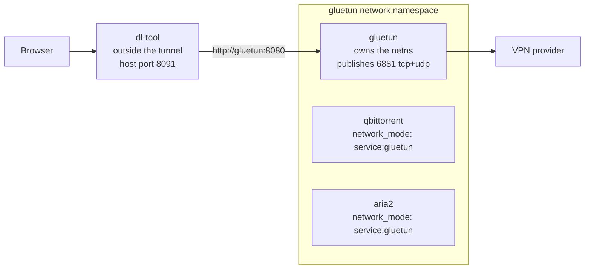

# 10 — Deployment and Compose

> **Status:** draft
> **Last reviewed:** 2026-09-01
> **Audience:** implementing agent
> **Read this before:** T001–T005, T093–T097, T099, T113, T115, and any task touching `compose.yaml`, `Dockerfile`, `deploy/` or `.github/workflows/release.yml`

## Purpose
Define the shipped container topology: service names, ports, volumes, compose profiles, the image build, the
release pipeline, reverse-proxy configuration, the optional VPN profile and NAS constraints. It does not
define environment-variable semantics, HTTP shapes or operator runbooks.

## Scope of this document
- In scope: `compose.yaml`, `.env.example`, the `/config` and `/data` volume layout, PUID/PGID/UMASK/TZ,
  the multi-stage `Dockerfile`, `deploy/aria2/Dockerfile`, `.github/workflows/release.yml`, Caddy and Traefik,
  base-path requirements, the `vpn` profile, resource limits, update and rollback policy, NAS specifics.
- Out of scope (lives instead in): the env var table → [`11-config-reference.md`](11-config-reference.md);
  endpoints and payloads → [`05-api-contract.md`](05-api-contract.md); engine wire protocols →
  [`06-download-engines.md`](06-download-engines.md); DDL → [`04-data-model.md`](04-data-model.md);
  threat model → [`12-security-and-threat-model.md`](12-security-and-threat-model.md); backup, restore,
  diagnostics and symptom→fix tables → [`17-operations-and-runbook.md`](17-operations-and-runbook.md);
  one-time migration from an existing Download Station or qBittorrent →
  [`15-migration-and-import.md`](15-migration-and-import.md).

---

## 1. Service inventory

Compose project name `dl-tool`. Service names are stable identifiers — DNS names on the compose network,
`depends_on` targets and `docker compose <cmd> <service>` arguments all use them.

| Service | Image | Profile | Container ports | Published | Purpose |
|---|---|---|---|---|---|
| `dl-tool` | `ghcr.io/l-k-m/dl-tool:1` | none (always on) | `8080` HTTP, `9090` metrics | `${DLTOOL_PORT:-8091}:8080` | Web UI, REST API, scheduler, jobs, yt-dlp subprocesses |
| `qbittorrent` | `lscr.io/linuxserver/qbittorrent` | none (always on) | `8080` WebUI, `6881` tcp+udp | `6881` only | BitTorrent engine |
| `aria2` | `ghcr.io/l-k-m/dl-tool-aria2:1` | `aria2` | `6800` JSON-RPC | none | HTTP/FTP/SFTP/Metalink engine |
| `gluetun` | `qmcgaw/gluetun` | `vpn` | owns a network namespace | see §8 | VPN egress and killswitch for the engines |
| `caddy` | `caddy:2` | `proxy` | `80`, `443` | `80`, `443` | TLS termination and reverse proxy |

Rules:

- Engine WebUI and RPC ports are **never published**; only `dl-tool` reaches them, over the compose network.
  The metrics listener binds `127.0.0.1:9090` in-container and is likewise not published.
- `6881/tcp` and `6881/udp` must be published and port-forwarded on the router, or BitTorrent gets
  connections only from peers that can reach out.
- There is **no `postgres` service and no `postgres` profile**; SQLite in `/config/dl-tool.db` is the only
  datastore ([ADR-0004](decisions/0004-sqlite-as-the-only-datastore.md)).
- `dl-tool` is profile-less, so every service it names in `depends_on` must be profile-less too: Compose
  requires a dependency behind a profile to be "in the same profile, started separately, or not assigned to
  any profile". That is why `dl-tool` depends on `qbittorrent` but **not** on `aria2`.

```bash
docker compose up -d                                  # dl-tool + qbittorrent
COMPOSE_PROFILES=aria2 docker compose up -d           # + aria2
docker compose --profile aria2 --profile proxy up -d  # + aria2 + caddy
```

---

## 2. `compose.yaml`

Ships at the repository root. No top-level `version:` key: Compose V2 warns "the attribute `version` is
obsolete, it will be ignored". Fragments use the **mapping** form for `environment:` because YAML merge
"only applies to mappings, and can't be used with sequences".

```yaml
# compose.yaml — dl-tool reference stack
#   docker compose up -d                          core: dl-tool + qbittorrent
#   COMPOSE_PROFILES=aria2 docker compose up -d   + the HTTP/FTP engine
#   COMPOSE_PROFILES=aria2,vpn,proxy docker compose up -d

x-common-env: &common-env
  PUID: "${PUID:-1000}"
  PGID: "${PGID:-1000}"
  TZ: "${TZ:-Etc/UTC}"
  UMASK: "${UMASK:-002}"

x-service-defaults: &service-defaults
  restart: unless-stopped
  security_opt:
    - no-new-privileges:true

services:

  dl-tool:
    <<: *service-defaults
    image: ghcr.io/l-k-m/dl-tool:1
    container_name: dl-tool
    environment:
      <<: *common-env
      DLTOOL_HTTP_ADDR: ":8080"
      DLTOOL_CONFIG_DIR: "/config"
      DLTOOL_DATA_ROOTS: "/data"
      DLTOOL_DB_PATH: "/config/dl-tool.db"
      DLTOOL_BASE_PATH: "${DLTOOL_BASE_PATH:-}"
      DLTOOL_TRUSTED_PROXIES: "${DLTOOL_TRUSTED_PROXIES:-}"
      DLTOOL_LOG_LEVEL: "${DLTOOL_LOG_LEVEL:-info}"
      DLTOOL_LOG_FORMAT: "${DLTOOL_LOG_FORMAT:-json}"
      DLTOOL_QBITTORRENT_URL: "http://qbittorrent:8080"
      DLTOOL_QBITTORRENT_USERNAME: "${QBT_USERNAME:-}"
      DLTOOL_QBITTORRENT_PASSWORD: "${QBT_PASSWORD:-}"
      DLTOOL_ARIA2_URL: "http://aria2:6800/jsonrpc"
      DLTOOL_ARIA2_SECRET: "${ARIA2_RPC_SECRET:-}"
    volumes:
      - ${CONFIG_DIR:-./config}/dl-tool:/config
      - ${DATA_DIR:-/srv/data}:/data          # ONE mount — see §3
    ports:
      - "${DLTOOL_PORT:-8091}:8080"
    healthcheck:
      test: ["CMD", "/usr/local/bin/dl-tool", "healthcheck"]
      interval: 30s
      timeout: 5s
      retries: 3
      start_period: 20s
    stop_grace_period: 60s
    depends_on:
      qbittorrent:
        condition: service_started

  qbittorrent:
    <<: *service-defaults
    image: lscr.io/linuxserver/qbittorrent:latest   # pin at implementation time
    container_name: qbittorrent
    environment:
      <<: *common-env
      WEBUI_PORT: "${QBT_WEBUI_PORT:-8080}"
      TORRENTING_PORT: "6881"
    volumes:
      - ${CONFIG_DIR:-./config}/qbittorrent:/config
      - ${DATA_DIR:-/srv/data}:/data          # same host path, same container path
    ports:
      - "6881:6881"
      - "6881:6881/udp"
      # WebUI is deliberately NOT published: only dl-tool talks to it.
    ulimits:
      nofile:
        soft: 65535
        hard: 65535
    stop_grace_period: 120s

  aria2:
    <<: *service-defaults
    profiles: ["aria2"]
    image: ghcr.io/l-k-m/dl-tool-aria2:1
    build:
      context: ./deploy/aria2
      dockerfile: Dockerfile
    container_name: aria2
    environment:
      <<: *common-env
      ARIA2_RPC_SECRET: "${ARIA2_RPC_SECRET:?set ARIA2_RPC_SECRET in .env}"
    volumes:
      - ${CONFIG_DIR:-./config}/aria2:/config
      - ${DATA_DIR:-/srv/data}:/data
    healthcheck:
      # Liveness only: proves the JSON-RPC listener answers HTTP. It carries no
      # token on purpose; credentials are checked by POST /engines/{id}/test.
      test: ["CMD-SHELL", "curl -fsS -X POST -d '{\"jsonrpc\":\"2.0\",\"id\":\"hc\",\"method\":\"aria2.getVersion\",\"params\":[]}' http://127.0.0.1:6800/jsonrpc >/dev/null"]
      interval: 30s
      timeout: 5s
      retries: 3
      start_period: 10s
    stop_grace_period: 30s

  gluetun:
    <<: *service-defaults
    profiles: ["vpn"]
    image: qmcgaw/gluetun                          # pin at implementation time
    container_name: gluetun
    cap_add: [NET_ADMIN]
    devices: ["/dev/net/tun:/dev/net/tun"]
    env_file: [.env]                               # VPN_*, WIREGUARD_*, FIREWALL_* — see section 8
    environment:
      TZ: "${TZ:-Etc/UTC}"
      VPN_SERVICE_PROVIDER: "${VPN_SERVICE_PROVIDER:?required for the vpn profile}"
    volumes:
      - ${CONFIG_DIR:-./config}/gluetun:/gluetun
    ports:
      - "6881:6881"
      - "6881:6881/udp"

  caddy:
    <<: *service-defaults
    profiles: ["proxy"]
    image: caddy:2
    container_name: caddy
    ports:
      - "80:80"
      - "443:443"
      - "443:443/udp"
    volumes:
      - ./deploy/caddy/Caddyfile.example:/etc/caddy/Caddyfile:ro
      - ${CONFIG_DIR:-./config}/caddy/data:/data
      - ${CONFIG_DIR:-./config}/caddy/config:/config
```

Notes a reader must not lose:

- `stop_grace_period` for `qbittorrent` is 120s. linuxserver's sample uses `10s` and the official
  `qbittorrent-nox` compose uses `30m`; libtorrent writes resume data on shutdown, so raise it for very
  large libraries and never lower it below 30s.
- With the `proxy` profile, bind the app port to loopback (`"127.0.0.1:${DLTOOL_PORT:-8091}:8080"`) so the
  only public entry point is Caddy.
- Both `image:` and `build:` are set on `aria2`: `docker compose up -d` pulls the published image,
  `docker compose build aria2` rebuilds it locally under the same tag.

---

## 3. Volumes

### 3.1 The two mounts

| Container path | Host path | Contents | Mandatory |
|---|---|---|---|
| `/config` | `${CONFIG_DIR}/<service>` | one directory per service; dl-tool's holds `dl-tool.db`, `definitions/`, `backups/`, `logs/`, `torrents/`, `secrets/` | yes |
| `/data` | `${DATA_DIR}` | every download and every library folder, one filesystem | yes |

**IMPORTANT** Mount `/data` exactly once, at the same container path, in every service. Two bind mounts are
two mount points inside the container's mount namespace, so `st_dev` differs, `link(2)` and `rename(2)`
return `EXDEV`, hardlinks become impossible and every completed-file move degrades to a copy plus delete.
The Servarr guide states it directly: passing in `/tv`, `/movies` and `/downloads` "makes them look like two
different file systems, even if they are a single file system outside the container. This means hard links
won't work *and* instead of an instant/atomic move, a slower and more IO intensive copy+delete is used."
See [ADR-0012](decisions/0012-single-data-mount.md).

### 3.2 Folder tree (TRaSH layout, verified)

```
data
├── torrents
│   ├── books
│   ├── movies
│   ├── music
│   └── tv
├── usenet
│   ├── incomplete
│   └── complete
│       ├── books
│       ├── movies
│       ├── music
│       └── tv
└── media
    ├── books
    ├── movies
    ├── music
    └── tv
```

`usenet/` is created but unused in v1 (no NZB engine); keep it so a v2 Usenet lane needs no re-layout.

### 3.3 Bootstrap

```bash
export DATA_DIR=/srv/data
mkdir -p "$DATA_DIR"/torrents/{books,movies,music,tv}
mkdir -p "$DATA_DIR"/usenet/{incomplete,complete/{books,movies,music,tv}}
mkdir -p "$DATA_DIR"/media/{books,movies,music,tv}
sudo chown -R "$USER:$USER" "$DATA_DIR"
sudo chmod -R a=,a+rX,u+w,g+w "$DATA_DIR"
```

The `chmod` expression yields `775` on directories and `664` on files, which is what `UMASK=002` reproduces
for everything created later. Upstream's own `mkdir` one-liner omits `books`; the commands above do not.

### 3.4 Startup self-check (mandatory)

`internal/fsx` runs this once per configured root at boot and after every settings change, and records the
result in `system/info`:

1. `stat()` each configured root and each category destination; compare `st_dev`.
2. Regardless of the `st_dev` result, **probe for real**: create `.dltool-linkprobe-<ulid>` in the download
   directory, `link()` it into the destination directory, then unlink both. `st_dev` alone does not catch
   exFAT, CIFS, NFS or FUSE unions that report one device but reject `link(2)`.
3. On differing `st_dev` **or** a failed `link()`, raise a persistent UI banner: "Downloads and library are
   on different mounts — moves will be slow copies and hardlinks are unavailable." Never fail the boot.
4. Record `hardlinks_available` per root so the move helper can pick its strategy without re-probing.

### 3.5 EXDEV-aware move helper (mandatory)

`internal/fsx/move.go` is the only place in the codebase allowed to relocate a completed file.

1. Try `os.Rename(src, dst)` first. Success is instant and atomic.
2. On `EXDEV` (and only `EXDEV`) fall back to copy: stream `src` → `dst.part`, `fsync` the file, `close`,
   `rename(dst.part, dst)` within the destination directory, `fsync` the destination directory, then unlink
   `src`.
3. Report progress. A 40 GB copy on a NAS is a ten-minute operation; emit `moving`-state progress on the same
   SSE channel as download progress so the UI never looks frozen.
4. Preserve mode and mtime; never hardcode `0644`/`0755` — open with `0666`/`0777` and let `UMASK` mask it.
5. Refuse any source or destination outside the configured roots first
   ([`12-security-and-threat-model.md`](12-security-and-threat-model.md)), and on failure leave the source
   intact and mark the task `error`. Never delete a source before the destination is durable.

---

## 4. PUID, PGID, UMASK, TZ

Docker runs containers as `root` by default, so without a mapping every file in `/data` is owned by `root`
and unusable from the NAS file manager or SMB. `deploy/entrypoint.sh` is the image's `ENTRYPOINT` and runs
as root, in exactly this order:

1. Read `PUID` (default `1000`), `PGID` (default `1000`), `UMASK` (default `002`), `TZ` (default `Etc/UTC`).
2. Apply the time zone: symlink `/usr/share/zoneinfo/$TZ` to `/etc/localtime` and write `$TZ` to
   `/etc/timezone`. The 24×7 bandwidth schedule is evaluated in this zone.
3. `umask "$UMASK"`. `002` gives `775` directories and `664` files; `022` gives `755`/`644`.
4. Create group `dltool` with GID `$PGID` and user `dltool` with UID `$PUID` if they do not already exist
   (`addgroup -g`, `adduser -D -H -u`).
5. `chown $PUID:$PGID /config` and its contents. **Never recursively chown `/data`** — it can hold terabytes
   and the operator owns its permissions.
6. Verify `/data` is writable as `$PUID:$PGID`; if not, log a `data_root_not_writable` warning and continue,
   so the UI can show the problem instead of the container crash-looping.
7. If the effective UID is already non-root (compose `user:` was used), skip steps 4–5 and go to step 9.
8. If `PUID=0`, skip the privilege drop and log a warning that dl-tool is running as root.
9. `exec su-exec "$PUID:$PGID" /usr/local/bin/dl-tool "$@"`. `exec` matters: without it the shell stays PID 1
   and swallows `SIGTERM`.

Rules that follow:

- Every file-creating call site uses permissive modes and relies on the umask. Hardcoding `0644` is the most
  common regression in this class of app.
- `/custom-cont-init.d` and `DOCKER_MODS` are deliberately **not** implemented: both execute third-party code
  fetched or mounted at runtime, which contradicts
  [ADR-0010](decisions/0010-never-execute-third-party-definitions.md).

### 4.1 The `user:` alternative

Operators who prefer Docker's own user mapping can bypass the entrypoint's identity handling:

```yaml
  dl-tool:
    user: "1000:1000"     # equivalent to PUID=1000 PGID=1000
```

The entrypoint then detects a non-root UID, skips user creation and `chown`, still applies `UMASK` and `TZ`,
and `exec`s the binary directly. The host directories must already be owned by that UID:GID. Note that
linuxserver.io images are **not** compatible with `--user` — their documentation says so explicitly — so
`qbittorrent` must keep `PUID`/`PGID`.

---

## 5. `Dockerfile`

Four stages. Both build stages run on `$BUILDPLATFORM` and cross-compile via `$TARGETARCH`, so no QEMU
emulation is needed for the expensive work; only the final `apk add` layer is emulated.

The runtime base is `alpine:3.22` and nothing else: musl is safe here because the Go binary is built with
`CGO_ENABLED=0` and is therefore statically linked, and yt-dlp publishes `yt-dlp_musllinux` /
`yt-dlp_musllinux_aarch64` builds ([ADR-0011](decisions/0011-alpine-runtime-with-puid-pgid.md)). Do not
propose `debian:trixie-slim` or `gcr.io/distroless/*`: a distroless image has no shell and no `su-exec`, so it
cannot perform the PUID/PGID drop in §4.

```dockerfile
# syntax=docker/dockerfile:1

FROM --platform=$BUILDPLATFORM node:24-alpine AS web
WORKDIR /web
COPY web/package.json web/package-lock.json ./
RUN npm ci
COPY web/ ./
RUN npm run build                     # -> /web/dist, asset URLs relative (vite base: './')

FROM --platform=$BUILDPLATFORM golang:1.26-alpine AS build
ARG TARGETOS TARGETARCH VERSION REVISION
WORKDIR /src
COPY go.mod go.sum ./
RUN --mount=type=cache,target=/go/pkg/mod go mod download
COPY . .
COPY --from=web /web/dist ./internal/api/dist
RUN --mount=type=cache,target=/go/pkg/mod \
    --mount=type=cache,target=/root/.cache/go-build \
    CGO_ENABLED=0 GOOS=${TARGETOS} GOARCH=${TARGETARCH} \
    go build -trimpath \
      -ldflags "-s -w -X main.version=${VERSION} -X main.revision=${REVISION}" \
      -o /out/dl-tool ./cmd/dl-tool

# yt-dlp: fetched on the build platform, selected by TARGETARCH, verified by SHA-256.
FROM --platform=$BUILDPLATFORM alpine:3.22 AS ytdlp
ARG TARGETARCH
# The three defaults below ARE the pin. They are the only place the yt-dlp version and
# hashes are recorded, and the weekly job in section 10.1 rewrites exactly these lines.
ARG YTDLP_VERSION=""                  # pin at implementation time
ARG YTDLP_SHA256_AMD64=""             # pin at implementation time
ARG YTDLP_SHA256_ARM64=""             # pin at implementation time
RUN apk add --no-cache curl
RUN set -eu; \
    case "${TARGETARCH}" in \
      amd64) file=yt-dlp_musllinux;         sum="${YTDLP_SHA256_AMD64}" ;; \
      arm64) file=yt-dlp_musllinux_aarch64; sum="${YTDLP_SHA256_ARM64}" ;; \
      *) echo "unsupported TARGETARCH=${TARGETARCH}" >&2; exit 1 ;; \
    esac; \
    curl -fsSL -o /yt-dlp \
      "https://github.com/yt-dlp/yt-dlp/releases/download/${YTDLP_VERSION}/${file}"; \
    echo "${sum}  /yt-dlp" | sha256sum -c -; \
    chmod 0755 /yt-dlp

FROM alpine:3.22
ARG VERSION REVISION CREATED
LABEL org.opencontainers.image.title="dl-tool" \
      org.opencontainers.image.description="Self-hosted download manager: one queue for HTTP, FTP, BitTorrent and media sites" \
      org.opencontainers.image.url="https://github.com/L-K-M/dl-tool" \
      org.opencontainers.image.documentation="https://github.com/L-K-M/dl-tool/tree/main/docs" \
      org.opencontainers.image.source="https://github.com/L-K-M/dl-tool" \
      org.opencontainers.image.version="${VERSION}" \
      org.opencontainers.image.revision="${REVISION}" \
      org.opencontainers.image.created="${CREATED}" \
      org.opencontainers.image.vendor="L-K-M" \
      org.opencontainers.image.licenses="Unlicense" \
      org.opencontainers.image.base.name="docker.io/library/alpine:3.22"
RUN apk add --no-cache su-exec ca-certificates tzdata 7zip nodejs
COPY --from=build /out/dl-tool /usr/local/bin/dl-tool
COPY --from=ytdlp /yt-dlp     /usr/local/bin/yt-dlp
COPY deploy/entrypoint.sh     /entrypoint.sh
ENV PUID=1000 PGID=1000 UMASK=002 TZ=Etc/UTC \
    DLTOOL_HTTP_ADDR=:8080 \
    DLTOOL_CONFIG_DIR=/config \
    DLTOOL_DATA_ROOTS=/data \
    DLTOOL_DB_PATH=/config/dl-tool.db \
    DLTOOL_YTDLP_PATH=/usr/local/bin/yt-dlp \
    DLTOOL_SEVENZIP_PATH=/usr/bin/7zz
EXPOSE 8080
HEALTHCHECK --interval=30s --timeout=5s --start-period=20s --retries=3 \
  CMD ["/usr/local/bin/dl-tool", "healthcheck"]
ENTRYPOINT ["/entrypoint.sh"]
CMD ["serve"]
```

- `su-exec` performs the privilege drop; `ca-certificates` for HTTPS indexers; `tzdata` for `TZ`; `7zip`
  provides `/usr/bin/7zz` for auto-extract; `nodejs` is the JavaScript runtime `yt-dlp-ejs` requires for full
  YouTube support ([ADR-0018](decisions/0018-pin-ytdlp-by-version-and-hash.md)).
- **Python is never installed.** yt-dlp is the standalone musl binary; `yt-dlp -U` is disabled at runtime and
  freshness comes from a scheduled CI rebuild that bumps `YTDLP_VERSION` and the hashes.
- `dl-tool healthcheck` is a subcommand of the same binary: it requests `{BASE_PATH}/healthz` on
  `DLTOOL_HTTP_ADDR` and exits `0` or `1`. No `curl` in the image and no shell in the health command.
- No `VOLUME` instruction: it would create anonymous volumes whenever an operator forgets a bind mount.

### 5.1 `deploy/aria2/Dockerfile`

```dockerfile
# syntax=docker/dockerfile:1
FROM alpine:3.22
LABEL org.opencontainers.image.title="dl-tool-aria2" \
      org.opencontainers.image.description="aria2c with JSON-RPC enabled, sized for dl-tool" \
      org.opencontainers.image.source="https://github.com/L-K-M/dl-tool" \
      org.opencontainers.image.licenses="Unlicense"
RUN apk add --no-cache aria2 su-exec ca-certificates tzdata curl
COPY entrypoint.sh /entrypoint.sh
EXPOSE 6800
ENTRYPOINT ["/entrypoint.sh"]
```

`entrypoint.sh` applies the same PUID/PGID/UMASK/TZ sequence as §4 and then:

```sh
exec su-exec "$PUID:$PGID" aria2c \
  --enable-rpc --rpc-listen-all --rpc-listen-port=6800 \
  --rpc-secret="$ARIA2_RPC_SECRET" \
  --dir=/data --continue=true --disk-cache=64M \
  --conf-path=/config/aria2.conf --save-session=/config/aria2.session \
  --input-file=/config/aria2.session --save-session-interval=30
```

The aria2 manual states it is "strongly recommended to set secret authorization token using the
`--rpc-secret` option"; the container refuses to start when `ARIA2_RPC_SECRET` is empty. Never reference
`p3terx/aria2-pro` — its last push was 2022-09-06.

---

## 6. `.env.example`

Ships at the repository root. Semantics of every `DLTOOL_*` variable live in
[`11-config-reference.md`](11-config-reference.md); this file is only what `compose.yaml` interpolates.

```dotenv
# ---- identity and permissions (container-level, handled by the entrypoint) ----
PUID=1000
PGID=1000
TZ=Etc/UTC
UMASK=002

# ---- host paths (compose-level) ----
# CONFIG_DIR gets one subdirectory per service. DATA_DIR is ONE filesystem; see docs section 3.
CONFIG_DIR=./config
DATA_DIR=/srv/data

# ---- published port (compose-level) ----
# 8091 avoids DSM's 5000/5001 and the crowded 8080.
DLTOOL_PORT=8091

# ---- engines (compose-level) ----
# Required whenever the aria2 profile is active. Generate: openssl rand -hex 32
ARIA2_RPC_SECRET=
QBT_WEBUI_PORT=8080
QBT_USERNAME=admin
QBT_PASSWORD=

# ---- app settings surfaced through compose ----
# Leave DLTOOL_BASE_PATH empty for a subdomain; set /dl-tool to serve under a subfolder (section 7.3).
DLTOOL_BASE_PATH=
DLTOOL_TRUSTED_PROXIES=
DLTOOL_LOG_LEVEL=info
DLTOOL_LOG_FORMAT=json

# ---- vpn profile only (section 8) ----
VPN_SERVICE_PROVIDER=
VPN_TYPE=wireguard
WIREGUARD_PRIVATE_KEY=
WIREGUARD_ADDRESSES=
OPENVPN_USER=
OPENVPN_PASSWORD=
FIREWALL_OUTBOUND_SUBNETS=
FIREWALL_VPN_INPUT_PORTS=
VPN_PORT_FORWARDING=off
```

`.env` is never committed. `ARIA2_RPC_SECRET` uses the `:?` form in `compose.yaml`, so an empty value fails
the `up` with a named error instead of starting an unauthenticated RPC endpoint.

---

## 7. Reverse proxy

### 7.1 Caddy — `deploy/caddy/Caddyfile.example`

```caddyfile
# Subdomain (recommended: no base-path handling needed anywhere).
dl.example.com {
	reverse_proxy dl-tool:8080 {
		# SSE at GET /api/v1/events must not be buffered. -1 flushes immediately.
		flush_interval -1
	}
}

# Subfolder. Requires DLTOOL_BASE_PATH=/dl-tool so the app emits prefixed links.
# `handle` (not `handle_path`) keeps the prefix visible to the app.
example.com {
	handle /dl-tool/* {
		reverse_proxy dl-tool:8080 {
			flush_interval -1
		}
	}
}
```

Caddy sets `X-Forwarded-For`, `X-Forwarded-Proto` and `X-Forwarded-Host`, and "by default, the proxy will
ignore their values from incoming requests, to prevent spoofing" unless `trusted_proxies` is configured. Set
`DLTOOL_TRUSTED_PROXIES` to the proxy's CIDR so dl-tool honours them in turn.

### 7.2 Traefik — `deploy/traefik/labels.md`

```yaml
    labels:
      - "traefik.enable=true"
      - "traefik.docker.network=dl-tool_default"
      - "traefik.http.routers.dltool.rule=Host(`dl.example.com`)"
      - "traefik.http.routers.dltool.entrypoints=websecure"
      - "traefik.http.routers.dltool.tls.certresolver=letsencrypt"
      - "traefik.http.services.dltool.loadbalancer.server.port=8080"
      # SSE: flush every write, never buffer the response.
      - "traefik.http.services.dltool.loadbalancer.responseforwarding.flushinterval=-1"
      # Subfolder variant — set DLTOOL_BASE_PATH=/dl-tool and do NOT add stripprefix:
      # - "traefik.http.routers.dltool.rule=Host(`example.com`) && PathPrefix(`/dl-tool`)"
```

<!-- UNVERIFIED: the responseforwarding.flushinterval label name was not confirmed against Traefik's docs in
     the research corpus; confirm at implementation time. Do not attach a `buffering` middleware either way. -->

`traefik.docker.network` is required whenever dl-tool is on more than one network, or Traefik may pick the
wrong container IP.

### 7.3 Base-path requirements

"Almost all HTTP applications are written under the assumption that they are serving requests from the web
root." Serving dl-tool under `/dl-tool` breaks assets, redirects and cookies unless all eight of the
following hold. Each is a hard requirement on the implementation.

1. **Configurable base.** `DLTOOL_BASE_PATH` accepts `/dl-tool`, normalises to a leading slash with no
   trailing slash, and `""` means the web root. It is also editable in Settings so it can be changed without
   env vars.
2. **Every route mounts under the base.** The SPA, `/api/v1/*`, `/healthz`, `/readyz` — one `chi` sub-router
   mounted at the base, nothing registered outside it. dl-tool serves `/api/v1` and nothing else; there is no
   second HTTP surface to proxy.
3. **Relative asset URLs.** Build the SPA with Vite `base: './'` so `dist/index.html` never emits a
   root-absolute `/assets/…` URL. Do not bake the base in at build time; it is a runtime setting.
4. **Injected base href.** The server rewrites `index.html` at serve time to carry `<base href="{base}/">`
   and a `window.__DLTOOL_BASE__ = "{base}"` script tag. The SPA reads that, never `location.pathname`.
5. **SSE and API URLs derived from the base.** Build them as `new URL(base + '/api/v1/events', document.baseURI)`
   and `new URL(base + '/api/v1/', document.baseURI)`. Never a hardcoded `/api/v1`.
6. **Cookie `Path` equals the base.** MDN: "If omitted, this attribute defaults to the path component of the
   request URL" — too fragile to rely on. Set it explicitly, with `HttpOnly`, `Secure` and `SameSite=Lax`.
   The `__Host-` prefix **requires `Path=/`**, so under a subfolder the session cookie must use the
   `__Secure-` prefix instead.
7. **Redirects preserve the base.** Never `Location: /login`; always `Location: {base}/login`. This includes
   the first-run wizard redirect, the post-login redirect and the trailing-slash normalisation.
8. **SPA fallback stays inside the base.** `GET {base}/anything` serves `index.html`; `GET /anything` outside
   the base returns 404, so a misconfigured proxy fails loudly instead of half-working.

Honour `X-Forwarded-Proto`, `-Host` and `-For` only from `DLTOOL_TRUSTED_PROXIES`; they decide whether the
session cookie gets `Secure`. An end-to-end test runs the app behind Caddy at `/dl-tool/`
([`13-testing-and-verification.md`](13-testing-and-verification.md)).

---

## 8. VPN profile (`vpn`)

Some operators route download traffic through a VPN because their ISP shapes or blocks peer-to-peer
protocols, because they are on a network that restricts it, or for general network privacy. dl-tool does not
require a VPN and does not enable one by default; the `vpn` profile exists for operators who have already
chosen one. Provider configuration lives in the gluetun wiki.



**Keep `dl-tool` outside the namespace.** It needs to be reachable on the LAN, it needs DNS for indexers, and
inside the namespace its `:8080` would collide with qBittorrent's WebUI `:8080` — a hard bind conflict, one
of the two containers simply fails to start.

### 8.1 Attaching the engines

A profile cannot change a service's `network_mode`, so the VPN topology is an override file the operator
saves next to `compose.yaml` and applies with
`docker compose -f compose.yaml -f compose.vpn.yaml --profile vpn up -d`:

```yaml
services:
  qbittorrent:
    network_mode: "service:gluetun"
    ports: []                       # a container in another netns cannot publish ports
    depends_on:
      gluetun:
        condition: service_healthy
        restart: true
  aria2:
    network_mode: "service:gluetun"
    depends_on:
      gluetun:
        condition: service_healthy
        restart: true
  dl-tool:
    environment:
      DLTOOL_QBITTORRENT_URL: "http://gluetun:8080"
      DLTOOL_ARIA2_URL: "http://gluetun:6800/jsonrpc"
```

Facts that follow:

- Published ports move onto `gluetun` (already done in §2): "You can access ports of containers connected to
  gluetun by port mapping ports on the `gluetun` container."
- Declaring `ports:` on a namespace-sharing service is rejected by the **Docker Engine**, not by Compose,
  with `conflicting options: port publishing and the container type network mode`. The same validator rejects
  `dns:` and `extra_hosts:`, so gluetun DNS cannot be patched from the attached service.
- The gluetun wiki says "There is no need for `depends_on`", but discussion #637 documents a real
  `cannot join network of a non running container` race. Keep `depends_on` with `restart: true`; it is
  harmless when unnecessary. `depends_on` only works within one compose project.

### 8.2 Firewall and port forwarding

| Variable | Meaning (verbatim from the gluetun wiki) |
|---|---|
| `FIREWALL_VPN_INPUT_PORTS` | "Comma separated list of ports to allow from the VPN server side" |
| `FIREWALL_INPUT_PORTS` | "Comma separated list of ports to allow through the default interface" |
| `FIREWALL_OUTBOUND_SUBNETS` | "Comma separated subnets that Gluetun and the containers sharing its network stack are allowed to access" |
| `VPN_PORT_FORWARDING` | `on` enables provider port forwarding; the assigned port is written to `/tmp/gluetun/forwarded_port` (the wiki notes that file "will be deprecated in v4.0.0 release") |

- `FIREWALL_VPN_INPUT_PORTS` is required for **statically assigned or non-native** forwarded ports. For the
  natively integrated providers with `VPN_PORT_FORWARDING=on`, gluetun opens the port itself.
- `FIREWALL_OUTBOUND_SUBNETS` must **not** overlap the VPN tunnel address range; a blanket `10.0.0.0/8` entry
  breaks NAT-PMP port forwarding. Hosts reached by name that resolve into those subnets must also be listed
  in `DNS_REBINDING_PROTECTION_EXEMPT_HOSTNAMES`.
- Push a forwarded port into qBittorrent with the up/down command pair. The placeholder is `{{PORT}}` (first
  port); `{{PORTS}}` is the comma-separated list and would emit invalid JSON here:

```dotenv
VPN_PORT_FORWARDING_UP_COMMAND=/bin/sh -c 'wget -O- -nv --retry-connrefused --post-data "json={\"listen_port\":{{PORT}},\"current_network_interface\":\"{{VPN_INTERFACE}}\",\"random_port\":false,\"upnp\":false}" http://127.0.0.1:8080/api/v2/app/setPreferences'
```

That command targets **qBittorrent's own WebAPI** inside the `qbittorrent` container, on qBittorrent's own
port. dl-tool exposes no such endpoint.

Two preconditions: qBittorrent's "Bypass authentication for clients on localhost" must be enabled, and a
matching `VPN_PORT_FORWARDING_DOWN_COMMAND` is required because the port must be re-set after a disconnect.
Do **not** set `VPN_PORT_FORWARDING_LISTENING_PORTS` for a torrent client — the wiki warns that such software
"would not be aware of the publicly visible port and would be announcing the private port instead".

### 8.3 Healthcheck, DNS and the restart gotcha

- gluetun's health server listens on `HEALTH_SERVER_ADDRESS`, default `127.0.0.1:9999`, returning 200 when
  healthy. Targets come from `HEALTH_ICMP_TARGET_IPS` and `HEALTH_TARGET_ADDRESSES`. On failure gluetun
  reconnects the VPN by itself.
- gluetun replaces `/etc/resolv.conf` with its own DoT resolver, so containers inside the namespace **cannot
  resolve Docker service names** — Docker's embedded `127.0.0.11` resolver is bypassed. Inside the namespace
  services reach each other on `127.0.0.1`; from outside, address them at `gluetun`. Current DNS variables
  are `DNS_UPSTREAM_RESOLVER_TYPE`, `DNS_UPSTREAM_RESOLVERS`, `DNS_CACHING`, `DNS_BLOCK_IPS`,
  `DNS_REBINDING_PROTECTION_EXEMPT_HOSTNAMES`; treat any guide using `DOT=off` or `DNS_ADDRESS` as stale.
- **"Containers connected to Gluetun lose connection once Gluetun is restarted."** Issue #641 is still open:
  routing entries from namespace-sharing containers disappear and restarting gluetun does not restore them.
  After `docker compose restart gluetun`, a gluetun image update or a host reboot, also run
  `docker compose restart qbittorrent aria2`. This does not apply to gluetun's internal VPN auto-reconnect,
  which restarts the tunnel rather than the container.
- dl-tool tolerates the transient loss: exponential backoff on every engine RPC, and an "engine unreachable"
  banner rather than a crash loop.

---

## 9. Data safety, resources and updates

### 9.1 State

The container must be destroyable and recreatable with zero loss as long as `/config` and `/data` survive.
Nothing stateful is written to `/tmp`, `/app` or the image filesystem. Backup, restore, `VACUUM INTO`
scheduling and the schema-newer-than-binary refusal are owned by
[`17-operations-and-runbook.md`](17-operations-and-runbook.md).

- SQLite lives in `/config/dl-tool.db` in WAL mode. WAL "does not work over a network filesystem"; dl-tool
  detects `nfs`, `cifs`, `smb3` or `fuse.*` on the directory holding the database and **refuses to start**
  with a named error. There is no degraded fallback.
- `stop_grace_period: 60s` on `dl-tool`. `docker stop` sends `SIGTERM` and then `SIGKILL` after the grace
  period, which defaults to 10s for Linux containers — far too short for a WAL checkpoint on NAS disks.
- On `SIGTERM`: stop accepting new work, pause or persist engine state, flush task rows,
  `PRAGMA wal_checkpoint(TRUNCATE)`, close the DB, exit 0. Target under 20s.
- Resumability is durable state, not memory. Every task's state and `engine_ref` are written to SQLite before
  the side effect; on boot dl-tool reconciles by re-attaching to qBittorrent torrents by infohash and
  re-querying aria2 GIDs. yt-dlp keeps `--continue` semantics plus its working directory and output template.

### 9.2 Disk space

- Pre-check before enqueueing: compare `f_bavail * f_frsize` on the destination filesystem against the task
  size plus committed-but-unwritten bytes (the sum of `total_bytes - completed_bytes` over active tasks on
  the same filesystem) plus `min_free_space` (default 2 GiB per root). Reject with `quota_exceeded` or
  `disk_full` as appropriate.
- A background job re-checks every active destination every 30s. Below `min_free_space` it **auto-pauses**
  active tasks with `disk_full` and raises a banner rather than letting the engine hit `ENOSPC`.
- `ENOSPC` never deletes partial data. A paused task resumes when space returns.
- Hardlinked copies consume no extra space, so a naive `du` over `/data` double-counts.

### 9.3 File descriptors and inotify

- `ulimits: nofile: {soft: 65535, hard: 65535}` on `qbittorrent` (already in §2). A torrent client opens one
  descriptor per file per active torrent plus one per peer.
- `fs.inotify.max_user_watches` and `max_user_instances` are **host kernel settings**; a container inherits
  the host's limits and a Dockerfile cannot change them. Exhaustion surfaces as `ENOSPC` from
  `inotify_add_watch` even though the disk is fine. Host fix:
  `echo "fs.inotify.max_user_watches=524288" | sudo tee -a /etc/sysctl.conf && sudo sysctl -p`.
- Watch folders must not register one watch per subdirectory without bound, must fall back to polling (10s)
  when registration fails, and must poll unconditionally on NFS or SMB, which generate no inotify events.
- Do not set a memory limit on `qbittorrent` by default: libtorrent 2.x uses memory-mapped file I/O, so RSS
  looks enormous and an aggressive cgroup limit turns page-cache pressure into OOM kills. If a limit is set,
  pair it with qBittorrent's "Simple pread/pwrite" disk I/O type.

### 9.4 Updating, pinning and rollback

- The shipped compose pins a **major** tag (`ghcr.io/l-k-m/dl-tool:1`), never `:latest`. Pin engine images
  too: a floating `lscr.io/linuxserver/qbittorrent:latest` can change the libtorrent version underneath a
  running library.
- Manual update is the documented path: `docker compose pull && docker compose up -d && docker image prune -f`.
- Migrations run on startup, forward-only, after an automatic pre-migration backup of the database.
- Rollback:

```bash
docker compose down
cp ./config/dl-tool/backups/dl-tool.db.pre-migration-<N>.bak ./config/dl-tool/dl-tool.db
# edit compose.yaml: image: ghcr.io/l-k-m/dl-tool:1.3.7
docker compose up -d
```

- **Do not recommend `containrrr/watchtower`.** It was archived (read-only) on 2025-12-17; the maintainers
  declined to bless any fork. Community forks exist but are not endorsed here. Operators who want automation
  should use a monitor-only notifier and pull by hand — unattended auto-update of a download manager runs
  schema migrations with nobody watching.

---

## 10. Release workflow

`.github/workflows/release.yml`. Action majors verified 2026-09-01: `docker/login-action@v4`,
`docker/setup-qemu-action@v4`, `docker/setup-buildx-action@v4`, `docker/build-push-action@v7`,
`docker/metadata-action@v6`. Pin by commit SHA if reproducibility matters more than convenience.

```yaml
name: release
on:
  push:
    branches: [main]
    tags: ['v*.*.*']
  pull_request:

permissions:
  contents: read
  packages: write
  id-token: write        # cosign keyless signing
  attestations: write

jobs:
  image:
    runs-on: ubuntu-latest
    strategy:
      matrix:
        include:
          - name: dl-tool
            context: .
            dockerfile: Dockerfile
            image: ghcr.io/l-k-m/dl-tool
          - name: dl-tool-aria2
            context: ./deploy/aria2
            dockerfile: ./deploy/aria2/Dockerfile
            image: ghcr.io/l-k-m/dl-tool-aria2
    steps:
      - uses: actions/checkout@v4

      - name: Set up QEMU
        uses: docker/setup-qemu-action@v4

      - name: Set up Docker Buildx
        uses: docker/setup-buildx-action@v4

      - name: Log in to GHCR
        if: github.event_name != 'pull_request'
        uses: docker/login-action@v4
        with:
          registry: ghcr.io
          username: ${{ github.actor }}
          password: ${{ secrets.GITHUB_TOKEN }}

      - name: Docker metadata
        id: meta
        uses: docker/metadata-action@v6
        with:
          images: ${{ matrix.image }}
          tags: |
            type=semver,pattern={{version}}
            type=semver,pattern={{major}}.{{minor}}
            type=semver,pattern={{major}}
            type=ref,event=branch
            type=ref,event=pr
            type=sha,format=short
            type=raw,value=latest,enable={{is_default_branch}}
          labels: |
            org.opencontainers.image.vendor=L-K-M
            org.opencontainers.image.licenses=Unlicense

      - name: Build and push
        id: build
        uses: docker/build-push-action@v7
        with:
          context: ${{ matrix.context }}
          file: ${{ matrix.dockerfile }}
          platforms: linux/amd64,linux/arm64
          push: ${{ github.event_name != 'pull_request' }}
          tags: ${{ steps.meta.outputs.tags }}
          labels: ${{ steps.meta.outputs.labels }}
          annotations: ${{ steps.meta.outputs.annotations }}
          build-args: |
            VERSION=${{ steps.meta.outputs.version }}
            REVISION=${{ github.sha }}
          cache-from: type=registry,ref=${{ matrix.image }}:buildcache
          cache-to: type=registry,ref=${{ matrix.image }}:buildcache,mode=max
          provenance: mode=max
          sbom: true

      - name: Install cosign
        if: github.event_name != 'pull_request'
        uses: sigstore/cosign-installer@v3   # pin at implementation time

      - name: Sign the image (keyless)
        if: github.event_name != 'pull_request'
        run: cosign sign --yes ${{ matrix.image }}@${{ steps.build.outputs.digest }}
```

- `provenance: mode=max` and `sbom: true` attach attestations to an **image index**; the classic image store
  cannot hold one, but `setup-buildx-action` provides the `docker-container` driver, which can.
- Registry cache is used instead of `type=gha`: the Actions cache is 10 GB per repository and LRU evicted,
  which a multi-arch `mode=max` cache thrashes.
- `metadata-action` generates `org.opencontainers.image.title`, `.description`, `.url`, `.source`,
  `.version`, `.created`, `.revision` and `.licenses`; the Dockerfile's static `LABEL` block covers the rest.
- Verification command for users:

```bash
cosign verify ghcr.io/l-k-m/dl-tool:1.0.0 \
  --certificate-identity-regexp '^https://github\.com/L-K-M/dl-tool/\.github/workflows/release\.yml@refs/tags/v' \
  --certificate-oidc-issuer https://token.actions.githubusercontent.com
```

<!-- UNVERIFIED: cosign action version and flag names were not covered by the research corpus; confirm
     against the cosign documentation at implementation time. -->

---

## 11. NAS specifics

Bind mounts beat named volumes on every NAS: they are visible in the file manager and over SMB, they are
covered by the NAS's own shared-folder backup product, they live on the large data pool rather than the small
system volume, they let the operator `chown`/`chmod` from the NAS UI, and only they give the deliberate
control over host filesystem paths that the single-`/data` rule in §3 requires.

### 11.1 Synology DSM 7 (Container Manager)

- Container Manager's **Project** feature consumes a `compose.yaml` from a folder under `/volume1/docker/`.
- DSM occupies 80, 443, 5000 and 5001. The default published port is therefore **8091**, not 5000/5001, and
  not the heavily contested 8080.
- The bundled Docker Engine lags upstream, the GUI can mangle bind mounts and `.env` substitution in the UI
  is unreliable; the reliable path is SSH plus `docker compose up -d` in the project folder.
  <!-- UNVERIFIED: DSM GUI limitations come from practitioner reports, not Synology documentation. -->
- Shared folders carry Synology ACLs on top of POSIX bits. Create a dedicated DSM user, read its uid/gid with
  `id`, grant it read/write on the shared folder, and set `PUID`/`PGID` to those values.
- Bind `/volume1/docker/dl-tool` to `CONFIG_DIR` and a data shared folder such as `/volume1/data` to
  `DATA_DIR`.

### 11.2 QNAP Container Station 3

- Container Station 3 runs Compose "Applications". Store `compose.yaml` under `/share/Container/…` and manage
  it through the Application YAML editor or over SSH.
- An Application created as a single container cannot have its YAML edited afterwards; recreate it instead.
  <!-- UNVERIFIED: single-container YAML edit restriction is a secondary-source report. -->
- QTS uses 8080 on many models, another reason the default published port is 8091.
- Bind mounts to `/share/<ShareName>/…` for visibility and HBS3 backup coverage.

### 11.3 Unraid (Community Applications)

- Ship `deploy/unraid/dl-tool.xml`. A CA template needs `<Repository>`, a readable `<Name>` and `<Overview>`,
  plus one `<Config>` element per port, path and variable.
- Defaults: `/mnt/user/appdata/dl-tool` → `/config`, `/mnt/user/data` → `/data`, `PUID=99`, `PGID=100`
  (Unraid's `nobody:users`), and `<WebUI>http://[IP]:[PORT:8080]/</WebUI>` so the dashboard link works.
  <!-- UNVERIFIED: the 99/100 convention and the exact <Config> attribute list were not confirmed against
       Unraid's schema in the research corpus; confirm before publishing the template. -->
- `/mnt/user` is a FUSE union. Hardlinks work **within** `/mnt/user` but break across
  `/mnt/user` ↔ `/mnt/cache` ↔ `/mnt/disk1` — the §3 rule with different names.

### 11.4 TrueNAS SCALE

- SCALE 24.10 moved apps onto plain Docker; the Apps UI has a **Custom App** screen that accepts a full
  Compose YAML with auto-start, health checks and log access.
- It is a slightly extended Compose variant with only basic YAML validation, and from TrueNAS 25.10 a
  `services:` key is required in custom YAML.
  <!-- UNVERIFIED: partially secondary-source. -->
- Create one dataset for `/config` and one for `/data`, both on the same pool, or §3's hardlink rule fails.
- ZFS ARC double-caches libtorrent's mmap'd I/O; set qBittorrent's disk I/O type to "Simple pread/pwrite".

---

## Decisions referenced
| ADR | Decision |
|---|---|
| [ADR-0004](decisions/0004-sqlite-as-the-only-datastore.md) | SQLite is the only datastore; no Postgres service and no Postgres profile. |
| [ADR-0005](decisions/0005-aria2-qbittorrent-ytdlp-engines.md) | aria2, qBittorrent and yt-dlp are the v1 engines, hence the service inventory in §1. |
| [ADR-0006](decisions/0006-sse-with-rid-deltas.md) | SSE drives live updates, hence the no-buffering proxy requirements in §7. |
| [ADR-0011](decisions/0011-alpine-runtime-with-puid-pgid.md) | Alpine 3.22 runtime with `su-exec` PUID/PGID privilege drop. |
| [ADR-0012](decisions/0012-single-data-mount.md) | One `/data` mount at an identical path in every container. |
| [ADR-0013](decisions/0013-mandatory-built-in-authentication.md) | Authentication is mandatory, so no deployment mode publishes an unauthenticated UI. |
| [ADR-0018](decisions/0018-pin-ytdlp-by-version-and-hash.md) | yt-dlp is pinned by version and SHA-256 and never self-updates. |

## Open questions
- [NEEDS CLARIFICATION: the brief allows only the `aria2`, `vpn` and `proxy` profiles, so a bare
  `docker compose up -d` starts no HTTP/FTP engine, while milestone M0/M1's exit checkpoint expects a pasted
  HTTPS URL to download. Either M1 is verified with `COMPOSE_PROFILES=aria2`, or `aria2` becomes
  profile-less. `02-requirements.md` and `13-testing-and-verification.md` should agree on one.]
- [NEEDS CLARIFICATION: `deploy/entrypoint.sh` and `deploy/aria2/entrypoint.sh` are not listed in the
  settled repository layout in the brief section 5, which names only `deploy/aria2/Dockerfile`. Confirm the
  two entrypoint paths before T093 creates them.]
- [NEEDS CLARIFICATION: ADR-0018's filename slug is assumed to be the full kebab-cased title; confirm when
  `docs/decisions/` is written.]

## Change log
| Date | Change |
|---|---|
| 2026-09-01 | Initial version |
