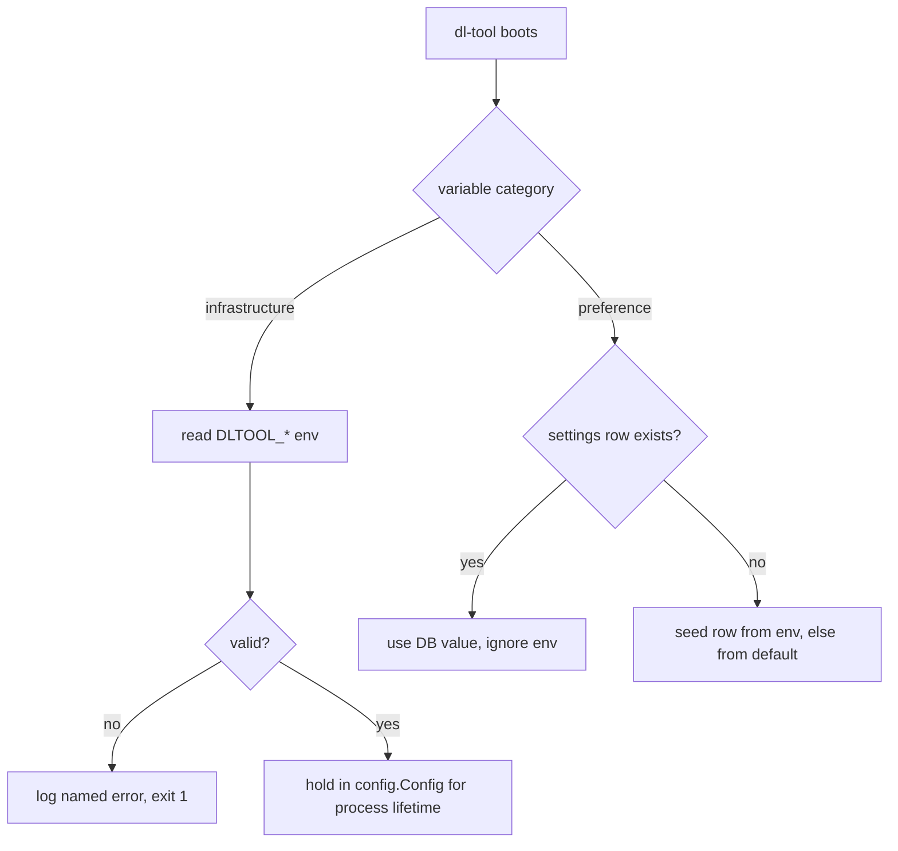

# 11 — Configuration Reference

> **Status:** draft
> **Last reviewed:** 2026-09-01
> **Audience:** implementing agent
> **Read this before:** T005, T006, T007, T099, T106, T113

## Purpose

Define every configuration input dl-tool accepts: the `DLTOOL_` environment variables, the container-level
variables the entrypoint consumes, the compose interpolation variables, and the database-backed settings.
This file does not describe compose service wiring, volumes or ports, and does not restate the HTTP shapes
of the settings endpoints.

## Scope of this document

- In scope: variable names, types, defaults, categories, effects, read sites, secret handling, `.env`
  examples, boot validation.
- Out of scope (lives instead in): compose services, volumes, published ports →
  [`10-deployment-and-compose.md`](10-deployment-and-compose.md) · the `settings` table DDL →
  [`04-data-model.md`](04-data-model.md) · `GET`/`PATCH /settings` request and response bodies →
  [`05-api-contract.md`](05-api-contract.md) · threat rationale for secret handling →
  [`12-security-and-threat-model.md`](12-security-and-threat-model.md).

---

## 1. Precedence rule

Two categories, one rule each. Every variable in this document is labelled with its category.

| Category | Covers | Winner | Changeable at runtime |
|---|---|---|---|
| `infrastructure` | Listen addresses, base path, filesystem paths, engine URLs, engine credentials, log sinks, security switches | **Environment wins at boot.** No API can change it. | No — restart the container |
| `preference` | Speed limits, bandwidth schedule, concurrency limits, RSS interval, extraction options, default destination, watch folder, notification target | **Database wins.** The env var seeds the row on first boot only and is ignored on every later boot. | Yes — `PATCH /settings` |



**IMPORTANT** A `preference` env var that is changed after the first boot has no effect and is not an error;
the operator must change it through `PATCH /settings` or the Settings screen.

Parsing rules for every variable below: booleans go through `strconv.ParseBool` (`true`, `false`, `1`, `0`,
`t`, `f`); durations through `time.ParseDuration` (`720h`, `15m`); path lists split on `:`; host lists split
on `,` after trimming spaces. An empty string means "unset", never "empty value".

---

## 2. `DLTOOL_` variables (application)

All names are read exactly as written, prefix included, by `internal/config/env.go` inside
`config.Load(ctx) (*config.Config, error)`, which is called once from `cmd/dl-tool/main.go`. The `Read by`
column names the package that consumes the parsed field.

| Name | Type | Default | Required | Category | Effect | Read by |
|---|---|---|---|---|---|---|
| `DLTOOL_HTTP_ADDR` | listen addr | `:8080` | no | infrastructure | Address of the main HTTP listener serving the SPA, `/api/v1`, `/healthz` and `/readyz`. | `internal/api/server.go` |
| `DLTOOL_BASE_PATH` | url path | *(empty)* | no | infrastructure | Sub-path prefix when reverse-proxied, e.g. `/dl-tool`. Must start with `/` and must not end with `/`. Empty means the app is served at the root. | `internal/api/server.go`, `internal/api/static.go` |
| `DLTOOL_CONFIG_DIR` | dir path | `/config` | no | infrastructure | Directory holding the database, `secrets.env`, `backups/`, `logs/` and `torrents/`. Must exist and be writable by the dropped user. | `internal/config`, `internal/store/db.go` |
| `DLTOOL_DATA_ROOTS` | `:`-separated dir paths | `/data` | no | infrastructure | The only directories any destination, browse, mkdir, move or delete-data operation may touch. Order matters: the first root is the fallback default destination. | `internal/fsx/safepath.go` |
| `DLTOOL_DB_PATH` | file path | `/config/dl-tool.db` | no | infrastructure | SQLite database file. Its directory must be on a local filesystem. | `internal/store/db.go` |
| `DLTOOL_LOG_LEVEL` | enum `debug\|info\|warn\|error` | `info` | no | infrastructure | Minimum `log/slog` level. | `internal/obs/log.go` |
| `DLTOOL_LOG_FORMAT` | enum `json\|text` | `json` | no | infrastructure | `json` selects `slog.NewJSONHandler`; `text` selects the `tint` handler for local development. | `internal/obs/log.go` |
| `DLTOOL_TRUSTED_PROXIES` | `,`-separated CIDRs | *(empty)* | no | infrastructure | Sources whose `X-Forwarded-For` and `X-Forwarded-Proto` are honoured. Empty means no forwarded header is trusted and the peer address is used. | `internal/api/server.go` |
| `DLTOOL_SESSION_TTL` | duration | `720h` | no | infrastructure | Lifetime of a session cookie and its `sessions` row. | `internal/secure/session.go` |
| `DLTOOL_METRICS_ADDR` | listen addr | `127.0.0.1:9090` | no | infrastructure | Separate listener exposing `GET /metrics`. Set to an empty string to disable metrics entirely. | `internal/obs/metrics.go` |
| `DLTOOL_ARIA2_URL` | url | *(empty)* | no | infrastructure | aria2 JSON-RPC endpoint, e.g. `http://aria2:6800/jsonrpc`. Empty disables the aria2 lane and every HTTP/FTP/SFTP/Metalink task fails with `engine_unavailable`. | `internal/engine/aria2/client.go` |
| `DLTOOL_ARIA2_SECRET` | **secret** string | *(empty)* | yes when `DLTOOL_ARIA2_URL` is set | infrastructure | Value sent as the aria2 `token:<secret>` first parameter. | `internal/engine/aria2/client.go` |
| `DLTOOL_QBITTORRENT_URL` | url | *(empty)* | no | infrastructure | qBittorrent WebUI base URL, e.g. `http://qbittorrent:8080`. Empty disables the BitTorrent lane. | `internal/engine/qbittorrent/client.go` |
| `DLTOOL_QBITTORRENT_USERNAME` | string | *(empty)* | yes when `DLTOOL_QBITTORRENT_URL` is set | infrastructure | Username for `POST /api/v2/auth/login` against the engine. | `internal/engine/qbittorrent/client.go` |
| `DLTOOL_QBITTORRENT_PASSWORD` | **secret** string | *(empty)* | yes when `DLTOOL_QBITTORRENT_URL` is set | infrastructure | Password for the same login call. | `internal/engine/qbittorrent/client.go` |
| `DLTOOL_YTDLP_PATH` | file path | `/usr/local/bin/yt-dlp` | no | infrastructure | Standalone `yt-dlp_musllinux` binary. Probed at boot for its version; self-update is never invoked. | `internal/engine/ytdlp/runner.go` |
| `DLTOOL_JS_RUNTIME_PATH` | file path | `/usr/bin/node` | no | infrastructure | JavaScript runtime required by `yt-dlp-ejs` for full YouTube support. Missing binary raises `js_runtime_missing` and disables the media lane with a visible warning. | `internal/engine/ytdlp/runner.go` |
| `DLTOOL_SEVENZIP_PATH` | file path | `/usr/bin/7zz` | no | infrastructure | Archive extractor used by the auto-extract job handler. | `internal/jobs/handlers_extract.go` |
| `DLTOOL_SSRF_ALLOW_PRIVATE` | bool | `false` | no | infrastructure | When `true`, outbound fetches of feeds, indexers and task URIs may resolve to loopback, link-local and RFC 1918 addresses. Leave `false` unless every indexer is on the same LAN. | `internal/secure/ssrf.go` |
| `DLTOOL_WATCH_DIR` | dir path | *(empty)* | no | preference | Seeds one enabled row in `watch_folders` pointing at this directory. Must be inside `DLTOOL_DATA_ROOTS`. | `internal/jobs/cron.go` |
| `DLTOOL_NOTIFY_URL` | url | *(empty)* | no | preference | Seeds one enabled `notification_channels` row of kind `webhook` with this URL. | `internal/jobs/handlers_notify.go` |

Every variable marked **secret** also accepts a `_FILE` suffixed sibling — see §6.

---

## 3. Container-level variables (entrypoint, not the application)

Consumed by `/entrypoint.sh` in the runtime image before `exec su-exec` hands control to the binary. The Go
process never reads them, except that `TZ` reaches it through the standard library.

| Name | Type | Default | Effect |
|---|---|---|---|
| `PUID` | integer uid | `1000` | User id the application runs as. `/config` is `chown`ed to `PUID:PGID` at start. `PUID=0` skips the privilege drop and logs a warning. |
| `PGID` | integer gid | `1000` | Group id the application runs as. |
| `TZ` | IANA zone | `Etc/UTC` | Container time zone. The 24×7 bandwidth schedule is evaluated in this zone; the UI shows it beside the grid. |
| `UMASK` | octal mask | `002` | Applied with `umask` before `exec`. `002` yields `775` directories and `664` files; `022` yields `755`/`644`. |

Files are created with mode `0666` and directories with `0777` so that `UMASK` — not a hard-coded mode —
decides the result. See [ADR-0011](decisions/0011-alpine-runtime-with-puid-pgid.md).

---

## 4. Compose-level variables

Read by Docker Compose from `.env` while expanding `compose.yaml`. Non-secret values interpolate into named
fields. Secret values source named file mounts and never enter a service environment.

| Name | Default in `compose.yaml` | Interpolated into |
|---|---|---|
| `CONFIG_DIR` | `./config` | The host side of the `/config` bind mount for dl-tool and each engine. |
| `DATA_DIR` | `/srv/data` | The host side of the single `/data` bind mount, identical in every service ([ADR-0012](decisions/0012-single-data-mount.md)). |
| `DLTOOL_PORT` | `8091` | Published host port mapped to container `8080`. |
| `ARIA2_RPC_SECRET` | *(none — must be set)* | Source of the `aria2_rpc_secret` Compose secret mounted into aria2 and dl-tool. |
| `QBT_WEBUI_PORT` | `8080` | qBittorrent's in-container WebUI port, used to build `DLTOOL_QBITTORRENT_URL`. |
| `QBT_USERNAME` | *(none — must be set)* | dl-tool's `DLTOOL_QBITTORRENT_USERNAME`. |
| `QBT_PASSWORD` | *(none — must be set)* | Source of the `qbt_password` Compose secret mounted only into dl-tool. |

---

## 5. Database-backed settings

One row per key in `settings` (`key`, `value_json`) — DDL in [`04-data-model.md`](04-data-model.md). Keys are
flat and lowercase. This table is the authoritative key list referenced by
[`05-api-contract.md`](05-api-contract.md) §11.

| Key | Type | Default | Changed by |
|---|---|---|---|
| `download_rate_limit` | integer bytes/s, `0` = unlimited | `0` | `PATCH /settings` |
| `upload_rate_limit` | integer bytes/s, `0` = unlimited | `0` | `PATCH /settings` |
| `alt_download_rate_limit` | integer bytes/s | `5242880` | `PATCH /settings` |
| `alt_upload_rate_limit` | integer bytes/s | `1048576` | `PATCH /settings` |
| `schedule_enabled` | boolean | `false` | `PATCH /settings` |
| `default_destination` | absolute path inside a data root | first entry of `DLTOOL_DATA_ROOTS` | `PATCH /settings` |
| `min_free_space` | object, root path → bytes | `2147483648` for every configured root | `PATCH /settings` |
| `max_active_total` | integer, `0` = unlimited | `5` | `PATCH /settings` |
| `max_active_per_engine` | integer, `0` = unlimited | `3` | `PATCH /settings` |
| `max_active_per_user` | integer, `0` = unlimited | `3` | `PATCH /settings` |
| `process_order` | enum `by_date_created\|by_user_round_robin` | `by_date_created` | `PATCH /settings` |
| `rss_enabled` | boolean | `true` | `PATCH /settings` |
| `rss_interval_s` | integer seconds, minimum `60` | `900` | `PATCH /settings` |
| `auto_extract` | boolean | `false` | `PATCH /settings` |
| `extract_passwords` | **secret** array of strings | `[]` | `PATCH /settings` |
| `confirm_on_delete` | boolean | `true` | `PATCH /settings` |

Seeding does not count toward any `max_active_*` limit. The 168-cell bandwidth grid is not a settings key: it
lives in its own table and is replaced through `PUT /settings/schedule`. Per-user `default_destination`,
`quota_bytes` and `locale` are columns on `users`, changed through `PATCH /users/{id}`.

---

## 6. Secrets

| Secret | Carrier | Never |
|---|---|---|
| `DLTOOL_ARIA2_SECRET` | inline or `_FILE`; shipped Compose mounts `/run/secrets/aria2_rpc_secret` mode `0400` | logged, returned by any endpoint, or written to a backup export |
| `DLTOOL_QBITTORRENT_PASSWORD` | inline or `_FILE`; shipped Compose mounts `/run/secrets/qbt_password` mode `0400` | logged, returned by any endpoint, or written to a backup export |
| `extract_passwords` | `settings` row | returned in clear by `GET /settings` — it renders as `"__redacted__"` |
| indexer `api_key` | `indexers` row | returned by `GET /indexers`, or included in a log line or an error message |
| notification channel `secret_enc` | `notification_channels` row | returned by `GET /notifications` |
| session signing key, CSRF HMAC key | `<CONFIG_DIR>/secrets.env`, mode `0600` | exported, or exposed through any API |

Rules:

- **`_FILE` convention.** Every variable marked **secret** in §2 also accepts `<NAME>_FILE` holding a path,
  the Docker-secrets and linuxserver.io style: `DLTOOL_ARIA2_SECRET_FILE=/run/secrets/aria2_rpc_secret`. The
  file is read once at boot and its trailing newline stripped. Setting both forms is a fatal
  `config_conflict`.
- **Shipped Compose.** Sensitive `.env` values source top-level Compose secrets. Grants are service-specific,
  mounts are mode `0400`, and no secret value enters a service environment. The host `.env` itself is mode
  `0600`.
- **Never baked into an image.** No `ARG` carrying a secret (it survives in `docker history`), no
  `COPY .env`. A build-time credential, if ever unavoidable, uses BuildKit `RUN --mount=type=secret,id=…`.
- **Never logged.** Secret fields are typed `secure.Secret`, whose `String`, `Format` and `MarshalJSON`
  return `[REDACTED]`. Request logging additionally redacts `Authorization`, `Cookie`, `X-Api-Key`, and the
  query or path parameters `apikey`, `token` and `passkey`, because indexer and tracker URLs routinely embed
  a per-user passkey.
- **Never returned.** No endpoint echoes a secret. Redacted placeholders are literal `"__redacted__"`, and
  `PATCH` of a field whose submitted value equals `"__redacted__"` is a no-op on that field.

### First-run secret generation

`ARIA2_RPC_SECRET` is one value shared by two containers, so it is generated once, before the stack starts:

1. Run `dl-tool gen-secrets` (or `openssl rand -base64 32`) before the first `docker compose up`. It writes
   `<CONFIG_DIR>/secrets.env` mode `0600`, owned by `PUID:PGID`, if that file does not already exist.
2. The file contains three values, each 32 bytes from `crypto/rand`, base64url-encoded:
   `ARIA2_RPC_SECRET`, `DLTOOL_SESSION_KEY`, `DLTOOL_CSRF_KEY`.
3. Copy `ARIA2_RPC_SECRET` and the qBittorrent WebUI password into `.env`, then set that file to mode `0600`.
   Compose converts both values into named, service-scoped secret files.
4. At every boot dl-tool regenerates any of the three that is missing from `secrets.env`. A regenerated
   session key invalidates all sessions; a regenerated `ARIA2_RPC_SECRET` does **not** reconfigure the
   running aria2 container, so dl-tool logs `aria2_secret_rotated` and marks the engine unhealthy until the
   operator restarts it.

---

## 7. Worked `.env` files

Minimal — everything else takes its default:

```dotenv
# .env — minimal
PUID=1000
PGID=1000
TZ=Europe/Zurich
UMASK=002

CONFIG_DIR=./config
DATA_DIR=/srv/data
DLTOOL_PORT=8091

QBT_USERNAME=admin
QBT_PASSWORD=replace-with-the-configured-webui-password
ARIA2_RPC_SECRET=Zk8s1QmF3rT9vN2xJ7bH5cW0aY4pL6dE8gU1oI3sK5M
```

Full — every knob this document defines, at its documented default unless a comment says otherwise:

```dotenv
# .env — full
# --- container ---
PUID=1000
PGID=1000
TZ=Europe/Zurich
UMASK=002

# --- compose interpolation ---
CONFIG_DIR=./config
DATA_DIR=/srv/data
DLTOOL_PORT=8091
QBT_WEBUI_PORT=8080
ARIA2_RPC_SECRET=Zk8s1QmF3rT9vN2xJ7bH5cW0aY4pL6dE8gU1oI3sK5M

# --- dl-tool: infrastructure ---
DLTOOL_HTTP_ADDR=:8080
DLTOOL_BASE_PATH=
DLTOOL_CONFIG_DIR=/config
DLTOOL_DATA_ROOTS=/data
DLTOOL_DB_PATH=/config/dl-tool.db
DLTOOL_LOG_LEVEL=info
DLTOOL_LOG_FORMAT=json
DLTOOL_TRUSTED_PROXIES=172.16.0.0/12
DLTOOL_SESSION_TTL=720h
DLTOOL_METRICS_ADDR=127.0.0.1:9090
DLTOOL_ARIA2_URL=http://aria2:6800/jsonrpc
DLTOOL_ARIA2_SECRET_FILE=/run/secrets/aria2_rpc_secret
DLTOOL_QBITTORRENT_URL=http://qbittorrent:8080
DLTOOL_QBITTORRENT_USERNAME=admin
DLTOOL_QBITTORRENT_PASSWORD_FILE=/run/secrets/qbt_password
DLTOOL_YTDLP_PATH=/usr/local/bin/yt-dlp
DLTOOL_JS_RUNTIME_PATH=/usr/bin/node
DLTOOL_SEVENZIP_PATH=/usr/bin/7zz
DLTOOL_SSRF_ALLOW_PRIVATE=false

# --- dl-tool: preference seeds, first boot only ---
DLTOOL_WATCH_DIR=/data/watch
DLTOOL_NOTIFY_URL=
```

`.env.example` in the repository root is this second file with every secret replaced by a placeholder.
The real `.env` is mode `0600`; `.gitignore` and `.dockerignore` exclude it, `config/`, databases and keys.

---

## 8. Boot validation

Checked in `config.Load` and `store.Open` before the listener binds. Fatal means: log one `error` record with
`err_code` set to the name below, then `os.Exit(1)`. Warn means: log one `warn` record and continue with the
stated fallback.

| Condition | Applies to | Behaviour | `err_code` |
|---|---|---|---|
| Variable unset | any `infrastructure` variable with a default | Use the default silently. | — |
| Variable unset | `DLTOOL_ARIA2_SECRET` while `DLTOOL_ARIA2_URL` is set | Fatal. | `config_missing` |
| Variable unset | `DLTOOL_QBITTORRENT_USERNAME` or `..._PASSWORD` while `DLTOOL_QBITTORRENT_URL` is set | Fatal. | `config_missing` |
| Both `X` and `X_FILE` set | any secret | Fatal. | `config_conflict` |
| `X_FILE` path unreadable | any secret | Fatal. | `config_secret_unreadable` |
| Unparseable value | bool, duration, integer, enum, CIDR list | Fatal, naming the variable and the received value. | `config_malformed` |
| Not a valid `host:port` | `DLTOOL_HTTP_ADDR`, `DLTOOL_METRICS_ADDR` | Fatal. | `config_malformed` |
| Missing leading `/`, or trailing `/` | `DLTOOL_BASE_PATH` | Fatal. | `config_malformed` |
| Not an absolute path | `DLTOOL_CONFIG_DIR`, `DLTOOL_DATA_ROOTS`, `DLTOOL_DB_PATH`, `DLTOOL_WATCH_DIR` | Fatal. | `config_malformed` |
| Directory missing or not writable | `DLTOOL_CONFIG_DIR`, directory of `DLTOOL_DB_PATH` | Fatal, after attempting one `MkdirAll`. | `config_path_unwritable` |
| Directory missing or not writable | any entry of `DLTOOL_DATA_ROOTS` | Fatal — a destination that cannot be written is not recoverable at runtime. | `config_path_unwritable` |
| Filesystem of the database directory is `nfs`, `cifs`, `smb3` or `fuse.*` | `DLTOOL_DB_PATH` | Fatal. SQLite WAL requires shared memory, which network filesystems do not provide; there is no degraded fallback. | `config_network_fs` |
| Binary absent or not executable | `DLTOOL_YTDLP_PATH`, `DLTOOL_SEVENZIP_PATH` | Warn. Disable the media lane and auto-extract respectively, and surface the reason in `GET /system/info`. | `binary_missing` |
| Binary absent or not executable | `DLTOOL_JS_RUNTIME_PATH` | Warn. Disable the media lane and raise the `js_runtime_missing` task-event code. | `js_runtime_missing` |
| Engine URL unreachable at boot | `DLTOOL_ARIA2_URL`, `DLTOOL_QBITTORRENT_URL` | Warn. Mark the engine disconnected, retry in the background, fail affected task creations with `engine_unavailable`. | `engine_unreachable` |
| `DLTOOL_WATCH_DIR` outside every data root | seed value | Warn. Skip seeding the watch folder. | `config_out_of_root` |
| Malformed or out-of-range value | any `preference` seed | Warn. Use the documented default from §5. | `config_malformed` |
| Preference env var changed after first boot | any `preference` variable | Ignore silently; the database value stands. | — |

`config.Load` performs no network I/O; engine reachability is probed after the listener is up.

---

## Decisions referenced

| ADR | Decision |
|---|---|
| [ADR-0004](decisions/0004-sqlite-as-the-only-datastore.md) | SQLite as the only datastore |
| [ADR-0011](decisions/0011-alpine-runtime-with-puid-pgid.md) | Alpine runtime image with PUID/PGID privilege drop |
| [ADR-0012](decisions/0012-single-data-mount.md) | A single `/data` mount |
| [ADR-0018](decisions/0018-pin-ytdlp-by-version-and-hash.md) | Pin yt-dlp by version and hash; never self-update at runtime |

## Open questions

- `DLTOOL_JS_RUNTIME_PATH` is not in the brief's canonical variable list; it is added because §15.2 requires a
  JavaScript runtime probe for yt-dlp and the probe needs a configurable path.
- <!-- UNVERIFIED: the Alpine `7zip` package installing the binary as `/usr/bin/7zz` was not verified against
  the package manifest; the brief pins this default and T004 confirms it at build time. -->

## Change log

| Date | Change |
|---|---|
| 2026-09-01 | Initial version |
| 2026-09-01 | Consistency review: removed the withdrawn ADR-0014 row and the two remaining façade references (the `preference` category description and `DLTOOL_HTTP_ADDR`); corrected the ADR-0011, ADR-0012 and ADR-0018 links to the canonical filenames. |
| 2026-09-01 | Security review: specified scoped Compose secret mounts and protected host secret inputs. |
