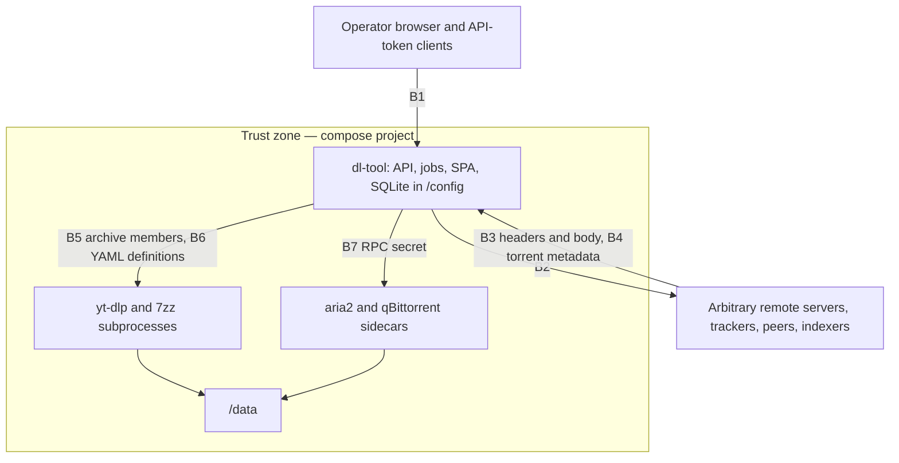

# 12 — Security and Threat Model

> **Status:** draft
> **Last reviewed:** 2026-09-01
> **Audience:** implementing agent
> **Read this before:** T005, T008, T009, T046, T054, T056, T074, T084, T097, T122, T123

## Purpose

Define every hardening rule dl-tool implements: trust boundaries, the SSRF client, the path-safety
algorithm, the archive extractor, untrusted-definition parsing, the web-application controls, and the
23 real incidents that justify them. This file does not restate requirement text, env-var semantics,
compose wiring or HTTP shapes.

## Scope of this document

- In scope: assets, trust boundaries, exact algorithms and limits, the CVE→NFR justification record,
  supply-chain and privacy posture, sidecar hardening.
- Out of scope (lives instead in): requirement sentences and `Verify:` lines →
  [`02-requirements.md`](02-requirements.md) · variable names, types, defaults →
  [`11-config-reference.md`](11-config-reference.md) · compose services, ports, volumes →
  [`10-deployment-and-compose.md`](10-deployment-and-compose.md) · per-engine fetch limits and the
  dlsearch schema → [`07-search-and-indexers.md`](07-search-and-indexers.md) · error slugs and status
  codes → [`05-api-contract.md`](05-api-contract.md) · fixtures and harness →
  [`13-testing-and-verification.md`](13-testing-and-verification.md) · licensing →
  [ADR-0016](decisions/0016-relicense-to-apache-2.md).

---

## 1. Assets and trust boundaries

| Asset | Lives in | Loss scenario |
|---|---|---|
| Host filesystem outside `DLTOOL_DATA_ROOTS` | container mounts | arbitrary write via a hostile filename or archive member |
| Contents of `/data` | the single data mount | overwrite, mass deletion through `delete_data` |
| argon2id hashes, sessions, API-token hashes | `/config/dl-tool.db` | account takeover |
| Indexer API keys, tracker passkeys | `indexers` rows, feed URLs | private-tracker identity theft, log leakage |
| Engine RPC credentials | `secrets.env`, compose secrets | full takeover of aria2 or qBittorrent |
| The operator's LAN and cloud metadata endpoints | reachable from the container | SSRF pivot |
| The operator's IP and download history | peers, trackers, indexers | privacy loss |



| # | Boundary | Untrusted input | Worst case | Control |
|---|---|---|---|---|
| B1 | Browser or API-token client → `/api/v1` | URLs, magnet links, destination paths, settings | arbitrary write, privilege escalation | §6, §3 |
| B2 | dl-tool → arbitrary remote HTTP(S) | the URL, DNS answers, redirects | **SSRF** to cloud metadata, LAN RPC ports, sibling containers | §2 |
| B3 | Remote server → dl-tool | `Content-Disposition`, `Content-Length`, body, TLS certificate | arbitrary write, disk exhaustion, MitM | §2.4, §3 |
| B4 | Torrent or magnet metadata → dl-tool | `name`, `files[].path`, BEP 47 symlink paths | traversal, symlink escape, disk exhaustion | §3 |
| B5 | Archive → extractor | zip, rar, 7z members | zip-slip, zip bomb, symlink escape | §4 |
| B6 | Indexer definitions → parser | YAML, selectors, regexes, templates | parser DoS, definition-driven SSRF | §5 |
| B7 | dl-tool ↔ sidecars | RPC secrets on a shared compose network | takeover of a download daemon | §10 |
| B8 | Base images, Go modules, yt-dlp, 7zz | upstream code | supply-chain RCE | §8 |

B2 is the defining hazard of this software class: dl-tool fetches attacker-supplied URLs server-side,
from inside the operator's LAN, as a long-lived daemon.

The only remote-service credentials dl-tool ever holds are the engine RPC secrets of B7 and indexer API
keys. It never asks for, transmits or stores the login of another download manager — there is no code path
that authenticates against a remote Download Station or a remote qBittorrent on the operator's behalf — so
that credential class is absent from the asset table by construction.

---

## 2. SSRF

### 2.1 The block list

Denied IPv4 prefixes, adopted verbatim from the `code.dny.dev/ssrf` defaults (18 prefixes):

```
0.0.0.0/8        10.0.0.0/8       100.64.0.0/10    127.0.0.0/8
169.254.0.0/16   172.16.0.0/12    192.0.0.0/24     192.0.2.0/24
192.31.196.0/24  192.52.193.0/24  192.88.99.0/24   192.168.0.0/16
192.175.48.0/24  198.18.0.0/15    198.51.100.0/24  203.0.113.0/24
224.0.0.0/4      240.0.0.0/4
```

IPv6 uses an allow-list, not a deny-list: only `2000::/3` (global unicast) is reachable at all, and
inside it `2001::/23`, `2001:db8::/32`, `2002::/16`, `2620:4f:8000::/48` and `3fff::/20` are denied.
Everything outside `2000::/3` is blocked, covering `::1/128`, `fc00::/7`, `fe80::/10`, `ff00::/8`,
`64:ff9b::/96` and IPv4-mapped `::ffff:0:0/96`.

No per-cloud hostname list is needed: AWS, GCP, Azure and DigitalOcean metadata all sit in
`169.254.0.0/16`, Alibaba's `100.100.100.200` in `100.64.0.0/10`, Oracle's `192.0.0.192` in
`192.0.0.0/24`. Two consequences to carry, not to "fix": `2000::/3` also blocks NAT64 `64:ff9b::/96`,
a real cost on an IPv6-only host; and Go unmaps IPv4-in-IPv6 inconsistently, so call
`netip.Addr.Is4In6()` and `Unmap()` explicitly before applying the IPv4 rules, and test
`::ffff:169.254.169.254`.

### 2.2 How to implement it

**IMPORTANT** Validate the **resolved peer IP inside the dialer**, never the hostname in the URL. A
resolve-then-hand-the-hostname-to-the-client design is a DNS-rebinding TOCTOU bypass: the HTTP client
re-resolves at connect time and gets a different answer.

`internal/secure/ssrf.go`:

```go
// Check runs after DNS resolution and socket creation, before the connection is used.
// network is "tcp4" or "tcp6"; addr is always "ip:port", never a hostname.
func (g *Guard) Check(ctx context.Context, network, addr string) error {
	if network != "tcp4" && network != "tcp6" {
		return ErrSSRFBlocked
	}
	host, port, err := net.SplitHostPort(addr)
	if err != nil || !g.allowedPorts[port] {
		return ErrSSRFBlocked
	}
	ip, err := netip.ParseAddr(host)
	if err != nil {
		return ErrSSRFBlocked
	}
	if ip.Is4In6() {
		ip = ip.Unmap() // ::ffff:169.254.169.254 must hit the IPv4 rules
	}
	return g.allow(ip) // nil, or ErrSSRFBlocked naming the matched prefix
}

// The one shared client wires Check in and caps redirects.
d := &net.Dialer{Timeout: 10 * time.Second, ControlContext: g.Check}
c := &http.Client{
	Transport:     &http.Transport{DialContext: d.DialContext, ForceAttemptHTTP2: true},
	CheckRedirect: g.CheckRedirect, // hop cap of 5, then scheme must stay http or https
	Timeout:       120 * time.Second,
}
```

| # | Rule |
|---|---|
| 1 | Use `net.Dialer.ControlContext`, not `Control`: `Control` is ignored whenever `ControlContext` is set, so a codebase that sets both silently loses the guard. |
| 2 | Every outbound fetch — task URIs, `.torrent` fetches, indexer queries, RSS polls, notification posts, poster proxying — uses this one client. Enforce with a `depguard` rule forbidding `http.Get`, `http.Post` and bare `http.Client{}` outside `internal/secure`. |
| 3 | The dialer re-runs for every new connection, so each redirect hop is re-validated automatically; `CheckRedirect` adds the hop cap and the scheme check the dialer cannot see. |
| 4 | Allow schemes `http` and `https` only, **including after a redirect**. `magnet` is parsed in-process and never fetched. Deny `file`, `ftp`, `gopher`, `data`, `dict`, `ldap`, `jar`, `blob`, `smb` and everything else. |
| 5 | Allow ports 80 and 443 only; a URL naming any other port is rejected before the dial. |
| 6 | Follow at most **5** redirects. Re-run rules 3–5 on every hop; a `301 → file:///etc/passwd` or `302 → http://169.254.169.254/` must never pass. |
| 7 | Cap the body while streaming with `io.LimitReader`, and reject an over-cap `Content-Length` up front — a lying `Content-Length` must not bypass the streaming cap. |
| 8 | TLS verification is always on. No env var, settings key or API field disables it, and no `InsecureSkipVerify: true` exists outside test fixtures. |
| 9 | Connection pooling means `ControlContext` fires per connection, not per request; never route a second logical host over a pooled connection. |

Do not cite OWASP's SSRF cheat sheet as authority for the socket-layer approach — its own recipe
(resolve all A/AAAA records, then verify) is the TOCTOU pattern this design rejects. Cite it only for
"deny-lists are bypass-prone; prefer allow-lists" and for disabling redirect following.

### 2.3 Private addresses and the engine sidecars

The sidecars sit on the compose network, which is RFC 1918 space, and are **not** an SSRF-client
concern: `DLTOOL_ARIA2_URL` and `DLTOOL_QBITTORRENT_URL` are infrastructure configuration and bypass
the guard by construction. The guard governs only URLs originating from a user, a feed, an indexer or a
remote redirect, and private ranges reach it in exactly two ways:

| Switch | Effect |
|---|---|
| `DLTOOL_SSRF_ALLOW_PRIVATE=true` | Lifts `10.0.0.0/8`, `172.16.0.0/12`, `192.168.0.0/16`, `127.0.0.0/8`, `fc00::/7` and `::1/128` globally ([`11-config-reference.md`](11-config-reference.md)) |
| Per-indexer `allow_private` flag on an `indexers` row | Lifts the same set for that indexer's fetches only ([`07-search-and-indexers.md`](07-search-and-indexers.md)) |

`169.254.0.0/16` and `fe80::/10` stay denied under both switches: link-local is where the cloud
metadata services live and there is no legitimate download source there. Gitea's
`GHSA-2r5c-gw76-rh3w`, "Incomplete SSRF Protection in Webhook and Migration Allow-list Default
Filter", is the cautionary tale for getting the default wrong.

### 2.4 Caps and diagnosability

| Cap | Value |
|---|---|
| Connect timeout · total request timeout | 10 s · 120 s |
| Redirect hops | 5 |
| Body, metadata fetch (`.torrent`, indexer page) | 8 MiB, enforced while streaming |
| Body, feed poll | 16 MiB, enforced while streaming — owned by [`08-rss-automation.md`](08-rss-automation.md) §2.1 |
| Response headers | 100 headers, 64 KiB total |

Every block logs one `warn` record carrying `url_redacted`, `resolved_ip`, `matched_prefix` and `hop`
(0 for the original request), and sets `tasks.error_code = 'ssrf_blocked'` or returns
`/problems/ssrf-blocked`. A silently dropped LAN fetch becomes a bug report; a log line naming the
prefix ends it in one round trip.

---

## 3. Path safety

Owned by `internal/fsx/safepath.go`. No unsanitised remote string may reach a filesystem call.

### 3.1 Where the names come from

| Source | Parsing rule |
|---|---|
| HTTP `Content-Disposition` | `filename` and `filename*` match case-insensitively; when both are present use `filename*` and ignore `filename`. Percent-decode `filename*` per RFC 8187 (which obsoletes RFC 5987) **exactly once**, then sanitise. |
| `.torrent` `info.name`, `info.files[].path[]` | Each element is one segment; the whole torrent is rejected if any element is `..` or absolute. |
| BEP 47 symlink entries | Never materialised — dl-tool creates no symlink or hardlink from remote metadata. |
| API `destination` | Must resolve inside `DLTOOL_DATA_ROOTS`, and inside the caller's jail for a non-admin. |

RFC 6266 §4.3 governs and belongs in the code comment: "Recipients MUST NOT be able to write into any
location other than one to which they are specifically entitled"; "never trust folder name information
in the filename parameter, for instance by stripping all but the last path segment"; recipients
"SHOULD ignore or substitute" names with special meaning "such as `.` and `..`, `~`, `|`, and also
device names"; and "MUST ensure that a file extension is used that is safe".

### 3.2 `sanitiseSegment(s string) string`

Applies to one path component, in this order.

1. If `s` is empty, return `"_"`.
2. Percent-decode only when the source was `filename*`. Never decode twice.
3. Unicode-normalise to **NFC**. Not NFKC — it mangles legitimate CJK and full-width titles.
4. Delete bidi and format codepoints `U+200B`–`U+200F`, `U+202A`–`U+202E`, `U+2066`–`U+2069`, `U+FEFF`.
5. Delete control characters (`< 0x20` and `0x7F`). That removes an embedded NUL; a NUL in a path the
   **user typed** additionally rejects the request, because a NUL reaching a C `open()` truncates.
6. Replace each of `/ \ : * ? " < > |` with `_`.
7. Repair invalid UTF-8, replacing each bad sequence with `_`.
8. Truncate to **240 bytes** of UTF-8 without splitting a codepoint, then re-append the extension if
   the original had one — a `.` within the last 9 characters plus what follows it.
9. Strip trailing `.` and space characters, then leading and trailing whitespace.
10. If `upper(stem)` is one of `CON PRN AUX NUL CLOCK$ CONIN$ CONOUT$ COM0`–`COM9 LPT0`–`LPT9`,
    prefix `_`.
11. If the result is `""`, `"."` or `".."`, return `"_"`.

Deviation notice, so nobody "fixes" it back: libtorrent's `aux::sanitize_append_path_element` filters
only `/`, `\`, seven bidi codepoints and `c < 32` on Linux — its Windows-illegal set, trailing-dot
stripping and reserved-name handling all sit inside `#ifdef TORRENT_WINDOWS`, and the reserved-name
block is dead code in the default Windows build. Steps 6, 9 and 10 are **deliberately stricter**,
because `/data` is routinely re-exported over SMB.

### 3.3 `safeJoin(root string, segments []string) (string, error)`

1. `root` must be one of the configured `DLTOOL_DATA_ROOTS` entries, matched by exact string against
   the resolved set — never a path the API caller supplies verbatim.
2. Per raw segment: drop `""` and `"."`; **reject the whole download** if it is `".."` or absolute — do
   not silently pop, because a torrent whose paths escape is hostile, not sloppy; otherwise sanitise.
3. Enforce total path length ≤ 4096 bytes and depth ≤ 32.
4. Verify containment at the syscall layer, not by string comparison. Linux ≥ 5.6:
   `openat2(dirfd, rel, {resolve: RESOLVE_BENEATH|RESOLVE_NO_SYMLINKS|RESOLVE_NO_MAGICLINKS})`, which
   closes the TOCTOU window entirely. Portable fallback, always implemented because `openat2` can
   return `ENOSYS`: create each intermediate directory with `mkdirat` plus `O_NOFOLLOW`, `lstat` every
   component, refuse any symlink, then compare the fully resolved real path against the resolved
   `root` plus a trailing separator.
5. Open the final file `O_CREAT|O_EXCL|O_NOFOLLOW`. Never `O_TRUNC` on a path dl-tool did not create.
6. Non-admins are additionally jailed to the subtree of their `users.default_destination` — the same
   function with `root` set to the jail.
7. Collisions: keep a per-download `map[string]int` keyed on the case-folded name and append ` (2)`,
   ` (3)` … **before** the extension. APFS, NTFS and case-insensitive ZFS or SMB datasets silently
   overwrite otherwise, so a torrent carrying both `Movie.mkv` and `movie.mkv` is an overwrite
   primitive.

### 3.4 Test-case table

Implement verbatim as table-driven tests in `internal/fsx/safepath_test.go` (T046).

| # | Input (single segment unless noted) | Expected output | Why |
|---|---|---|---|
| 1 | `normal.mkv` | `normal.mkv` | baseline |
| 2 | `..` | `_` | dot-only element |
| 3 | `.` | dropped by `safeJoin` | current directory |
| 4 | `...` | `_` | trailing dots stripped, then empty |
| 5 | `/etc/passwd` as a `Content-Disposition` filename | `_etc_passwd` | RFC 6266: strip folder info |
| 6 | `..%2F..%2Fetc%2Fshadow` from `filename*` | decodes to `../../etc/shadow` → **reject the download** | double-decode trap |
| 7 | `C:\Windows\system32.exe` | `C__Windows_system32.exe` | drive letter plus backslash |
| 8 | `\\?\C:\x` | `____C_x` | Windows device path |
| 9 | `CON` | `_CON` | reserved name |
| 10 | `nul.txt` | `_nul.txt` | reserved stem, case-insensitive |
| 11 | `com9.tar.gz` | `_com9.tar.gz` | reserved name |
| 12 | `clock$` | `_clock$` | reserved name |
| 13 | `file.txt.` | `file.txt` | trailing dot |
| 14 | `file ` (trailing space) | `file` | trailing space |
| 15 | `evil\u202Egnp.exe` | `evilgnp.exe` | RTL override removed |
| 16 | `a\u200Bb.mkv` | `ab.mkv` | zero-width space removed |
| 17 | `bad\x00name` | `badname`, and **reject** when it came from a user-typed path | NUL byte |
| 18 | `tab\there` | `tabhere` | control character |
| 19 | `"a<b>c\|d?e*f:g"` | `_a_b_c_d_e_f_g_` | Windows-illegal set |
| 20 | `"A"×300 + ".mkv"` | 240 bytes of `A` then `.mkv` | length cap, extension preserved |
| 21 | `"日"×200 + ".mkv"` | ≤ 240 **bytes**, no split codepoint | byte-versus-rune cap |
| 22 | `` (empty) | `_` | never empty |
| 23 | `résumé.txt` supplied as NFD | `résumé.txt` in NFC | normalisation |
| 24 | `аdmin.txt` (Cyrillic `а`, U+0430) | `аdmin.txt` **kept** | homoglyph: sanitising is the wrong fix — never make a security decision on a filename |
| 25 | `.hidden` | `.hidden` | legitimate on Unix |
| 26 | `-rf` | `-rf` | argument injection: every shell-out uses an exec array, never a shell string |
| 27 | torrent `files[].path = ["..","..","x"]` | **reject the whole torrent** | traversal |
| 28 | torrent `name = "/"` | `_` | absolute name |
| 29 | BEP 47 symlink entry pointing at `/etc` | **reject; never create a symlink** | symlink escape |
| 30 | `Movie.mkv` and `movie.mkv` in one torrent | `Movie.mkv`, `movie (2).mkv` | case-insensitive collision |

Rows 2, 4, 13, 14 and 19 are stricter than libtorrent's Linux behaviour by design; see §3.2.

---

## 4. Archive extraction

Auto-extract is off by default (`auto_extract`, [`11-config-reference.md`](11-config-reference.md)) and
the UI discloses that it runs a native archive decoder over untrusted input.

| Attack | Mechanism | Precedent |
|---|---|---|
| Zip-slip | Member name contains `../` | Snyk 2018; applies to tar, jar, war, cpio, apk, rar and 7z alike |
| Symlink escape | A member is a symlink `link -> /etc`; a later member is `link/cron.d/x` | CVE-2022-30333 in UnRAR ≤ 6.11; Zimbra's fix was to replace `unrar` with `7z` |
| Tar member traversal | `../` in tar names | CVE-2007-4559, open in CPython for 15 years |
| Zip bomb | Extreme compression ratio | `42.zip` reaches 4.5 PB by recursion; Fifield's 2019 non-recursive bomb reaches 4.5 PB from 46 MB by overlapping members, defeating depth limits. DEFLATE's ceiling is 1032:1 and Zip64 removes the output cap |
| Password guessing | Server-side candidate testing | CPU denial of service |
| Decoder memory safety | Native C decoders | treat any native decoder as hostile code |

### 4.1 The safe recipe

`internal/jobs/handlers_extract.go`, three passes in this order.

**Pass 1 — list and validate before writing anything.**

```go
cmd := exec.CommandContext(ctx, cfg.SevenzipPath, "l", "-slt", "-y", "-ba", archivePath)
```

Reject the archive without extracting if any member name fails `sanitiseSegment`/`safeJoin`, is
absolute, or contains a `..` element; if the declared member count or summed declared uncompressed size
exceeds its cap; or if a member is declared a link, device, FIFO, or carries setuid or setgid.

**Pass 2 — extract into a fresh empty directory on the same filesystem.**

```go
tmp := filepath.Join(root, ".dl-tool-extract-"+ulid.Make().String()) // same root, same filesystem
cmd := exec.CommandContext(ctx, cfg.SevenzipPath,
    "x",        // extract with full paths
    "-y",       // assume yes on all queries
    "-bd",      // no progress indicator
    "-o"+tmp,   // output directory
    "-p"+pw,    // password, empty string when none
    archivePath)
```

- Invoke `7zz` as an **exec array**; never a shell string, never `sh -c`
  ([NFR-015](02-requirements.md#nfr-015-never-interpolate-configuration-into-a-shell)).
- `tmp` sits **inside the target data root**, so an escape past pass 1 lands inside the root, not
  in `/etc`. The process inherits `no-new-privileges:true` and the dropped UID/GID.
- Enforce a wall-clock deadline through the `context` and kill the process group on expiry.
- Poll bytes **written** into `tmp` and abort on breach; headers lie, so pass 1's declared sizes are a
  pre-filter, not the enforcement. Never recurse — extract one level and leave nested archives alone.

**Pass 3 — walk, verify, then move.** Walk `tmp` with `lstat` on every entry and abort the job if any
entry is a symlink, hardlink, device node, FIFO or socket, or resolves outside `tmp`. Force mode `0644`
on files and `0755` on directories and ignore archive-supplied uid, gid and setuid/setgid bits. Only
then move the tree into place; because `tmp` shares the filesystem, the move is a `rename`. On any
abort, remove `tmp` recursively and leave the target untouched.

| Cap | Default | Enforced by |
|---|---|---|
| Total uncompressed bytes | smaller of 10 × archive size and 20 GiB | bytes written, polled in pass 2 |
| Member count | 10 000 | declared in pass 1, recounted in pass 3 |
| Single member uncompressed size | 4 GiB | declared in pass 1, bytes written in pass 2 |
| Path depth below `tmp` | 32 | `safeJoin` |
| Wall clock | 30 min | `context` deadline |
| Recursion depth | 1 | pass 3 never enqueues a nested archive |

### 4.2 Passwords

Candidates are tried in order and each **once**: the task's `extract_password` from `POST /tasks`, then
each entry of the `extract_passwords` settings array in list order, capped at 16 entries. dl-tool
generates no candidates, loads no wordlist and retries no failed candidate — a fixed operator-supplied
list is not a dictionary attack. After the last candidate fails, the job writes a `task_events` row and
leaves the archive in place. Passwords are never logged, never appear in an error `detail`, and render
as `"__redacted__"` in `GET /settings`.

<!-- UNVERIFIED: 7-Zip offers no documented way to read the password from stdin, so `-p<password>`
     appears in /proc/<pid>/cmdline for the child's lifetime. Acceptable while every process in the
     container runs as the same unprivileged user; revisit if that changes. -->

Never use `github.com/mholt/archiver/v3` — CVE-2025-3445 is a zip-slip in exactly this role. Go's
`archive/zip` and `archive/tar` are used only for the `.dlm` case in §5.3, always with dl-tool's own
name validation on top.

---

## 5. Untrusted definitions

dl-tool executes no third-party code, ever
([ADR-0010](decisions/0010-never-execute-third-party-definitions.md)). Definitions are data.

### 5.1 YAML parsing

| Control | Value |
|---|---|
| Decoder | `gopkg.in/yaml.v3` with `Decoder.KnownFields(true)`; an unknown key is an error, not a warning |
| Target type | a concrete Go struct — never `interface{}` followed by dynamic reflection |
| File size | ≤ 512 KiB, checked **before** parsing |
| Nesting depth · node count · alias expansions | ≤ 32 · ≤ 50 000 · ≤ 1 000 |
| Parse wall clock | ≤ 2 s |
| Schema | validated against the bundled `dlsearch/v1` JSON Schema before use |
| Schemes | a definition may name only `http` or `https`, and every fetch it drives goes through the §2 client |

Every rejection names the limit it hit. Precedents: CVE-2019-11253, an unauthenticated billion-laughs
denial of service against the Kubernetes API server; CVE-2020-14343 in PyYAML, where `full_load`
reached RCE through `python/object/new`.

### 5.2 Selectors and regexes

- Regexes run on Go `regexp` — RE2-based and linear-time, so ReDoS is structurally impossible. The
  cost, no backreferences and no lookaround, is documented in the schema. Cap each pattern at 512
  bytes of source and apply a per-match `context` deadline.
- Parse HTML with `github.com/PuerkitoBio/goquery` over `net/html` and run selectors with Cascadia.
  Never match structure with a regex; do not implement XPath over untrusted definitions.
- Per-engine input caps, rate limits and the 15 s deadline are owned by
  [`07-search-and-indexers.md`](07-search-and-indexers.md) §3.5. Definitions load from
  `/config/definitions` plus the reviewed built-in set; nothing auto-downloads a definition.

### 5.3 `.dlm` tar-member validation

A `.dlm` is a gzip-compressed tar archive. `internal/search/dlm_import.go` reads it with `compress/gzip`
plus `archive/tar` and applies these checks before touching any member.

| Check | Limit |
|---|---|
| Uploaded file size | ≤ 2 MiB |
| Decompressed total | ≤ 8 MiB, enforced with an `io.LimitReader` over the gzip stream |
| Member count | ≤ 64 |
| Member types accepted | `tar.TypeReg` and `tar.TypeDir` only; any `TypeSymlink`, `TypeLink`, `TypeChar`, `TypeBlock` or `TypeFifo` rejects the upload |
| Member names | every element through `sanitiseSegment`; absolute names and any `..` element reject the upload |
| Files read | exactly two — `INFO`, then the member named by `INFO.module`; every other member is ignored |
| Written to disk | nothing; both members are read into memory and analysed, the archive is never extracted |
| Mode bits | ignored entirely |

The PHP module is statically analysed and converted, never executed; the image contains no PHP runtime.
Imported engines start disabled and record their provenance.

---

## 6. Web application security

### 6.1 Sessions and cookies

| Attribute | Value |
|---|---|
| Name | `__Host-dltool_session` when the listener itself terminates TLS at the root, `__Secure-dltool_session` when the listener itself terminates TLS under a base path, plain `dltool_session` otherwise — browsers reject a prefixed cookie without `Secure`, and the name is fixed at boot, so the prefix can only follow the listener's static TLS state. This is deliberately a **stronger** condition than the `Secure` row's per-request `X-Forwarded-Proto` judgement: behind a TLS-terminating proxy the cookie is therefore `Secure` yet unprefixed (valid, one notch less hardened). Chosen at boot from `DLTOOL_BASE_PATH` and the listener's TLS state ([`10-deployment-and-compose.md`](10-deployment-and-compose.md) §7.3) |
| Flags | `HttpOnly`, `SameSite=Lax`, `Path=<base path>/` |
| `Secure` | set whenever the request arrived over TLS, judged from the listener or from `X-Forwarded-Proto` sent by a `DLTOOL_TRUSTED_PROXIES` peer; otherwise omitted and a startup warning is logged |
| Value | ≥ 128 bits from `crypto/rand`, opaque, stored server-side in `sessions` |
| Rotation | a new session id on login and on any privilege change |
| Lifetime | `DLTOOL_SESSION_TTL`, default `720h` |

No JWT and no token in `localStorage`: that reintroduces XSS token theft for no benefit in a
single-origin stateful app. API tokens travel only in `Authorization: Bearer`, never in a query string.

### 6.2 CSRF

dl-tool uses a **synchroniser token**, explicitly **not** a `Referer` check. qBittorrent relies on
`Referer` and issue #17598 documents the fallout: behind an nginx reverse proxy users must either strip
`Referer` to bypass the protection or disable CSRF checking entirely, and the issue asks upstream to
adopt Transmission's token approach instead. Three layers, because proxies break each differently:

1. A per-session token returned in the body of `POST /auth/setup`, `POST /auth/login` and
   `GET /auth/me`, never set as a cookie, required in `X-DLTOOL-CSRF` on every `POST`, `PUT`, `PATCH`
   and `DELETE` made with cookie authentication, and compared in constant time. Bearer-authenticated
   requests are exempt.
2. `Origin` (falling back to `Referer`) must match the request host when the header is present.
3. The `Host` allowlist of §6.5.

### 6.3 Password storage and login

| Control | Value |
|---|---|
| Algorithm | argon2id via `golang.org/x/crypto/argon2` (`argon2.IDKey`) |
| Parameters | `m=19456` KiB (19 MiB), `t=2`, `p=1`, `saltLen=16`, `hashLen=32` — the OWASP mid-point, comfortable on a Raspberry Pi 4 class NAS |
| Storage | the full PHC string `$argon2id$v=19$m=19456,t=2,p=1$<salt>$<hash>`, so parameters can be raised and the hash re-derived on the next successful login |
| Comparison | `crypto/subtle.ConstantTimeCompare` |
| Minimum length | 12 characters, enforced by `POST /auth/setup` and `PATCH /users/{id}` |
| Failure response | identical text and identical timing for a wrong password, a disabled account and an unknown user |

Brute-force controls in `internal/secure/session.go`: per-account exponential backoff starting at 1 s,
doubling, capped at 15 minutes; a per-source-IP token bucket of 10 attempts per 5 minutes keyed on the
peer address (or the `X-Forwarded-For` entry from a trusted proxy, never a forged one); `429` with
`Retry-After` on exhaustion. **Never a permanent lockout** — it strands a single-admin home server and
is itself a denial-of-service primitive. Every failed login writes one record with a stable event code
and the source IP for fail2ban or CrowdSec; the repository ships the matching filter regex.

### 6.4 First run, and the absence of default credentials

Authentication is mandatory ([ADR-0013](decisions/0013-mandatory-built-in-authentication.md)): no
built-in account, no default password, no anonymous mode, no "disabled for local addresses" escape.

1. On first start with an empty `users` table, dl-tool generates a one-time setup token, prints it to
   stdout and writes `<config>/setup-token` mode `0600`.
2. Every endpoint except `POST /auth/setup` returns `401` `/problems/setup-required`.
3. `POST /auth/setup` requires that token and creates the first admin with a password of at least 12
   characters; on success the token file is deleted and the endpoint returns `409` thereafter.
4. No admin password is ever accepted from an environment variable in the shipped compose file — it
   would land in `docker inspect`, `docker compose config` and shell history.

Why: qBittorrent shipped `admin`/`adminadmin` as defaults (per its wiki, before 4.6.1) and
CVE-2023-30801 turned that into unauthenticated RCE through "run external program"; from 4.6.1 it
prints a random temporary password on each start instead. Sonarr v4's mandate, described accurately,
renamed `AuthenticationMethod: None` to `External` and demoted it to the configuration file rather than
removing it. dl-tool ships **no** "run external program on completion" feature reachable from the web
API, and every subprocess it launches (`yt-dlp`, `7zz`) uses a fixed argument vector.

### 6.5 Host-header allowlist against DNS rebinding

A malicious page can rebind a hostname to `127.0.0.1` and drive dl-tool's API from the victim's
browser. Transmission shipped this defence after CVE-2018-5702 and documents it as "2.2.2 DNS rebinding
protection"; its `settings.json` keys are `rpc-host-whitelist-enabled` (default true) and
`rpc-host-whitelist`, both added in v2.93.

| Rule | Behaviour |
|---|---|
| Enabled | always; no switch turns it off |
| Implicitly allowed | `localhost`, `localhost.`, and any literal IPv4 or IPv6 address, port stripped |
| Additionally allowed | the names the operator configures |
| Mismatch | `421 Misdirected Request`, logged with the offending `Host` value |

### 6.6 Response headers

Sent on every HTML response by `internal/api/server.go`:

```
Content-Security-Policy: default-src 'self'; script-src 'self'; style-src 'self'; img-src 'self' data:;
  connect-src 'self'; font-src 'self'; object-src 'none'; base-uri 'none'; form-action 'self';
  frame-ancestors 'none'
X-Content-Type-Options: nosniff
Referrer-Policy: same-origin
X-Frame-Options: DENY
Permissions-Policy: geolocation=(), camera=(), microphone=(), interest-cohort=()
Cross-Origin-Opener-Policy: same-origin
Cross-Origin-Resource-Policy: same-origin
```

No `unsafe-inline`, no `unsafe-eval`, no CDN origin; every asset is bundled into the binary, so the UI
works with no internet access. `Strict-Transport-Security` is sent **only** on requests that arrived
over HTTPS — unconditionally it bricks plain-HTTP LAN access. dl-tool never serves downloaded content
through the app; were that to change, such a route must set `Content-Disposition: attachment`,
`X-Content-Type-Options: nosniff` and `Content-Security-Policy: sandbox`.

### 6.7 Open redirects, configuration lock, exposure

- A login redirect parameter is honoured only when it is a relative path beginning with a single `/`;
  `//evil.example` and `https://evil.example` are ignored and the user lands on the application root.
  Sonarr shipped CVE-2024-45247 (CWE-601) in exactly this place.
- `internal/config` exposes a `config_lock` switch, settable from the environment only, that makes
  every settings-mutating endpoint return `403`. SABnzbd names precisely this control as the mitigation
  for both of its RCE advisories, and it costs almost nothing.
- Do not expose dl-tool directly to the internet. Put it behind a reverse proxy that terminates TLS and
  preferably behind an identity layer or a private network overlay; the proxy profiles are in
  [`10-deployment-and-compose.md`](10-deployment-and-compose.md). Every incident in §7 that was
  exploited at scale involved an internet-exposed web UI.

---

## 7. The justification record: 23 incidents mapped to requirements

Each row is the evidence for a rule above. Requirement text lives in
[`02-requirements.md`](02-requirements.md).

| # | Project | Identifier | What happened | Produces |
|---|---|---|---|---|
| 1 | qBittorrent | CVE-2024-51774, fixed in 5.0.1 (2024-10-28) | HTTPS proceeded despite certificate validation errors, unconditionally, for 14 years | [NFR-010](02-requirements.md#nfr-010-always-verify-tls-certificates) |
| 2 | qBittorrent | CVE-2023-30801, CVSS 9.8, **reportedly** exploited in the wild March 2023 (issue #18731, opened 2023-03-20) | Default credentials plus "run external program on completion" gave unauthenticated RCE; victims received XMRig miners | [NFR-011](02-requirements.md#nfr-011-ship-no-default-credentials), [NFR-015](02-requirements.md#nfr-015-never-interpolate-configuration-into-a-shell) |
| 3 | qBittorrent | issue #17598, open | WebUI CSRF relies on `Referer`; it breaks behind proxies, so users disable it | [NFR-012](02-requirements.md#nfr-012-protect-against-csrf-with-a-synchroniser-token) |
| 4 | Transmission | CVE-2018-5702, Project Zero issue 1447 | DNS rebinding against the RPC port let a web page set `script-torrent-done-enabled` and run any command, or set `download-dir` to the home directory and upload a torrent for `.bashrc` | [NFR-013](02-requirements.md#nfr-013-reject-unexpected-host-headers) |
| 5 | Transmission | RPC spec §2.2.2, keys added in v2.93 | The post-fix design to copy: `rpc-host-whitelist-enabled` default true, with `localhost`, `localhost.` and all literal IP addresses implicitly allowed | [NFR-013](02-requirements.md#nfr-013-reject-unexpected-host-headers), [NFR-012](02-requirements.md#nfr-012-protect-against-csrf-with-a-synchroniser-token) |
| 6 | Deluge | CVE-2017-9031, NVD scores it 9.8, fixed 1.3.15 | WebUI directory traversal, no authentication required. It is arbitrary **read**, not write; RCE was indirect, by cracking the hash read from `web.conf` | [NFR-014](02-requirements.md#nfr-014-never-build-a-filesystem-path-from-a-request-parameter) |
| 7 | Deluge | CVE-2017-7178, before 1.3.14 | WebUI CSRF; exploitation also required the victim to install and enable a plugin | [NFR-012](02-requirements.md#nfr-012-protect-against-csrf-with-a-synchroniser-token) |
| 8 | aria2 | traversal fixed in 1.9.3, GLSA 201101-04 | A crafted **metalink** file caused creation of arbitrary files | [NFR-014](02-requirements.md#nfr-014-never-build-a-filesystem-path-from-a-request-parameter) |
| 9 | webui-aria2 | CVE-2023-39141 | Path traversal in a popular third-party front end allows arbitrary file read | [NFR-014](02-requirements.md#nfr-014-never-build-a-filesystem-path-from-a-request-parameter); dl-tool ships one first-party UI |
| 10 | aria2 design | manual, current | `--enable-rpc` defaults false; the manual "strongly recommends" `--rpc-secret`; `--rpc-listen-all` and `--rpc-allow-origin-all` both default false; the token is the first RPC parameter, formatted `token:<secret>` with a single colon | [NFR-023](02-requirements.md#nfr-023-generate-secrets-on-first-run-and-support-file-based-secrets), §10 |
| 11 | SABnzbd | CVE-2023-34237, GHSA-hhgh-xgh3-985r, fixed 4.0.2; CNA scores 8.1, NVD 9.8 | RCE through the Notification Script `Parameters` setting; the default posture was localhost-only with no authentication | [NFR-011](02-requirements.md#nfr-011-ship-no-default-credentials), [NFR-015](02-requirements.md#nfr-015-never-interpolate-configuration-into-a-shell) |
| 12 | SABnzbd | CVE-2020-13124, GHSA-9x87-96gg-33w2, 2.0.0RC1–2.3.9 non-Windows, fixed after 3.0.0Beta4, authenticated | Code execution through unvalidated `isFAT()` in `checkdir.py`, plus the `Nice` and `IONice` parameters; the advisory names `config_lock` as the mitigation | [NFR-015](02-requirements.md#nfr-015-never-interpolate-configuration-into-a-shell), §6.7 |
| 13 | Sonarr | CVE-2024-45247, GHSA-c3w6-j3xj-3mx5, CVSS 6.1 | CWE-601 open redirect | [NFR-024](02-requirements.md#nfr-024-validate-login-redirects-as-relative-paths) |
| 14 | Sonarr | v4 breaking change | Authentication made mandatory; `None` renamed `External` and demoted to the configuration file | [NFR-011](02-requirements.md#nfr-011-ship-no-default-credentials) |
| 15 | \*arr ecosystem | Huntarr 9.4.2 reports, 2026 | A third-party dashboard reportedly exposed API keys without login. **UNVERIFIED** — vendor-blog sourcing only, no CVE | [NFR-016](02-requirements.md#nfr-016-keep-api-tokens-revocable-and-out-of-the-logs) |
| 16 | youtube-dl | RIAA §1201 notice 2020-10-23, reinstated 2020-11-16 | A legal incident, not a vulnerability, in this exact software class | [ADR-0016](decisions/0016-relicense-to-apache-2.md), [`01-vision-and-scope.md`](01-vision-and-scope.md) |
| 17 | UnRAR | CVE-2022-30333, fixed 6.12 / OSS 6.1.7 | Symlink path traversal on Unix; pre-authentication RCE against Zimbra, which fixed it by replacing `unrar` with `7z` | [NFR-018](02-requirements.md#nfr-018-extract-archives-safely) |
| 18 | CPython `tarfile` | CVE-2007-4559 → PEP 706 | `extractall` honoured `..` for 15 years; the `data` filter now refuses absolute links, escaping links and device files | [NFR-018](02-requirements.md#nfr-018-extract-archives-safely) |
| 19 | Kubernetes | CVE-2019-11253 | Unauthenticated YAML billion-laughs denial of service | [NFR-019](02-requirements.md#nfr-019-parse-untrusted-definitions-and-regexes-defensively) |
| 20 | PyYAML | CVE-2020-14343, an incomplete fix of CVE-2020-1747 | `full_load` reached RCE through `python/object/new` | [NFR-019](02-requirements.md#nfr-019-parse-untrusted-definitions-and-regexes-defensively), [NFR-020](02-requirements.md#nfr-020-execute-no-third-party-code) |
| 21 | mholt/archiver v3 | CVE-2025-3445 | Zip-slip in a widely used Go archive library | [NFR-018](02-requirements.md#nfr-018-extract-archives-safely), [NFR-028](02-requirements.md#nfr-028-harden-the-release-supply-chain) |
| 22 | WeasyPrint | CVE-2025-68616, CVSS 7.5, patched in 68.0 | "SSRF Protection Bypass via HTTP Redirect": the underlying library followed redirects without re-validating the new destination | [NFR-017](02-requirements.md#nfr-017-block-server-side-request-forgery) |
| 23 | Gitea | GHSA-2r5c-gw76-rh3w | "Incomplete SSRF Protection in Webhook and Migration Allow-list Default Filter" | [NFR-017](02-requirements.md#nfr-017-block-server-side-request-forgery) |

Two citation corrections to preserve: row 1's fix did **not** remove the ignore-SSL behaviour, it made
it an off-by-default preference with a checkbox, so dl-tool's total ban is stricter than upstream and
the CVE is not the authority for it; row 6 is arbitrary read, so never cite it as an arbitrary-write
precedent.

---

## 8. Supply chain

| Control | Rule |
|---|---|
| Base images | Pinned by digest — `FROM alpine:3.22@sha256:…`, tag kept for readability |
| Digest maintenance | Renovate with `pinDigests: true`; Dependabot does not do real digest pinning for Docker |
| Lockfiles | `go.sum` and `package-lock.json` committed; builds run `GOFLAGS=-mod=readonly` and `npm ci` |
| GitHub Actions | Third-party actions pinned by **commit SHA**, never by tag; Renovate maintains the SHAs |
| Image signing | cosign **keyless**: Actions OIDC → Fulcio short-lived certificate → Rekor transparency log, no long-lived keys. The README publishes the exact `cosign verify` command with `--certificate-identity-regexp` and `--certificate-oidc-issuer https://token.actions.githubusercontent.com` |
| SBOM | A Syft SBOM attached as a cosign attestation per image, plus `actions/attest-build-provenance` for SLSA provenance |
| Scanning | A `trivy` or `grype` gate in CI; GitHub secret scanning with push protection; `gitleaks` in CI |
| Build secrets | Never `ARG` (it survives in `docker history`), never `COPY .env`; BuildKit `RUN --mount=type=secret` if unavoidable |

### 8.1 yt-dlp: freshness versus unreviewed code

yt-dlp must be updated constantly to stay functional, and it parses hostile input and evaluates remote
JavaScript through `yt-dlp-ejs`. Its channels are `stable` (roughly monthly), `nightly` (published
shortly before midnight UTC on any day with changes, upstream's recommended channel) and `master`
(after each push). No signed release artefacts or signature verification inside `yt-dlp -U` could be
found — **UNVERIFIED, likely absent** — so `-U` inside a container is an unreviewed remote code fetch.
Chosen policy
([ADR-0018](decisions/0018-pin-ytdlp-by-version-and-hash.md)):

1. The image installs an exact pinned `yt-dlp_musllinux` version, verified by SHA-256 at build time,
   and self-update is disabled at runtime — dl-tool never invokes `-U` or `--update-to`.
2. A scheduled weekly CI job bumps the pin, CI runs a smoke test, and a human merges.
3. Rebuilding and republishing the image is the update mechanism, so every yt-dlp version that reaches
   an operator passed a reviewed, signed, SBOM'd build. v1 offers no opt-in nightly channel.
4. yt-dlp runs as a **subprocess**, never in-process, so an extractor bug is contained.

---

## 9. Privacy

- **No telemetry.** Not opt-out, absent: no analytics SDK, no crash reporting, no vendor domain
  resolved at startup ([NFR-009](02-requirements.md#nfr-009-collect-and-transmit-no-telemetry)).
- **No phone-home update check**, by default or otherwise. dl-tool never contacts a release API.
- **No third-party runtime assets, and no browser-side poster or thumbnail fetches.** A CDN, web-font
  or indexer image request leaks the operator's IP on every page load; posters are proxied through the
  §2 client and cached locally, or not shown.
- **Logging.** The default level records no full URL with a query string, because tracker and indexer
  URLs routinely carry a per-user passkey in the path or query. Redact `Authorization`, `Cookie`,
  `X-Api-Key`, `?apikey=`, `?token=` and `passkey=` from every request log, error message and
  diagnostics bundle. Wrap secrets in a `type Secret string` whose `String`, `MarshalJSON` and `%v`
  render `"[REDACTED]"`.
- **BitTorrent is not private, and the documentation says so plainly.** Every peer sees the operator's
  IP; trackers log announcing IPs; DHT and PEX broadcast it to nodes never contacted. Disabling DHT,
  PEX and LSD reduces exposure without eliminating it, many tracker announces are plain HTTP, and UDP
  tracker traffic is unencrypted by definition.
- **DNS and IPv6 leakage under a VPN.** `network_mode: "service:gluetun"` leaves the torrent engine no
  route except the tunnel; bind it to the tunnel interface so a dropped tunnel stops transfers instead
  of leaking. Resolvers must sit inside the tunnel or announce lookups leak to the ISP even when the
  traffic does not, and a container with IPv6 connectivity bypasses an IPv4-only tunnel — disable IPv6
  in the engine container unless the tunnel carries it. Overlay:
  [`10-deployment-and-compose.md`](10-deployment-and-compose.md).

---

## 10. Sidecar hardening

| Control | Value |
|---|---|
| `--enable-rpc` | required; aria2's own default is false |
| `--rpc-secret` | generated on first run, ≥ 32 bytes from a CSPRNG, base64url-encoded, delivered by `DLTOOL_ARIA2_SECRET_FILE` or a compose secret. The container refuses to start with an empty secret. The token is the first RPC parameter, formatted `token:<secret>` with a **single** colon |
| `--rpc-allow-origin-all` | **never set**, in any environment |
| `--rpc-listen-all` | false wherever aria2 is reachable over loopback. It is true only in the shipped compose topology, where the sidecar owns its network namespace and dl-tool must reach it across the compose network |
| Published ports | none. aria2's `6800` and the qBittorrent WebUI port never appear in a `ports:` list; only the `dl-tool` service reaches them, over the compose network |
| Metrics listener | binds `127.0.0.1:9090` inside the container and is never published |
| qBittorrent credentials | `DLTOOL_QBITTORRENT_USERNAME` and `DLTOOL_QBITTORRENT_PASSWORD` (or its `_FILE` form); never the WebUI defaults, never a bypass-by-subnet rule |
| Container flags | `security_opt: [no-new-privileges:true]` on every service |
| Secret storage | `<CONFIG_DIR>/secrets.env`, mode `0600`, owned by the app user; never in `environment:`, where `docker inspect` and `docker compose config` expose it |
| Rotation | a UI action regenerates each secret; rotating the session key invalidates every session |

If a Transmission adapter is ever added it keeps `rpc-host-whitelist-enabled: true` and binds
`rpc-bind-address` to the container address.

---

## 11. Licensing

Licensing posture and the Unlicense-to-Apache-2.0 question live in
[ADR-0016](decisions/0016-relicense-to-apache-2.md); `LICENSE` is unchanged until
the repository owner decides.

## Decisions referenced

| ADR | Decision |
|---|---|
| [0010](decisions/0010-never-execute-third-party-definitions.md) | Never execute third-party definition code |
| [0011](decisions/0011-alpine-runtime-with-puid-pgid.md) | Alpine runtime image with PUID/PGID privilege drop |
| [0012](decisions/0012-single-data-mount.md) | A single `/data` mount |
| [0013](decisions/0013-mandatory-built-in-authentication.md) | Mandatory built-in authentication |
| [0016](decisions/0016-relicense-to-apache-2.md) | Relicense from the Unlicense to Apache-2.0 (proposed) |
| [0018](decisions/0018-pin-ytdlp-by-version-and-hash.md) | Pin yt-dlp by version and hash; never self-update at runtime |

## Open questions

- [NEEDS CLARIFICATION: `security.md` R55 demands `--rpc-listen-all=false` unconditionally, which is
  unreachable across a compose network. §10 keeps the flag true only where the port is unpublished and
  the RPC secret is mandatory; confirm that trade with the repository owner.]
- [NEEDS CLARIFICATION: `openat2` needs Linux ≥ 5.6 and a seccomp profile that permits it (Docker's
  default has allowed it since roughly 20.10.10). The portable `O_NOFOLLOW` fallback in §3.3 is always
  implemented, so this affects TOCTOU strength only.]

## Change log

| Date | Change |
|---|---|
| 2026-09-01 | Initial version |
| 2026-09-01 | Compatibility façades and the migration subsystem cut: boundary B1 is now the browser or an API-token client against `/api/v1`, and no boundary, asset or control covers credentials for a remote Download Station or a remote qBittorrent, because no such credentials are ever collected. Corrected the ADR-0011/0012/0016/0018 filenames to the canonical slugs. The per-user destination jail (§3), the `delete_data` rules and the yt-dlp supply-chain rule (§8.1) are unchanged. The Gitea advisory title in §7 keeps the word "Migration" verbatim. |
| 2026-09-01 | Contradiction fix: §2.4 splits the body cap — feed polls 16 MiB (owned by `08-rss-automation.md` §2.1) from the 8 MiB metadata-fetch cap. |
| 2026-09-01 | Review pass: §6.1 names the cookie with its prefix (`__Host-dltool_session` at the root, `__Secure-dltool_session` under a base path, chosen at boot), and §2.4 splits the feed body cap from the metadata-fetch cap. |
| 2026-09-01 | Review pass 2: the cookie prefix is conditional on TLS — `__Host-`/`__Secure-` only when the cookie is `Secure`, plain `dltool_session` on plain HTTP, because browsers reject a prefixed cookie without `Secure` and plain-HTTP LAN access is supported. |
| 2026-09-01 | Review pass 3: the prefix condition is the listener's static TLS state, not the `Secure` row's per-request `X-Forwarded-Proto` judgement — behind a TLS-terminating proxy the cookie is `Secure` yet unprefixed, which is valid and stated. |
